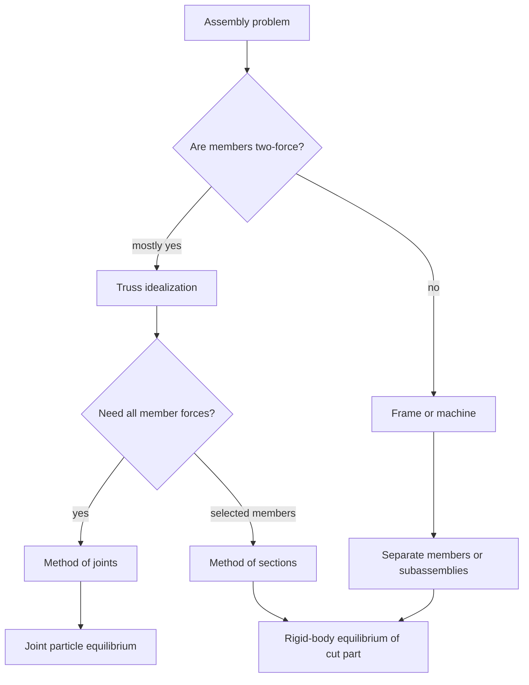

# Trusses, Frames, and Machines

Trusses, frames, and machines are assemblies of connected members. The same equilibrium laws apply, but the modeling level changes: sometimes each joint is isolated as a particle, sometimes a whole section is cut out as a rigid body, and sometimes individual links must be separated to reveal internal pin forces. The skill is deciding which free-body diagram gives the desired unknown with the least algebra.

A truss is primarily a force-carrying structure. A frame is primarily a support structure whose members may carry more than two forces. A machine is an assembly meant to transform forces and motion. These categories are not rigid; what matters mechanically is whether a member can be idealized as a two-force body or must be treated as a general rigid body.

## Definitions

A **truss** is an assembly of slender members connected at their ends, commonly idealized with frictionless pins. Loads and supports are assumed to act at joints. Under the usual idealization, each truss member is a two-force member, so it carries only axial tension or compression.

If member $AB$ is isolated and only the pin forces at $A$ and $B$ act, equilibrium requires the forces to be equal, opposite, and collinear with $AB$. The member force is usually denoted $F_{AB}$. A positive result under a tension assumption means the member pulls away from the joint. A negative result means compression.

The **method of joints** isolates one joint at a time. Because each joint is a particle in a planar truss, the equations are

$$
\sum F_x=0,\qquad \sum F_y=0.
$$

The method is efficient when a joint has at most two unknown member forces.

The **method of sections** cuts through selected members and isolates one part of the truss. The cut member forces are exposed as external forces on the cut free body. Since the cut part is a rigid body, planar equilibrium gives

$$
\sum F_x=0,\qquad \sum F_y=0,\qquad \sum M_O=0.
$$

The method is efficient when only a few selected member forces are needed.

A **frame** contains at least one member that is not a two-force member. It may have loads applied between pins, multiple pin connections, fixed supports, or distributed loads. A **machine** is similar, but the goal is often to find an output force, mechanical advantage, or input force.

For a planar pin-jointed truss with $m$ members, $j$ joints, and $r$ external reaction components, the determinacy count

$$
m+r=2j
$$

is a useful first check for simple determinacy. It is not a proof of stability; geometry still matters.

## Key results

For truss analysis, the most important result is the two-force member rule. Because the force at each end must lie along the member, every member contributes only one scalar unknown rather than two pin components. This is what makes large trusses solvable from joint equilibrium.

At a joint, assign unknown member forces as tensile by drawing them away from the joint. Then solve the two scalar equations. If $F_{AB}\lt0$, the actual force on the joint points toward the joint, and member $AB$ is in compression. This sign convention keeps the algebra consistent across the whole truss.

Common zero-force member rules come directly from joint equilibrium:

- If two noncollinear members meet at an unloaded joint with no support reaction, both member forces are zero.
- If three members meet at an unloaded joint and two are collinear, the noncollinear member has zero force.

These are not shortcuts from memory alone; they are force balance facts. They fail if an external load or support reaction also acts at the joint.

For the method of sections, choose a cut that passes through no more than three unknown member forces in a planar truss. Then take moments about the intersection point of two unknown cut forces to eliminate them and solve the third directly. This is often much faster than walking across the truss joint by joint.

Frames and machines require more caution. A pin between two members exerts equal and opposite force components on the two free-body diagrams. If the connected members are separated, label the pin force components consistently. Do not put both action and reaction on the same isolated body.

For an ideal machine, **mechanical advantage** may be defined as

$$
MA=\frac{\text{output force magnitude}}{\text{input force magnitude}}.
$$

In static rigid-body analysis without friction and deformation, mechanical advantage comes from moment arms, geometry, pulleys, gears, wedges, or link arrangements. When friction and deformation matter, equilibrium alone is only a first approximation.

## Visual



| Assembly type | Main free body | Member force type | Best first method |
|---|---|---|---|
| Simple truss | Joints | Axial tension or compression | Method of joints |
| Truss, selected member | Cut section | Cut axial forces | Method of sections |
| Frame | Individual members | Pin forces, loads, moments | Member FBDs |
| Machine | Links and handles | Input/output forces, pin forces | Moment balance by link |

## Worked example 1: Method of joints on a triangular truss

**Problem.** A triangular truss has joints $A=(0,0)$, $B=(4,0)$, and $C=(2,3)$ m. A pin at $A$ and a roller at $B$ support the truss. A $10$ kN downward load acts at $C$. Find member forces $AC$, $BC$, and $AB$.

**Method.** First find support reactions from the whole truss. Then isolate joint $C$ to get $AC$ and $BC$, and finally use joint $A$ or $B$ for $AB$.

1. Whole-truss equilibrium. The geometry and load are symmetric, so the vertical reactions should split equally, but compute them.

$$
\sum M_A=0:\quad 4B_y-10(2)=0.
$$

$$
B_y=5\ \text{kN}.
$$

Vertical force balance gives

$$
A_y+B_y-10=0,\qquad A_y=5\ \text{kN}.
$$

Horizontal force balance gives

$$
A_x=0.
$$

2. Unit direction from $C$ to $A$:

$$
\mathbf{r}_{CA}=(-2)\mathbf{i}+(-3)\mathbf{j},\qquad |\mathbf{r}_{CA}|=\sqrt{13}.
$$

$$
\mathbf{u}_{CA}=-\frac{2}{\sqrt{13}}\mathbf{i}-\frac{3}{\sqrt{13}}\mathbf{j}.
$$

From $C$ to $B$:

$$
\mathbf{u}_{CB}=\frac{2}{\sqrt{13}}\mathbf{i}-\frac{3}{\sqrt{13}}\mathbf{j}.
$$

3. At joint $C$, assume member forces are tensile, pulling away from the joint:

$$
F_{AC}\mathbf{u}_{CA}+F_{BC}\mathbf{u}_{CB}-10\mathbf{j}=\mathbf{0}.
$$

4. Horizontal balance:

$$
-\frac{2}{\sqrt{13}}F_{AC}+\frac{2}{\sqrt{13}}F_{BC}=0,
$$

so

$$
F_{AC}=F_{BC}=F.
$$

5. Vertical balance:

$$
-\frac{3}{\sqrt{13}}F-\frac{3}{\sqrt{13}}F-10=0.
$$

$$
-\frac{6}{\sqrt{13}}F=10,\qquad F=-\frac{10\sqrt{13}}{6}=-6.01\ \text{kN}.
$$

Both sloping members are in compression:

$$
F_{AC}=F_{BC}=6.01\ \text{kN compression}.
$$

6. Use joint $A$ to find $AB$. At $A$, the support force is $5$ kN upward. The actual compression force from member $AC$ on joint $A$ points from $C$ toward $A$? It is cleaner to retain the algebraic tensile sign $F_{AC}=-6.01$ kN along the direction from $A$ to $C$:

$$
\mathbf{u}_{AC}=\frac{2}{\sqrt{13}}\mathbf{i}+\frac{3}{\sqrt{13}}\mathbf{j}.
$$

At joint $A$:

$$
A_y\mathbf{j}+F_{AC}\mathbf{u}_{AC}+F_{AB}\mathbf{i}=\mathbf{0}.
$$

Horizontal balance:

$$
F_{AB}+(-6.01)\frac{2}{\sqrt{13}}=0.
$$

$$
F_{AB}=3.33\ \text{kN}.
$$

Positive means $AB$ is in tension. The checked answer is

$$
\boxed{AC=BC=6.01\ \text{kN compression},\qquad AB=3.33\ \text{kN tension}.}
$$

## Worked example 2: Method of sections for a selected member

**Problem.** A simply supported truss has bottom joints $A=(0,0)$, $B=(3,0)$, $C=(6,0)$, $D=(9,0)$ and top joints $E=(3,3)$, $F=(6,3)$. Members include $AB$, $BC$, $CD$, $AE$, $BE$, $BF$, $CF$, $EF$, and $DF$. A $12$ kN downward load acts at $F$. Supports are a pin at $A$ and a roller at $D$. Find the force in member $BC$.

**Method.** Find reactions, cut through $BC$, $BF$, and $EF$, and take moments about $F$ on the left section so forces in $BF$ and $EF$ create no moment.

1. Whole-truss reactions:

$$
\sum M_A=0:\quad 9D_y-12(6)=0.
$$

$$
D_y=8\ \text{kN},\qquad A_y=12-8=4\ \text{kN},\qquad A_x=0.
$$

2. Cut the truss through $BC$, $BF$, and $EF$. Keep the left part containing $A$, $B$, and $E$. Assume cut member forces are tensile on the left section.

3. Take moments about $F=(6,3)$, where the lines of action of $BF$ and $EF$ pass through or can be arranged to eliminate their moments. The force in $BC$ acts horizontally along $y=0$. Its perpendicular distance to $F$ is $3$ m.

4. Moment of $A_y=4$ kN about $F$. The position from $F$ to $A$ is $(-6,-3)$ m. The force is $(0,4)$ kN:

$$
M_F(A_y)=xF_y-yF_x=(-6)(4)-(-3)(0)=-24\ \text{kN m}.
$$

5. Moment of $F_{BC}$ on the left section. If tensile on the left cut at $BC$, it points to the right along $+x$. A horizontal force at $y=0$ below $F$ gives

$$
M_F(BC)=x(0)-yF_{BC}=-(-3)F_{BC}=3F_{BC}.
$$

6. Moment balance:

$$
\sum M_F=0:\quad -24+3F_{BC}=0.
$$

$$
F_{BC}=8\ \text{kN}.
$$

The positive value matches the tensile assumption:

$$
\boxed{F_{BC}=8\ \text{kN tension}.}
$$

7. Check reasonableness. The lower chord in a simply supported truss under downward top loading often carries tension in the span region, consistent with the result.

## Code

```python
import numpy as np

# Solve joint C of the triangular truss by component equations.
sqrt13 = np.sqrt(13.0)
u_CA = np.array([-2.0 / sqrt13, -3.0 / sqrt13])
u_CB = np.array([2.0 / sqrt13, -3.0 / sqrt13])

A = np.column_stack([u_CA, u_CB])
load = np.array([0.0, -10.0])
FAC, FBC = np.linalg.solve(A, -load)

print(f"FAC = {FAC:.3f} kN, negative means compression")
print(f"FBC = {FBC:.3f} kN, negative means compression")

# Joint A for member AB.
u_AC = np.array([2.0 / sqrt13, 3.0 / sqrt13])
Ay = 5.0
FAB = -(FAC * u_AC[0])
vertical_residual = Ay + FAC * u_AC[1]
print(f"FAB = {FAB:.3f} kN")
print(f"vertical residual at A = {vertical_residual:.2e} kN")
```

## Common pitfalls

- Applying member forces at a joint in inconsistent directions from one joint to another.
- Forgetting that a negative tensile assumption indicates compression, not a failed solution.
- Using the method of joints at a joint with too many unknowns when a different joint or section is cleaner.
- Cutting through more unknown member forces than equilibrium can solve.
- Treating a frame member with a midspan load as a two-force member.
- Losing action-reaction consistency when separating machine links at pins.
- Relying on the count $m+r=2j$ without checking geometric stability.

## Connections

- [Particle equilibrium](/physics/mechanics/particle-equilibrium)
- [Rigid-body equilibrium](/physics/mechanics/rigid-body-equilibrium)
- [Internal forces in beams](/physics/mechanics/internal-forces-beams)
- [Work-energy methods](/physics/mechanics/work-energy-methods)
