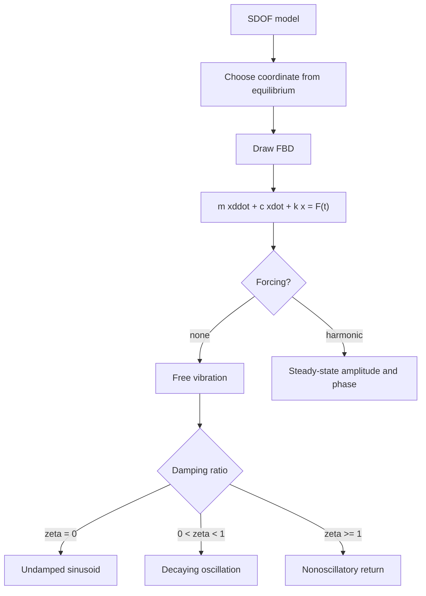

# Vibrations of Single-Degree-of-Freedom Systems

Vibration is dynamics focused on motion near equilibrium. A single-degree-of-freedom system has one independent coordinate, such as the displacement of a mass on a spring or the angle of a small pendulum. The equation of motion is usually an ordinary differential equation whose solution reveals frequency, damping, transient decay, and steady forced response.

This page ties together Newton's second law, work-energy ideas, and linearization. The same mass-spring-damper model appears in machinery, vehicle suspensions, building response, instruments, isolation mounts, and control systems. Even when real systems have many degrees of freedom, the single-degree model gives the vocabulary: natural frequency, damping ratio, resonance, phase, and transmissibility.

## Definitions

A **single-degree-of-freedom** system is one whose configuration can be described by one coordinate $x(t)$ after constraints are applied. The standard linear mass-spring-damper equation is

$$
m\ddot{x}+c\dot{x}+kx=F(t),
$$

where $m$ is mass, $c$ is viscous damping coefficient, $k$ is stiffness, and $F(t)$ is an applied force.

The **undamped natural frequency** is

$$
\omega_n=\sqrt{\frac{k}{m}}.
$$

The **critical damping coefficient** is

$$
c_c=2m\omega_n=2\sqrt{km}.
$$

The **damping ratio** is

$$
\zeta=\frac{c}{c_c}=\frac{c}{2m\omega_n}.
$$

For free vibration with no forcing,

$$
m\ddot{x}+c\dot{x}+kx=0.
$$

For undamped free vibration,

$$
m\ddot{x}+kx=0,
$$

with solution

$$
x(t)=A\cos\omega_nt+B\sin\omega_nt.
$$

For underdamped free vibration, $0\lt\zeta\lt1$, the damped natural frequency is

$$
\omega_d=\omega_n\sqrt{1-\zeta^2},
$$

and the motion has the form

$$
x(t)=e^{-\zeta\omega_nt}\left(A\cos\omega_dt+B\sin\omega_dt\right).
$$

For harmonic forcing

$$
F(t)=F_0\cos\omega t,
$$

the steady-state response has the same frequency as the forcing but generally different amplitude and phase.

## Key results

The equation of motion should be written about a static equilibrium position when possible. If a vertical spring supports a mass, gravity shifts the equilibrium stretch but does not appear in the linear vibration equation about that equilibrium:

$$
m\ddot{y}+ky=0
$$

where $y$ is measured from static equilibrium. This prevents double-counting weight.

For undamped free vibration, initial displacement $x(0)=x_0$ and initial velocity $\dot{x}(0)=v_0$ give

$$
x(t)=x_0\cos\omega_nt+\frac{v_0}{\omega_n}\sin\omega_nt.
$$

The period is

$$
T=\frac{2\pi}{\omega_n}.
$$

For underdamped vibration, the exponential envelope decays as

$$
e^{-\zeta\omega_nt}.
$$

Larger damping ratio means faster decay, but for $0\lt\zeta\lt1$ the system still oscillates. At $\zeta=1$, the system is critically damped and returns to equilibrium without oscillating as quickly as possible in the ideal linear model. For $\zeta\gt1$, it is overdamped and also nonoscillatory but slower.

For harmonic steady-state response of

$$
m\ddot{x}+c\dot{x}+kx=F_0\cos\omega t,
$$

the displacement amplitude is

$$
X=\frac{F_0/k}{\sqrt{(1-r^2)^2+(2\zeta r)^2}},
$$

where

$$
r=\frac{\omega}{\omega_n}.
$$

The phase lag $\phi$ satisfies

$$
\tan\phi=\frac{2\zeta r}{1-r^2}.
$$

When damping is small and $r$ is near $1$, the amplitude can be large. This is resonance in the linear forced-response model. Damping limits the peak but also changes phase.

Energy gives another view. In an undamped free oscillator,

$$
E=\frac{1}{2}m\dot{x}^2+\frac{1}{2}kx^2
$$

is constant. With viscous damping,

$$
\frac{dE}{dt}=-c\dot{x}^2\le0,
$$

so mechanical energy decreases monotonically.

Linear vibration models are usually local models. A pendulum, for example, is exactly governed by a nonlinear equation involving $\sin\theta$, but for small angles $\sin\theta\approx\theta$, so the equation becomes linear and has a natural frequency. The same pattern appears in springs, beams, shafts, and mechanisms: choose an equilibrium configuration, define a small displacement coordinate, and keep the leading linear stiffness and damping terms. The model is then useful only over the range where those approximations remain accurate.

Initial conditions control the transient response. For a forced damped system, the full solution is the sum of a transient part and a steady-state part. The transient depends on initial displacement and velocity and decays if damping is positive. The steady-state part depends on the forcing frequency and remains as long as the harmonic forcing continues. Many engineering measurements taken after startup are dominated by steady-state response, while shock and startup problems require the transient.

Units are a strong guardrail. Stiffness $k$ has units N/m, damping $c$ has units N s/m, $\omega_n$ has units rad/s, and $\zeta$ is dimensionless. A damping coefficient cannot be inserted where a damping ratio belongs without dividing by $2m\omega_n$.

## Visual



| Case | Condition | Motion type | Key formula |
|---|---|---|---|
| Undamped free | $\zeta=0$, $F=0$ | Constant-amplitude sinusoid | $\omega_n=\sqrt{k/m}$ |
| Underdamped free | $0\lt\zeta\lt1$, $F=0$ | Decaying oscillation | $\omega_d=\omega_n\sqrt{1-\zeta^2}$ |
| Critically damped | $\zeta=1$ | Fast nonoscillatory return | $c_c=2m\omega_n$ |
| Overdamped | $\zeta\gt1$ | Slow nonoscillatory return | Two real exponential modes |
| Harmonic forced | $F_0\cos\omega t$ | Steady amplitude and phase | $X/(F_0/k)=1/\sqrt{(1-r^2)^2+(2\zeta r)^2}$ |

## Worked example 1: Undamped free vibration from initial conditions

**Problem.** A $5$ kg mass is attached to a spring with stiffness $k=180$ N/m on a frictionless horizontal surface. It is pulled $0.08$ m from equilibrium and released with velocity $0.30$ m/s toward positive $x$. Find the motion $x(t)$ and the maximum displacement amplitude.

**Method.** Use the undamped free-vibration solution with initial displacement and velocity.

1. Natural frequency:

$$
\omega_n=\sqrt{\frac{k}{m}}=\sqrt{\frac{180}{5}}=\sqrt{36}=6\ \text{rad/s}.
$$

2. General solution:

$$
x(t)=A\cos6t+B\sin6t.
$$

3. Apply initial displacement:

$$
x(0)=A=0.08\ \text{m}.
$$

4. Velocity:

$$
\dot{x}(t)=-6A\sin6t+6B\cos6t.
$$

At $t=0$,

$$
\dot{x}(0)=6B=0.30.
$$

Thus

$$
B=0.050\ \text{m}.
$$

5. Motion:

$$
x(t)=0.08\cos6t+0.05\sin6t\ \text{m}.
$$

6. Amplitude:

For $x=A\cos\omega t+B\sin\omega t$, the amplitude is

$$
X=\sqrt{A^2+B^2}.
$$

$$
X=\sqrt{0.08^2+0.05^2}
=\sqrt{0.0064+0.0025}
=\sqrt{0.0089}=0.0943\ \text{m}.
$$

The checked answer is

$$
\boxed{x(t)=0.08\cos6t+0.05\sin6t\ \text{m},\qquad X=0.094\ \text{m}.}
$$

The amplitude is larger than the initial displacement because the initial velocity also contributes energy.

## Worked example 2: Forced response amplitude of a damped oscillator

**Problem.** A machine component is modeled as $m=20$ kg, $k=5000$ N/m, and damping ratio $\zeta=0.08$. It is forced by $F(t)=120\cos(12t)$ N. Find the steady-state displacement amplitude.

**Method.** Compute $\omega_n$, frequency ratio $r$, static displacement $F_0/k$, and dynamic magnification factor.

1. Natural frequency:

$$
\omega_n=\sqrt{\frac{k}{m}}=\sqrt{\frac{5000}{20}}=\sqrt{250}=15.811\ \text{rad/s}.
$$

2. Frequency ratio:

$$
r=\frac{\omega}{\omega_n}=\frac{12}{15.811}=0.759.
$$

3. Static displacement under force amplitude:

$$
\delta_{st}=\frac{F_0}{k}=\frac{120}{5000}=0.0240\ \text{m}.
$$

4. Denominator of magnification factor:

$$
D=\sqrt{(1-r^2)^2+(2\zeta r)^2}.
$$

Compute $r^2$:

$$
r^2=(0.759)^2=0.576.
$$

Then

$$
1-r^2=0.424.
$$

Also

$$
2\zeta r=2(0.08)(0.759)=0.121.
$$

Thus

$$
D=\sqrt{0.424^2+0.121^2}
=\sqrt{0.1798+0.0146}
=\sqrt{0.1944}=0.441.
$$

5. Amplitude:

$$
X=\frac{\delta_{st}}{D}=\frac{0.0240}{0.441}=0.0544\ \text{m}.
$$

The checked answer is

$$
\boxed{X=0.054\ \text{m}.}
$$

The response amplitude is larger than the static deflection because the forcing frequency is below but near the natural frequency.

## Code

```python
import math

# Free vibration example.
m = 5.0
k = 180.0
x0 = 0.08
v0 = 0.30
omega_n = math.sqrt(k / m)
A = x0
B = v0 / omega_n
amplitude = math.sqrt(A*A + B*B)
period = 2.0 * math.pi / omega_n

print(f"omega_n = {omega_n:.3f} rad/s")
print(f"x(t) = {A:.3f} cos({omega_n:.3f} t) + {B:.3f} sin({omega_n:.3f} t)")
print(f"amplitude = {amplitude:.4f} m")
print(f"period = {period:.4f} s")

# Forced response example.
m = 20.0
k = 5000.0
zeta = 0.08
F0 = 120.0
omega = 12.0
omega_n = math.sqrt(k / m)
r = omega / omega_n
D = math.sqrt((1.0 - r*r)**2 + (2.0 * zeta * r)**2)
X = (F0 / k) / D
print(f"forced amplitude = {X:.4f} m")
```

## Common pitfalls

- Measuring displacement from the unstretched spring length when the vibration equation should use static equilibrium.
- Confusing natural frequency in rad/s with cyclic frequency in Hz.
- Treating damping ratio $\zeta$ as the damping coefficient $c$.
- Assuming every large response is resonance without comparing forcing frequency to natural frequency.
- Using undamped formulas when damping is specified.
- Ignoring initial velocity when finding free-vibration amplitude.
- Applying a linear spring model beyond the range where the real system behaves linearly.

## Connections

- [Particle kinetics with Newton's second law](/physics/mechanics/particle-kinetics-newton)
- [Work-energy methods](/physics/mechanics/work-energy-methods)
- [Impulse, momentum, and impact](/physics/mechanics/impulse-momentum-impact)
- [Planar rigid-body motion](/physics/mechanics/planar-rigid-body-motion)
