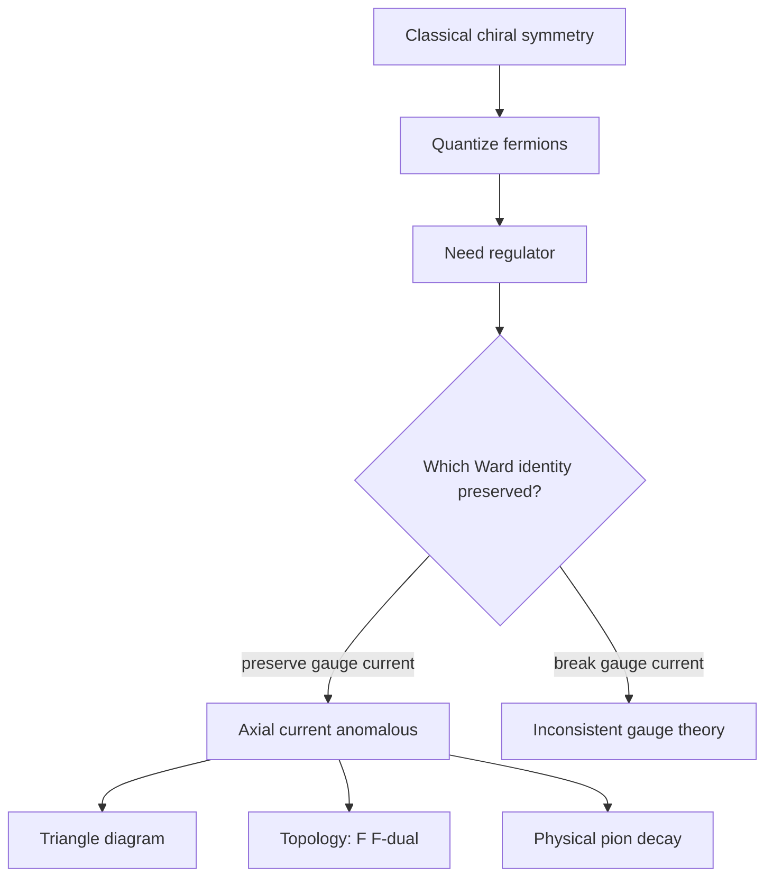

# Chiral Anomalies

An anomaly occurs when a symmetry of the classical action cannot be preserved by the quantum theory. Chiral anomalies are especially important because they connect ultraviolet regularization, fermion chirality, gauge fields, and topology. The classical conservation law for an axial current is spoiled by quantum loops, and the failure is not a small technical error; it is a measurable effect.

Zee's anomaly chapter fits naturally after gauge theory and symmetry breaking. It shows that symmetries must survive quantization, not merely the classical equations. Global anomalies can explain physical processes such as neutral pion decay. Gauge anomalies are more severe: if a gauge redundancy is anomalous, the theory is inconsistent unless the fermion content cancels the anomaly.

## Definitions

For a massless Dirac fermion, define vector and axial currents

$$
j^\mu=\bar{\psi}\gamma^\mu\psi,
\qquad
j_5^\mu=\bar{\psi}\gamma^\mu\gamma^5\psi.
$$

Classically, when $m=0$,

$$
\partial_\mu j^\mu=0,
\qquad
\partial_\mu j_5^\mu=0.
$$

Quantum mechanically, in a background electromagnetic field,

$$
\partial_\mu j_5^\mu
=\frac{e^2}{16\pi^2}
\epsilon^{\mu\nu\rho\sigma}F_{\mu\nu}F_{\rho\sigma}
$$

for one Dirac fermion with a standard normalization. Equivalently,

$$
\partial_\mu j_5^\mu
=\frac{e^2}{2\pi^2}\mathbf{E}\cdot\mathbf{B}
$$

up to convention-dependent signs and factors in the definition of $\epsilon^{\mu\nu\rho\sigma}$.

The dual field strength is

$$
\tilde{F}^{\mu\nu}
=\frac{1}{2}\epsilon^{\mu\nu\rho\sigma}F_{\rho\sigma}.
$$

Then the anomaly is often written as

$$
\partial_\mu j_5^\mu
=\frac{e^2}{16\pi^2}F_{\mu\nu}\tilde{F}^{\mu\nu}.
$$

## Key results

The triangle diagram with one axial current insertion and two vector current insertions is the standard perturbative origin of the chiral anomaly. The loop integral is superficially linearly divergent, so shifting loop momentum is not innocent unless a regulator is specified. No regulator can preserve all the classically expected Ward identities simultaneously. Preserving gauge invariance forces the axial current to be anomalous.

The anomaly has topological content. In nonabelian gauge theory,

$$
\partial_\mu j_5^\mu
=\frac{g^2}{16\pi^2}
\mathrm{tr}\,F_{\mu\nu}\tilde{F}^{\mu\nu}.
$$

The spacetime integral of $\mathrm{tr}\,F\tilde{F}$ is related to an integer winding number for suitable gauge-field configurations. This is why anomalies connect perturbative diagrams, instantons, and global structure.

Gauge anomaly cancellation is a consistency condition. If a gauge current has an anomaly, gauge redundancy fails at the quantum level, unphysical polarizations do not decouple, and the theory loses unitarity or renormalizability. The Standard Model fermion charges are arranged so the gauge anomalies cancel within each generation.

Global anomalies are different: they can be physically real. The axial anomaly explains why the neutral pion decays into two photons at an observed rate even though a naive classical chiral symmetry argument would suggest suppression.

There is also a path-integral way to see the anomaly, often associated with Fujikawa's method. A chiral rotation changes the fermion fields, and the classical action may look invariant, but the functional measure

$$
\mathcal{D}\bar{\psi}\mathcal{D}\psi
$$

need not be invariant after a regulator is used to define it. The Jacobian of the transformation produces the same $F\tilde{F}$ term found in the triangle diagram. This viewpoint makes the anomaly feel less like a peculiarity of one Feynman graph and more like a statement about the incompatibility of the symmetry with the regulated quantum measure.

Anomalies are also robust under changes of energy scale. 't Hooft anomaly matching says that anomalies of exact global symmetries must be reproduced by whatever low-energy degrees of freedom describe the theory. If a strongly coupled theory confines, the composite particles in the infrared must still account for the anomaly seen in the ultraviolet. This provides powerful constraints when direct calculation is hard.

Instantons provide a nonperturbative companion to the perturbative anomaly. Gauge-field configurations with nonzero topological charge make

$$
\int d^4x\,\mathrm{tr}\,F_{\mu\nu}\tilde{F}^{\mu\nu}
$$

nonzero. The anomaly then implies that chiral charge can change in such backgrounds. This connection between topology and fermion number violation is one of the reasons anomalies appear across particle physics, condensed matter, and mathematical physics.

In practical model building, anomaly checks are mandatory. A proposed chiral gauge theory must cancel pure gauge anomalies, mixed gauge anomalies, and mixed gauge-gravity anomalies. Passing these algebraic tests does not prove the model is realized in nature, but failing them usually means the theory cannot be consistently quantized as stated.

## Visual



| Symmetry type | If anomalous | Physical consequence |
|---|---|---|
| Global axial symmetry | allowed | real nonconservation, pion decay |
| Gauge symmetry | not allowed in a consistent theory | anomaly cancellation required |
| Vector current in QED | preserved by regulator choice | electric charge conservation |
| Chiral fermion number | violated by topology | selection rules can change |

## Worked example 1: Classical axial current divergence

Problem: Show that the axial current is classically conserved for a massless Dirac fermion, and find the mass term contribution when $m\neq0$.

Step 1: Start with the Dirac equations:

$$
(i\gamma^\mu\partial_\mu-m)\psi=0,
$$

and

$$
i(\partial_\mu\bar{\psi})\gamma^\mu+m\bar{\psi}=0.
$$

Step 2: Compute

$$
\partial_\mu j_5^\mu
=\partial_\mu(\bar{\psi}\gamma^\mu\gamma^5\psi)
=(\partial_\mu\bar{\psi})\gamma^\mu\gamma^5\psi
+\bar{\psi}\gamma^\mu\gamma^5\partial_\mu\psi.
$$

Step 3: From the adjoint equation,

$$
i(\partial_\mu\bar{\psi})\gamma^\mu=-m\bar{\psi},
$$

so

$$
(\partial_\mu\bar{\psi})\gamma^\mu\gamma^5\psi
=im\bar{\psi}\gamma^5\psi.
$$

Step 4: Use $\{\gamma^5,\gamma^\mu\}=0$:

$$
\bar{\psi}\gamma^\mu\gamma^5\partial_\mu\psi
=-\bar{\psi}\gamma^5\gamma^\mu\partial_\mu\psi.
$$

Step 5: From the Dirac equation,

$$
i\gamma^\mu\partial_\mu\psi=m\psi,
$$

so

$$
\gamma^\mu\partial_\mu\psi=-im\psi.
$$

Therefore

$$
\bar{\psi}\gamma^\mu\gamma^5\partial_\mu\psi
=-\bar{\psi}\gamma^5(-im\psi)
=im\bar{\psi}\gamma^5\psi.
$$

Step 6: Add the two pieces:

$$
\partial_\mu j_5^\mu=2im\bar{\psi}\gamma^5\psi.
$$

The checked answer is zero when $m=0$ classically. The anomaly adds a quantum term even in the massless limit.

## Worked example 2: Anomaly cancellation in a toy charge set

Problem: For a chiral $U(1)$ gauge theory, the cubic gauge anomaly is proportional to $\sum_i q_i^3$ over left-handed Weyl fermions. Check whether charges $1,1,-2$ cancel the cubic anomaly.

Step 1: List the charges:

$$
q_1=1,\qquad q_2=1,\qquad q_3=-2.
$$

Step 2: Cube each charge:

$$
q_1^3=1,\qquad q_2^3=1,\qquad q_3^3=-8.
$$

Step 3: Sum:

$$
\sum_i q_i^3=1+1-8=-6.
$$

Step 4: Since the sum is not zero, the cubic anomaly does not cancel:

$$
\sum_i q_i^3\neq0.
$$

Step 5: Also check the mixed gravitational anomaly proportional to $\sum_i q_i$:

$$
\sum_i q_i=1+1-2=0.
$$

The checked conclusion is that the mixed gravitational condition cancels, but the cubic gauge anomaly does not. A consistent gauged chiral theory needs all required anomaly sums to vanish.

## Code

```python
def u1_anomaly_sums(charges):
    cubic = sum(q**3 for q in charges)
    linear = sum(charges)
    return cubic, linear

examples = {
    "1,1,-2": [1, 1, -2],
    "1,-1": [1, -1],
    "1,1,1,-3": [1, 1, 1, -3],
}

for name, charges in examples.items():
    cubic, linear = u1_anomaly_sums(charges)
    print(name, "cubic =", cubic, "linear =", linear)
```

## Common pitfalls

- Saying an anomaly means the calculation was done incorrectly. A true anomaly remains after all legitimate regulators are considered.
- Treating global and gauge anomalies as equally acceptable. Global anomalies can describe real physics; gauge anomalies usually make the theory inconsistent.
- Forgetting explicit mass terms. Even classically, $m\neq0$ breaks axial current conservation.
- Confusing $F_{\mu\nu}\tilde{F}^{\mu\nu}$ with $F_{\mu\nu}F^{\mu\nu}$. The first is parity odd and topological; the second is the gauge kinetic density.
- Checking only one anomaly condition for a chiral gauge theory. Several independent anomaly sums may be required.
- Forgetting that anomaly coefficients are exact in many important cases. Higher-order corrections do not freely renormalize the basic chiral anomaly coefficient.
- Ignoring low-energy matching. If an exact global symmetry has an anomaly in the ultraviolet, the infrared description must reproduce it through massless fields, topological terms, or other degrees of freedom.

## Connections

Anomalies are best studied after the spinor and gauge pages because their formulas combine chirality, currents, loop diagrams, and topology. They also anticipate EFT: anomaly terms in a low-energy action can encode ultraviolet fermion physics that is no longer present as explicit light fields. In model building, this page should be read before inventing new chiral gauge matter, since anomaly cancellation is a basic consistency check rather than an optional refinement.

- [Dirac Fields and Spinors](/physics/quantum-field-theory/dirac-fields-and-spinors)
- [Gauge Invariance and QED](/physics/quantum-field-theory/gauge-invariance-and-qed)
- [Yang-Mills Theory and QCD](/physics/quantum-field-theory/yang-mills-theory-and-qcd)
- [Electroweak Theory and Grand Unification](/physics/quantum-field-theory/electroweak-theory-and-grand-unification)
