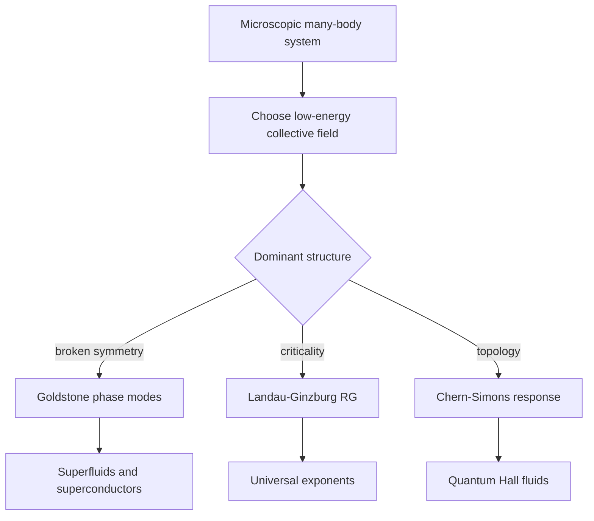

# Collective and Condensed Matter Field Theory

Quantum field theory is not only a theory of elementary particles. It is also the natural language of collective behavior, where the important excitations are not individual microscopic constituents but fields describing density, phase, magnetization, order parameters, and topological response. Zee devotes major space to this point because it changes how one understands the reach of QFT.

In condensed matter, the vacuum is replaced by a material ground state, Lorentz symmetry may be absent, and the speed of light is rarely the relevant velocity. Yet the same ideas recur: path integrals, symmetry breaking, Goldstone modes, vortices, solitons, effective actions, Chern-Simons terms, and renormalization group flow. The payoff is that field theory explains universality: many microscopic systems share the same long-distance behavior.

## Definitions

A nonrelativistic bosonic field $\psi(t,\mathbf{x})$ can be described by

$$
\mathcal{L}
=i\psi^\ast\partial_t\psi
-\frac{1}{2m}\nabla\psi^\ast\cdot\nabla\psi
-\frac{g}{2}(\psi^\ast\psi)^2.
$$

For a condensate, write

$$
\psi=\sqrt{\rho}\,e^{i\theta}.
$$

The phase $\theta$ is the Goldstone-like field associated with broken particle-number phase symmetry.

The Landau-Ginzburg free-energy functional for a real order parameter is

$$
F[\phi]=\int d^d x\left[
\frac{1}{2}(\nabla\phi)^2
+\frac{r}{2}\phi^2
+\frac{u}{4!}\phi^4
\right].
$$

At finite temperature, the Euclidean path integral is periodic in imaginary time:

$$
\tau\sim \tau+\beta,
\qquad
\beta=\frac{1}{T}.
$$

For quantum Hall systems, a Chern-Simons term in $2+1$ dimensions has the schematic form

$$
S_{\text{CS}}=
\frac{k}{4\pi}\int d^3x\,\epsilon^{\mu\nu\rho}a_\mu\partial_\nu a_\rho.
$$

## Key results

Superfluids show the field-theory connection between broken global $U(1)$ symmetry and a gapless phase mode. Density fluctuations are often massive or less important at long distance, while the phase field controls low-energy hydrodynamics. Vortices occur because the phase is compact:

$$
\oint \nabla\theta\cdot d\mathbf{\ell}=2\pi n.
$$

Landau-Ginzburg theory shows how critical phenomena reduce to an effective field theory for an order parameter. Near a critical point, the correlation length

$$
\xi\sim |T-T_c|^{-\nu}
$$

becomes large, so microscopic details are washed out. RG flow explains why critical exponents are universal.

Superconductivity is a gauged version of condensate physics. The order parameter is charged, so the would-be Goldstone mode is absorbed by the electromagnetic field. The result is the Meissner effect: magnetic fields are expelled because the photon becomes massive inside the superconductor.

Fractional quantum Hall fluids show a different side of QFT: topology. Chern-Simons effective theory captures quantized Hall conductance and anyonic statistics without relying on local symmetry breaking in the usual Landau sense.

Finite temperature is another major bridge. In imaginary time, bosonic fields are periodic and fermionic fields are antiperiodic:

$$
\phi(\tau+\beta)=\phi(\tau),
\qquad
\psi(\tau+\beta)=-\psi(\tau).
$$

The allowed frequencies become discrete Matsubara frequencies. This turns thermal field theory into a close cousin of statistical mechanics while preserving much of the diagrammatic machinery. Phase transitions, response functions, and transport coefficients can all be studied with field-theoretic correlators.

Superconductivity adds gauge structure to the condensate story. A charged order parameter coupled to electromagnetism produces the Ginzburg-Landau functional

$$
F=\int d^3x\left[
\frac{1}{2m}|(-i\nabla-e\mathbf{A})\psi|^2
+a|\psi|^2+b|\psi|^4
+\frac{\mathbf{B}^2}{2}
\right].
$$

When $\psi$ condenses, the phase mode is absorbed into the electromagnetic field inside the material, giving a penetration depth for magnetic fields. This is the condensed-matter version of the Higgs mechanism.

The fractional quantum Hall effect is different because its low-energy response is topological rather than controlled by a local order parameter. A Chern-Simons action has no ordinary propagating photon mode in the bulk, but it fixes Hall conductance and the braiding statistics of quasiparticles. Edge states then carry gapless dynamics required by gauge invariance and anomaly inflow.

Disorder and replicas illustrate how far QFT methods can be stretched. Averaging over random potentials is hard because one needs the average of $\log Z$, not just $Z$. The replica trick studies $Z^n$ and analytically continues $n\to0$. This method is formal, but it has generated deep field theories of localization, random matrices, and disordered critical points.

The common message is that the field is chosen for the scale of interest. It may be a phase, height, magnetization, density, gauge field, or matrix. The microscopic atoms remain real, but the long-distance theory uses the variables that fluctuate slowly.

## Visual



| System | Effective field | Key term | Signature |
|---|---|---|---|
| Superfluid | phase $\theta$ | stiffness $(\nabla\theta)^2$ | sound mode, quantized vortices |
| Critical magnet | order parameter $\phi$ | $\phi^4$ free energy | universal scaling |
| Superconductor | charged condensate | $\vert D\psi\vert ^2$ | Meissner effect |
| Fractional Hall fluid | emergent gauge field $a_\mu$ | Chern-Simons term | anyons, quantized response |
| Surface growth | height field $h$ | stochastic field equation | dynamic scaling |

## Worked example 1: Quantized circulation in a superfluid

Problem: Show why a superfluid vortex has quantized circulation when $\psi=\sqrt{\rho}e^{i\theta}$.

Step 1: The condensate wavefunction must be single-valued. Moving around a closed loop $C$,

$$
\psi\to\psi
$$

after returning to the same point.

Step 2: The amplitude $\sqrt{\rho}$ returns to itself, so the phase can only change by an integer multiple of $2\pi$:

$$
\Delta\theta=2\pi n,
\qquad n\in\mathbb{Z}.
$$

Step 3: Write the phase change as a line integral:

$$
\Delta\theta=\oint_C \nabla\theta\cdot d\mathbf{\ell}.
$$

Step 4: The superfluid velocity is proportional to the phase gradient:

$$
\mathbf{v}=\frac{1}{m}\nabla\theta
$$

in units with $\hbar=1$.

Step 5: Therefore the circulation is

$$
\oint_C \mathbf{v}\cdot d\mathbf{\ell}
=\frac{1}{m}\oint_C\nabla\theta\cdot d\mathbf{\ell}
=\frac{2\pi n}{m}.
$$

The checked answer is quantized circulation. The integer $n$ is a topological winding number, stable unless the order parameter vanishes somewhere so the phase becomes undefined.

## Worked example 2: Mean-field critical exponent in Landau theory

Problem: For

$$
f(\phi)=\frac{r}{2}\phi^2+\frac{u}{4}\phi^4,
\qquad u>0,
$$

with $r=a(T-T_c)$, find the order parameter below $T_c$ and the mean-field exponent $\beta$.

Step 1: Minimize the free-energy density:

$$
\frac{df}{d\phi}=r\phi+u\phi^3.
$$

Step 2: Set the derivative to zero:

$$
\phi(r+u\phi^2)=0.
$$

Step 3: Solutions are

$$
\phi=0
$$

or

$$
\phi^2=-\frac{r}{u}.
$$

Step 4: Below $T_c$, $T-T_c\lt 0$, so $r\lt 0$. The nonzero solution is real:

$$
|\phi|=\sqrt{\frac{-r}{u}}.
$$

Step 5: Substitute $r=a(T-T_c)$:

$$
|\phi|=\sqrt{\frac{a(T_c-T)}{u}}.
$$

Step 6: Compare with the definition

$$
|\phi|\sim (T_c-T)^\beta.
$$

The checked answer is

$$
\beta=\frac{1}{2}
$$

in mean-field theory. Fluctuations modify this exponent below the upper critical dimension.

## Code

```python
import math

def mean_field_order_parameter(temp, tc, a=1.0, u=1.0):
    r = a * (temp - tc)
    if r >= 0:
        return 0.0
    return math.sqrt(-r / u)

tc = 1.0
for temp in [1.2, 1.0, 0.9, 0.75, 0.5]:
    print(temp, mean_field_order_parameter(temp, tc, a=2.0, u=0.5))
```

## Common pitfalls

- Assuming relativistic notation implies relativistic physics. Many condensed-matter field theories are nonrelativistic.
- Treating the order parameter as microscopic truth. It is a coarse-grained variable chosen for the long-distance problem.
- Forgetting compactness of a phase field, which is what makes vortices topological.
- Applying mean-field exponents too close to a critical point in low dimensions, where fluctuations matter.
- Confusing topological order with ordinary symmetry breaking. Quantum Hall fluids are not described by a local order parameter in the same way as magnets.
- Ignoring boundary modes in topological phases. A bulk Chern-Simons term often requires edge degrees of freedom for a complete physical description.
- Treating finite temperature as a minor modification of zero-temperature QFT. Periodic or antiperiodic imaginary-time boundary conditions change the allowed frequencies and infrared behavior.
- Forgetting that emergent fields need not be fundamental. Phonons, magnons, order parameters, and emergent gauge fields are effective variables selected by the phase and scale.
- Applying particle-physics intuition too literally. In a material, the medium defines preferred frames, velocities, cutoffs, and quasiparticle lifetimes.

## Connections

This page is the reminder that QFT is a language for phases and excitations, not only for elementary particles. It should be read alongside symmetry breaking and RG: order parameters explain which field is slow, while RG explains why microscopic differences can disappear. The EFT page gives the general logic behind writing low-energy actions, and the path-integral page explains why Euclidean field theory and statistical mechanics share the same mathematical machinery.

- [Path Integral Formulation](/physics/quantum-field-theory/path-integral-formulation)
- [Symmetry Breaking, Goldstone Bosons, and Higgs Physics](/physics/quantum-field-theory/symmetry-breaking-goldstone-higgs)
- [Renormalization Group](/physics/quantum-field-theory/renormalization-group)
- [Effective Field Theory](/physics/quantum-field-theory/effective-field-theory)
