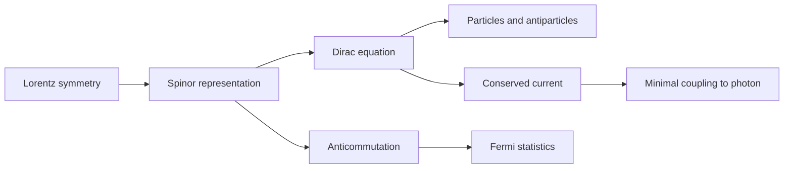

# Dirac Fields and Spinors

Scalar fields describe spin-zero quanta, but much of matter is fermionic. Electrons, quarks, neutrinos, and many quasiparticles require spinor fields, anticommutation, and a relativistic wave equation that is first order in derivatives. The Dirac equation is the gateway: it combines special relativity, spin, antiparticles, and the algebraic structure that later supports gauge theory.

The spinor part of QFT is often where notation first becomes dense. The central physical idea is simpler than the notation suggests. A Dirac field is an operator-valued field whose excitations include particles and antiparticles, and the minus signs required by Fermi statistics are implemented by anticommutators or Grassmann variables. Zee's sequence from the Dirac equation to fermion diagrams is meant to make this algebra feel like a necessity rather than a trick.


*Figure: Electron-positron annihilation is a compact physical scene for interaction vertices and crossing ideas. Image: [Wikimedia Commons](https://commons.wikimedia.org/wiki/File:Basic_Feynman_diagram_-_electron_and_positron_annihilate.svg), Romainbehar, CC0 1.0.*

## Definitions

The Dirac Lagrangian is

$$
\mathcal{L}=\bar{\psi}(i\gamma^\mu\partial_\mu-m)\psi,
\qquad
\bar{\psi}=\psi^\dagger\gamma^0.
$$

The gamma matrices satisfy the Clifford algebra

$$
\{\gamma^\mu,\gamma^\nu\}=2\eta^{\mu\nu}.
$$

The Euler-Lagrange equation for $\bar{\psi}$ gives the Dirac equation:

$$
(i\gamma^\mu\partial_\mu-m)\psi=0.
$$

In momentum space, plane-wave solutions satisfy

$$
(\gamma^\mu p_\mu-m)u(p)=0,
\qquad
(\gamma^\mu p_\mu+m)v(p)=0.
$$

Quantization uses equal-time anticommutation relations:

$$
\{\psi_\alpha(t,\mathbf{x}),\psi^\dagger_\beta(t,\mathbf{y})\}
=\delta_{\alpha\beta}\delta^{(3)}(\mathbf{x}-\mathbf{y}).
$$

The free fermion propagator is

$$
S_F(p)=\frac{i(\gamma^\mu p_\mu+m)}{p^2-m^2+i\epsilon}
=\frac{i}{\gamma^\mu p_\mu-m+i\epsilon}.
$$

Fermionic path integrals use Grassmann variables, which anticommute:

$$
\theta_i\theta_j=-\theta_j\theta_i,
\qquad
\theta_i^2=0.
$$

## Key results

The Dirac equation squares to the Klein-Gordon equation. Multiply the operator $(i\gamma^\mu\partial_\mu-m)$ by $(i\gamma^\nu\partial_\nu+m)$:

$$
(i\gamma^\nu\partial_\nu+m)(i\gamma^\mu\partial_\mu-m)\psi
=(-\gamma^\nu\gamma^\mu\partial_\nu\partial_\mu-m^2)\psi.
$$

Because $\partial_\nu\partial_\mu$ is symmetric, only the anticommutator of gamma matrices contributes:

$$
-\frac{1}{2}\{\gamma^\nu,\gamma^\mu\}\partial_\nu\partial_\mu-m^2
=-(\partial^2+m^2).
$$

Thus every Dirac component satisfies $(\partial^2+m^2)\psi=0$, while the full spinor also carries spin and particle-antiparticle structure.

The conserved current associated with global phase symmetry $\psi\to e^{i\alpha}\psi$ is

$$
j^\mu=\bar{\psi}\gamma^\mu\psi,
\qquad
\partial_\mu j^\mu=0.
$$

This current is the one that couples to electromagnetism. Replacing $\partial_\mu$ by a covariant derivative $D_\mu=\partial_\mu+ieA_\mu$ gives the QED interaction

$$
\mathcal{L}_{\text{int}}=-e\bar{\psi}\gamma^\mu A_\mu\psi.
$$

The sign structure of closed fermion loops is another key result: every closed fermion loop contributes an additional minus sign. This is not optional bookkeeping; it follows from moving Grassmann variables or fermionic operators past each other to perform contractions.

Spinor fields also split naturally into chiral parts. Define projectors

$$
P_L=\frac{1-\gamma^5}{2},
\qquad
P_R=\frac{1+\gamma^5}{2}.
$$

Then

$$
\psi_L=P_L\psi,\qquad \psi_R=P_R\psi.
$$

For a massless fermion the left- and right-handed pieces decouple. This is why chiral symmetry is visible in the massless Dirac Lagrangian and why anomalies are so important: a symmetry that looks exact in the classical massless theory may fail after quantization. In the electroweak theory, chirality is not just notation. Left-handed fermions transform as weak doublets, while right-handed fermions are weak singlets, so the gauge interaction itself distinguishes the two chiralities.

Another useful distinction is between Dirac, Weyl, and Majorana descriptions. A Dirac spinor has enough components to describe a charged fermion with a distinct antiparticle. A Weyl spinor is chiral and is the natural language for massless or chiral gauge theories. A Majorana spinor satisfies a reality condition and can describe a neutral fermion that is its own antiparticle, if the gauge charges allow such a condition. The same physical fermion may be described in different notations, but the allowed mass terms depend sharply on its gauge representation.

The spin-statistics connection is deeper than the algebraic rule "use anticommutators." Relativistic causality requires fermionic fields to anticommute at spacelike separation. If one tried to quantize a Dirac field with commutators, the Hamiltonian or causal structure would fail. This is why the minus signs in fermion diagrams should be read as a structural feature of relativistic QFT, not as a convention chosen for convenience.

## Visual



| Object | Bosonic scalar | Dirac fermion |
|---|---|---|
| Field | $\phi$ | $\psi,\bar{\psi}$ |
| Equation | $(\partial^2+m^2)\phi=0$ | $(i\gamma^\mu\partial_\mu-m)\psi=0$ |
| Quantization | commutators | anticommutators |
| Propagator numerator | $1$ | $\gamma^\mu p_\mu+m$ |
| Statistics | Bose-Einstein | Fermi-Dirac |
| Closed loop sign | no universal extra sign | extra minus sign |

## Worked example 1: Squaring the Dirac equation

Problem: Show that solutions of the free Dirac equation also satisfy the Klein-Gordon equation.

Step 1: Start from

$$
(i\gamma^\mu\partial_\mu-m)\psi=0.
$$

Step 2: Act on the left with the conjugate operator:

$$
(i\gamma^\nu\partial_\nu+m)(i\gamma^\mu\partial_\mu-m)\psi=0.
$$

Step 3: Expand the product. Since $m$ is constant, the cross terms cancel:

$$
(i\gamma^\nu\partial_\nu)(i\gamma^\mu\partial_\mu)-m^2.
$$

The derivative part is

$$
-\gamma^\nu\gamma^\mu\partial_\nu\partial_\mu.
$$

Step 4: Use symmetry of $\partial_\nu\partial_\mu$:

$$
\gamma^\nu\gamma^\mu\partial_\nu\partial_\mu
=\frac{1}{2}\{\gamma^\nu,\gamma^\mu\}\partial_\nu\partial_\mu.
$$

Step 5: Use the Clifford algebra:

$$
\frac{1}{2}\{\gamma^\nu,\gamma^\mu\}\partial_\nu\partial_\mu
=\eta^{\nu\mu}\partial_\nu\partial_\mu
=\partial^2.
$$

Therefore the equation becomes

$$
-(\partial^2+m^2)\psi=0.
$$

The checked answer is

$$
(\partial^2+m^2)\psi=0.
$$

The Dirac equation is a square root of the relativistic dispersion relation, but with spinor structure included.

## Worked example 2: Conserved Dirac current

Problem: Show that $j^\mu=\bar{\psi}\gamma^\mu\psi$ is conserved for a free Dirac field.

Step 1: Write the Dirac equation:

$$
i\gamma^\mu\partial_\mu\psi-m\psi=0.
$$

Step 2: Write the adjoint equation. Taking the Hermitian adjoint and multiplying by $\gamma^0$ gives

$$
i(\partial_\mu\bar{\psi})\gamma^\mu+m\bar{\psi}=0
$$

with the derivative acting to the left.

Step 3: Compute the divergence:

$$
\partial_\mu j^\mu
=\partial_\mu(\bar{\psi}\gamma^\mu\psi)
=(\partial_\mu\bar{\psi})\gamma^\mu\psi
+\bar{\psi}\gamma^\mu\partial_\mu\psi.
$$

Step 4: Use the adjoint equation:

$$
i(\partial_\mu\bar{\psi})\gamma^\mu\psi=-m\bar{\psi}\psi,
$$

so

$$
(\partial_\mu\bar{\psi})\gamma^\mu\psi=i m\bar{\psi}\psi.
$$

Step 5: Use the original equation:

$$
i\bar{\psi}\gamma^\mu\partial_\mu\psi=m\bar{\psi}\psi,
$$

so

$$
\bar{\psi}\gamma^\mu\partial_\mu\psi=-i m\bar{\psi}\psi.
$$

Step 6: Add both terms:

$$
\partial_\mu j^\mu=im\bar{\psi}\psi-im\bar{\psi}\psi=0.
$$

The checked answer is $\partial_\mu j^\mu=0$.

## Code

```python
def clifford_check_1_plus_1():
    # A tiny real representation for signature (+,-):
    # gamma0^2 = +1, gamma1^2 = -1, gamma0 gamma1 + gamma1 gamma0 = 0.
    gamma0 = [[1, 0], [0, -1]]
    gamma1 = [[0, 1], [-1, 0]]

    def matmul(a, b):
        return [[sum(a[i][k] * b[k][j] for k in range(2)) for j in range(2)] for i in range(2)]

    def add(a, b):
        return [[a[i][j] + b[i][j] for j in range(2)] for i in range(2)]

    print("gamma0^2 =", matmul(gamma0, gamma0))
    print("gamma1^2 =", matmul(gamma1, gamma1))
    print("anticommutator =", add(matmul(gamma0, gamma1), matmul(gamma1, gamma0)))

clifford_check_1_plus_1()
```

## Common pitfalls

- Treating spinors as ordinary vectors under spacetime rotations. Spinors transform under a spin representation, not the vector representation.
- Forgetting the bar in $\bar{\psi}=\psi^\dagger\gamma^0$. The Lorentz scalar mass term is $\bar{\psi}\psi$, not $\psi^\dagger\psi$.
- Using commutators for fermion quantization. Fermions require anticommutators to produce Fermi statistics and a stable spectrum.
- Losing the extra minus sign from a closed fermion loop.
- Assuming the Dirac equation replaces the Klein-Gordon equation. It refines it; each component still satisfies the relativistic mass shell condition.
- Confusing chirality with helicity in all circumstances. They coincide for massless fermions, but massive fermions mix left and right chiral components through the mass term.
- Writing a mass term without checking gauge charges. Dirac, Majorana, and Yukawa masses obey different representation constraints.

## Connections

Spinor notation pays off in the pages on QED, anomalies, and electroweak theory. QED uses the vector current $\bar{\psi}\gamma^\mu\psi$, anomalies use the axial current $\bar{\psi}\gamma^\mu\gamma^5\psi$, and electroweak theory uses chiral projections to couple left- and right-handed fermions differently. If a later calculation has a mysterious trace over gamma matrices or an unexpected minus sign from a loop, the explanation is usually in the spinor and Grassmann structure summarized here.

- [Gauge Invariance and QED](/physics/quantum-field-theory/gauge-invariance-and-qed)
- [Chiral Anomalies](/physics/quantum-field-theory/chiral-anomalies)
- [Electroweak Theory and Grand Unification](/physics/quantum-field-theory/electroweak-theory-and-grand-unification)
- [Motivation, Fields, and Quanta](/physics/quantum-field-theory/motivation-fields-and-quanta)
