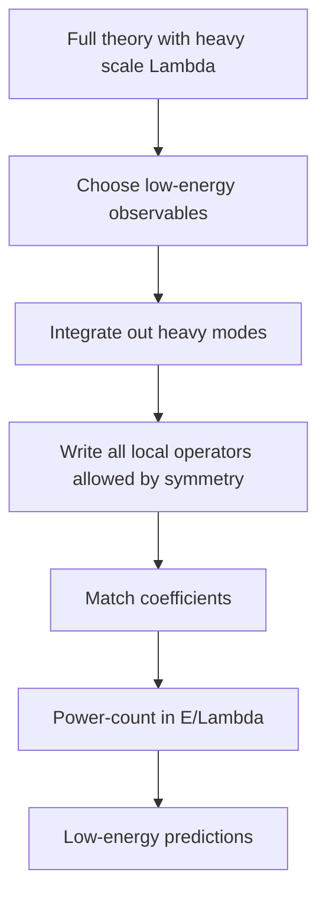

# Effective Field Theory

Effective field theory is the modern interpretation of why QFT works so broadly. A theory does not need to be valid at every distance scale to be predictive. It needs to include every interaction allowed by the symmetries, organized by powers of the energy scale being probed. Short-distance physics is compressed into coefficients of local operators.

This viewpoint turns old language about nonrenormalizable theories upside down. Nonrenormalizable interactions are not forbidden; they are usually suppressed by a heavy scale and become small at low energy. Zee's final chapters use this perspective to connect particle physics, condensed matter, gravity, and newer developments: field theory is a language for scale-separated ignorance.


*Figure: A Feynman diagram turns perturbation theory into a compact bookkeeping picture for particles, propagators, and vertices. Image: [Wikimedia Commons](https://commons.wikimedia.org/wiki/File:Electron-scattering.svg), KCVelaga, CC BY-SA 4.0.*

## Definitions

An effective Lagrangian has the schematic form

$$
\mathcal{L}_{\text{EFT}}
=\mathcal{L}_{\text{light}}
+\sum_i \frac{c_i}{\Lambda^{\Delta_i-d}}\mathcal{O}_i.
$$

Here $\Lambda$ is the cutoff or heavy scale, $\mathcal{O}_i$ is a local operator of dimension $\Delta_i$, and $d$ is the spacetime dimension. The coefficients $c_i$ encode short-distance physics.

The expansion parameter is typically

$$
\frac{E}{\Lambda},
$$

where $E$ is the characteristic energy of the process.

**Matching** determines EFT coefficients by requiring the low-energy theory to reproduce amplitudes or correlation functions of the more complete theory at a chosen scale.

**Power counting** estimates which operators must be retained to reach a desired accuracy.

Relevant, marginal, and irrelevant operators are classified by the sign of $d-\Delta_i$. EFTs include all three, but irrelevant operators are suppressed at low energy.

## Key results

If a heavy particle of mass $M$ mediates interactions among light particles, then for external momenta much smaller than $M$ its propagator can be expanded:

$$
\frac{1}{p^2-M^2}
=-\frac{1}{M^2}\frac{1}{1-p^2/M^2}
=-\frac{1}{M^2}
\mathcal{O}\left(\frac{p^2}{M^4}\right).
$$

The heavy exchange becomes a local contact interaction plus derivative corrections. This is the basic reason EFT works.

The Fermi theory of weak interactions is the classic example:

$$
\mathcal{L}_{\text{Fermi}}
=-\frac{G_F}{\sqrt{2}}J_\mu^\dagger J^\mu,
$$

with

$$
G_F\sim \frac{g^2}{M_W^2}.
$$

At energies far below the $W$ mass, the detailed propagating $W$ boson can be replaced by a four-fermion operator.

Gravity is also an EFT at low energies. The Einstein-Hilbert term is the leading operator:

$$
\mathcal{L}=\sqrt{-g}\left(\frac{M_{\text{Pl}}^2}{2}R+c_1R^2+c_2R_{\mu\nu}R^{\mu\nu}+\cdots\right).
$$

Higher-curvature terms are suppressed by powers of a high scale. The theory is predictive for sufficiently low-energy gravitational processes even if it is not a complete ultraviolet theory.

The decoupling intuition is simple but powerful. Low-energy probes cannot resolve short-distance structure in detail, so heavy physics appears through local operators. The coefficients remember the heavy theory, while the operator form is dictated by light fields and symmetries. If two different microscopic theories produce the same EFT coefficients to a given order, then no low-energy experiment at that accuracy can distinguish them.

Loops inside an EFT are handled by the same EFT logic. A loop made from lower-dimension operators may generate divergences that require higher-dimension counterterms. This is not a failure; it is how the expansion announces which operators are needed at the next order. Predictivity is maintained because only finitely many operators contribute up to a fixed power of $E/\Lambda$.

Symmetries can sharpen power counting. Chiral perturbation theory, for example, describes pions as pseudo-Goldstone bosons and organizes interactions by derivatives and quark-mass insertions. The leading interactions are constrained by symmetry, while higher-order constants encode short-distance QCD. The same pattern appears in nuclear EFTs, heavy-quark EFTs, and the Standard Model EFT.

Matching can be done at tree level or loop level. Tree matching captures direct heavy-particle exchange. Loop matching captures heavy particles that appear only virtually. In either case one computes the same low-energy amplitude in the full theory and in the EFT, expands in external momenta, and solves for the coefficients $c_i$. Running below the matching scale then sums logarithms between $\Lambda$ and the measurement scale.

The guiding rule is conservative: include every operator allowed by the unbroken symmetries unless there is a power-counting reason to postpone it. Omitting allowed operators usually hides assumptions rather than simplifying the theory.

## Visual



| Operator dimension in $d=4$ | Coupling dimension | RG name | Low-energy role |
|---|---|---|---|
| $\Delta\lt 4$ | positive | relevant | grows in IR, often must be fixed carefully |
| $\Delta=4$ | zero | marginal | can run logarithmically |
| $\Delta\gt 4$ | negative | irrelevant | suppressed by powers of $E/\Lambda$ |

## Worked example 1: Heavy scalar exchange becomes a contact term

Problem: Suppose a heavy scalar $H$ of mass $M$ couples to a light scalar $\phi$ through

$$
\mathcal{L}_{\text{int}}=-\frac{g}{2}H\phi^2.
$$

Find the leading low-energy effective interaction for $\phi$ scattering by tree-level $H$ exchange.

Step 1: The tree-level exchange amplitude contains two vertices and one heavy propagator:

$$
i\mathcal{M}\sim (-ig)^2\frac{i}{p^2-M^2}.
$$

Step 2: Simplify the factors:

$$
(-ig)^2i=-ig^2.
$$

Thus

$$
i\mathcal{M}\sim -ig^2\frac{1}{p^2-M^2}.
$$

Step 3: At low energy, $p^2\ll M^2$, expand:

$$
\frac{1}{p^2-M^2}
=-\frac{1}{M^2}
-\frac{p^2}{M^4}
\cdots.
$$

Step 4: The leading amplitude is

$$
i\mathcal{M}\sim i\frac{g^2}{M^2}.
$$

Step 5: A local $\phi^4$ operator

$$
\mathcal{L}_{\text{eff}}\supset -\frac{\lambda_{\text{eff}}}{4!}\phi^4
$$

has amplitude $-i\lambda_{\text{eff}}$. Matching signs depends on channel and convention, but the coefficient scales as

$$
\lambda_{\text{eff}}\sim \frac{g^2}{M^2}.
$$

The checked EFT result is that heavy exchange produces a local contact interaction suppressed by $M^2$.

## Worked example 2: Power counting a dimension-six operator

Problem: In four dimensions, estimate the size of a dimension-six operator

$$
\Delta\mathcal{L}=\frac{c}{\Lambda^2}\mathcal{O}_6
$$

in a process with characteristic energy $E$.

Step 1: The Lagrangian density has dimension four:

$$
[\mathcal{L}]=4.
$$

Step 2: The operator has dimension

$$
[\mathcal{O}_6]=6.
$$

Step 3: Therefore the coefficient must have dimension

$$
4-6=-2.
$$

Step 4: Write the coefficient as $c/\Lambda^2$, with dimensionless $c$.

Step 5: Matrix elements of $\mathcal{O}_6$ scale with two additional powers of energy compared with a dimension-four operator. Thus its relative contribution is

$$
\Delta\mathcal{A}\sim c\frac{E^2}{\Lambda^2}.
$$

Step 6: If $E=100\ \mathrm{GeV}$ and $\Lambda=1\ \mathrm{TeV}$,

$$
\frac{E^2}{\Lambda^2}=\left(\frac{100}{1000}\right)^2=0.01.
$$

The checked answer is a one-percent correction when $c$ is order one.

## Code

```python
def eft_suppression(energy, cutoff, operator_dimension, spacetime_dim=4, coefficient=1.0):
    power = operator_dimension - spacetime_dim
    return coefficient * (energy / cutoff) ** power

for dim in [5, 6, 8]:
    print("dimension", dim, "suppression", eft_suppression(100, 1000, dim))
```

## Common pitfalls

- Thinking an EFT is less scientific because it is not valid at arbitrarily high energy. Predictivity only requires controlled errors in its domain.
- Omitting operators allowed by symmetry because they look unfamiliar. EFT logic demands including them if they contribute at the chosen order.
- Confusing the cutoff $\Lambda$ with the renormalization scale $\mu$. They can be related but play different conceptual roles.
- Using an EFT above its breakdown scale.
- Assuming coefficients are always order one. Symmetries, loops, selection rules, or matching can make them small or large.
- Keeping a higher-order correction while dropping other operators of the same order. Power counting only works when the truncation is systematic.
- Matching at one scale and then ignoring running. Large logarithms between the heavy scale and the measurement scale should be summed with RG evolution when they are important.
- Treating irrelevant operators as physically irrelevant in every context. They are suppressed at low energy, but they can encode the leading observable trace of heavy new physics.
- Forgetting field redefinitions. Some operators can be moved into others using equations of motion, so a clean operator basis avoids redundant parameters.
- Claiming model independence while secretly assuming a restricted operator set. The symmetry and power counting must be stated.
- Forgetting that EFT errors should be estimated, not merely hoped to be small.

## Connections

EFT is the organizing principle that makes the later, broader parts of Zee's scope feel unified. Condensed-matter order-parameter theories, chiral pion theories, Fermi weak theory, gravitational EFT, and Standard Model extensions all use the same recipe: choose light fields, impose symmetries, write all allowed operators, match coefficients, and estimate errors. This page should be read after RG, because power counting and running are what make the expansion predictive rather than a list of arbitrary terms.

- [Renormalization Group](/physics/quantum-field-theory/renormalization-group)
- [Renormalization and Counterterms](/physics/quantum-field-theory/renormalization-and-counterterms)
- [Gravity, Cosmology, and Beyond](/physics/quantum-field-theory/gravity-cosmology-and-beyond)
- [Collective and Condensed Matter Field Theory](/physics/quantum-field-theory/collective-and-condensed-matter-field-theory)
