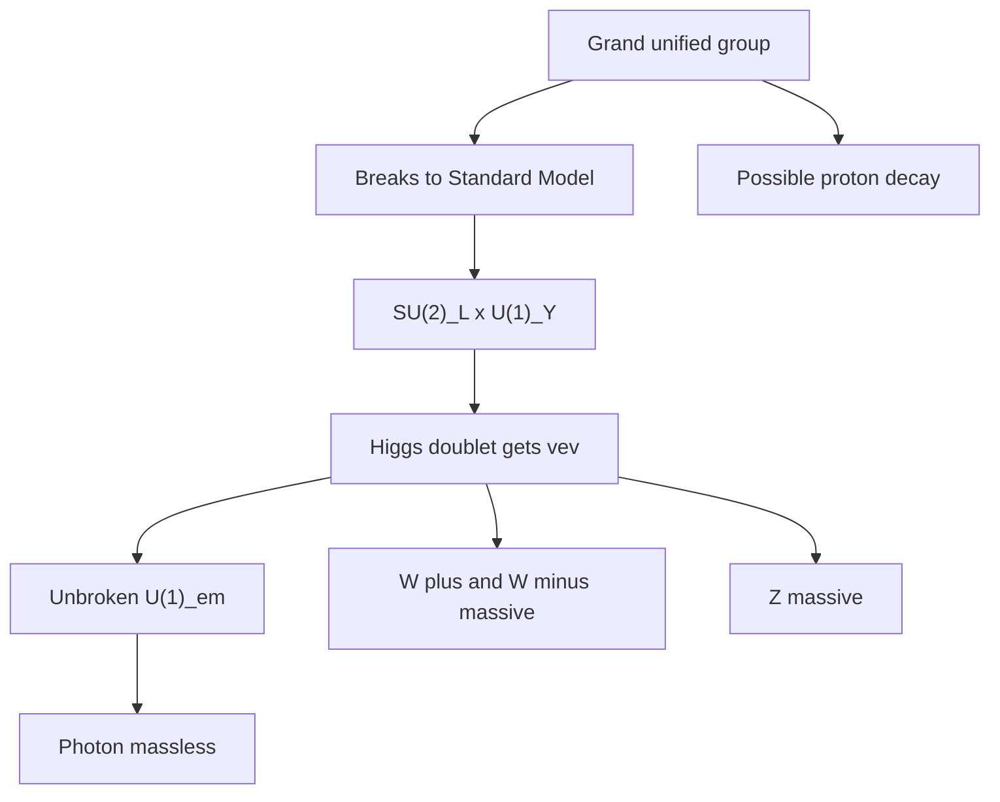

# Electroweak Theory and Grand Unification

The electroweak theory combines weak interactions and electromagnetism into a gauge theory with spontaneous symmetry breaking. At high energy the natural gauge group is $SU(2)_L\times U(1)_Y$; at low energy the Higgs vacuum leaves an unbroken $U(1)_{\text{em}}$. The photon remains massless, while the $W^\pm$ and $Z$ bosons become massive.

Grand unification asks whether the gauge groups and matter representations of the Standard Model are fragments of a larger simple group such as $SU(5)$ or $SO(10)$. Zee's grand-unification chapters connect group theory, running couplings, proton decay, and the idea that apparently different charges may be different components of one deeper gauge structure.


*Figure: The Standard Model chart gives QFT pages a concrete particle-spectrum map. Image: [Wikimedia Commons](https://commons.wikimedia.org/wiki/File:Standard_Model_of_Elementary_Particles.svg), Cush and MissMJ, public domain/CC BY 3.0.*

## Definitions

The electroweak gauge group is

$$
SU(2)_L\times U(1)_Y.
$$

The covariant derivative acting on a field with weak isospin generators $\tau^a/2$ and hypercharge $Y$ is

$$
D_\mu=\partial_\mu
+ig\frac{\tau^a}{2}W_\mu^a
+ig'\frac{Y}{2}B_\mu.
$$

The Higgs doublet may be written in unitary gauge as

$$
H(x)=\frac{1}{\sqrt{2}}
\begin{pmatrix}
0\\
v+h(x)
\end{pmatrix}.
$$

The electric charge generator is

$$
Q=T_3+\frac{Y}{2}.
$$

The physical photon and $Z$ boson are mixtures of $W_\mu^3$ and $B_\mu$:

$$
\begin{aligned}
A_\mu &= \sin\theta_W\, W_\mu^3+\cos\theta_W\,B_\mu,\\
Z_\mu &= \cos\theta_W\, W_\mu^3-\sin\theta_W\,B_\mu.
\end{aligned}
$$

with

$$
\tan\theta_W=\frac{g'}{g}.
$$

## Key results

The Higgs kinetic term

$$
|D_\mu H|^2
$$

generates gauge boson masses after $H$ takes its vacuum value. The charged weak bosons are

$$
W_\mu^\pm=\frac{1}{\sqrt{2}}(W_\mu^1\mp iW_\mu^2),
$$

with mass

$$
m_W=\frac{1}{2}gv.
$$

The neutral massive boson has

$$
m_Z=\frac{1}{2}v\sqrt{g^2+g'^2}.
$$

The photon remains massless because the vacuum is invariant under the electromagnetic generator $Q$.

In grand unification, the running gauge couplings are extrapolated to high energy. A simple unified group would have one gauge coupling at the unification scale, later splitting into the observed strong, weak, and hypercharge couplings through symmetry breaking and RG flow. Proton decay is a generic risk because quarks and leptons can sit in common multiplets, allowing heavy gauge bosons to mediate baryon-number-violating processes.

The group $SO(10)$ is especially economical because one Standard Model generation plus a right-handed neutrino fits into a single spinor representation. This is one reason it appears in many unification discussions.

Fermion masses enter through Yukawa couplings to the Higgs field. A schematic charged-lepton term is

$$
\mathcal{L}_Y=-y_e\bar{L}He_R+\text{h.c.}
$$

After the Higgs gets its vacuum value, this becomes a mass term

$$
m_e=\frac{y_ev}{\sqrt{2}}.
$$

Thus the Higgs mechanism gives masses not only to weak gauge bosons but also, through Yukawa interactions, to charged fermions and quarks. The pattern of Yukawa couplings is one of the least explained numerical structures in the Standard Model.

The electroweak theory is chiral: left-handed and right-handed fermions transform differently. This makes anomaly cancellation nontrivial. The quark and lepton hypercharges in each generation are arranged so that the dangerous gauge anomalies cancel. This cancellation is one of the strongest hints that the fermion content is not arbitrary, even though it does not by itself prove a specific grand-unified group.

Grand unification uses RG flow as evidence and constraint. The three Standard Model gauge couplings run differently because their beta functions differ. In simple unification, after proper normalization of hypercharge, the couplings approach a common value at a high scale. In the minimal Standard Model they do not meet perfectly; extensions such as low-energy supersymmetry historically improved the apparent meeting, though experimental constraints have made the simplest stories more difficult.

Proton decay is the sharp phenomenological cost of many GUTs. Heavy gauge bosons or colored Higgs fields can mediate baryon-number-violating processes. Nonobservation of proton decay sets very high lower bounds on the masses of such particles and rules out or pressures simple models. A viable unification story must therefore address both coupling patterns and rare-process constraints.

Neutrino mass is another motivation for larger structures. If a right-handed neutrino exists, a large Majorana mass can produce small observed neutrino masses through the seesaw mechanism. Groups such as $SO(10)$ naturally accommodate such a field, which is why neutrino physics often appears beside grand unification.

## Visual



| Boson | Field combination | Mass after symmetry breaking |
|---|---|---|
| $W^\pm$ | $(W^1\mp iW^2)/\sqrt{2}$ | $gv/2$ |
| $Z$ | $\cos\theta_W W^3-\sin\theta_W B$ | $v\sqrt{g^2+g'^2}/2$ |
| $\gamma$ | $\sin\theta_W W^3+\cos\theta_W B$ | $0$ |

## Worked example 1: Electroweak mass relation

Problem: Derive the tree-level relation

$$
m_W=m_Z\cos\theta_W.
$$

Step 1: Use the mass formulas:

$$
m_W=\frac{1}{2}gv,
\qquad
m_Z=\frac{1}{2}v\sqrt{g^2+g'^2}.
$$

Step 2: The weak mixing angle is defined by

$$
\tan\theta_W=\frac{g'}{g}.
$$

Step 3: Therefore

$$
\cos\theta_W
=\frac{1}{\sqrt{1+\tan^2\theta_W}}
=\frac{1}{\sqrt{1+(g'/g)^2}}.
$$

Step 4: Simplify:

$$
\cos\theta_W
=\frac{g}{\sqrt{g^2+g'^2}}.
$$

Step 5: Multiply $m_Z$ by $\cos\theta_W$:

$$
m_Z\cos\theta_W
=\frac{1}{2}v\sqrt{g^2+g'^2}
\frac{g}{\sqrt{g^2+g'^2}}.
$$

Step 6: Cancel the square roots:

$$
m_Z\cos\theta_W=\frac{1}{2}gv=m_W.
$$

The checked answer is the tree-level electroweak mass relation. Radiative corrections shift precision observables but preserve the logic of the symmetry-breaking pattern.

## Worked example 2: Proton decay scaling from a heavy boson

Problem: A grand-unified heavy gauge boson of mass $M_X$ mediates a baryon-number-violating four-fermion operator. Estimate how the proton decay rate scales with $M_X$.

Step 1: Integrating out a heavy boson gives a dimension-six operator:

$$
\mathcal{L}_{\text{eff}}\sim \frac{g_X^2}{M_X^2}qqql.
$$

Step 2: A decay amplitude has the same leading coefficient:

$$
\mathcal{A}\sim \frac{g_X^2}{M_X^2}
$$

times a hadronic matrix element.

Step 3: A decay rate is proportional to amplitude squared times phase space:

$$
\Gamma\propto |\mathcal{A}|^2.
$$

Step 4: Therefore

$$
\Gamma_p\sim \frac{g_X^4}{M_X^4}m_p^5,
$$

where $m_p^5$ supplies the correct dimension for a dimension-six decay estimate.

Step 5: The lifetime is inverse rate:

$$
\tau_p\sim \frac{M_X^4}{g_X^4m_p^5}.
$$

The checked conclusion is that proton lifetime is extremely sensitive to the unification scale: raising $M_X$ by a factor of $10$ raises the lifetime estimate by $10^4$.

## Code

```python
import math

def electroweak_masses(g, gp, v=246.0):
    mw = 0.5 * g * v
    mz = 0.5 * v * math.sqrt(g * g + gp * gp)
    cos_theta = g / math.sqrt(g * g + gp * gp)
    return mw, mz, mz * cos_theta

mw, mz, relation = electroweak_masses(0.65, 0.36)
print("mW estimate:", mw)
print("mZ estimate:", mz)
print("mZ cos(theta):", relation)
```

## Common pitfalls

- Saying electromagnetism is broken in the electroweak theory. The Higgs vacuum leaves $U(1)_{\text{em}}$ unbroken.
- Confusing hypercharge $Y$ with electric charge $Q$. They are related by $Q=T_3+Y/2$.
- Forgetting that the photon and $Z$ are mixtures of $W^3$ and $B$.
- Treating grand unification as established fact. It is an elegant framework with strong constraints, not confirmed physics.
- Ignoring proton decay constraints when discussing simple GUT models.
- Forgetting that the weak interaction is chiral. Left- and right-handed fermions do not have identical electroweak quantum numbers.
- Treating Yukawa couplings as predicted by the Higgs mechanism. The mechanism converts Yukawa couplings into masses, but the numerical values of those couplings are inputs in the Standard Model.
- Comparing gauge couplings for unification without the correct hypercharge normalization. Grand-unified normalization matters.
- Assuming coupling unification alone is sufficient. A model must also handle symmetry breaking, fermion masses, neutrino masses, anomaly cancellation, and rare-process bounds.
- Forgetting that precision electroweak data test loop corrections, not just the tree-level mass formulas shown in introductory derivations.
- Treating the Higgs vacuum value as arbitrary after fixing measured weak-interaction scales.
- Ignoring flavor mixing when moving from gauge eigenstates to observed quark and lepton states.

## Connections

This page depends on nearly every earlier structural idea: chiral spinors for weak interactions, gauge symmetry for $SU(2)_L\times U(1)_Y$, spontaneous symmetry breaking for vector-boson masses, anomalies for consistency, and RG flow for unification tests. It is therefore a useful checkpoint page. If any formula here feels unmotivated, follow the links backward to the page that supplies the missing ingredient, then return to see how the Standard Model assembles those ingredients.

- [Symmetry Breaking, Goldstone Bosons, and Higgs Physics](/physics/quantum-field-theory/symmetry-breaking-goldstone-higgs)
- [Yang-Mills Theory and QCD](/physics/quantum-field-theory/yang-mills-theory-and-qcd)
- [Renormalization Group](/physics/quantum-field-theory/renormalization-group)
- [Effective Field Theory](/physics/quantum-field-theory/effective-field-theory)
