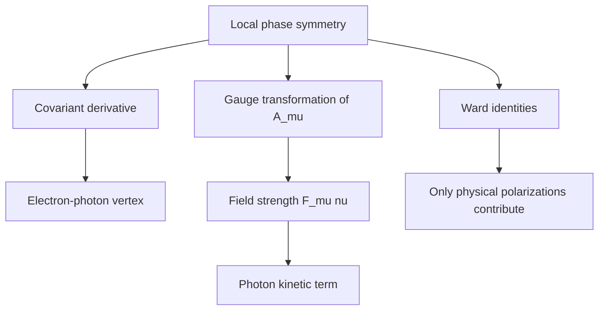

# Gauge Invariance and QED

Gauge invariance is a redundancy with physical force. In electromagnetism the vector potential $A_\mu$ has more components than the photon has physical polarizations, and gauge symmetry identifies descriptions that differ by a derivative. Quantum electrodynamics turns this redundancy into a principle that fixes how charged matter couples to light and protects the photon from acquiring a mass.

QED is the cleanest gauge theory because its group is abelian, $U(1)$. The electron field carries charge, the photon field mediates the interaction, and the local phase symmetry determines the covariant derivative. Zee's discussion uses QED to show how a symmetry can be both a computational constraint and a physical explanation for why a force has the structure it has.

## Definitions

The QED Lagrangian is

$$
\mathcal{L}_{\text{QED}}
=-\frac{1}{4}F_{\mu\nu}F^{\mu\nu}
+\bar{\psi}(i\gamma^\mu D_\mu-m)\psi,
$$

with

$$
F_{\mu\nu}=\partial_\mu A_\nu-\partial_\nu A_\mu,
\qquad
D_\mu=\partial_\mu+ieA_\mu.
$$

The local $U(1)$ gauge transformation is

$$
\psi(x)\to e^{-ie\alpha(x)}\psi(x),
\qquad
A_\mu(x)\to A_\mu(x)+\partial_\mu\alpha(x).
$$

The interaction term is

$$
\mathcal{L}_{\text{int}}=-e\bar{\psi}\gamma^\mu A_\mu\psi.
$$

The photon propagator depends on gauge choice. In Feynman gauge,

$$
D_{\mu\nu}(k)=\frac{-ig_{\mu\nu}}{k^2+i\epsilon}.
$$

The electron propagator is

$$
S_F(p)=\frac{i(\gamma^\mu p_\mu+m)}{p^2-m^2+i\epsilon},
$$

and the electron-photon vertex is

$$
-ie\gamma^\mu.
$$

## Key results

Gauge invariance forbids a photon mass term

$$
\frac{1}{2}m_\gamma^2 A_\mu A^\mu,
$$

because $A_\mu A^\mu$ is not invariant under $A_\mu\to A_\mu+\partial_\mu\alpha$. This is the field-theory expression of the photon's masslessness in ordinary QED.

Current conservation follows from the electron equations of motion:

$$
\partial_\mu(\bar{\psi}\gamma^\mu\psi)=0.
$$

The same conservation law appears diagrammatically as a Ward identity. For a photon attached to a conserved current, replacing the photon polarization $\epsilon_\mu$ by its momentum $k_\mu$ gives zero:

$$
k_\mu \mathcal{M}^\mu=0.
$$

This identity ensures that unphysical photon polarizations do not affect measured amplitudes.

Gauge fixing is required for quantization because the path integral over $A_\mu$ otherwise integrates repeatedly over gauge-equivalent configurations. A common covariant gauge-fixing term is

$$
\mathcal{L}_{\text{gf}}=-\frac{1}{2\xi}(\partial_\mu A^\mu)^2.
$$

In abelian QED, ghosts decouple from physical processes. In nonabelian gauge theory they become essential.

The Ward-Takahashi identity is the off-shell version of the Ward identity and relates the electron-photon vertex to the inverse electron propagator. Schematically,

$$
q_\mu\Gamma^\mu(p+q,p)=S^{-1}(p+q)-S^{-1}(p).
$$

This equation is more than a formal constraint. It forces a relationship between charge renormalization, electron wavefunction renormalization, and vertex corrections. In ordinary QED notation it leads to the equality $Z_1=Z_2$ between the vertex and electron field renormalization constants in gauge-invariant schemes.

Gauge fixing does not remove gauge invariance from the physics. It chooses one representative from each equivalence class so the kinetic operator can be inverted. Different values of the covariant gauge parameter $\xi$ change intermediate propagators:

$$
D_{\mu\nu}(k)=\frac{-i}{k^2+i\epsilon}
\left(g_{\mu\nu}-(1-\xi)\frac{k_\mu k_\nu}{k^2}\right).
$$

Physical cross sections cannot depend on $\xi$. If a result does depend on the gauge parameter, something has been omitted, usually a diagram, counterterm, or external-state condition.

QED also introduces infrared structure. Because the photon is massless, amplitudes with charged particles can have soft and collinear sensitivity. A process with no emitted photon and the same process with an undetected very soft photon are experimentally inseparable. Inclusive observables, which sum over degenerate soft-photon final states, are the quantities that become finite. This is another example of a field-theory lesson: the mathematically sharp object must match what can actually be measured.

## Visual



| Rule | QED expression | Meaning |
|---|---|---|
| Electron propagator | $i(\gamma\cdot p+m)/(p^2-m^2+i\epsilon)$ | charged fermion propagation |
| Photon propagator | $-ig_{\mu\nu}/(k^2+i\epsilon)$ | gauge-fixed massless vector propagation |
| Vertex | $-ie\gamma^\mu$ | photon couples to electric current |
| Gauge condition | $\partial_\mu A^\mu=0$ or variant | removes redundant description |
| Ward identity | $k_\mu\mathcal{M}^\mu=0$ | gauge redundancy cancels unphysical modes |

## Worked example 1: Gauge invariance of the covariant derivative

Problem: Show that $D_\mu\psi=(\partial_\mu+ieA_\mu)\psi$ transforms like $\psi$ under

$$
\psi\to e^{-ie\alpha}\psi,
\qquad
A_\mu\to A_\mu+\partial_\mu\alpha.
$$

Step 1: Apply the transformed derivative:

$$
D'_\mu\psi'
=\left(\partial_\mu+ieA'_\mu\right)(e^{-ie\alpha}\psi).
$$

Step 2: Substitute $A'_\mu=A_\mu+\partial_\mu\alpha$:

$$
D'_\mu\psi'
=\left(\partial_\mu+ieA_\mu+ie\partial_\mu\alpha\right)(e^{-ie\alpha}\psi).
$$

Step 3: Differentiate the product:

$$
\partial_\mu(e^{-ie\alpha}\psi)
=e^{-ie\alpha}\partial_\mu\psi
-ie(\partial_\mu\alpha)e^{-ie\alpha}\psi.
$$

Step 4: Add the gauge-field terms:

$$
D'_\mu\psi'
=e^{-ie\alpha}\partial_\mu\psi
-ie(\partial_\mu\alpha)e^{-ie\alpha}\psi
+ieA_\mu e^{-ie\alpha}\psi
+ie(\partial_\mu\alpha)e^{-ie\alpha}\psi.
$$

Step 5: The two $\partial_\mu\alpha$ terms cancel:

$$
D'_\mu\psi'=e^{-ie\alpha}(\partial_\mu+ieA_\mu)\psi.
$$

The checked answer is

$$
D'_\mu\psi'=e^{-ie\alpha}D_\mu\psi.
$$

Therefore $\bar{\psi}i\gamma^\mu D_\mu\psi$ is gauge invariant.

## Worked example 2: Ward identity for a simple current

Problem: Let a photon with momentum $k=p'-p$ couple to an external electron line. Show that contraction with $k_\mu$ vanishes between on-shell spinors.

Step 1: The current factor is

$$
\bar{u}(p')\gamma^\mu u(p).
$$

Step 2: Contract with $k_\mu$:

$$
k_\mu\bar{u}(p')\gamma^\mu u(p)
=\bar{u}(p')(\gamma^\mu k_\mu)u(p).
$$

Step 3: Since $k=p'-p$,

$$
\gamma^\mu k_\mu=\gamma^\mu p'_\mu-\gamma^\mu p_\mu.
$$

Thus

$$
\bar{u}(p')(\gamma\cdot p'-\gamma\cdot p)u(p).
$$

Step 4: Use the on-shell Dirac equations:

$$
(\gamma\cdot p-m)u(p)=0,
\qquad
\bar{u}(p')(\gamma\cdot p'-m)=0.
$$

Step 5: Replace each momentum slash acting on its spinor by $m$:

$$
\bar{u}(p')\gamma\cdot p' u(p)-\bar{u}(p')\gamma\cdot p\,u(p)
=m\bar{u}(p')u(p)-m\bar{u}(p')u(p)=0.
$$

The checked answer is $k_\mu j^\mu=0$. This is the external-line version of the Ward identity.

## Code

```python
def qed_vertex_factor(charge=1.0):
    # Return symbolic components of -i e gamma^mu.
    return [f"-i*{charge}*gamma^{mu}" for mu in range(4)]

def gauge_parameter_gradient(alpha_values, dx):
    return [(alpha_values[i + 1] - alpha_values[i]) / dx for i in range(len(alpha_values) - 1)]

alpha = [0.0, 0.1, 0.15, 0.25]
print("vertex:", qed_vertex_factor(0.3028))
print("discrete d alpha:", gauge_parameter_gradient(alpha, dx=0.5))
```

## Common pitfalls

- Calling gauge symmetry an ordinary physical symmetry. It is a redundancy in description, though it has strong physical consequences.
- Adding a photon mass term to QED without breaking gauge invariance or introducing a Higgs mechanism.
- Forgetting to fix gauge before inverting the photon kinetic operator.
- Treating longitudinal photon polarizations as physical external states.
- Applying Ward identities off shell without the extra terms that appear away from external physical states.
- Reading gauge fixing as a physical choice. It is a calculational choice; gauge-parameter dependence must cancel from physical observables.
- Ignoring infrared inclusiveness. In a theory with massless photons, a measurable charged-particle cross section often requires summing over unobserved soft radiation.
- Breaking gauge invariance with a regulator or cutoff and then trusting the answer. If the regulator violates the symmetry, the required restoring counterterms or Ward-identity checks must be explicit.
- Using a conserved-current argument while external fermions are off shell. Off-shell identities involve inverse propagators, not just zero.
- Forgetting that charge conservation is tied to the exact local gauge structure.

## Connections

This page is the abelian training ground for all later gauge theory. The photon has no self-interaction, ghosts decouple, and the Ward identity is relatively transparent, so QED is the place to learn what gauge redundancy does before adding nonabelian complications. The same concepts return in Yang-Mills theory with stronger consequences: self-coupled gauge bosons, nontrivial ghosts, asymptotic freedom, and confinement. The renormalization pages explain how QED loop corrections define the physical electric charge.

- [Dirac Fields and Spinors](/physics/quantum-field-theory/dirac-fields-and-spinors)
- [Perturbation Theory and Feynman Diagrams](/physics/quantum-field-theory/perturbation-and-feynman-diagrams)
- [Renormalization and Counterterms](/physics/quantum-field-theory/renormalization-and-counterterms)
- [Yang-Mills Theory and QCD](/physics/quantum-field-theory/yang-mills-theory-and-qcd)
