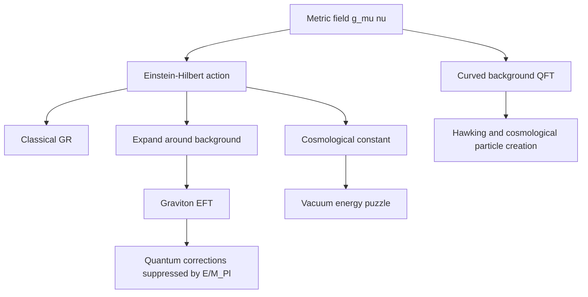

# Gravity, Cosmology, and Beyond

Gravity enters QFT in two complementary ways. First, ordinary quantum fields can be placed on a curved spacetime background, producing phenomena such as particle creation and Hawking radiation. Second, gravity itself can be treated as a field theory at low energy by expanding the metric around a background and quantizing the fluctuations. This does not solve quantum gravity completely, but it gives a controlled effective field theory below the Planck scale.

Zee's later chapters connect gravity, cosmology, supersymmetry, string theory glimpses, gravitational waves, and modern scattering ideas. The common theme is that field theory remains useful even when it points beyond itself. It supplies the language for low-energy gravitational interactions, vacuum energy puzzles, and relationships between gauge theory and gravity amplitudes.

## Definitions

The Einstein-Hilbert action is

$$
S_{\text{EH}}=
\frac{M_{\text{Pl}}^2}{2}\int d^4x\,\sqrt{-g}\,R,
$$

where $R$ is the Ricci scalar and

$$
M_{\text{Pl}}^2=\frac{1}{8\pi G}
$$

in the reduced Planck-mass convention.

Matter couples to the metric through

$$
S_{\text{matter}}=\int d^4x\,\sqrt{-g}\,\mathcal{L}_{\text{matter}}.
$$

The stress-energy tensor is

$$
T_{\mu\nu}=
-\frac{2}{\sqrt{-g}}
\frac{\delta S_{\text{matter}}}{\delta g^{\mu\nu}}.
$$

For weak gravity, expand around flat spacetime:

$$
g_{\mu\nu}=\eta_{\mu\nu}+\kappa h_{\mu\nu},
\qquad
\kappa=\sqrt{32\pi G}.
$$

The cosmological constant term is

$$
S_\Lambda=-\int d^4x\,\sqrt{-g}\,\Lambda_{\text{cc}}.
$$

## Key results

At low energy, gravity is an effective field theory:

$$
\mathcal{L}_{\text{grav}}
=\sqrt{-g}\left[
\frac{M_{\text{Pl}}^2}{2}R
-\Lambda_{\text{cc}}
+c_1R^2
+c_2R_{\mu\nu}R^{\mu\nu}
+\cdots
\right].
$$

The higher-curvature terms are suppressed at long distance. Quantum loops of gravitons and matter require such terms as counterterms, but predictions can still be made order by order in $E/M_{\text{Pl}}$.

The cosmological constant problem is the tension between vacuum energy estimates from quantum fields and the observed small curvature associated with dark energy. A zero-point contribution schematically looks like

$$
\rho_{\text{vac}}\sim \int^{\Lambda}\frac{d^3k}{(2\pi)^3}\frac{1}{2}\sqrt{k^2+m^2},
$$

which scales roughly as $\Lambda^4$ for a high cutoff. Observed cosmic acceleration corresponds to a much smaller energy density than naive particle-physics cutoffs suggest.

Kaluza-Klein theory illustrates another field-theory idea: extra-dimensional components of the metric can appear as gauge fields after compactification. If one dimension is a circle of radius $R$, momentum in that direction is quantized:

$$
p_5=\frac{n}{R}.
$$

A four-dimensional observer sees a tower of masses

$$
m_n^2=m_0^2+\frac{n^2}{R^2}.
$$

Modern amplitude relations suggest deep links between gauge theory and gravity, often summarized by the idea that gravity amplitudes can resemble a "square" of Yang-Mills structures in special formulations.

Quantum fields in curved spacetime also challenge the idea of a unique particle. In flat spacetime, positive frequency modes define a natural vacuum for inertial observers. In a time-dependent or curved background, different observers or different early and late time regions may split modes differently. Particle creation in an expanding universe and Hawking radiation near black holes come from this mismatch of vacuum definitions.

The Hawking temperature of a black hole is

$$
T_H=\frac{1}{8\pi GM}
$$

for a nonrotating neutral black hole in units with $c=\hbar=k_B=1$. This formula is one of the sharpest hints that quantum theory, gravity, and thermodynamics are inseparable. The corresponding entropy is proportional to horizon area, not volume:

$$
S_{\text{BH}}=\frac{A}{4G}.
$$

Gravitational waves fit naturally into the weak-field expansion. The transverse-traceless part of $h_{\mu\nu}$ carries the two polarizations of a massless spin-two field. In an EFT treatment, compact binary inspiral can be described by separating scales: object size, orbital separation, and radiation wavelength. Matching and power counting then organize corrections to Newtonian gravity.

Supersymmetry and string theory enter Zee's late scope as possible ultraviolet clues. Supersymmetry relates bosons and fermions and can soften ultraviolet behavior because loop contributions cancel between partners. String theory replaces point particles by extended objects, and its worldsheet description is a two-dimensional field theory. Even when these ideas are not assumed to be realized directly at accessible energies, they have influenced how field theorists understand duality, anomalies, and gauge-gravity relations.

The cosmological constant problem remains a central warning. Effective field theory says vacuum energy terms are allowed by symmetry, and gravity says they curve spacetime. Explaining why the observed value is so small compared with natural high-energy estimates is not a minor detail; it is one of the deepest open problems at the boundary of QFT and cosmology.

## Visual



| Topic | Field-theory object | Main lesson |
|---|---|---|
| Weak gravity | $h_{\mu\nu}$ | graviton as metric fluctuation |
| Curved-spacetime QFT | fields on fixed $g_{\mu\nu}$ | vacuum depends on geometry |
| Cosmological constant | $\sqrt{-g}\Lambda_{\text{cc}}$ | vacuum energy gravitates |
| Kaluza-Klein | compact extra dimension | towers of massive modes |
| Gravitational EFT | curvature expansion | predictive below $M_{\text{Pl}}$ |

## Worked example 1: Kaluza-Klein mass tower

Problem: A scalar field lives in five dimensions with the fifth dimension compactified on a circle of radius $R$. Show the four-dimensional mass spectrum.

Step 1: Periodicity in the fifth coordinate $y$ requires

$$
\phi(x,y+2\pi R)=\phi(x,y).
$$

Step 2: Expand in Fourier modes:

$$
\phi(x,y)=\sum_{n=-\infty}^{\infty}\phi_n(x)e^{iny/R}.
$$

Step 3: The fifth derivative acts as

$$
\partial_y\phi_n e^{iny/R}
=\frac{in}{R}\phi_n e^{iny/R}.
$$

Step 4: The five-dimensional Klein-Gordon equation is

$$
(\partial_\mu\partial^\mu-\partial_y^2+m_0^2)\phi=0
$$

up to signature convention.

Step 5: Acting on the $n$th mode, $-\partial_y^2$ contributes

$$
\frac{n^2}{R^2}.
$$

Step 6: The four-dimensional mode obeys

$$
(\partial_\mu\partial^\mu+m_0^2+n^2/R^2)\phi_n=0.
$$

The checked mass spectrum is

$$
m_n^2=m_0^2+\frac{n^2}{R^2}.
$$

Small compact dimensions make the excited modes heavy.

## Worked example 2: Vacuum energy with a momentum cutoff

Problem: Estimate the leading cutoff dependence of the zero-point energy density for a relativistic scalar:

$$
\rho_{\text{vac}}(\Lambda)=
\frac{1}{2}\int_{|\mathbf{k}|<\Lambda}
\frac{d^3k}{(2\pi)^3}\sqrt{\mathbf{k}^2+m^2}.
$$

Step 1: At large $\Lambda\gg m$, approximate

$$
\sqrt{k^2+m^2}\approx k.
$$

Step 2: Use spherical coordinates in three momentum dimensions:

$$
d^3k=4\pi k^2dk.
$$

Step 3: Substitute:

$$
\rho_{\text{vac}}\approx
\frac{1}{2}\frac{4\pi}{(2\pi)^3}
\int_0^\Lambda k^3\,dk.
$$

Step 4: Simplify the prefactor:

$$
\frac{1}{2}\frac{4\pi}{8\pi^3}
=\frac{1}{4\pi^2}.
$$

Step 5: Integrate:

$$
\int_0^\Lambda k^3\,dk=\frac{\Lambda^4}{4}.
$$

Step 6: Combine:

$$
\rho_{\text{vac}}\approx
\frac{\Lambda^4}{16\pi^2}.
$$

The checked answer is quartic sensitivity to the cutoff. The cosmological constant problem is not merely that this expression is large, but that gravitating vacuum energy appears extraordinarily small compared with many natural particle-physics scales.

## Code

```python
import math

def kk_masses(m0, radius, max_mode):
    return [math.sqrt(m0 * m0 + (n / radius) ** 2) for n in range(max_mode + 1)]

def vacuum_energy_leading(cutoff):
    return cutoff**4 / (16 * math.pi**2)

print("KK masses:", kk_masses(m0=1.0, radius=0.5, max_mode=5))
for cutoff in [1, 10, 100]:
    print(cutoff, vacuum_energy_leading(cutoff))
```

## Common pitfalls

- Thinking nonrenormalizable gravity means no quantum predictions. As an EFT, gravity is predictive at energies well below the Planck scale.
- Confusing QFT in curved spacetime with full quantum gravity. In the former, the metric is usually a classical background.
- Ignoring the cosmological constant term because it is constant in nongravitational physics. With gravity, vacuum energy curves spacetime.
- Treating Kaluza-Klein towers as optional decoration. They are the direct Fourier consequence of compact extra dimensions.
- Assuming gauge-gravity amplitude relations are a complete theory of quantum gravity. They are powerful structural clues, not by themselves a full ultraviolet completion.
- Forgetting the domain of gravitational EFT. The expansion is controlled by energy, curvature, and length scales compared with the Planck scale or other heavy thresholds.
- Treating vacuum energy as removable by shifting the zero of energy once gravity is dynamical. Constant energy density contributes to spacetime curvature.
- Confusing the graviton with a scalar ripple. The weak-field graviton is a massless spin-two excitation with gauge redundancy inherited from diffeomorphism invariance.

## Connections

Gravity is the endpoint that tests how far the field-theory viewpoint can be pushed. The EFT page explains why quantum gravity can still make low-energy predictions, the RG page explains scale separation, and the Yang-Mills page supplies the gauge-theory side of modern amplitude connections. The motivation page is also relevant: if particles are field excitations, then a graviton is the excitation of the metric field in a weak-background expansion.

- [Effective Field Theory](/physics/quantum-field-theory/effective-field-theory)
- [Renormalization Group](/physics/quantum-field-theory/renormalization-group)
- [Yang-Mills Theory and QCD](/physics/quantum-field-theory/yang-mills-theory-and-qcd)
- [Motivation, Fields, and Quanta](/physics/quantum-field-theory/motivation-fields-and-quanta)
