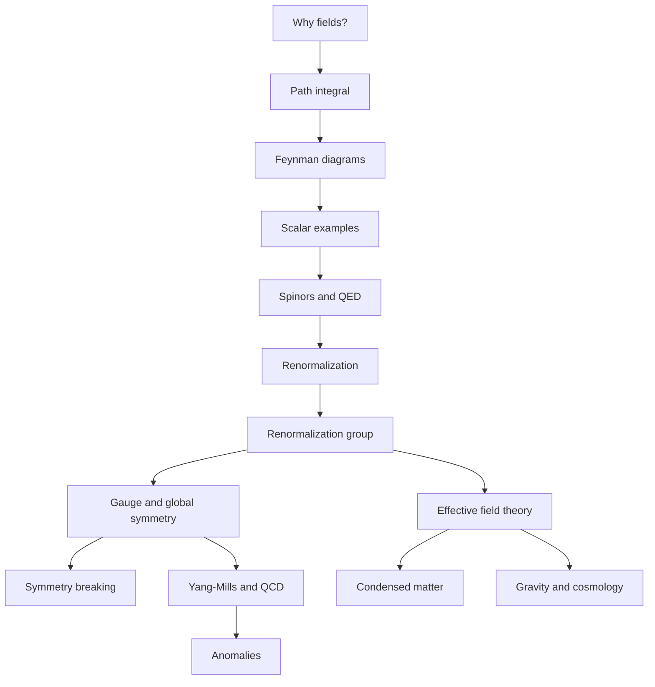

# Quantum Field Theory in a Nutshell

These notes are an original study guide to the scope of A. Zee's *Quantum Field Theory in a Nutshell*. The organizing idea is that quantum field theory is the common language of relativistic particles, gauge forces, collective phenomena, and low-energy approximations to deeper physics. The pages follow Zee's broad arc: motivation and foundations, path integrals, diagrams, spinors, gauge theory, renormalization, symmetry breaking, anomalies, condensed matter, unification, and gravity.

The goal is not to replace the book. It is to provide a structured wiki path through the main concepts with formulas, derivation sketches, visual anchors, worked examples, code snippets, and cross-links. The table of contents extracted from the first pages of the PDF shows Zee's sequence: Part I introduces motivation, path integrals, fields, particles, diagrams, canonical quantization, symmetry, and curved spacetime; Part II develops Dirac spinors and QED scattering; Part III covers renormalization and gauge invariance; Part IV covers symmetry breaking, nonabelian gauge theory, Higgs physics, and anomalies; Parts V and VI connect field theory with collective and condensed-matter phenomena; Part VII treats Yang-Mills, electroweak theory, QCD, large $N$, and grand unification; Part VIII and Part N look toward gravity, cosmology, EFT, supersymmetry, string theory, gravitational waves, and modern gauge-gravity connections.

Use the pages as a map rather than a linear substitute for a course. A first pass can follow the sidebar order and focus on definitions and worked examples. A second pass should connect recurring structures: Gaussian integrals reappear as propagators, symmetries reappear as Ward identities, and scale dependence reappears as both renormalization and effective field theory.


*Figure: Standard Model particle chart. Image: [Wikimedia Commons](https://commons.wikimedia.org/wiki/File:Standard_Model_of_Elementary_Particles.svg), Cush, public domain.*

## Definitions

The central object of QFT is a field on spacetime. A scalar example is

$$
\phi(x),\qquad x^\mu=(t,\mathbf{x}).
$$

The dynamics are encoded by an action

$$
S[\phi]=\int d^4x\,\mathcal{L}(\phi,\partial_\mu\phi).
$$

Quantization can be approached canonically through commutators, or through the path integral

$$
Z[J]=\int\mathcal{D}\phi\,
\exp\left(iS[\phi]+i\int d^4x\,J(x)\phi(x)\right).
$$

Correlation functions are vacuum expectation values of time-ordered products:

$$
G^{(n)}(x_1,\dots,x_n)
=\langle 0|T\phi(x_1)\cdots\phi(x_n)|0\rangle.
$$

Particles appear as excitations of fields. A free real scalar field has the mode expansion

$$
\hat{\phi}(x)=
\int\frac{d^3p}{(2\pi)^3}\frac{1}{\sqrt{2E_{\mathbf{p}}}}
\left(a_{\mathbf{p}}e^{-ip\cdot x}
+a_{\mathbf{p}}^\dagger e^{ip\cdot x}\right),
$$

where $a_{\mathbf{p}}^\dagger$ creates a quantum of momentum $\mathbf{p}$.

The notes use natural units $c=\hbar=1$, metric signature $(+,-,-,-)$ where needed, and absolute wiki links under `/physics/quantum-field-theory/...`.

## Key results

QFT is built from a few recurring results:

1. Locality and Lorentz symmetry constrain Lagrangians.
2. Quadratic terms define propagators.
3. Interaction terms define vertices.
4. Functional derivatives of $Z[J]$ generate correlation functions.
5. Loop integrals require regularization and renormalization.
6. Gauge invariance removes redundant degrees of freedom and enforces Ward identities.
7. Spontaneous symmetry breaking reorganizes the spectrum.
8. The renormalization group explains scale dependence and universality.
9. Effective field theory makes finite-domain theories predictive.

The generated chapter list is:

| Position | Page | Main Zee-aligned scope |
|---|---|---|
| 2 | [Motivation, Fields, and Quanta](/physics/quantum-field-theory/motivation-fields-and-quanta) | why fields, particles as excitations, locality |
| 3 | [Path Integral Formulation](/physics/quantum-field-theory/path-integral-formulation) | sum over histories, generating functionals |
| 4 | [Perturbation Theory and Feynman Diagrams](/physics/quantum-field-theory/perturbation-and-feynman-diagrams) | propagators, vertices, graph counting |
| 5 | [Scalar Phi-Four Theory](/physics/quantum-field-theory/scalar-phi-four-theory) | scalar model, loops, counterterm targets |
| 6 | [Dirac Fields and Spinors](/physics/quantum-field-theory/dirac-fields-and-spinors) | Dirac equation, fermion quantization |
| 7 | [Gauge Invariance and QED](/physics/quantum-field-theory/gauge-invariance-and-qed) | local $U(1)$, Ward identities, QED rules |
| 8 | [Renormalization and Counterterms](/physics/quantum-field-theory/renormalization-and-counterterms) | regulators, counterterms, physical parameters |
| 9 | [Renormalization Group](/physics/quantum-field-theory/renormalization-group) | beta functions, fixed points, universality |
| 10 | [Symmetry Breaking, Goldstone Bosons, and Higgs Physics](/physics/quantum-field-theory/symmetry-breaking-goldstone-higgs) | Goldstone theorem and Higgs mechanism |
| 11 | [Yang-Mills Theory and QCD](/physics/quantum-field-theory/yang-mills-theory-and-qcd) | nonabelian gauge theory, ghosts, QCD |
| 12 | [Chiral Anomalies](/physics/quantum-field-theory/chiral-anomalies) | axial anomaly, topology, consistency |
| 13 | [Effective Field Theory](/physics/quantum-field-theory/effective-field-theory) | matching, power counting, low-energy expansion |
| 14 | [Electroweak Theory and Grand Unification](/physics/quantum-field-theory/electroweak-theory-and-grand-unification) | electroweak breaking, GUT scaling ideas |
| 15 | [Collective and Condensed Matter Field Theory](/physics/quantum-field-theory/collective-and-condensed-matter-field-theory) | superfluids, criticality, superconductors, Hall fluids |
| 16 | [Gravity, Cosmology, and Beyond](/physics/quantum-field-theory/gravity-cosmology-and-beyond) | curved spacetime, gravitational EFT, cosmological constant |

## Visual



| Theme | Pages to read first | Minimal mathematical tool |
|---|---|---|
| Scattering | diagrams, $\phi^4$, QED | Gaussian integrals and Fourier transforms |
| Symmetry | spinors, gauge theory, symmetry breaking | groups, currents, Noether reasoning |
| Scale | renormalization, RG, EFT | dimensional analysis and logarithms |
| Matter systems | condensed matter, symmetry breaking, RG | Euclidean path integrals and order parameters |
| Beyond the Standard Model | Yang-Mills, electroweak/GUT, gravity | gauge groups and EFT power counting |

## Worked example 1: From action to propagator

Problem: Explain how a quadratic scalar action determines the propagator.

Step 1: Start with the free action in a compact quadratic notation:

$$
S_0[\phi]=\frac{1}{2}\int d^4x\,\phi(x)K\phi(x),
$$

where

$$
K=-\partial^2-m^2+i\epsilon.
$$

Step 2: Add a source:

$$
S_0[\phi]+\int d^4x\,J(x)\phi(x).
$$

Step 3: Complete the square in functional form:

$$
\frac{1}{2}\phi K\phi+J\phi
=\frac{1}{2}(\phi+K^{-1}J)K(\phi+K^{-1}J)
-\frac{1}{2}JK^{-1}J.
$$

Step 4: The shifted Gaussian integral gives

$$
Z_0[J]=Z_0[0]\exp\left(-\frac{i}{2}JK^{-1}J\right)
$$

up to sign conventions absorbed into the definition of the Feynman Green function.

Step 5: The propagator is the inverse kernel:

$$
K\Delta_F(x-y)=i\delta^{(4)}(x-y).
$$

Step 6: Fourier transform. Since $\partial^2\to -p^2$,

$$
\tilde{\Delta}_F(p)=\frac{i}{p^2-m^2+i\epsilon}.
$$

The checked answer is that the propagator is the inverse of the quadratic operator in the action, with the $i\epsilon$ prescription specifying the vacuum boundary condition.

## Worked example 2: Choosing a reading path for a calculation

Problem: A student wants to compute the first loop correction to $2\to2$ scalar scattering and understand why the answer depends on a scale. Which pages should they read and what are the intermediate checkpoints?

Step 1: Begin with [Motivation, Fields, and Quanta](/physics/quantum-field-theory/motivation-fields-and-quanta) to identify the scalar field, the action, and why particles are excitations.

Step 2: Read [Path Integral Formulation](/physics/quantum-field-theory/path-integral-formulation). The checkpoint is being able to write

$$
Z[J]=\int\mathcal{D}\phi\,e^{iS+iJ\phi}
$$

and obtain correlators by differentiating with respect to $J$.

Step 3: Read [Perturbation Theory and Feynman Diagrams](/physics/quantum-field-theory/perturbation-and-feynman-diagrams). The checkpoint is knowing that an internal line gives

$$
\frac{i}{p^2-m^2+i\epsilon}
$$

and a $\phi^4$ vertex gives $-i\lambda$.

Step 4: Read [Scalar Phi-Four Theory](/physics/quantum-field-theory/scalar-phi-four-theory). The checkpoint is deriving the graph relation

$$
D=4-E.
$$

For $E=4$, the one-loop correction is logarithmically divergent.

Step 5: Read [Renormalization and Counterterms](/physics/quantum-field-theory/renormalization-and-counterterms). The checkpoint is understanding that the divergent part is absorbed into $\delta\lambda$ while a finite renormalization condition defines the measured $\lambda$.

Step 6: Read [Renormalization Group](/physics/quantum-field-theory/renormalization-group). The checkpoint is interpreting the residual scale dependence as a beta function:

$$
\beta(\lambda)=\mu\frac{d\lambda}{d\mu}.
$$

The checked reading path turns a single loop diagram into the linked ideas of propagators, vertices, divergence, counterterm, renormalization condition, and running coupling.

## Code

```python
pages = [
    ("motivation-fields-and-quanta", "fields and particles"),
    ("path-integral-formulation", "generating functional"),
    ("perturbation-and-feynman-diagrams", "diagram rules"),
    ("scalar-phi-four-theory", "scalar test model"),
    ("renormalization-and-counterterms", "remove cutoff dependence"),
    ("renormalization-group", "scale flow"),
]

for index, (slug, purpose) in enumerate(pages, start=1):
    url = f"/physics/quantum-field-theory/{slug}"
    print(f"{index}. {purpose}: {url}")
```

## Common pitfalls

- Reading QFT as a list of unrelated tricks. The same few ideas repeat: locality, symmetry, Gaussian integrals, perturbative expansion, and scale dependence.
- Skipping the scalar model too quickly. $\phi^4$ theory is where most of the machinery can be learned without spin or gauge redundancy.
- Treating gauge invariance as a force law rather than a redundancy that constrains force laws.
- Thinking renormalization only removes infinities. Its deeper content is how measured parameters change with scale.
- Treating condensed matter and gravity pages as side topics. They show why QFT is a general framework, not merely a particle-physics technique.

## Connections

- [Motivation, Fields, and Quanta](/physics/quantum-field-theory/motivation-fields-and-quanta)
- [Path Integral Formulation](/physics/quantum-field-theory/path-integral-formulation)
- [Perturbation Theory and Feynman Diagrams](/physics/quantum-field-theory/perturbation-and-feynman-diagrams)
- [Scalar Phi-Four Theory](/physics/quantum-field-theory/scalar-phi-four-theory)
- [Dirac Fields and Spinors](/physics/quantum-field-theory/dirac-fields-and-spinors)
- [Gauge Invariance and QED](/physics/quantum-field-theory/gauge-invariance-and-qed)
- [Renormalization and Counterterms](/physics/quantum-field-theory/renormalization-and-counterterms)
- [Renormalization Group](/physics/quantum-field-theory/renormalization-group)
- [Symmetry Breaking, Goldstone Bosons, and Higgs Physics](/physics/quantum-field-theory/symmetry-breaking-goldstone-higgs)
- [Yang-Mills Theory and QCD](/physics/quantum-field-theory/yang-mills-theory-and-qcd)
- [Chiral Anomalies](/physics/quantum-field-theory/chiral-anomalies)
- [Effective Field Theory](/physics/quantum-field-theory/effective-field-theory)
- [Electroweak Theory and Grand Unification](/physics/quantum-field-theory/electroweak-theory-and-grand-unification)
- [Collective and Condensed Matter Field Theory](/physics/quantum-field-theory/collective-and-condensed-matter-field-theory)
- [Gravity, Cosmology, and Beyond](/physics/quantum-field-theory/gravity-cosmology-and-beyond)
