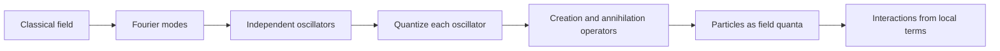

# Motivation, Fields, and Quanta

Quantum field theory begins with a change in what we regard as primary. In nonrelativistic quantum mechanics a particle has a wavefunction, but relativistic physics makes fixed particle number unstable: enough energy can create new particles, and a localized particle state spreads in ways that fight the simple one-particle picture. A field is the more natural object because it assigns degrees of freedom to every point in space, and particles appear as quantized excitations of those degrees of freedom.

This point of view also unifies forces and matter. A classical field can store energy, carry momentum, and mediate interactions; a quantum field does the same while allowing exchange in discrete quanta. Zee's opening chapters stress this physical motivation before machinery: fields are not decorative notation for particles, but the bookkeeping system demanded by locality, relativity, and quantum mechanics together.

## Definitions

A **classical field** is a function on spacetime. A real scalar field is the simplest example:

$$
\phi:\mathbb{R}^{1,3}\to \mathbb{R}, \qquad x^\mu=(t,\mathbf{x}).
$$

In natural units, $c=\hbar=1$, time and length are measured in inverse energy. The action is the spacetime integral of a Lagrangian density:

$$
S[\phi]=\int d^4x\,\mathcal{L}(\phi,\partial_\mu\phi).
$$

For a free real scalar field,

$$
\mathcal{L}=\frac{1}{2}\partial_\mu\phi\,\partial^\mu\phi-\frac{1}{2}m^2\phi^2.
$$

The Euler-Lagrange equation for fields is

$$
\frac{\partial \mathcal{L}}{\partial \phi}
-\partial_\mu\left(\frac{\partial \mathcal{L}}{\partial(\partial_\mu\phi)}\right)=0.
$$

Applying it to the free scalar Lagrangian gives the Klein-Gordon equation:

$$
(\partial_\mu\partial^\mu+m^2)\phi=0.
$$

A **quantum field** promotes the field and its conjugate momentum to operators. Equal-time canonical quantization imposes

$$
[\hat{\phi}(t,\mathbf{x}),\hat{\pi}(t,\mathbf{y})]=i\delta^{(3)}(\mathbf{x}-\mathbf{y}),
\qquad
\hat{\pi}=\frac{\partial \mathcal{L}}{\partial\dot{\phi}}.
$$

A **particle** is an excitation created by a creation operator acting on the vacuum:

$$
| \mathbf{p}\rangle = a^\dagger_{\mathbf{p}}|0\rangle .
$$

Thus the field is the operator that creates and destroys quanta, not merely a wavefunction for one quantum.

## Key results

The first structural result is that a free relativistic field decomposes into independent harmonic oscillators, one for each momentum mode. Write, schematically,

$$
\hat{\phi}(x)=
\int\frac{d^3p}{(2\pi)^3}\frac{1}{\sqrt{2E_{\mathbf{p}}}}
\left(a_{\mathbf{p}}e^{-ip\cdot x}+a^\dagger_{\mathbf{p}}e^{ip\cdot x}\right),
\qquad E_{\mathbf{p}}=\sqrt{\mathbf{p}^2+m^2}.
$$

The energy operator becomes a sum over oscillator energies:

$$
\hat{H}=\int \frac{d^3p}{(2\pi)^3}E_{\mathbf{p}}
\left(a^\dagger_{\mathbf{p}}a_{\mathbf{p}}+\frac{1}{2}\delta^{(3)}(0)\right).
$$

The infinite zero-point term is already a warning sign: quantum fields naturally produce ultraviolet-sensitive quantities. In many nongravitational calculations only energy differences matter, but once gravity is included the vacuum energy becomes physically serious.

The second structural result is locality. Local interactions are built from products of fields at the same spacetime point, for example

$$
\mathcal{L}_{\text{int}}=-\frac{\lambda}{4!}\phi^4.
$$

Locality keeps cause and effect compatible with relativity. It also makes the theory predictive when combined with symmetry and dimensional analysis, because only certain interactions remain important at long distances.

A third result is crossing between classical waves and particles. A classical field configuration can be understood as a coherent state containing many quanta. Conversely, a one-particle state is a small excitation of the quantum field. The language changes smoothly between particle physics, condensed matter, and classical field theory.

There is also a useful diagnostic for when a field description is forced on us. If the question involves creation or annihilation, radiation, collective oscillation, or a local conservation law, a fixed-particle Hilbert space is usually the wrong starting point. A decaying excited atom emits a photon; an accelerated charge radiates; a hot gas produces and absorbs quanta; a crystal has phonons whose number is not conserved. The field supplies operators that create and destroy these excitations while keeping energy, momentum, charge, and spin under control.

The field viewpoint also makes causality sharper. Relativistic locality is expressed by the vanishing of commutators or anticommutators at spacelike separation, for example schematically

$$
[\mathcal{O}(x),\mathcal{O}(y)]=0
\quad\text{when}\quad (x-y)^2<0
$$

for bosonic observables. This condition says that measurements outside each other's light cones cannot be used to send signals. It is much more natural to impose this on local fields and local composite operators than on an instantaneous potential between particles.

Finally, fields make approximation systematic. One writes the most general local Lagrangian consistent with the symmetries and orders the terms by dimension or by the number of derivatives. The result may be a fundamental-looking theory, such as QED over a wide range of scales, or an effective theory, such as phonons in a solid. In both cases the same mathematical structure explains why only a few terms dominate the low-energy behavior.

## Visual



| Idea | Particle-first language | Field-first language | Why field-first wins |
|---|---|---|---|
| Basic object | Trajectory or wavefunction | Operator-valued field | Handles changing particle number |
| Locality | Must be imposed indirectly | Built from local densities | Relativity is transparent |
| Forces | Potentials between particles | Exchange of field quanta | Fits radiation and scattering |
| Vacuum | Empty background | Lowest-energy field state | Vacuum fluctuations are dynamical |
| Many-body systems | Large Hilbert space | Same field with many excitations | Natural for collective modes |

## Worked example 1: Deriving the Klein-Gordon equation

Problem: Starting from

$$
\mathcal{L}=\frac{1}{2}\partial_\mu\phi\,\partial^\mu\phi-\frac{1}{2}m^2\phi^2,
$$

derive the equation of motion.

Step 1: Differentiate with respect to the field:

$$
\frac{\partial \mathcal{L}}{\partial \phi}=-m^2\phi.
$$

Step 2: Differentiate with respect to the field derivative:

$$
\frac{\partial \mathcal{L}}{\partial(\partial_\mu\phi)}
=\partial^\mu\phi.
$$

Step 3: Insert both pieces into the field Euler-Lagrange equation:

$$
-m^2\phi-\partial_\mu(\partial^\mu\phi)=0.
$$

Step 4: Move signs into the standard form:

$$
(\partial_\mu\partial^\mu+m^2)\phi=0.
$$

Step 5: Check with a plane wave $\phi=e^{-ip\cdot x}$. Since $\partial_\mu\partial^\mu e^{-ip\cdot x}=-p_\mu p^\mu e^{-ip\cdot x}$, the equation becomes

$$
(-p^2+m^2)e^{-ip\cdot x}=0,
$$

so $p^2=m^2$, or $E^2=\mathbf{p}^2+m^2$. The field equation reproduces the relativistic energy-momentum relation.

## Worked example 2: Mass dimension of a scalar interaction

Problem: In four spacetime dimensions, find the mass dimensions of $\phi$, $m$, and $\lambda$ in the interaction $-\lambda \phi^4/4!$.

Step 1: The action is dimensionless in natural units:

$$
[S]=0.
$$

Step 2: Since $d^4x$ has dimension $-4$, the Lagrangian density has dimension

$$
[\mathcal{L}]=4.
$$

Step 3: The kinetic term is $\frac{1}{2}\partial_\mu\phi\partial^\mu\phi$. Since $[\partial_\mu]=1$,

$$
[\partial_\mu\phi\partial^\mu\phi]=2+2[\phi].
$$

Set this equal to $4$:

$$
2+2[\phi]=4 \quad \Rightarrow \quad [\phi]=1.
$$

Step 4: The mass term has dimension

$$
[m^2\phi^2]=2[m]+2[\phi].
$$

Using $[\phi]=1$ and setting the result equal to $4$ gives

$$
2[m]+2=4 \quad \Rightarrow \quad [m]=1.
$$

Step 5: The quartic interaction has dimension

$$
[\lambda\phi^4]=[\lambda]+4[\phi]=[\lambda]+4.
$$

Therefore

$$
[\lambda]+4=4 \quad \Rightarrow \quad [\lambda]=0.
$$

The checked answer is $[\phi]=1$, $[m]=1$, and $[\lambda]=0$. A dimensionless coupling is a first hint that $\phi^4$ theory in four dimensions is marginal by power counting.

## Code

```python
import math

def scalar_dimensions(spacetime_dim):
    # From [L] = d and [(partial phi)^2] = 2 + 2[phi].
    phi_dim = (spacetime_dim - 2) / 2
    m_dim = 1
    lambda_phi4_dim = spacetime_dim - 4 * phi_dim
    return phi_dim, m_dim, lambda_phi4_dim

for d in [2, 3, 4, 5, 6]:
    phi_dim, m_dim, lam_dim = scalar_dimensions(d)
    print(f"d={d}: [phi]={phi_dim:.1f}, [m]={m_dim}, [lambda_phi4]={lam_dim:.1f}")
```

## Common pitfalls

- Treating a quantum field as a one-particle wavefunction. The field operator acts on Fock space and changes particle number.
- Forgetting that $\mathcal{L}$ usually means Lagrangian density in field theory, not the spatially integrated Lagrangian.
- Dropping metric signs inconsistently. With signature $(+,-,-,-)$, $\partial_\mu\partial^\mu=\partial_t^2-\nabla^2$.
- Thinking the vacuum is empty in the classical sense. The quantum vacuum is the lowest-energy state of fields and can have correlations.
- Confusing the mass parameter $m$ with a coupling. In natural units it has dimension one, while $\lambda$ in four-dimensional $\phi^4$ theory is dimensionless.
- Missing the operational test: if the process can emit, absorb, or exchange quanta, use field operators rather than a fixed-particle wavefunction.

## Connections

- [Path Integral Formulation](/physics/quantum-field-theory/path-integral-formulation)
- [Perturbation Theory and Feynman Diagrams](/physics/quantum-field-theory/perturbation-and-feynman-diagrams)
- [Scalar Phi-Four Theory](/physics/quantum-field-theory/scalar-phi-four-theory)
- [Renormalization and Counterterms](/physics/quantum-field-theory/renormalization-and-counterterms)
