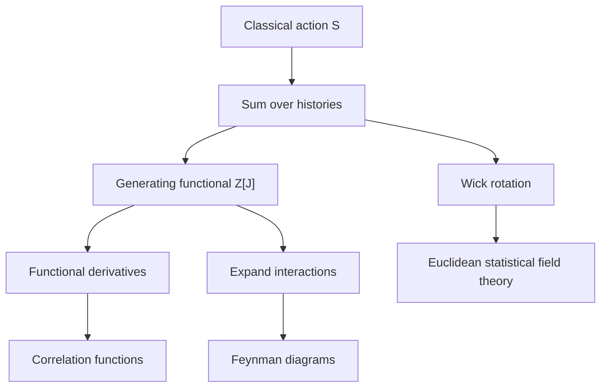

# Path Integral Formulation

The path integral replaces the question "which path did the particle take?" with "how do all paths interfere?" In ordinary quantum mechanics this is already a radical idea. In quantum field theory it becomes almost unavoidable, because the histories being summed are field configurations over spacetime, and the formalism treats symmetries, perturbation theory, and tunneling in a unified way.

Zee emphasizes the path integral early because it gives a compact route from quantum mechanics to field theory. Instead of beginning with commutators and Hilbert-space operators, one starts with the classical action and integrates over configurations weighted by $e^{iS}$. Correlation functions, propagators, Feynman rules, and semiclassical approximations all come from the same generating functional.


*Figure: A Feynman diagram turns perturbation theory into a compact bookkeeping picture for particles, propagators, and vertices. Image: [Wikimedia Commons](https://commons.wikimedia.org/wiki/File:Electron-scattering.svg), KCVelaga, CC BY-SA 4.0.*

## Definitions

For a single quantum-mechanical coordinate $q(t)$, the transition amplitude is formally

$$
\langle q_f,t_f|q_i,t_i\rangle
=\int_{q(t_i)=q_i}^{q(t_f)=q_f}\mathcal{D}q(t)\,e^{iS[q]}.
$$

For a scalar field,

$$
Z=\int \mathcal{D}\phi\,e^{iS[\phi]},
\qquad
S[\phi]=\int d^4x\,\mathcal{L}.
$$

The **generating functional** adds a source $J(x)$:

$$
Z[J]=\int \mathcal{D}\phi\,
\exp\left(iS[\phi]+i\int d^4x\,J(x)\phi(x)\right).
$$

Correlation functions are obtained by functional differentiation:

$$
\langle 0|T\phi(x_1)\cdots \phi(x_n)|0\rangle
=\frac{1}{Z[0]}\left.
\frac{1}{i^n}
\frac{\delta^n Z[J]}{\delta J(x_1)\cdots\delta J(x_n)}
\right|_{J=0}.
$$

The free scalar action can be written as a quadratic form:

$$
S_0[\phi]=\frac{1}{2}\int d^4x\,\phi(x)\left(-\partial^2-m^2+i\epsilon\right)\phi(x),
$$

where the $i\epsilon$ prescription selects the Feynman contour and vacuum boundary condition.

## Key results

The central identity behind perturbative QFT is the Gaussian integral. In finite dimensions,

$$
\int d^n x\,\exp\left(\frac{i}{2}x^TAx+iJ^Tx\right)
\propto
\exp\left(-\frac{i}{2}J^TA^{-1}J\right).
$$

The field-theory version gives the free generating functional:

$$
Z_0[J]=Z_0[0]\exp\left(
\frac{i}{2}\int d^4x\,d^4y\,J(x)\Delta_F(x-y)J(y)
\right),
$$

where the Feynman propagator satisfies

$$
(-\partial^2-m^2+i\epsilon)\Delta_F(x-y)=i\delta^{(4)}(x-y).
$$

Interactions can be represented as differential operators acting on $Z_0[J]$. For $\phi^4$ theory,

$$
Z[J]=\exp\left(
-i\int d^4x\,\frac{\lambda}{4!}
\left(\frac{1}{i}\frac{\delta}{\delta J(x)}\right)^4
\right)Z_0[J].
$$

This compact expression is the seed of Feynman diagrams. Each source derivative pulls down propagators; each interaction term supplies a vertex; combinatorics counts contractions.

The Euclidean path integral is obtained by Wick rotation $t=-i\tau$:

$$
Z_E=\int \mathcal{D}\phi\,e^{-S_E[\phi]}.
$$

Euclidean form makes the connection with statistical mechanics direct: $e^{-S_E}$ resembles the Boltzmann weight $e^{-\beta H}$. This is why the same field-theoretic tools apply to thermal systems and critical phenomena.

The path integral is best understood as a regulated construction before it is treated formally. In quantum mechanics one divides the time interval into $N$ small pieces, inserts complete sets of position eigenstates, and then lets $N\to\infty$. In field theory one can similarly imagine putting spacetime on a lattice, integrating over the field value at each lattice site, and only afterward asking for the continuum limit. This picture prevents a common misunderstanding: $\mathcal{D}\phi$ is not a magical measure with all properties obvious from notation. Its meaning is supplied by a regulator and by the limiting procedure.

Another important object is the connected generating functional

$$
W[J]=-i\log Z[J].
$$

Functional derivatives of $W[J]$ generate connected correlation functions. A further Legendre transform gives the effective action

$$
\Gamma[\varphi]=W[J]-\int d^4x\,J(x)\varphi(x),
\qquad
\varphi(x)=\frac{\delta W}{\delta J(x)}.
$$

The effective action is the quantum-corrected analog of the classical action. Its stationary point gives the expectation value of the field, and its expansion contains one-particle-irreducible vertices. This is the bridge from the path integral to loop-corrected equations of motion and the effective potential used in symmetry breaking.

The formalism also clarifies why classical physics emerges. When the action is large compared with $\hbar$, rapidly oscillating phases cancel except near stationary points of $S$. Restoring $\hbar$ for one sentence, the weight is $e^{iS/\hbar}$; the limit $\hbar\to0$ selects configurations satisfying $\delta S=0$. Quantum corrections are fluctuations around those stationary configurations.

## Visual



| Object | Minkowski form | Euclidean form | Main use |
|---|---|---|---|
| Weight | $e^{iS}$ | $e^{-S_E}$ | Oscillatory vs damped integral |
| Time | $t$ | $\tau=it$ | Real-time scattering vs equilibrium |
| Propagator pole | $i\epsilon$ prescription | elliptic inverse operator | Causality vs convergence |
| Analogy | interference phase | Boltzmann weight | Quantum amplitudes vs statistical averages |

## Worked example 1: Free generating functional in one dimension

Problem: Evaluate the finite-dimensional analog

$$
I(J)=\int_{-\infty}^{\infty} dx\,\exp\left(\frac{i}{2}ax^2+iJx\right)
$$

up to a $J$-independent constant, assuming the contour is chosen so the Gaussian is defined.

Step 1: Complete the square:

$$
\frac{i}{2}ax^2+iJx
=\frac{i}{2}a\left(x^2+\frac{2J}{a}x\right).
$$

Step 2: Add and subtract $(J/a)^2$:

$$
x^2+\frac{2J}{a}x
=\left(x+\frac{J}{a}\right)^2-\frac{J^2}{a^2}.
$$

Step 3: Substitute:

$$
\frac{i}{2}a\left(x+\frac{J}{a}\right)^2
-\frac{i}{2}\frac{J^2}{a}.
$$

Step 4: Shift the integration variable $y=x+J/a$. The $y$ integral does not depend on $J$:

$$
I(J)=I(0)\exp\left(-\frac{i}{2}\frac{J^2}{a}\right).
$$

Step 5: Check by differentiating:

$$
\frac{1}{I(0)}\left.\frac{1}{i^2}\frac{d^2 I}{dJ^2}\right|_{J=0}
=\frac{i}{a}.
$$

The result is the finite-dimensional propagator. In field theory, $a^{-1}$ becomes the inverse differential operator $\Delta_F$.

## Worked example 2: Extracting the two-point function

Problem: Use

$$
Z_0[J]=Z_0[0]\exp\left(
\frac{i}{2}\int d^4x\,d^4y\,J(x)\Delta_F(x-y)J(y)
\right)
$$

to compute $\langle T\phi(a)\phi(b)\rangle$.

Step 1: Define $W[J]$ by $Z_0[J]=Z_0[0]e^{W[J]}$, with

$$
W[J]=\frac{i}{2}\int d^4x\,d^4y\,J(x)\Delta_F(x-y)J(y).
$$

Step 2: Differentiate once:

$$
\frac{\delta W}{\delta J(a)}
=i\int d^4y\,\Delta_F(a-y)J(y).
$$

Step 3: Differentiate twice:

$$
\frac{\delta^2 W}{\delta J(a)\delta J(b)}
=i\Delta_F(a-b).
$$

Step 4: At $J=0$, the first derivative of $W$ vanishes, so the second derivative of $Z_0$ is

$$
\left.\frac{\delta^2 Z_0}{\delta J(a)\delta J(b)}\right|_{J=0}
=Z_0[0]\,i\Delta_F(a-b).
$$

Step 5: Apply the factor $1/i^2$ and divide by $Z_0[0]$:

$$
\langle T\phi(a)\phi(b)\rangle
=\frac{1}{i^2}i\Delta_F(a-b)
=\frac{1}{i}\Delta_F(a-b).
$$

Depending on convention, the object called $\Delta_F$ may include the factor of $i$. The checked point is structural: the two-point function is the inverse of the quadratic kernel in the action.

## Code

```python
import cmath

def gaussian_ratio(a, source):
    # J-dependent part of integral exp(i/2 a x^2 + i J x).
    return cmath.exp(-0.5j * source * source / a)

def second_derivative_at_zero(a, h=1e-4):
    f0 = gaussian_ratio(a, 0.0)
    fp = gaussian_ratio(a, h)
    fm = gaussian_ratio(a, -h)
    return (fp - 2 * f0 + fm) / (h * h)

a = 3.0
print("I(J)/I(0) at J=0.5:", gaussian_ratio(a, 0.5))
print("second derivative:", second_derivative_at_zero(a))
print("expected:", -1j / a)
```

## Common pitfalls

- Thinking the path integral is an ordinary integral over one variable. It is a regulated limit of many coupled integrations.
- Ignoring boundary conditions. The $i\epsilon$ prescription is not cosmetic; it selects the vacuum propagator.
- Forgetting normalization by $Z[0]$ when computing expectation values.
- Mixing Minkowski and Euclidean signs without Wick rotating the action consistently.
- Treating functional derivatives as mysterious. They are the continuum version of differentiating a Gaussian with respect to many sources.
- Assuming every formal manipulation of $\mathcal{D}\phi$ is legal. A regulator, boundary condition, and limiting prescription are part of the definition.
- Confusing $Z[J]$, $W[J]$, and $\Gamma[\varphi]$. They generate all diagrams, connected diagrams, and one-particle-irreducible vertices respectively.

## Connections

Read this page before doing any serious diagram calculation. The key connection is that perturbation theory is not an independent set of rules; it is the expansion of the interacting path integral around a Gaussian. The same source method also reappears in effective actions, statistical mechanics, finite-temperature field theory, and semiclassical tunneling. When later pages use propagators, loop corrections, or one-particle-irreducible vertices, they are using objects that originate here.

- [Motivation, Fields, and Quanta](/physics/quantum-field-theory/motivation-fields-and-quanta)
- [Perturbation Theory and Feynman Diagrams](/physics/quantum-field-theory/perturbation-and-feynman-diagrams)
- [Scalar Phi-Four Theory](/physics/quantum-field-theory/scalar-phi-four-theory)
- [Collective and Condensed Matter Field Theory](/physics/quantum-field-theory/collective-and-condensed-matter-field-theory)
