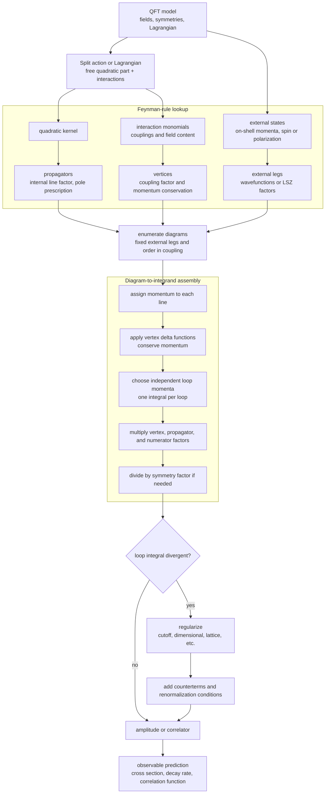

# Perturbation Theory and Feynman Diagrams

Feynman diagrams are not cartoons added after a calculation. They are a compact notation for the terms generated when an interacting path integral or time-ordered operator expression is expanded in powers of a coupling. Lines represent propagators, vertices represent local interactions, and the graph tells you what momentum integrals and symmetry factors to write.

The physical value of the diagrammatic language is that it separates universal structure from algebra. Once the propagators and vertices are known, scattering amplitudes can be organized by the number of vertices or loops. Zee's early discussion of diagrams is meant to make this organization feel natural: forces arise because fields propagate between interaction events, and perturbation theory enumerates those events.

## Definitions

For a theory split into free and interacting parts,

$$
\mathcal{L}=\mathcal{L}_0+\mathcal{L}_{\text{int}},
$$

the perturbative expansion is an expansion in powers of the coupling constants appearing in $\mathcal{L}_{\text{int}}$. For scalar $\phi^4$ theory,

$$
\mathcal{L}_{\text{int}}=-\frac{\lambda}{4!}\phi^4.
$$

The **propagator** is the two-point function of the free theory:

$$
\tilde{\Delta}_F(p)=\frac{i}{p^2-m^2+i\epsilon}.
$$

The **vertex factor** for $-\lambda\phi^4/4!$ is

$$
-i\lambda.
$$

An **external line** corresponds to an incoming or outgoing particle. An **internal line** is integrated over momentum. A **loop** is an independent internal momentum integral:

$$
\int \frac{d^4\ell}{(2\pi)^4}.
$$

A connected diagram contributes to a connected scattering amplitude. Vacuum bubbles cancel in normalized correlators or are absorbed into vacuum energy.

## Key results

The basic algorithm for scalar perturbation theory is:

1. Draw topologically distinct diagrams with the required external legs and order in $\lambda$.
2. Assign momentum to each line.
3. Write a propagator for each internal line.
4. Write a vertex factor for each vertex.
5. Enforce momentum conservation at each vertex.
6. Integrate over independent loop momenta.
7. Divide by the graph symmetry factor when the Feynman rules do not already include it.

For $2\to2$ scattering in $\phi^4$ theory at tree level, the amplitude is simply

$$
i\mathcal{M}_{\text{tree}}=-i\lambda,
\qquad \mathcal{M}_{\text{tree}}=-\lambda.
$$

At one loop, the same process receives $s$, $t$, and $u$ channel bubble corrections:

$$
i\mathcal{M}_{1\text{-loop}}
\sim
\frac{(-i\lambda)^2}{2}
\int \frac{d^4\ell}{(2\pi)^4}
\frac{i}{\ell^2-m^2+i\epsilon}
\frac{i}{(\ell+P)^2-m^2+i\epsilon},
$$

where $P$ is the momentum through the channel. The integral diverges in four dimensions and leads directly to regularization and renormalization.

Diagrams also encode conservation laws. Translational invariance gives momentum conservation. Internal symmetries impose charge flow. Gauge symmetry produces Ward identities, which are diagrammatic constraints strong enough to cancel unphysical polarizations and relate different amplitudes.

There are several layers of diagrammatic organization. Ordinary connected diagrams contribute to connected correlation functions. Amputated connected diagrams, with external propagators removed, enter scattering amplitudes through the LSZ reduction idea. One-particle-irreducible diagrams, which cannot be disconnected by cutting a single internal line, build the effective action and self-energies. Keeping these categories separate prevents confusion when the same drawing appears in different formulas with different external factors.

Power counting gives a quick estimate before any integral is evaluated. A tree diagram has no loop integral and is usually algebraic once momentum conservation is imposed. A one-loop diagram has one independent momentum integration and is the first place ultraviolet divergences, thresholds, and imaginary parts appear. Higher-loop diagrams are not merely harder versions of the same calculation; they test whether counterterms introduced at lower order were sufficient and whether the renormalization scheme has been applied consistently.

External states also matter. A correlation function with fields inserted at arbitrary spacetime points is not yet an experiment. A scattering amplitude assumes asymptotic states, wavefunction normalization, and on-shell external momenta. For stable particles this is straightforward. For confined particles, unstable resonances, or finite-temperature systems, the diagrammatic expansion still exists, but its direct interpretation as a particle scattering process needs more care.

The most useful habit is to read every diagram twice: once as a mathematical recipe and once as a physical process allowed by the symmetries. The mathematical reading writes denominators, numerators, integrals, and delta functions. The physical reading asks which quanta propagate, which charges flow, what intermediate states can go on shell, and which conservation laws constrain the answer.

## Visual



This perturbation-theory diagram turns a Lagrangian into a calculation pipeline. The rule-lookup subgraph separates propagators, vertices, and external legs, while the integrand subgraph shows momentum assignment, delta functions, loop integration, numerator factors, and symmetry factors. The divergence branch makes regularization and counterterms part of the architecture whenever loop integrals are ultraviolet sensitive.

ASCII sketch of common scalar diagrams:

```text
tree 2->2:

 p1 ----\
         X---- p3
 p2 ----/ \
          \--- p4

one-loop bubble:

 p1 ----\      /---- p3
         X====X
 p2 ----/      \---- p4
```

| Diagram feature | Mathematical object | Physical reading |
|---|---|---|
| External leg | asymptotic particle | prepared or detected quantum |
| Internal line | propagator | virtual propagation between events |
| Vertex | coupling and local product of fields | interaction at one spacetime point |
| Loop | unconstrained momentum integral | quantum fluctuation summed over |
| Symmetry factor | combinatorial division | avoids overcounting identical contractions |

## Worked example 1: Tree-level phi-four scattering

Problem: Compute the leading amplitude for $\phi(p_1)+\phi(p_2)\to\phi(p_3)+\phi(p_4)$ in real scalar $\phi^4$ theory.

Step 1: Identify the interaction:

$$
\mathcal{L}_{\text{int}}=-\frac{\lambda}{4!}\phi^4.
$$

Step 2: Read off the four-point vertex. The factor $4!$ cancels the number of ways four identical fields can be contracted with four external particles:

$$
\text{vertex}=-i\lambda.
$$

Step 3: There is one tree diagram with one four-leg vertex and no internal propagator. Momentum conservation supplies

$$
(2\pi)^4\delta^{(4)}(p_1+p_2-p_3-p_4).
$$

Step 4: The $S$-matrix convention writes

$$
i\mathcal{M}(2\pi)^4\delta^{(4)}(\sum p_{\text{in}}-\sum p_{\text{out}})
$$

for the connected amplitude.

Step 5: Therefore

$$
i\mathcal{M}_{\text{tree}}=-i\lambda,
\qquad
\mathcal{M}_{\text{tree}}=-\lambda.
$$

The checked answer has no momentum dependence at this order because the interaction is a contact interaction.

## Worked example 2: Counting loops from graph data

Problem: A connected scalar diagram has $V=3$ quartic vertices and $E=4$ external legs. How many internal lines $I$ and loops $L$ does it have?

Step 1: Count line ends. Each quartic vertex has four field ends, so three vertices give

$$
4V=12
$$

line ends.

Step 2: External lines consume one line end each:

$$
E=4.
$$

Step 3: Internal lines consume two line ends each. Therefore

$$
4V=E+2I.
$$

Insert $V=3$ and $E=4$:

$$
12=4+2I.
$$

Step 4: Solve:

$$
2I=8,\qquad I=4.
$$

Step 5: For a connected graph, the number of independent loops is

$$
L=I-V+1.
$$

Thus

$$
L=4-3+1=2.
$$

The checked answer is $I=4$ internal lines and $L=2$ loops. A third-order four-point diagram in $\phi^4$ theory is therefore a two-loop correction.

## Code

```python
def phi4_graph_counts(vertices, external_legs, connected=True):
    ends = 4 * vertices
    if (ends - external_legs) % 2 != 0:
        raise ValueError("line ends do not pair into internal lines")
    internal_lines = (ends - external_legs) // 2
    loops = internal_lines - vertices + (1 if connected else 0)
    return internal_lines, loops

for vertices in range(1, 5):
    internal, loops = phi4_graph_counts(vertices, external_legs=4)
    print(f"V={vertices}: I={internal}, L={loops}")
```

## Common pitfalls

- Reading diagrams as literal particle trajectories. Internal lines represent terms in an amplitude, not directly observed paths.
- Omitting the momentum-conserving delta function and then double-counting momentum constraints.
- Forgetting symmetry factors in diagrammatic expansions derived directly from Wick contractions.
- Confusing the amplitude $\mathcal{M}$ with $i\mathcal{M}$; conventions differ, so track factors of $i$ consistently.
- Treating loop divergences as mistakes. Divergences are signals that parameters must be defined with a regulator and physical renormalization condition.
- Mixing correlation functions with scattering amplitudes. A correlator still has external propagators and off-shell positions; an $S$-matrix element requires amputation, on-shell limits, and normalization of external states.
- Counting only the number of vertices when estimating difficulty. The number of loops controls independent momentum integrations, ultraviolet behavior, and the appearance of imaginary parts from physical thresholds.
- Forgetting that diagrams are constrained by every symmetry of the Lagrangian. Charge flow, momentum conservation, spinor structure, and gauge identities are as much a part of the diagram as its topology.
- Drawing all topologies but forgetting permutations of external assignments. For identical particles this may be hidden in symmetry factors; for distinct particles it can change the channel structure.

## Connections

This page is the practical bridge from formal QFT to calculations. It should be read with the scalar and QED pages open, because diagrams become meaningful only after the field content and Lagrangian are specified. The graph-counting rules also prepare the renormalization pages: once a diagram contains loops, one must ask about ultraviolet behavior, counterterms, and physical normalization conditions. In gauge theories, the same diagrams must satisfy Ward or Slavnov-Taylor identities, so diagrammatics and symmetry are inseparable.

- [Path Integral Formulation](/physics/quantum-field-theory/path-integral-formulation)
- [Scalar Phi-Four Theory](/physics/quantum-field-theory/scalar-phi-four-theory)
- [Renormalization and Counterterms](/physics/quantum-field-theory/renormalization-and-counterterms)
- [Gauge Invariance and QED](/physics/quantum-field-theory/gauge-invariance-and-qed)
