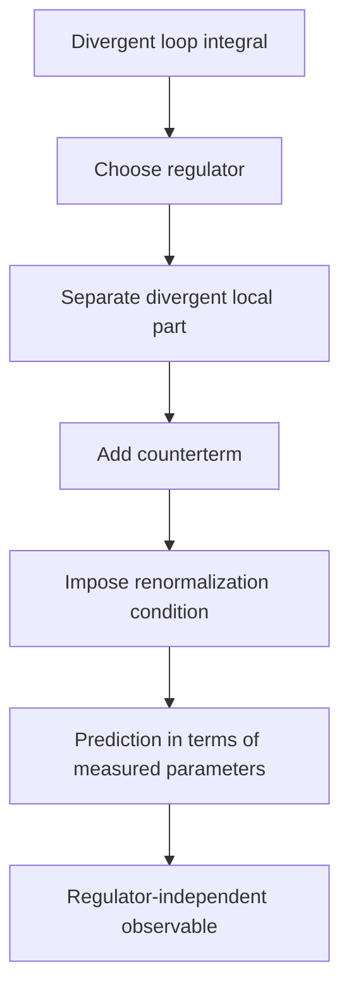

# Renormalization and Counterterms

Loop diagrams integrate over virtual momenta of all sizes. At high momentum the integrals often diverge, not because the theory has become meaningless, but because the parameters written in the Lagrangian are not directly measured numbers until a prescription relates them to experiments. Renormalization is the disciplined process of regulating the integrals, absorbing cutoff dependence into parameters, and expressing predictions in terms of physical quantities.

Zee's renormalization chapters present the subject as a lesson in ignorance. A cutoff represents the fact that the theory is not trusted at arbitrarily short distance. Counterterms are not a cover-up; they are the most general local terms required by the symmetries to keep long-distance predictions finite when short-distance details are hidden.

## Definitions

A **regulator** modifies divergent expressions so that intermediate quantities are finite. Examples include a momentum cutoff $\Lambda$, dimensional regularization with $d=4-\epsilon$, and Pauli-Villars fields.

A **bare parameter** is a parameter in the regulated Lagrangian, such as $m_0$ or $\lambda_0$. A **renormalized parameter** is defined by a convention at a scale or physical point:

$$
m_0^2=m^2+\delta m^2,
\qquad
\lambda_0=\lambda+\delta\lambda,
\qquad
\phi_0=Z^{1/2}\phi.
$$

The renormalized $\phi^4$ Lagrangian may be written as

$$
\mathcal{L}=
\frac{1}{2}(\partial\phi)^2-\frac{1}{2}m^2\phi^2-\frac{\lambda}{4!}\phi^4
+\frac{1}{2}\delta Z(\partial\phi)^2
-\frac{1}{2}\delta m^2\phi^2
-\frac{\delta\lambda}{4!}\phi^4.
$$

A **renormalization condition** fixes the finite part of a counterterm. For example, one may require the pole of the two-point function to occur at the measured mass and the four-point amplitude at a chosen symmetric momentum to equal a measured coupling.

## Key results

Power counting classifies which divergences can occur. In four-dimensional $\phi^4$ theory, only the two-point and four-point functions require primitive counterterms, consistent with the operators already present in the Lagrangian.

At one loop, a typical tadpole integral with a cutoff behaves like

$$
I(m,\Lambda)=\int^{\Lambda}\frac{d^4k}{(2\pi)^4}\frac{i}{k^2-m^2+i\epsilon}
\sim
C_2\Lambda^2+C_0m^2\log\frac{\Lambda^2}{m^2}+\text{finite}.
$$

The precise constants depend on regulator and convention, but the local form of the divergence determines the counterterm. The mass counterterm cancels the two-point divergence; the coupling counterterm cancels the four-point logarithm.

Renormalizability means that a finite set of counterterms absorbs all divergences order by order in perturbation theory. Nonrenormalizable interactions are not useless; in the modern effective-field-theory view, they are suppressed by powers of a high scale and become predictive at low energy when organized systematically.

The physical moral is that measured quantities should not depend on arbitrary regulator choices. If an observable $\mathcal{O}$ is computed in terms of renormalized parameters,

$$
\frac{d\mathcal{O}}{d\Lambda}=0
$$

after bare quantities and counterterms are adjusted consistently.

Different renormalization schemes organize the same physics in different ways. In an on-shell scheme, masses and charges are defined directly by physical pole locations and low-energy amplitudes. In minimal subtraction, especially with dimensional regularization, counterterms subtract only pole terms in $\epsilon=4-d$ or specified constants along with them. Minimal subtraction is often algebraically cleaner for RG calculations, while on-shell schemes keep the connection to measured quantities more immediate.

Counterterms must respect the symmetries of the regulated theory. If the original Lagrangian is Lorentz invariant and has a $\phi\to-\phi$ symmetry, the counterterm Lagrangian cannot contain a term linear in $\phi$ unless the symmetry is broken by the regulator or by the chosen vacuum. In gauge theories this principle is stricter: counterterms must be gauge invariant after gauge fixing is handled correctly. This is why symmetry is as important as power counting in deciding what divergences can mean.

Renormalization also exposes naturalness questions. If a parameter receives corrections proportional to a high scale, keeping it much smaller than that scale may require a delicate cancellation between the bare parameter and counterterm. Scalar masses are especially sensitive in cutoff language, while fermion masses and gauge boson masses can be protected by chiral or gauge symmetries. Whether such cancellations are acceptable, explained by symmetry, or evidence for new physics depends on the theory and the physical context.

The operational test is simple: after renormalization, predictions among observables must be finite and stable under changes of regulator convention. Individual bare parameters, counterterms, and loop integrals do not need to be separately observable.

## Visual



| Concept | What it does | Example |
|---|---|---|
| Cutoff $\Lambda$ | limits short-distance modes | $\vert k\vert \lt \Lambda$ |
| Counterterm | cancels local divergence | $\delta m^2\phi^2/2$ |
| Renormalized mass | measured pole location | $p^2=m_{\text{phys}}^2$ |
| Renormalized coupling | measured amplitude at a scale | $\mathcal{M}(s_0,t_0,u_0)$ |
| Scheme | convention for finite parts | on-shell or minimal subtraction |

## Worked example 1: Cutoff estimate of a tadpole divergence

Problem: Estimate the large-$\Lambda$ behavior of the Euclidean integral

$$
I_E(\Lambda)=\int_{|k|<\Lambda}\frac{d^4k}{(2\pi)^4}\frac{1}{k^2+m^2}.
$$

Step 1: Use four-dimensional spherical coordinates. The area of the unit three-sphere is $2\pi^2$, so

$$
d^4k=2\pi^2 k^3 dk.
$$

Step 2: Substitute:

$$
I_E(\Lambda)=\frac{2\pi^2}{(2\pi)^4}
\int_0^\Lambda dk\,\frac{k^3}{k^2+m^2}.
$$

Step 3: Simplify the prefactor:

$$
\frac{2\pi^2}{16\pi^4}=\frac{1}{8\pi^2}.
$$

Step 4: Rewrite the integrand:

$$
\frac{k^3}{k^2+m^2}
=k-\frac{m^2k}{k^2+m^2}.
$$

Step 5: Integrate term by term:

$$
\int_0^\Lambda k\,dk=\frac{\Lambda^2}{2},
$$

and

$$
\int_0^\Lambda \frac{m^2k}{k^2+m^2}\,dk
=\frac{m^2}{2}\log\frac{\Lambda^2+m^2}{m^2}.
$$

Step 6: Combine:

$$
I_E(\Lambda)=\frac{1}{8\pi^2}
\left[
\frac{\Lambda^2}{2}
-\frac{m^2}{2}\log\frac{\Lambda^2+m^2}{m^2}
\right].
$$

The checked asymptotic form is

$$
I_E(\Lambda)=\frac{\Lambda^2}{16\pi^2}
-\frac{m^2}{16\pi^2}\log\frac{\Lambda^2}{m^2}
+\cdots.
$$

## Worked example 2: Determining a mass counterterm

Problem: Suppose the one-loop correction to the inverse scalar propagator is

$$
\Sigma_{\text{div}}=\frac{\lambda}{2}I_E(\Lambda),
$$

where $I_E$ is the divergent integral above. Choose $\delta m^2$ so the renormalized inverse propagator has no divergent mass shift.

Step 1: The inverse propagator contains, schematically,

$$
p^2-m^2-\Sigma+\delta m^2.
$$

Step 2: Split the self-energy into divergent and finite parts:

$$
\Sigma=\Sigma_{\text{div}}+\Sigma_{\text{fin}}.
$$

Step 3: To cancel the divergent part, require

$$
-\Sigma_{\text{div}}+\delta m^2_{\text{div}}=0.
$$

Step 4: Therefore

$$
\delta m^2_{\text{div}}=\Sigma_{\text{div}}
=\frac{\lambda}{2}I_E(\Lambda).
$$

Step 5: Insert the leading asymptotic expression:

$$
\delta m^2_{\text{div}}
=\frac{\lambda}{2}
\left[
\frac{\Lambda^2}{16\pi^2}
-\frac{m^2}{16\pi^2}\log\frac{\Lambda^2}{m^2}
\right].
$$

Thus

$$
\delta m^2_{\text{div}}
=\frac{\lambda\Lambda^2}{32\pi^2}
-\frac{\lambda m^2}{32\pi^2}\log\frac{\Lambda^2}{m^2}.
$$

The checked answer cancels the regulator-dependent local mass correction. The finite part is then fixed by the chosen renormalization condition.

## Code

```python
import math

def tadpole_cutoff(mass, cutoff):
    return (cutoff**2 - mass**2 * math.log((cutoff**2 + mass**2) / mass**2)) / (16 * math.pi**2)

def mass_counterterm(lam, mass, cutoff):
    return 0.5 * lam * tadpole_cutoff(mass, cutoff)

for cutoff in [10, 100, 1000]:
    print(cutoff, mass_counterterm(lam=0.2, mass=1.0, cutoff=cutoff))
```

## Common pitfalls

- Treating the cutoff as necessarily physical in every scheme. It can be a calculational regulator or a real scale of new physics, depending on context.
- Believing counterterms are arbitrary after renormalization conditions are imposed. Their divergent and finite parts are fixed by the chosen convention and measured inputs.
- Dropping power divergences and logarithmic divergences without understanding the regulator dependence of that statement.
- Confusing bare parameters with measured parameters.
- Thinking nonrenormalizable means useless. It usually means the theory should be read as an effective expansion.
- Comparing numbers from two schemes without translating parameters. A coupling called $\lambda$ in minimal subtraction is not automatically the same number as an on-shell coupling.
- Forgetting finite counterterms. Removing the divergent part is not enough to define a prediction; the finite part is fixed by the chosen renormalization condition.

## Connections

This page should be paired with explicit loop calculations. The scalar page shows the simplest divergent diagrams, QED shows symmetry constraints on counterterms, and the RG page explains why finite redefinitions become scale dependence. EFT then reframes the entire discussion: counterterms are not just repairs for infinities, but part of the most general local description compatible with the symmetries at a chosen scale.

- [Scalar Phi-Four Theory](/physics/quantum-field-theory/scalar-phi-four-theory)
- [Renormalization Group](/physics/quantum-field-theory/renormalization-group)
- [Effective Field Theory](/physics/quantum-field-theory/effective-field-theory)
- [Gauge Invariance and QED](/physics/quantum-field-theory/gauge-invariance-and-qed)
