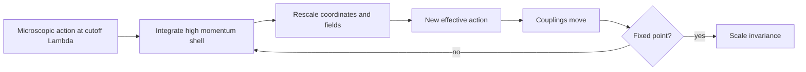

# Renormalization Group

The renormalization group is the idea that physics changes its description when the resolution changes. Instead of treating a cutoff as a nuisance, the RG asks how couplings move when short-distance modes are hidden and the theory is rewritten for longer distances. This turns renormalization into a dynamical picture: theories flow through a space of possible Lagrangians.

In Zee's scope, the RG appears in both high-energy and condensed-matter contexts. In particle physics it explains running charges and asymptotic freedom; in critical phenomena it explains universality and scaling. The same mathematics says that many microscopic systems can share one long-distance theory because irrelevant details flow away.

## Definitions

Let $g_i(\mu)$ be couplings defined at renormalization scale $\mu$. The beta function is

$$
\beta_i(g)=\mu\frac{d g_i}{d\mu}.
$$

A **fixed point** satisfies

$$
\beta_i(g_\ast)=0
$$

for all $i$. Near a fixed point, linearize:

$$
\mu\frac{d}{d\mu}\delta g_i
=\sum_j B_{ij}\delta g_j,
\qquad
B_{ij}=\left.\frac{\partial \beta_i}{\partial g_j}\right|_{g_\ast}.
$$

Directions are classified by how they scale:

| Direction | Behavior toward infrared | Meaning |
|---|---|---|
| Relevant | grows | must be tuned to reach criticality |
| Marginal | neither grows nor shrinks at tree level | quantum corrections decide |
| Irrelevant | shrinks | microscopic detail fades |

In Wilsonian language, one integrates out high-momentum modes in a shell

$$
\Lambda/b<|k|<\Lambda,
\qquad b>1,
$$

then rescales momenta and fields to restore the cutoff to $\Lambda$.

## Key results

Dimensional analysis gives the tree-level RG classification. If an operator $\mathcal{O}_i$ has scaling dimension $\Delta_i$ in $d$ spacetime dimensions,

$$
S\supset \int d^d x\,g_i\mathcal{O}_i,
\qquad
[g_i]=d-\Delta_i.
$$

If $[g_i]\gt 0$, the coupling is relevant; if $[g_i]\lt 0$, it is irrelevant; if $[g_i]=0$, it is marginal at tree level.

For QED, the electric charge grows slowly at high energy:

$$
\mu\frac{d e}{d\mu}=\frac{e^3}{12\pi^2}+\cdots
$$

for one charged Dirac fermion. For nonabelian Yang-Mills theory with enough gauge self-interaction relative to matter content, the beta function can be negative:

$$
\mu\frac{d g}{d\mu}=-b_0g^3+\cdots,
\qquad b_0>0.
$$

Then the coupling weakens at high energy, the phenomenon called asymptotic freedom.

The Callan-Symanzik equation expresses the fact that a physical correlator does not depend on the arbitrary renormalization scale once couplings and fields run appropriately. For an $n$-point function $G^{(n)}$,

$$
\left(
\mu\frac{\partial}{\partial\mu}
+\beta(g)\frac{\partial}{\partial g}
+n\gamma(g)
\right)G^{(n)}=0
$$

in a simplified massless setting, where $\gamma$ is the anomalous dimension of the field.

Wilsonian RG gives a more physical picture of the same equations. Begin with a cutoff theory containing all operators allowed by symmetry. Split the field into slow modes and fast modes:

$$
\phi=\phi_<+\phi_>,
\qquad
|k|<\Lambda/b\ \text{for}\ \phi_<,
\qquad
\Lambda/b<|k|<\Lambda\ \text{for}\ \phi_>.
$$

Integrate out $\phi_\gt $ to obtain a new action for $\phi_\lt $. Then rescale coordinates and fields so the cutoff again equals $\Lambda$. The coefficients of operators have changed, and those changes are the RG flow. This construction makes clear that the flow is not only about infinities; it is about changing the resolution of the description.

Anomalous dimensions are another key lesson. The engineering dimension of a field follows from the classical kinetic term, but interactions can modify the scaling of correlation functions. Near an interacting fixed point,

$$
\langle \phi(x)\phi(0)\rangle
\sim \frac{1}{|x|^{2\Delta_\phi}},
$$

where

$$
\Delta_\phi=\frac{d-2}{2}+\gamma_\phi.
$$

The anomalous part $\gamma_\phi$ is one reason critical exponents are not generally equal to their mean-field values.

The RG also explains universality. Two microscopic systems can have different lattice spacings, atoms, and short-distance interactions but flow to the same infrared fixed point. Then their long-distance exponents, scaling functions, and operator content match. This is why a magnet, a fluid near its critical point, and a scalar field theory can share mathematical behavior even though their microscopic constituents are unrelated.

In high-energy physics the same logic becomes running couplings. The measured electromagnetic charge depends weakly on scale because the vacuum polarizes; the strong coupling decreases in the ultraviolet because gluon self-interactions dominate the beta function. Both are RG statements, not separate miracles.

## Visual



ASCII flow near a fixed point:

```text
irrelevant direction
        \
         \
          * fixed point ---- relevant direction
         /
        /
```

## Worked example 1: Tree-level relevance of scalar operators

Problem: In $d=4$, classify $\phi^2$, $\phi^4$, and $\phi^6$ interactions for a free scalar fixed point.

Step 1: The scalar field dimension at the free fixed point is

$$
[\phi]=\frac{d-2}{2}.
$$

In $d=4$,

$$
[\phi]=1.
$$

Step 2: Compute operator dimensions:

$$
[\phi^2]=2,\qquad [\phi^4]=4,\qquad [\phi^6]=6.
$$

Step 3: Coupling dimensions are $[g_i]=d-\Delta_i$. Therefore

$$
[g_2]=4-2=2,
$$

$$
[g_4]=4-4=0,
$$

and

$$
[g_6]=4-6=-2.
$$

Step 4: Interpret:

$$
\phi^2\text{ is relevant},\qquad
\phi^4\text{ is marginal},\qquad
\phi^6\text{ is irrelevant}.
$$

The checked answer explains why mass terms require tuning near critical points, why $\phi^4$ is central in four dimensions, and why $\phi^6$ is usually suppressed at long distances.

## Worked example 2: Solving a one-loop running coupling

Problem: Solve the beta function

$$
\mu\frac{dg}{d\mu}=-b_0g^3,
\qquad b_0>0.
$$

Step 1: Rewrite in logarithmic scale $t=\log\mu$:

$$
\frac{dg}{dt}=-b_0g^3.
$$

Step 2: Separate variables:

$$
\frac{dg}{g^3}=-b_0\,dt.
$$

Step 3: Integrate from reference scale $\mu_0$ to $\mu$:

$$
\int_{g(\mu_0)}^{g(\mu)}g^{-3}\,dg
=-b_0\int_{\log\mu_0}^{\log\mu}dt.
$$

Step 4: The left integral is

$$
\left[-\frac{1}{2g^2}\right]_{g_0}^{g(\mu)}
=-\frac{1}{2g^2(\mu)}+\frac{1}{2g_0^2}.
$$

Step 5: Set equal to the right side:

$$
-\frac{1}{2g^2(\mu)}+\frac{1}{2g_0^2}
=-b_0\log\frac{\mu}{\mu_0}.
$$

Step 6: Multiply by $-2$:

$$
\frac{1}{g^2(\mu)}
=\frac{1}{g_0^2}+2b_0\log\frac{\mu}{\mu_0}.
$$

The checked solution is

$$
g^2(\mu)=
\frac{g_0^2}{1+2b_0g_0^2\log(\mu/\mu_0)}.
$$

For $\mu\gt \mu_0$, the denominator grows, so $g(\mu)$ decreases: asymptotic freedom.

## Code

```python
import math

def asymptotically_free_running(g0, mu0, mu, b0):
    denom = 1 + 2 * b0 * g0 * g0 * math.log(mu / mu0)
    return g0 / math.sqrt(denom)

g0 = 1.0
mu0 = 1.0
b0 = 0.05
for mu in [1, 10, 100, 1000]:
    print(mu, asymptotically_free_running(g0, mu0, mu, b0))
```

## Common pitfalls

- Thinking the RG is only a trick for divergent integrals. It is a statement about how descriptions change with scale.
- Confusing bare cutoff dependence with physical scale dependence of renormalized couplings.
- Classifying relevance using engineering dimensions when anomalous dimensions are important near an interacting fixed point.
- Assuming marginal means exactly constant. Marginal couplings can be marginally relevant or irrelevant once loops are included.
- Forgetting that the direction of flow depends on whether one moves toward the ultraviolet or infrared.
- Equating RG flow with time evolution. The flow parameter is resolution or renormalization scale, not physical time.
- Treating the cutoff theory as if it contains only the operators written in a textbook example. Wilsonian logic says all symmetry-allowed operators are present, even if many are irrelevant at long distance.
- Using engineering dimensions at an interacting fixed point without checking anomalous dimensions. Critical exponents and correlation functions are controlled by full scaling dimensions.
- Forgetting that universality has conditions. Two systems share an infrared fixed point only when their symmetries, dimensionality, conserved quantities, and relevant perturbations match.
- Confusing $\mu$ dependence of a parameter with direct experimental drift. Physical observables are scale independent after all running parameters and matrix elements are combined consistently.
- Linearizing around the wrong point in coupling space. Relevance and irrelevance are defined near a fixed point, so changing the fixed point can change the classification of the same-looking perturbation.
- Treating a Landau pole as automatically a physical catastrophe at accessible energy. It may instead mark the breakdown of an effective description before that scale.
- Forgetting to specify which variables are held fixed when differentiating with respect to the renormalization scale.
- Forgetting threshold effects when massive particles enter or leave the active low-energy description.

## Connections

The RG page is the scale map for the whole collection. It explains why renormalized parameters depend on $\mu$, why QCD becomes weak at high energy, why critical phenomena forget microscopic details, and why EFTs are organized by operator dimension. When another page says that an operator is relevant, marginal, irrelevant, running, universal, or suppressed, it is invoking RG logic. Revisit this page after studying both renormalization and condensed-matter applications, because those two viewpoints make the abstract flow picture concrete from opposite directions.

- [Renormalization and Counterterms](/physics/quantum-field-theory/renormalization-and-counterterms)
- [Yang-Mills Theory and QCD](/physics/quantum-field-theory/yang-mills-theory-and-qcd)
- [Effective Field Theory](/physics/quantum-field-theory/effective-field-theory)
- [Collective and Condensed Matter Field Theory](/physics/quantum-field-theory/collective-and-condensed-matter-field-theory)
