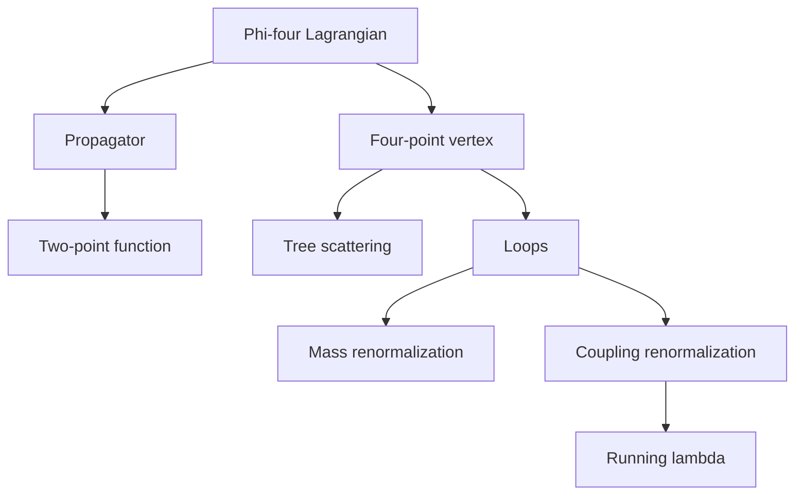

# Scalar Phi-Four Theory

Real scalar $\phi^4$ theory is the laboratory model of perturbative quantum field theory. It has a kinetic term, a mass term, and the simplest nontrivial local self-interaction in four spacetime dimensions. Because it avoids spin, gauge redundancy, and group theory, it lets the central machinery stand in the open: propagators, vertices, loops, divergences, counterterms, and running couplings.

The theory is also physically flexible. In relativistic particle physics it models contact scattering and spontaneous symmetry breaking. In condensed matter, its Euclidean version becomes the Landau-Ginzburg theory of critical phenomena. Zee uses this kind of model repeatedly because it is simple enough to calculate with and rich enough to display the logic of QFT.


*Figure: The Mexican-hat potential visualizes spontaneous symmetry breaking as a choice among degenerate minima. Image: [Wikimedia Commons](https://commons.wikimedia.org/wiki/File:Mexican_hat_potential_polar.svg), Rupert Millard, public domain.*

## Definitions

The Lagrangian density for a real scalar with quartic interaction is

$$
\mathcal{L}=
\frac{1}{2}\partial_\mu\phi\,\partial^\mu\phi
-\frac{1}{2}m^2\phi^2
-\frac{\lambda}{4!}\phi^4.
$$

The free propagator in momentum space is

$$
\tilde{\Delta}_F(p)=\frac{i}{p^2-m^2+i\epsilon}.
$$

The four-point vertex is

$$
-i\lambda.
$$

The classical potential is

$$
V(\phi)=\frac{1}{2}m^2\phi^2+\frac{\lambda}{4!}\phi^4.
$$

For stability at large $\vert \phi\vert $, one wants $\lambda\gt 0$. If $m^2\gt 0$, the minimum is at $\phi=0$. If $m^2\lt 0$, the symmetric point becomes unstable and two nonzero minima appear, making the same model a prototype for spontaneous symmetry breaking.

The $n$-point correlation functions are generated from

$$
Z[J]=
\int\mathcal{D}\phi\,
\exp\left(i\int d^4x\left[
\mathcal{L}+J\phi
\right]\right).
$$

## Key results

The field equation is nonlinear:

$$
(\partial^2+m^2)\phi+\frac{\lambda}{3!}\phi^3=0.
$$

Perturbatively, the first nontrivial correction to the two-point function is the tadpole loop. The first correction to the four-point amplitude is the bubble diagram. These two diagrams already show the two main renormalization targets: the mass and the coupling.

The superficial degree of divergence in four-dimensional $\phi^4$ theory is

$$
D=4-E,
$$

where $E$ is the number of external legs. This follows from $D=4L-2I$ and the graph identities for quartic vertices. It means that the two-point function is quadratically divergent by power counting, the four-point function logarithmically divergent, and higher-point functions superficially convergent. This is why only a finite list of counterterms is needed:

$$
\delta\mathcal{L}=
\frac{1}{2}\delta Z\,\partial_\mu\phi\,\partial^\mu\phi
-\frac{1}{2}\delta m^2\phi^2
-\frac{\delta\lambda}{4!}\phi^4.
$$

At tree level the $2\to2$ amplitude is constant, but loops introduce momentum dependence and scale dependence. The theory is therefore a compact testing ground for the idea that measured parameters depend on the scale at which they are measured.

The theory is also useful because the same Lagrangian supports several physical interpretations depending on parameters and signature. With $m^2\gt 0$ and Minkowski time, it describes a massive scalar particle with a short-range contact self-interaction. With $m^2\lt 0$, the classical potential has degenerate minima and becomes the simplest algebraic model of spontaneous symmetry breaking. After Wick rotation to Euclidean signature, the action resembles a statistical free energy for an order parameter, and the parameter $m^2$ plays the role of distance from a critical point.

Renormalization conditions can be stated directly in this model. One may demand that the exact two-point function has a pole at $p^2=m_{\text{phys}}^2$ with residue one, and that the four-point amplitude at a specified symmetric momentum equals $-\lambda_{\text{phys}}$. These requirements determine $\delta m^2$, $\delta Z$, and $\delta\lambda$ order by order. Other schemes choose different finite parts, but all schemes agree on physical observables after parameters are translated.

The model also illustrates why "simple" does not mean "trivial." In four dimensions the coupling is marginal at tree level, so loop effects decide its scale dependence. In dimensions below four, the quartic coupling becomes relevant and drives nontrivial critical behavior. In dimensions above four, it becomes irrelevant in the RG sense, and the free Gaussian fixed point dominates long-distance behavior unless other scales intervene.

Finally, $\phi^4$ theory is a warning about notation. The same symbol $\lambda$ may denote a bare coupling, a renormalized coupling at scale $\mu$, or a measured low-energy parameter. A calculation is incomplete until it states which one is being used and how it is fixed.

## Visual



| Quantity | Symbol | Tree-level expression | Loop sensitivity |
|---|---|---|---|
| Propagator | $\tilde{\Delta}_F(p)$ | $i/(p^2-m^2+i\epsilon)$ | mass and field-strength shifts |
| Vertex | four-point | $-i\lambda$ | logarithmic correction in $d=4$ |
| Potential | $V(\phi)$ | $m^2\phi^2/2+\lambda\phi^4/4!$ | effective potential |
| Counterterms | $\delta Z,\delta m^2,\delta\lambda$ | absent in bare tree theory | chosen by renormalization conditions |

## Worked example 1: Classical minima and small oscillations

Problem: Let

$$
V(\phi)=-\frac{1}{2}\mu^2\phi^2+\frac{\lambda}{4!}\phi^4,
\qquad \mu^2>0,\quad \lambda>0.
$$

Find the minima and the mass of small fluctuations about one minimum.

Step 1: Differentiate the potential:

$$
\frac{dV}{d\phi}=-\mu^2\phi+\frac{\lambda}{3!}\phi^3.
$$

Step 2: Set this equal to zero:

$$
\phi\left(-\mu^2+\frac{\lambda}{6}\phi^2\right)=0.
$$

Step 3: The stationary points are

$$
\phi=0,
\qquad
\phi^2=\frac{6\mu^2}{\lambda}.
$$

Define

$$
v=\sqrt{\frac{6\mu^2}{\lambda}}.
$$

Step 4: Use the second derivative:

$$
\frac{d^2V}{d\phi^2}=-\mu^2+\frac{\lambda}{2}\phi^2.
$$

At $\phi=0$ this is $-\mu^2$, so the origin is unstable. At $\phi=\pm v$,

$$
\frac{d^2V}{d\phi^2}
=-\mu^2+\frac{\lambda}{2}\frac{6\mu^2}{\lambda}
=2\mu^2.
$$

Step 5: The small fluctuation $\phi=v+\eta$ has mass squared

$$
m_\eta^2=2\mu^2.
$$

The checked result is two degenerate minima at $\phi=\pm v$ and a stable excitation of mass $\sqrt{2}\mu$ around either one.

## Worked example 2: Superficial divergence in phi-four theory

Problem: Derive $D=4-E$ for a connected $\phi^4$ graph in four spacetime dimensions.

Step 1: Each loop integral contributes four powers of momentum:

$$
4L.
$$

Step 2: Each internal scalar propagator behaves as $1/p^2$ at large momentum, contributing

$$
-2I.
$$

Thus

$$
D=4L-2I.
$$

Step 3: For a connected graph,

$$
L=I-V+1.
$$

Substitute:

$$
D=4(I-V+1)-2I=2I-4V+4.
$$

Step 4: Count line ends:

$$
4V=2I+E.
$$

Therefore

$$
2I=4V-E.
$$

Step 5: Substitute:

$$
D=(4V-E)-4V+4=4-E.
$$

The checked answer is $D=4-E$. A two-point graph has $D=2$, a four-point graph has $D=0$, and a six-point graph has $D=-2$.

## Code

```python
def superficial_degree_phi4(external_legs, spacetime_dim=4):
    if spacetime_dim != 4:
        raise ValueError("this shortcut is for four spacetime dimensions")
    return 4 - external_legs

for external in [2, 4, 6, 8]:
    degree = superficial_degree_phi4(external)
    verdict = "divergent" if degree >= 0 else "superficially convergent"
    print(f"E={external}: D={degree}, {verdict}")
```

## Common pitfalls

- Forgetting the $4!$ in the interaction and then assigning the wrong vertex factor.
- Treating $\lambda\gt 0$ as optional for a stable potential. Without higher stabilizing terms, negative $\lambda$ makes the potential unbounded.
- Confusing the sign of $m^2$ in the Lagrangian with the sign in the potential.
- Assuming every divergent graph requires a new physical parameter. Renormalizability means divergences can be absorbed into existing terms.
- Ignoring disconnected vacuum bubbles when deriving diagrams; they cancel from normalized correlators but matter for vacuum energy discussions.
- Using the same symbol for bare and renormalized quantities without saying which is meant. In loop calculations, $\lambda_0$, $\lambda(\mu)$, and a measured scattering coupling are different until a renormalization condition relates them.
- Forgetting that the same polynomial potential has different physics in different regimes. Positive $m^2$ gives a symmetric massive phase; negative $m^2$ requires expanding around a nonzero vacuum; Euclidean signature turns the model into a critical-phenomena workhorse.
- Treating power counting as the whole calculation. It predicts possible divergence, not the finite part, symmetry factor, threshold structure, or scheme-dependent subtraction.
- Assuming the classical potential alone determines the quantum phase diagram. Loop corrections can shift masses, couplings, and the effective potential.
- Expanding around an unstable point and then interpreting the resulting negative mass squared as a particle mass.

## Connections

Use this page as the controlled sandbox for the rest of the subject. Nearly every later complication has a scalar prototype: propagators come from the quadratic term, vertices from the quartic term, counterterms from divergent loops, symmetry breaking from the sign of $m^2$, and RG flow from the scale dependence of $\lambda$. Once these mechanisms are clear in $\phi^4$ theory, spinors and gauge fields add structure without changing the basic perturbative logic.

- [Perturbation Theory and Feynman Diagrams](/physics/quantum-field-theory/perturbation-and-feynman-diagrams)
- [Renormalization and Counterterms](/physics/quantum-field-theory/renormalization-and-counterterms)
- [Renormalization Group](/physics/quantum-field-theory/renormalization-group)
- [Symmetry Breaking, Goldstone Bosons, and Higgs Physics](/physics/quantum-field-theory/symmetry-breaking-goldstone-higgs)
