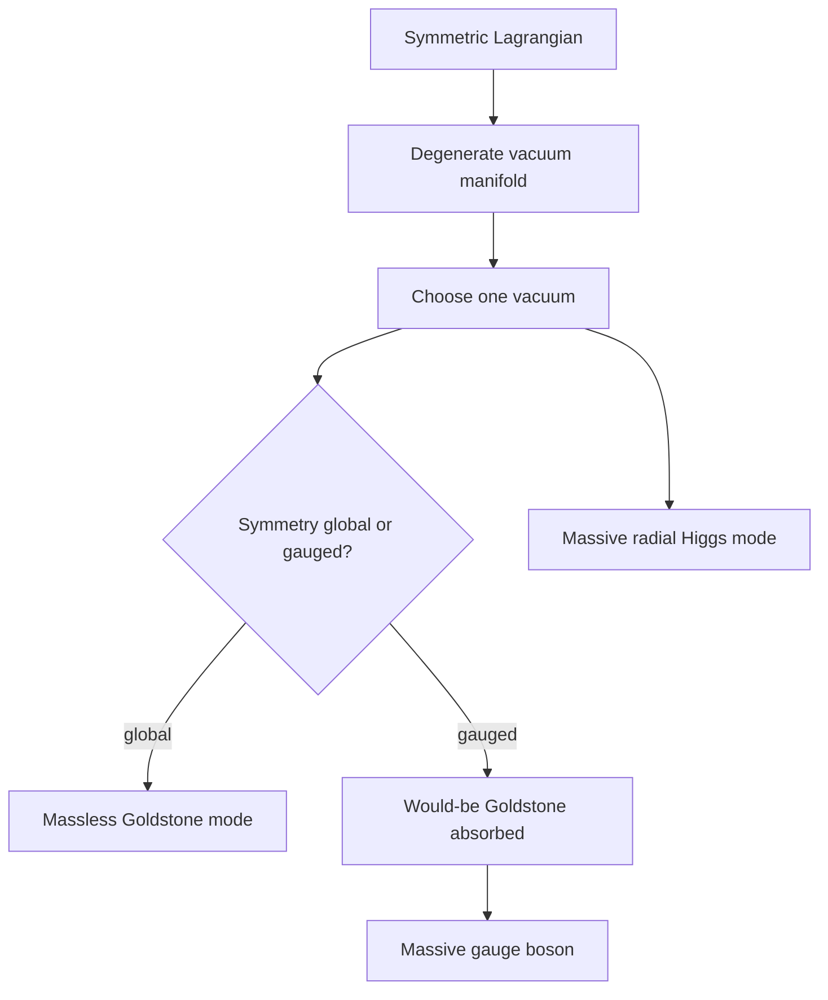

# Symmetry Breaking, Goldstone Bosons, and Higgs Physics

Symmetry is often most powerful when the equations have it but the state does not. In spontaneous symmetry breaking, the Lagrangian is symmetric while the vacuum chooses one of many equivalent minima. Small fluctuations along the valley of minima become gapless Nambu-Goldstone modes for global continuous symmetries. When the broken symmetry is gauged, those modes can be absorbed into gauge fields, giving massive vector bosons through the Anderson-Higgs mechanism.

This cluster of ideas is central to both particle physics and condensed matter. The pion is understood as an approximate Goldstone boson of chiral symmetry breaking. Superconductivity and the electroweak theory both use the Higgs mechanism. Zee treats these topics as one conceptual family: a vacuum is not passive; its structure determines the particle spectrum.


*Figure: Mexican-hat potential used to visualize spontaneous symmetry breaking. Image: [Wikimedia Commons](https://commons.wikimedia.org/wiki/File:Mexican_hat_potential_polar.svg), Rupert Millard, public domain.*


*Figure: The Standard Model chart gives QFT pages a concrete particle-spectrum map. Image: [Wikimedia Commons](https://commons.wikimedia.org/wiki/File:Standard_Model_of_Elementary_Particles.svg), Cush and MissMJ, public domain/CC BY 3.0.*

## Definitions

A symmetry transformation maps fields to fields while preserving the action:

$$
S[\phi']=S[\phi].
$$

The vacuum spontaneously breaks the symmetry if

$$
\langle 0|\phi|0\rangle \neq 0
$$

and the expectation value is not invariant under the full symmetry group.

For a complex scalar with global $U(1)$ symmetry,

$$
\mathcal{L}=
\partial_\mu\phi^\ast\partial^\mu\phi
-V(\phi),
\qquad
V(\phi)=
-\mu^2|\phi|^2+\lambda|\phi|^4,
$$

where $\mu^2\gt 0$ and $\lambda\gt 0$. The minima satisfy

$$
|\phi|^2=\frac{\mu^2}{2\lambda}.
$$

A convenient parameterization is

$$
\phi(x)=\frac{1}{\sqrt{2}}\left(v+\rho(x)\right)e^{i\theta(x)/v}.
$$

Here $\rho$ is the radial mode and $\theta$ is the angular Goldstone mode.

For a gauged $U(1)$, replace

$$
\partial_\mu\phi\to D_\mu\phi=(\partial_\mu+ieA_\mu)\phi.
$$

## Key results

Goldstone's theorem states that every spontaneously broken continuous global symmetry generator produces a massless excitation, subject to standard assumptions such as locality and Lorentz invariance. The intuitive proof is that moving along the degenerate vacuum manifold costs no potential energy, so the angular fluctuation has no mass term.

For the complex scalar potential above, expand around a vacuum. Let

$$
\phi=\frac{1}{\sqrt{2}}(v+\rho+i\pi)
$$

to leading order. The radial field $\rho$ gets a nonzero mass, while the angular field $\pi$ is massless:

$$
m_\rho^2=2\mu^2,
\qquad
m_\pi^2=0
$$

up to convention-dependent normalization of the potential.

In the Higgs mechanism, the angular field is not a physical massless particle. The covariant derivative term contains

$$
|D_\mu\phi|^2
\supset
\frac{1}{2}e^2v^2A_\mu A^\mu,
$$

so the gauge boson mass is

$$
m_A=ev.
$$

The gauge field gains a longitudinal polarization, and the would-be Goldstone field is absorbed into the massive vector field. Gauge symmetry is not destroyed; it is hidden by the choice of variables and gauge.

The vacuum manifold is often the most compact way to understand the low-energy excitations. If a group $G$ is broken to a subgroup $H$, the degenerate vacua are described by the coset space

$$
G/H.
$$

The number of broken generators is the dimension of this space, and in a relativistic theory it equals the number of Goldstone bosons for global symmetries. Topological defects are also classified by the shape of the vacuum manifold. Disconnected vacua can support domain walls, circular vacuum manifolds can support vortices, and more complicated manifolds can support monopoles or textures.

The effective potential refines the classical picture. Quantum corrections shift the relation between Lagrangian parameters and the location of the vacuum. Instead of minimizing the classical potential alone, one studies

$$
V_{\text{eff}}(\varphi),
$$

whose derivatives generate zero-momentum one-particle-irreducible diagrams. The curvature of $V_{\text{eff}}$ at its minimum gives loop-corrected masses, while its shape can reveal radiative symmetry breaking or metastable vacua.

In gauge theories, gauge choice can obscure the counting of degrees of freedom. Before symmetry breaking, a massless vector in four dimensions has two physical polarizations, and a complex scalar has two real degrees of freedom. After the Higgs mechanism, a massive vector has three polarizations and one real Higgs scalar remains. The number of physical degrees of freedom is unchanged:

$$
2+2=3+1.
$$

This accounting is the cleanest way to remember what happened to the Goldstone mode.

Approximate symmetry breaking is also common. If a symmetry is nearly exact but explicitly broken by small terms, the Goldstone boson becomes a pseudo-Goldstone boson. Its mass is controlled by the explicit breaking, which is why light pions indicate approximate chiral symmetry rather than exact masslessness.

## Visual



| Symmetry type | Broken vacuum gives | Spectrum signal | Example |
|---|---|---|---|
| Discrete global | domain walls possible | no Goldstone theorem | real $\phi^4$ double well |
| Continuous global | Goldstone boson | massless angular mode | superfluid phase mode |
| Local gauge | Higgs mechanism | massive vector boson | electroweak $W^\pm,Z$ |
| Approximate global | pseudo-Goldstone boson | light but not massless | pions |

## Worked example 1: Goldstone mode in a complex scalar

Problem: For

$$
V(\phi)=-\mu^2|\phi|^2+\lambda|\phi|^4,
$$

find the vacuum radius and identify radial and angular masses.

Step 1: Let $r=\vert \phi\vert $. Then

$$
V(r)=-\mu^2r^2+\lambda r^4.
$$

Step 2: Differentiate:

$$
\frac{dV}{dr}=-2\mu^2r+4\lambda r^3.
$$

Step 3: Set equal to zero:

$$
2r(-\mu^2+2\lambda r^2)=0.
$$

Thus

$$
r=0
\quad\text{or}\quad
r^2=\frac{\mu^2}{2\lambda}.
$$

Step 4: The nonzero circle is the minimum. Choose

$$
\phi=\frac{1}{\sqrt{2}}(v+\rho+i\pi),
\qquad
\frac{v^2}{2}=\frac{\mu^2}{2\lambda}.
$$

Therefore

$$
v^2=\frac{\mu^2}{\lambda}.
$$

Step 5: The potential depends only on $\vert \phi\vert $, so moving in the angular $\pi$ direction along the circle does not change $V$ to quadratic order:

$$
m_\pi^2=0.
$$

Step 6: The radial curvature is nonzero. Using the radial second derivative,

$$
\frac{d^2V}{dr^2}=-2\mu^2+12\lambda r^2.
$$

At $r^2=\mu^2/(2\lambda)$,

$$
\frac{d^2V}{dr^2}=4\mu^2.
$$

With canonical normalization this corresponds to a massive radial mode; convention choices set the precise factor. The checked qualitative result is one massive radial mode and one massless Goldstone mode.

## Worked example 2: Gauge boson mass from a Higgs vacuum

Problem: In a $U(1)$ gauge theory with

$$
D_\mu=\partial_\mu+ieA_\mu,
\qquad
\phi=\frac{1}{\sqrt{2}}(v+h)
$$

in unitary gauge, find the gauge boson mass term.

Step 1: Write the kinetic term:

$$
|D_\mu\phi|^2.
$$

Step 2: For the constant vacuum part, $\partial_\mu v=0$, so

$$
D_\mu\phi\supset ieA_\mu\frac{v}{\sqrt{2}}.
$$

Step 3: Square the vacuum contribution:

$$
|D_\mu\phi|^2\supset
\frac{e^2v^2}{2}A_\mu A^\mu.
$$

Step 4: Compare with the Proca mass form:

$$
\frac{1}{2}m_A^2A_\mu A^\mu.
$$

Step 5: Match coefficients:

$$
\frac{1}{2}m_A^2=\frac{1}{2}e^2v^2.
$$

Therefore

$$
m_A=ev.
$$

The checked answer is that the gauge boson becomes massive while the angular scalar degree of freedom supplies its longitudinal polarization.

## Code

```python
import math

def mexican_hat_parameters(mu, lam, e=0.0):
    v = mu / math.sqrt(lam)
    radial_mass = math.sqrt(2) * mu
    gauge_mass = e * v
    return v, radial_mass, gauge_mass

for e in [0.0, 0.3, 0.7]:
    v, mh, mA = mexican_hat_parameters(mu=2.0, lam=0.5, e=e)
    print(f"e={e}: v={v:.3f}, radial mass={mh:.3f}, gauge mass={mA:.3f}")
```

## Common pitfalls

- Saying the symmetry of the Lagrangian is broken explicitly when the vacuum is what fails to respect it.
- Expecting a Goldstone boson for a broken discrete symmetry. Goldstone's theorem requires a continuous symmetry.
- Treating gauge symmetry as literally broken in the same way as a global symmetry. Gauge redundancy remains; the spectrum is reorganized.
- Forgetting that approximate symmetries produce pseudo-Goldstone bosons with small masses.
- Expanding around $\phi=0$ when the true vacuum lies at nonzero field value.
- Counting fields before and after the Higgs mechanism without counting physical degrees of freedom. Gauge redundancy makes the naive component count misleading.
- Assuming every flat direction is exact. Quantum corrections, explicit breaking terms, gauge interactions, or boundary conditions can lift a classical degeneracy.
- Confusing the order parameter with a directly observable particle. The vacuum expectation value labels the phase; excitations are fluctuations around it.

## Connections

Symmetry breaking connects the scalar model, gauge theory, condensed matter, and electroweak physics. The real scalar double well teaches discrete breaking; the complex scalar teaches Goldstone modes; the gauged complex scalar teaches the Higgs mechanism; superconductivity gives a material realization; the electroweak theory gives the particle-physics realization. Keep track of whether the symmetry is global, local, exact, or approximate, because the spectrum changes in each case.

- [Scalar Phi-Four Theory](/physics/quantum-field-theory/scalar-phi-four-theory)
- [Gauge Invariance and QED](/physics/quantum-field-theory/gauge-invariance-and-qed)
- [Electroweak Theory and Grand Unification](/physics/quantum-field-theory/electroweak-theory-and-grand-unification)
- [Collective and Condensed Matter Field Theory](/physics/quantum-field-theory/collective-and-condensed-matter-field-theory)
