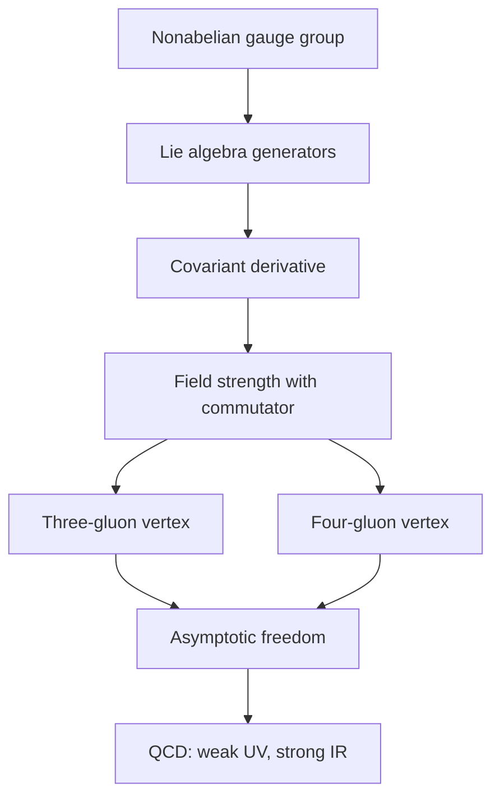

# Yang-Mills Theory and QCD

Yang-Mills theory generalizes electromagnetism from an abelian $U(1)$ gauge group to a nonabelian group such as $SU(N)$. The crucial change is that gauge bosons themselves carry the charge of the gauge symmetry. Photons do not directly couple to photons in QED, but gluons couple to gluons in QCD. This self-interaction is responsible for asymptotic freedom, confinement, and much of the structure of the strong interaction.

Zee's treatment uses nonabelian gauge theory as a bridge between elegant geometry and measurable particle physics. The same field strength that looks like curvature in a mathematical connection becomes the source of three-gluon and four-gluon vertices. Quantizing the theory requires gauge fixing and ghosts, and the resulting theory underlies QCD, the electroweak theory, and grand unification.

## Definitions

Let $T^a$ be generators of a Lie algebra:

$$
[T^a,T^b]=if^{abc}T^c.
$$

The gauge field is matrix-valued:

$$
A_\mu=A_\mu^aT^a.
$$

The covariant derivative is

$$
D_\mu=\partial_\mu+igA_\mu.
$$

The nonabelian field strength is

$$
F_{\mu\nu}
=\partial_\mu A_\nu-\partial_\nu A_\mu+ig[A_\mu,A_\nu].
$$

In components,

$$
F_{\mu\nu}^a
=\partial_\mu A_\nu^a-\partial_\nu A_\mu^a
-g f^{abc}A_\mu^bA_\nu^c
$$

up to sign conventions for $D_\mu$.

The pure Yang-Mills Lagrangian is

$$
\mathcal{L}_{\text{YM}}=-\frac{1}{4}F_{\mu\nu}^aF^{a\mu\nu}.
$$

For QCD with quarks,

$$
\mathcal{L}_{\text{QCD}}
=-\frac{1}{4}G_{\mu\nu}^aG^{a\mu\nu}
+\sum_f \bar{q}_f(i\gamma^\mu D_\mu-m_f)q_f.
$$

## Key results

The commutator term in $F_{\mu\nu}$ produces gauge boson self-interactions. Expanding $F^2$ yields quadratic kinetic terms, cubic terms proportional to $g$, and quartic terms proportional to $g^2$. This is the algebraic source of the nonabelian vertices.

Gauge fixing introduces Faddeev-Popov ghost fields in covariant quantization. Ghosts are anticommuting scalar fields whose loops cancel unphysical gauge degrees of freedom. They do not appear as external physical particles, but they are essential in loop calculations.

The one-loop beta function for an $SU(N_c)$ gauge theory with $N_f$ Dirac fermions in the fundamental representation is

$$
\beta(g)=\mu\frac{dg}{d\mu}
=-\frac{g^3}{16\pi^2}
\left(\frac{11}{3}N_c-\frac{2}{3}N_f\right)+\cdots.
$$

When

$$
\frac{11}{3}N_c-\frac{2}{3}N_f>0,
$$

the coupling decreases at high energy. For QCD with six or fewer active quark flavors, this condition holds. The theory is weakly coupled in high-energy scattering and strongly coupled in the infrared, where confinement occurs.

Wilson loops diagnose confinement. For a closed curve $C$,

$$
W(C)=\mathrm{Tr}\,\mathcal{P}\exp\left(ig\oint_C A_\mu dx^\mu\right).
$$

An area law for large loops indicates a linearly rising potential between color sources.

BRST symmetry is the modern bookkeeping device that survives gauge fixing. After adding gauge-fixing and ghost terms, ordinary gauge invariance is no longer manifest in the same way, but a fermionic BRST transformation remains. It organizes the cancellation of unphysical polarizations and ghosts and identifies the physical state space through cohomology. Even if one does not compute with BRST immediately, it is the conceptual reason gauge-fixed perturbation theory can still describe a gauge-invariant quantum theory.

QCD also teaches the limits of perturbation theory. At high momentum transfer, asymptotic freedom allows quarks and gluons to be used as weakly coupled degrees of freedom. At low energy, the coupling grows, and the natural observed particles are color-singlet hadrons. Confinement, chiral symmetry breaking, and the hadron spectrum require nonperturbative methods such as lattice gauge theory, effective chiral Lagrangians, or large-$N$ expansions.

The lattice formulation makes gauge invariance exact at finite cutoff by putting group elements on links rather than gauge potentials at sites. A plaquette, the product of links around a small square, approximates the field strength. The Wilson action sums traces of plaquettes and becomes the Yang-Mills action in the continuum limit. This is not just a regulator; it gives a practical nonperturbative definition of QCD for numerical calculations.

Large-$N$ thinking offers another expansion parameter. For $SU(N)$ gauge theory, one can take $N\to\infty$ while holding the 't Hooft coupling

$$
\lambda_{\text{'t Hooft}}=g^2N
$$

fixed. Diagrams then organize by topology, with planar diagrams dominant. This connects ordinary gauge perturbation theory to string-like pictures and helps explain why Zee's later chapters can discuss hidden gauge-gravity relationships.

## Visual



| Feature | QED | Yang-Mills / QCD |
|---|---|---|
| Gauge group | $U(1)$ | $SU(N)$ |
| Gauge boson charge | photon neutral | gluons carry color |
| Field strength | derivative terms only | derivative plus commutator |
| Ghosts | decouple in abelian theory | required in loops |
| Beta function sign | positive for charged matter | can be negative |
| Long-distance behavior | Coulomb force | confinement in QCD |

## Worked example 1: Field strength from a commutator

Problem: Show that the commutator of covariant derivatives gives the nonabelian field strength.

Step 1: Define

$$
D_\mu=\partial_\mu+igA_\mu.
$$

Step 2: Compute the commutator acting on a field $\psi$:

$$
[D_\mu,D_\nu]\psi
=(\partial_\mu+igA_\mu)(\partial_\nu+igA_\nu)\psi
-(\mu\leftrightarrow\nu).
$$

Step 3: Expand the first product:

$$
\partial_\mu\partial_\nu\psi
+ig(\partial_\mu A_\nu)\psi
+igA_\nu\partial_\mu\psi
+igA_\mu\partial_\nu\psi
-g^2A_\mu A_\nu\psi.
$$

Step 4: Subtract the expression with $\mu$ and $\nu$ exchanged. The second-derivative terms cancel, and the terms with one derivative on $\psi$ cancel.

Step 5: The remaining terms are

$$
ig(\partial_\mu A_\nu-\partial_\nu A_\mu)\psi
-g^2(A_\mu A_\nu-A_\nu A_\mu)\psi.
$$

Step 6: Factor out $ig$:

$$
[D_\mu,D_\nu]\psi
=ig\left(\partial_\mu A_\nu-\partial_\nu A_\mu+ig[A_\mu,A_\nu]\right)\psi.
$$

The checked answer is

$$
[D_\mu,D_\nu]=igF_{\mu\nu}.
$$

## Worked example 2: Asymptotic freedom condition

Problem: For an $SU(3)$ gauge theory with $N_f$ quark flavors, determine for which $N_f$ the one-loop beta function is negative.

Step 1: The coefficient is

$$
b=\frac{11}{3}N_c-\frac{2}{3}N_f.
$$

For $SU(3)$, $N_c=3$, so

$$
b=\frac{11}{3}\cdot 3-\frac{2}{3}N_f.
$$

Step 2: Simplify:

$$
b=11-\frac{2}{3}N_f.
$$

Step 3: The beta function is

$$
\beta(g)=-\frac{g^3}{16\pi^2}b.
$$

It is negative when $b\gt 0$.

Step 4: Solve:

$$
11-\frac{2}{3}N_f>0.
$$

Multiply by $3$:

$$
33-2N_f>0.
$$

Thus

$$
N_f<16.5.
$$

Step 5: Since $N_f$ is an integer, asymptotic freedom holds for

$$
N_f\le 16.
$$

The checked answer includes real-world QCD with $N_f\le6$ active quark flavors.

## Code

```python
def qcd_beta_coefficient(nc, nf):
    return (11 / 3) * nc - (2 / 3) * nf

def is_asymptotically_free(nc, nf):
    return qcd_beta_coefficient(nc, nf) > 0

for nf in range(0, 19):
    b = qcd_beta_coefficient(3, nf)
    print(f"Nf={nf:2d}: b={b:5.2f}, asymptotically_free={b > 0}")
```

## Common pitfalls

- Treating nonabelian gauge theory as QED with more photons. The commutator term changes the theory qualitatively.
- Forgetting ghosts in loop calculations. Gauge fixing creates them, and unitarity depends on their cancellations.
- Assuming weak coupling at all scales because high-energy QCD is weakly coupled. The infrared theory is strongly coupled.
- Confusing color charge with electric charge. Quarks carry both, gluons carry color but no electric charge.
- Reading confinement directly from perturbation theory. It is a nonperturbative phenomenon.
- Dropping ghost loops in covariant gauges. They are required to cancel unphysical gauge polarizations and to obtain the correct beta function.
- Treating the coupling $g$ as a fixed number independent of scale. In QCD, its running is central to both asymptotic freedom and infrared strong coupling.
- Forgetting representation theory. The beta function, anomaly coefficients, and allowed matter couplings depend on whether fields are fundamental, adjoint, or in another representation.
- Assuming lattice gauge theory is merely a numerical trick. It is also a gauge-invariant regulator and a nonperturbative definition of the theory.
- Confusing color confinement with the absence of quarks in the Lagrangian. Quark and gluon fields are still the correct short-distance variables.
- Using abelian intuition for nonabelian flux. Gluon self-interaction changes screening, running, and long-distance force behavior.
- Forgetting that physical external states in QCD must be color singlets, even when short-distance calculations use colored partons.

## Connections

Nonabelian gauge theory sits at the center of modern QFT. It generalizes QED, supplies the strong interaction, underlies the weak interaction before symmetry breaking, and motivates grand unification. It is also the first place where perturbation theory and nonperturbative physics must be held together: asymptotic freedom is perturbative, while confinement and the hadron spectrum are not. The anomaly and electroweak pages rely on the same group-theoretic language introduced here.

- [Gauge Invariance and QED](/physics/quantum-field-theory/gauge-invariance-and-qed)
- [Renormalization Group](/physics/quantum-field-theory/renormalization-group)
- [Electroweak Theory and Grand Unification](/physics/quantum-field-theory/electroweak-theory-and-grand-unification)
- [Chiral Anomalies](/physics/quantum-field-theory/chiral-anomalies)
