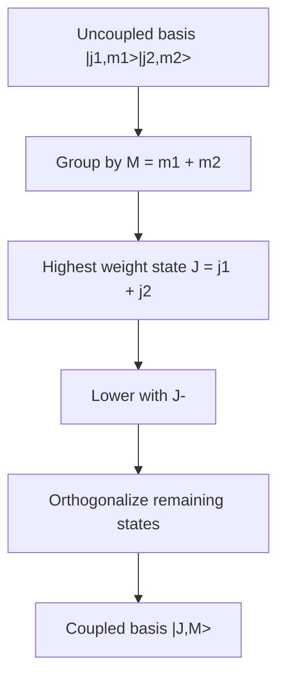

# Addition of Angular Momentum

Composite quantum systems carry angular momentum in pieces: orbital plus spin, electron plus nucleus, two spins in a molecule, or two outgoing particles in a collision. The total angular momentum basis is often the basis in which rotationally invariant Hamiltonians become simple.

Sakurai treats angular-momentum addition through tensor products, coupled bases, and Clebsch-Gordan coefficients. Ballentine connects the same decomposition to irreducible representations and tensor operators. The Gottfried-named notes derive common low-dimensional coefficients explicitly. Schiff's central-potential and atomic notation uses the resulting quantum numbers heavily, especially in spectroscopic language.

## Definitions

For two angular momenta $\mathbf J_1$ and $\mathbf J_2$ acting on different Hilbert spaces,

$$
\mathbf J=\mathbf J_1+\mathbf J_2.
$$

The uncoupled basis is

$$
|j_1,m_1\rangle|j_2,m_2\rangle.
$$

It diagonalizes $J_1^2,J_{1z},J_2^2,J_{2z}$. The coupled basis is

$$
|j_1,j_2;J,M\rangle,
$$

often shortened to $\vert J,M\rangle$ when $j_1$ and $j_2$ are fixed. It diagonalizes

$$
J_1^2,\quad J_2^2,\quad J^2,\quad J_z.
$$

The allowed total angular momenta are

$$
J=|j_1-j_2|,\ |j_1-j_2|+1,\ldots,\ j_1+j_2.
$$

The total projection is

$$
M=m_1+m_2.
$$

Clebsch-Gordan coefficients are the change-of-basis amplitudes:

$$
|j_1,j_2;J,M\rangle
=\sum_{m_1,m_2}
|j_1,m_1\rangle|j_2,m_2\rangle
\langle j_1m_1;j_2m_2|JM\rangle.
$$

## Key results

The dimensions match:

$$
(2j_1+1)(2j_2+1)=\sum_{J=|j_1-j_2|}^{j_1+j_2}(2J+1).
$$

This is a useful check on any decomposition.

For two spin-1/2 systems, the tensor product splits as

$$
{1\over 2}\otimes {1\over 2}=1\oplus 0.
$$

The triplet states are

$$
|1,1\rangle=|+z\rangle|+z\rangle,
$$

$$
|1,0\rangle={1\over \sqrt2}\left(|+z\rangle|-z\rangle+|-z\rangle|+z\rangle\right),
$$

and

$$
|1,-1\rangle=|-z\rangle|-z\rangle.
$$

The singlet state is

$$
|0,0\rangle={1\over \sqrt2}\left(|+z\rangle|-z\rangle-|-z\rangle|+z\rangle\right).
$$

The singlet is rotationally invariant up to phase and has total spin zero. It is also the basic state behind many EPR-Bell spin-correlation discussions.

For spin-orbit coupling, a common Hamiltonian term is

$$
H_{SO}=A\,\mathbf L\cdot\mathbf S.
$$

Using

$$
J^2=(L+S)^2=L^2+S^2+2\mathbf L\cdot\mathbf S,
$$

one gets

$$
\mathbf L\cdot\mathbf S={1\over 2}(J^2-L^2-S^2).
$$

Thus the coupled basis diagonalizes spin-orbit interactions. This is why atomic fine structure is labeled by $n,\ell,j,m_j$ rather than only $n,\ell,m$.

## Visual



| Coupling | Total values | Dimension check | Common use |
|---|---|---|---|
| $1/2\otimes1/2$ | $1,0$ | $4=3+1$ | two spins, singlet/triplet |
| $1\otimes1/2$ | $3/2,1/2$ | $6=4+2$ | p electron plus spin |
| $\ell\otimes1/2$ | $\ell+1/2,\ell-1/2$ | $2(2\ell+1)=(2\ell+2)+(2\ell)$ | spin-orbit splitting |

## Worked example 1: Deriving the two-spin singlet and triplet

**Problem.** Add two spin-1/2 particles and construct the $M=0$ coupled states.

**Method.**

1. The highest state is unique:

$$
|1,1\rangle=|+z\rangle|+z\rangle.
$$

2. Lower it with

$$
J_-=S_{1-}+S_{2-}.
$$

3. Since

$$
S_-|+z\rangle=\hbar|-z\rangle,
$$

we get

$$
J_-|1,1\rangle
=\hbar|-z\rangle|+z\rangle+\hbar|+z\rangle|-z\rangle.
$$

4. The ladder formula also says

$$
J_-|1,1\rangle=\hbar\sqrt2|1,0\rangle.
$$

5. Therefore

$$
|1,0\rangle={1\over\sqrt2}
\left(|+z\rangle|-z\rangle+|-z\rangle|+z\rangle\right).
$$

6. The other normalized $M=0$ combination must be orthogonal:

$$
|0,0\rangle={1\over\sqrt2}
\left(|+z\rangle|-z\rangle-|-z\rangle|+z\rangle\right).
$$

**Checked answer.** The symmetric $M=0$ state belongs to $J=1$, while the antisymmetric one belongs to $J=0$.

## Worked example 2: Spin-orbit energy for l = 1 and s = 1/2

**Problem.** For $H_{SO}=A\mathbf L\cdot\mathbf S$, compute the energy shift for $\ell=1$, $s=1/2$, and $j=3/2$ or $j=1/2$.

**Method.**

1. Use

$$
\mathbf L\cdot\mathbf S={1\over2}(J^2-L^2-S^2).
$$

2. Replace each square by its eigenvalue:

$$
\Delta E_j={A\hbar^2\over 2}
\left[j(j+1)-\ell(\ell+1)-s(s+1)\right].
$$

3. For $\ell=1$,

$$
\ell(\ell+1)=2.
$$

4. For $s=1/2$,

$$
s(s+1)={3\over4}.
$$

5. For $j=3/2$,

$$
j(j+1)={3\over2}{5\over2}={15\over4}.
$$

Thus

$$
\Delta E_{3/2}={A\hbar^2\over2}\left({15\over4}-2-{3\over4}\right)
={A\hbar^2\over2}.
$$

6. For $j=1/2$,

$$
j(j+1)={3\over4},
$$

so

$$
\Delta E_{1/2}={A\hbar^2\over2}\left({3\over4}-2-{3\over4}\right)
=-A\hbar^2.
$$

**Checked answer.** The splitting between the two levels is $3A\hbar^2/2$.

## Code

```python
from fractions import Fraction

def spin_orbit_shift(l, s, j, A=1):
    return Fraction(A, 2) * (j * (j + 1) - l * (l + 1) - s * (s + 1))

l = Fraction(1, 1)
s = Fraction(1, 2)
for j in [Fraction(3, 2), Fraction(1, 2)]:
    print(j, spin_orbit_shift(l, s, j))
```

## Common pitfalls

- Adding $m$ values correctly but forgetting that $J$ has restricted ranges.
- Treating uncoupled and coupled bases as different systems. They are different bases in the same tensor-product space.
- Missing normalization when symmetric and antisymmetric combinations are formed.
- Losing phase conventions. Clebsch-Gordan coefficients are convention-dependent in sign, though physical predictions are not.
- Assuming $\mathbf L\cdot\mathbf S$ is diagonal in the uncoupled basis. It is diagonal in the coupled basis.
- Forgetting the dimension check. If the multiplet dimensions do not add up, the coupling list is wrong.
- Confusing exchange symmetry with angular-momentum coupling. They interact strongly for identical particles, but they are conceptually distinct.

The main strategy for angular-momentum addition is to start from the highest-weight state. The state with $M=j_1+j_2$ is unique, so it must belong to $J=j_1+j_2$. Repeated application of the total lowering operator generates that entire multiplet. Any states left over at the same $M$ values must be orthogonal combinations belonging to smaller $J$. This constructive method explains where Clebsch-Gordan coefficients come from, rather than treating tables as magic.

The uncoupled and coupled bases answer different physical questions. If a magnetic field couples separately to $J_{1z}$ and $J_{2z}$, the uncoupled basis may be natural. If the Hamiltonian contains $\mathbf J_1\cdot\mathbf J_2$, the coupled basis is natural because $J^2$ diagonalizes the dot product. Spectroscopic notation is built around choosing the basis that diagonalizes the largest part of the Hamiltonian, then treating smaller terms as perturbations.

Phase conventions are unavoidable. Most physics texts use the Condon-Shortley convention, but signs can differ if a basis state is defined with a different phase. A single Clebsch-Gordan coefficient sign is not directly observable; relative signs inside a state matter because they affect interference and matrix elements. When combining coefficients from different tables or software libraries, verify the convention before comparing components.

Addition of angular momentum also connects to identical-particle constraints. For two identical spin-1/2 fermions, the spin singlet is antisymmetric and the spin triplet is symmetric. The spatial wave function must compensate so that the total state is antisymmetric. This is why helium, molecular hydrogen, and two-nucleon systems use both angular-momentum coupling and exchange symmetry in the same calculation.

When solving homework-style coupling problems, write down the full uncoupled dimension before doing anything else. Then list the possible $J$ values and their dimensions. Only after the dimension count works should you compute coefficients. This prevents common errors such as missing the $J=\vert j_1-j_2\vert $ multiplet or inventing an extra state with an impossible $M$. For low-dimensional cases, laddering and orthogonality are usually faster and more reliable than searching a table.

In atomic notation, remember that different coupling schemes may be appropriate in different physical regimes. Weak spin-orbit coupling suggests $LS$ coupling, where orbital angular momenta combine, spins combine, and then total $J$ is formed. Stronger relativistic effects may favor $jj$ coupling, where each electron's $\ell$ and $s$ first combine to an individual $j$. The underlying Hilbert space is the same, but the useful basis changes with the dominant Hamiltonian.

As a check on any coupled state, verify three things: it has the advertised $M$, it is normalized, and it is orthogonal to other states with the same $M$ but different $J$. These tests catch nearly every arithmetic error in hand-built Clebsch-Gordan states. If a Hamiltonian is rotationally invariant, states with the same $J$ but different $M$ should remain degenerate unless another interaction selects an axis.

This makes angular-momentum addition both a computational method and a symmetry audit.

## Connections

- [Angular momentum algebra](/physics/quantum-mechanics/angular-momentum-algebra)
- [Spin-1/2 systems](/physics/quantum-mechanics/spin-one-half-systems)
- [Central potentials and the hydrogen atom](/physics/quantum-mechanics/central-potentials-hydrogen-atom)
- [Identical particles and symmetrization](/physics/quantum-mechanics/identical-particles-symmetrization)
- [Time-independent perturbation theory](/physics/quantum-mechanics/time-independent-perturbation-theory)
