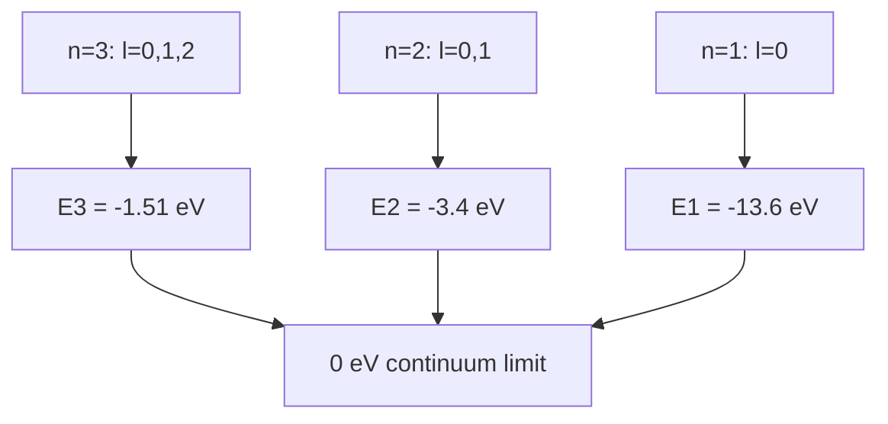

# Central Potentials and the Hydrogen Atom

The hydrogen atom is the central bound-state problem of nonrelativistic quantum mechanics. It combines rotational symmetry, separation of variables, angular momentum, radial boundary conditions, degeneracy, and perturbative corrections. It also explains why spectroscopy became one of the first precision tests of quantum theory.

Sakurai treats hydrogen and hydrogenlike atoms after angular momentum and again in approximation methods through fine structure and Zeeman effects. Ballentine's bound-state chapter emphasizes estimates, variational reasoning, and perturbative corrections. The Gottfried-named notes use hydrogen as a perturbation-theory example. Schiff's traditional wave-mechanics approach is the classic separation into radial and angular equations.


*Figure: Hydrogen density plots make angular momentum, nodes, and probability density visible in real atomic structure. Image: [Wikimedia Commons](https://commons.wikimedia.org/wiki/File:Hydrogen_Density_Plots.png), PoorLeno, public domain.*

## Definitions

A **central potential** depends only on radius:

$$
V(\mathbf r)=V(r).
$$

Then

$$
[H,L^2]=0,\qquad [H,L_z]=0,
$$

so stationary states can be labeled by angular momentum quantum numbers.

For hydrogen,

$$
V(r)=-{e^2\over 4\pi\epsilon_0 r}.
$$

The Hamiltonian for the relative coordinate is

$$
H=-{\hbar^2\over 2\mu}\nabla^2-{e^2\over 4\pi\epsilon_0 r},
$$

where $\mu$ is the electron-proton reduced mass.

Separation of variables gives

$$
\psi_{n\ell m}(r,\theta,\phi)=R_{n\ell}(r)Y_\ell^m(\theta,\phi).
$$

The Bohr radius is

$$
a_0={4\pi\epsilon_0\hbar^2\over \mu e^2}.
$$

The principal quantum number is

$$
n=1,2,3,\ldots,
$$

with

$$
\ell=0,1,\ldots,n-1,
\qquad
m=-\ell,\ldots,\ell.
$$

## Key results

The bound-state energies are

$$
E_n=-{\mu e^4\over 2(4\pi\epsilon_0)^2\hbar^2}{1\over n^2}
=-{13.6\,\mathrm{eV}\over n^2}
$$

for hydrogen to the usual reduced-mass approximation.

The energy depends only on $n$ in the nonrelativistic Coulomb problem. For a fixed $n$, the degeneracy counting without spin is

$$
\sum_{\ell=0}^{n-1}(2\ell+1)=n^2.
$$

Including electron spin doubles it to $2n^2$ before fine structure, hyperfine structure, or external fields are included.

The normalized ground-state wave function is

$$
\psi_{100}(r,\theta,\phi)={1\over \sqrt{\pi a_0^3}}e^{-r/a_0}.
$$

The radial probability density for the ground state is

$$
P(r)=4\pi r^2|\psi_{100}(r)|^2
={4r^2\over a_0^3}e^{-2r/a_0}.
$$

It is largest at $r=a_0$, even though the wave function itself is largest at $r=0$. This distinction between amplitude density and radial shell probability is a common conceptual test.

Fine structure corrections include relativistic kinetic energy, spin-orbit coupling, and the Darwin term. Zeeman splitting in a weak magnetic field is governed by magnetic moments and angular momentum projections. Sakurai's treatment uses angular-momentum machinery; Schiff's older notation often presents these corrections in a more wave-equation-centered form.

## Visual



| Quantum number | Allowed values | Physical meaning |
|---|---|---|
| $n$ | $1,2,3,\ldots$ | energy shell in Coulomb problem |
| $\ell$ | $0,\ldots,n-1$ | orbital angular momentum magnitude |
| $m$ | $-\ell,\ldots,\ell$ | $z$ projection of orbital angular momentum |
| $s$ | $1/2$ for electron | intrinsic spin |
| $j$ | $\ell\pm1/2$ | total electronic angular momentum |

## Worked example 1: Most probable radius in the ground state

**Problem.** Show that the most probable radius in the hydrogen ground state is $a_0$.

**Method.**

1. Start from

$$
\psi_{100}={1\over \sqrt{\pi a_0^3}}e^{-r/a_0}.
$$

2. The probability of finding the electron between $r$ and $r+dr$ is

$$
P(r)dr=4\pi r^2|\psi_{100}|^2dr.
$$

3. Substitute:

$$
P(r)={4r^2\over a_0^3}e^{-2r/a_0}.
$$

4. Differentiate:

$$
{dP\over dr}={4\over a_0^3}
\left(2r e^{-2r/a_0}-{2r^2\over a_0}e^{-2r/a_0}\right).
$$

5. Factor:

$$
{dP\over dr}={8r\over a_0^3}e^{-2r/a_0}\left(1-{r\over a_0}\right).
$$

6. Critical points are $r=0$ and $r=a_0$. Since $P(0)=0$ and $P(r)$ rises then falls, the maximum is

$$
r=a_0.
$$

**Checked answer.** The amplitude is largest at the origin, but the radial probability includes the shell factor $4\pi r^2$.

## Worked example 2: Energy of a Lyman-alpha photon

**Problem.** Find the photon energy for the transition $n=2\to n=1$ in hydrogen using the nonrelativistic formula.

**Method.**

1. Use

$$
E_n=-{13.6\,\mathrm{eV}\over n^2}.
$$

2. Compute the initial energy:

$$
E_2=-{13.6\over 4}\,\mathrm{eV}=-3.4\,\mathrm{eV}.
$$

3. Compute the final energy:

$$
E_1=-13.6\,\mathrm{eV}.
$$

4. The emitted photon energy is the lost atomic energy:

$$
E_\gamma=E_2-E_1=(-3.4)-(-13.6)=10.2\,\mathrm{eV}.
$$

5. A wavelength estimate is

$$
\lambda={hc\over E_\gamma}
\approx {1240\,\mathrm{eV\,nm}\over 10.2\,\mathrm{eV}}
\approx 122\,\mathrm{nm}.
$$

**Checked answer.** This is ultraviolet light, consistent with the Lyman series.

## Code

```python
import numpy as np

a0 = 1.0
r = np.linspace(0, 8 * a0, 1000)
radial_prob = 4 * r**2 / a0**3 * np.exp(-2 * r / a0)
r_peak = r[np.argmax(radial_prob)]

for n in [1, 2, 3, 4]:
    print(n, -13.6 / n**2)
print("peak radius in units of a0:", r_peak)
```

## Common pitfalls

- Confusing $R_{n\ell}(r)$, $\psi_{n\ell m}$, and radial probability density. The shell factor matters.
- Forgetting reduced mass. Precision spectroscopy needs $\mu$, not exactly the electron mass.
- Assuming the Coulomb degeneracy is generic. Most central potentials have energies depending on both $n$ and $\ell$.
- Treating $m$ degeneracy as permanent. External fields split projection degeneracies.
- Mixing orbital and total angular momentum labels when spin-orbit coupling is present.
- Calling $a_0$ the average radius. In the ground state, the most probable radius is $a_0$, while the expectation value is $3a_0/2$.
- Applying nonrelativistic hydrogen energies to fine spectral details without corrections.

Central-potential problems are a lesson in using symmetry before solving equations. Rotational invariance tells you that $L^2$ and $L_z$ commute with the Hamiltonian, so the angular dependence must be organized by spherical harmonics. The remaining problem is radial. This separation is not a computational trick; it is the mathematical expression of the fact that no direction in space is preferred by $V(r)$. Sakurai's route through angular momentum makes this structure explicit before the hydrogen formulas appear.

The Coulomb potential has an additional hidden symmetry, which is why the nonrelativistic energy depends only on $n$ rather than on $\ell$. That degeneracy is special. A generic central potential has energies depending on the radial quantum number and $\ell$. When fine structure, Lamb shift, hyperfine coupling, or external fields are included, the simple $n^2$ degeneracy is partially or fully lifted. Treat the $-13.6/n^2$ formula as the leading idealization, not the full story of real hydrogen spectroscopy.

Radial probability is another conceptual trap. The probability density in three dimensions is $\vert \psi(\mathbf r)\vert ^2$, but the probability for a radius interval includes the volume element $4\pi r^2dr$ for spherically symmetric states. This is why the ground-state wave function is largest at the origin while the most probable radius is $a_0$. Whenever a problem asks "where is the electron most likely to be found," check whether it means a point density or a radial shell probability.

Hydrogen also functions as a meeting point for later approximation methods. The Stark effect uses degenerate perturbation theory in excited shells. The Zeeman effect uses angular momentum and magnetic moments. Variational estimates reproduce the ground energy when the trial family contains the exact exponential form. Scattering from Coulomb-like potentials requires special care because the potential is long-ranged. One atom therefore exercises nearly the whole nonrelativistic toolkit.

When doing hydrogen calculations, keep the hierarchy of approximations explicit. The simplest Hamiltonian uses a Coulomb potential and reduced mass. Fine structure adds relativistic kinetic correction, spin-orbit coupling, and Darwin terms. Hyperfine structure adds nuclear spin. The Lamb shift requires quantum-field effects beyond ordinary nonrelativistic quantum mechanics. External electric and magnetic fields add Stark and Zeeman perturbations. Mixing formulas from different levels of this hierarchy without stating the approximation leads to inconsistent spectroscopic predictions.

The radial equation is also a good place to practice dimensional reasoning. Lengths should naturally appear in units of $a_0$, energies in Rydberg-scale units, and angular parts should be dimensionless spherical harmonics. If a radial wave function normalization produces a dimensionless $R(r)$, something is wrong: because $\int \vert R\vert ^2r^2dr=1$, $R$ has dimensions of length to the power $-3/2$.

For problem solving, start by identifying which labels remain good quantum numbers after each added interaction. Pure Coulomb hydrogen uses $n,\ell,m$ and spin separately. Spin-orbit coupling favors $j,m_j$. A magnetic field may make a projection quantum number central. Choosing labels before calculating keeps degeneracy splitting organized.

## Connections

- [Angular momentum algebra](/physics/quantum-mechanics/angular-momentum-algebra)
- [Addition of angular momentum](/physics/quantum-mechanics/addition-of-angular-momentum)
- [Time-independent perturbation theory](/physics/quantum-mechanics/time-independent-perturbation-theory)
- [Variational principle and WKB](/physics/quantum-mechanics/variational-principle-wkb)
- [Symmetries and conservation laws](/physics/quantum-mechanics/symmetries-conservation-laws)
