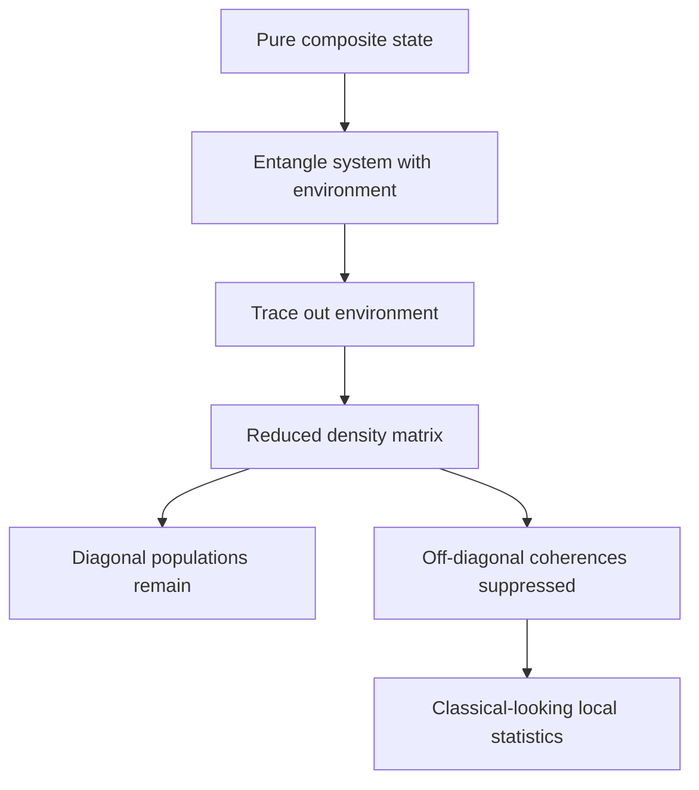

# Density Operator, Entanglement, and Decoherence

The density operator is the language of incomplete information, subsystems, statistical mixtures, and open-system behavior. State vectors are enough for isolated pure states, but experiments usually involve preparation uncertainty, unobserved environments, or composite systems whose parts do not have their own pure states.

Sakurai introduces density operators in the angular-momentum chapter through pure versus mixed ensembles and later uses spin correlations and Bell inequalities. Ballentine gives extensive attention to pure and general states, measurement, and ensemble interpretation. The Gottfried-named notes develop density matrices for spin-1/2 and mixed beams. Schiff's older treatment is less centered on density operators, reflecting the historical emphasis on wave functions.

## Definitions

A density operator $\rho$ is a positive semidefinite, trace-one operator:

$$
\rho\geq0,\qquad \mathrm{Tr}\rho=1.
$$

For a pure state,

$$
\rho=|\psi\rangle\langle\psi|.
$$

For a classical mixture of preparations $\vert \psi_i\rangle$ with probabilities $p_i$,

$$
\rho=\sum_i p_i|\psi_i\rangle\langle\psi_i|,
\qquad p_i\geq0,\quad \sum_i p_i=1.
$$

Expectation values are

$$
\langle A\rangle=\mathrm{Tr}(\rho A).
$$

Unitary evolution is

$$
\rho(t)=U(t)\rho(0)U^\dagger(t),
$$

or

$$
i\hbar {d\rho\over dt}=[H,\rho].
$$

For a composite system $AB$, the reduced density operator of subsystem $A$ is

$$
\rho_A=\mathrm{Tr}_B(\rho_{AB}).
$$

The von Neumann entropy is

$$
S(\rho)=-\mathrm{Tr}(\rho\ln\rho).
$$

## Key results

A state is pure if and only if

$$
\rho^2=\rho,
$$

equivalently

$$
\mathrm{Tr}(\rho^2)=1.
$$

For a mixed state,

$$
\mathrm{Tr}(\rho^2)<1.
$$

For spin-1/2,

$$
\rho={1\over2}(I+\mathbf r\cdot\boldsymbol{\sigma}),
$$

where $\mathbf r$ is the Bloch vector. Positivity requires

$$
|\mathbf r|\leq1.
$$

Pure states sit on the Bloch sphere, and mixed states sit inside it.

Entanglement means that a composite pure state cannot be factored into subsystem states. The Bell state

$$
|\Phi^+\rangle={1\over\sqrt2}(|00\rangle+|11\rangle)
$$

has total density operator

$$
\rho_{AB}=|\Phi^+\rangle\langle\Phi^+|.
$$

Tracing out $B$ gives

$$
\rho_A={1\over2}I.
$$

Thus the whole state is pure while each subsystem is maximally mixed. This is not ignorance about which pure state $A$ "really has"; it is a structural feature of entanglement.

Decoherence occurs when a system becomes entangled with environmental degrees of freedom and interference terms in a preferred basis become practically inaccessible. It does not by itself choose one outcome, but it explains why coherent superpositions become hard to observe locally. Ballentine's ensemble caution and Sakurai's spin-correlation discussion are both useful here: density matrices encode predictions without requiring a single interpretation of collapse.

## Visual



| Concept | Mathematical test | Interpretation |
|---|---|---|
| Pure state | $\mathrm{Tr}(\rho^2)=1$ | one ray description |
| Mixed state | $\mathrm{Tr}(\rho^2)\lt 1$ | statistical or reduced description |
| Entangled pure state | cannot factor $\vert \psi\rangle_A\vert \phi\rangle_B$ | subsystems need density operators |
| Decoherence | local off-diagonal terms shrink | interference becomes inaccessible |

## Worked example 1: Pure or mixed spin state

**Problem.** Consider

$$
\rho={1\over2}
\begin{pmatrix}
1+r&0\\
0&1-r
\end{pmatrix}.
$$

Find when it is pure.

**Method.**

1. The eigenvalues are visible:

$$
\lambda_+= {1+r\over2},
\qquad
\lambda_-={1-r\over2}.
$$

2. Positivity requires

$$
-1\leq r\leq1.
$$

3. Compute purity:

$$
\mathrm{Tr}(\rho^2)=\lambda_+^2+\lambda_-^2.
$$

4. Substitute:

$$
\begin{aligned}
\mathrm{Tr}(\rho^2)
&={ (1+r)^2+(1-r)^2\over4}\\
&={2+2r^2\over4}\\
&={1+r^2\over2}.
\end{aligned}
$$

5. Set this equal to $1$:

$$
{1+r^2\over2}=1\Rightarrow r^2=1.
$$

**Checked answer.** The state is pure only for $r=\pm1$. For $r=0$, it is maximally mixed: $\rho=I/2$.

## Worked example 2: Partial trace of a Bell state

**Problem.** For

$$
|\Phi^+\rangle={1\over\sqrt2}(|00\rangle+|11\rangle),
$$

compute $\rho_A$.

**Method.**

1. Form the total density operator:

$$
\rho_{AB}={1\over2}
\left(|00\rangle\langle00|
+|00\rangle\langle11|
+|11\rangle\langle00|
+|11\rangle\langle11|\right).
$$

2. Trace over subsystem $B$ using

$$
\mathrm{Tr}_B(|a b\rangle\langle a' b'|)
=|a\rangle\langle a'|\langle b'|b\rangle.
$$

3. Apply this term by term:

$$
\mathrm{Tr}_B(|00\rangle\langle00|)=|0\rangle\langle0|,
$$

$$
\mathrm{Tr}_B(|00\rangle\langle11|)=|0\rangle\langle1|\langle1|0\rangle=0,
$$

$$
\mathrm{Tr}_B(|11\rangle\langle00|)=0,
$$

$$
\mathrm{Tr}_B(|11\rangle\langle11|)=|1\rangle\langle1|.
$$

4. Therefore

$$
\rho_A={1\over2}\left(|0\rangle\langle0|+|1\rangle\langle1|\right)={I\over2}.
$$

**Checked answer.** The subsystem is maximally mixed even though the joint state is pure.

## Code

```python
import numpy as np

phi = np.array([1, 0, 0, 1], dtype=complex) / np.sqrt(2)
rho = np.outer(phi, phi.conj()).reshape(2, 2, 2, 2)
rho_a = np.trace(rho, axis1=1, axis2=3)

print(rho_a)
print("purity subsystem:", np.trace(rho_a @ rho_a).real)
```

## Common pitfalls

- Confusing a mixed state with a superposition. A mixture has probabilities over preparations; a superposition has coherent amplitudes.
- Assuming every density matrix decomposition into pure states is unique. It is not.
- Treating subsystem mixedness as necessarily ignorance. For entangled pure states, reduced mixedness is intrinsic to the subsystem description.
- Forgetting the trace in expectation values. With density operators, use $\mathrm{Tr}(\rho A)$.
- Thinking decoherence alone solves every measurement problem. It suppresses local interference but does not by itself select a unique experienced outcome.
- Ignoring positivity. Trace one is not enough for a valid density matrix.
- Confusing classical correlation with entanglement. Entanglement is not just strong correlation; it is nonfactorization of quantum state structure.

Density matrices are especially useful because they separate two operations that state vectors mix together: coherent superposition and probabilistic mixing. Off-diagonal entries in a basis represent coherence relative to that basis. Diagonal entries represent populations. A unitary basis change can move coherence around, so one should not say a density matrix is "diagonal" without naming the basis. Decoherence is the physical suppression of off-diagonal terms in a dynamically selected pointer basis, not in every possible basis at once.

Purity is a quick diagnostic but not a complete interpretation. If $\mathrm{Tr}(\rho^2)=1$, the state is pure. If it is less than one, the state is mixed. The same mixed density operator may describe ignorance about a preparation procedure or the reduced state of an entangled subsystem. These two cases can be operationally identical for measurements on the subsystem alone, but they differ when joint measurements or purification questions are considered.

The partial trace is often the first place tensor-product bookkeeping becomes unavoidable. Write basis indices explicitly if needed: $\rho_{aa',bb'}$ becomes $(\rho_A)_{aa'}=\sum_b \rho_{aa',bb}$. This index contraction is not a physical loss of information by itself; it represents choosing not to access subsystem $B$. In open-system physics, the environment has many degrees of freedom, so recovering the full phase information is practically impossible even though the total system may evolve unitarily.

Ballentine's ensemble emphasis and Sakurai's density-operator spin examples complement each other. Ballentine keeps the statistical meaning of $\rho$ explicit. Sakurai shows how $\rho$ handles pure and mixed spin beams in the same algebraic language. Together they make density operators feel less like an advanced add-on and more like the natural generalization of the Born rule.

A useful computational habit is to diagonalize $\rho$ when interpreting a state. Its eigenvalues are probabilities in the basis that makes the mixture look classical, and they determine entropy and purity. But the eigenbasis of $\rho$ is not automatically the measurement basis of interest. A detector measuring $S_z$ cares about diagonal entries in the $z$ basis, while entropy cares about the eigenvalues of $\rho$ itself. Confusing these two diagonalizations leads to wrong statements about coherence.

For entanglement, avoid relying only on visual inspection of a state vector. A two-qubit pure state is entangled if the reduced density matrix of either qubit is mixed, or equivalently if the coefficient matrix has rank greater than one. This gives a practical test: reshape the coefficient vector into a matrix and check whether it factors into one column times one row. The Bell examples are maximally entangled, but partially entangled states require this more careful diagnosis.

In calculations involving measurement, density operators also prevent accidental conditioning. If the outcome is known, update with the corresponding normalized branch. If the outcome is not known or is deliberately ignored, sum over all branches. Both are legitimate operations, but they answer different experimental questions. This distinction is central to interpreting decoherence and mixed spin beams.

Whenever a problem mentions an unobserved subsystem, an imperfect preparation, or discarded measurement records, switch to density-operator language early rather than trying to force a single ket to carry missing information.

## Connections

- [Spin-1/2 systems](/physics/quantum-mechanics/spin-one-half-systems)
- [Postulates of quantum mechanics](/physics/quantum-mechanics/postulates-of-quantum-mechanics)
- [Identical particles and symmetrization](/physics/quantum-mechanics/identical-particles-symmetrization)
- [Measurement and interpretation](/physics/quantum-mechanics/measurement-interpretation)
- [Symmetries and conservation laws](/physics/quantum-mechanics/symmetries-conservation-laws)
