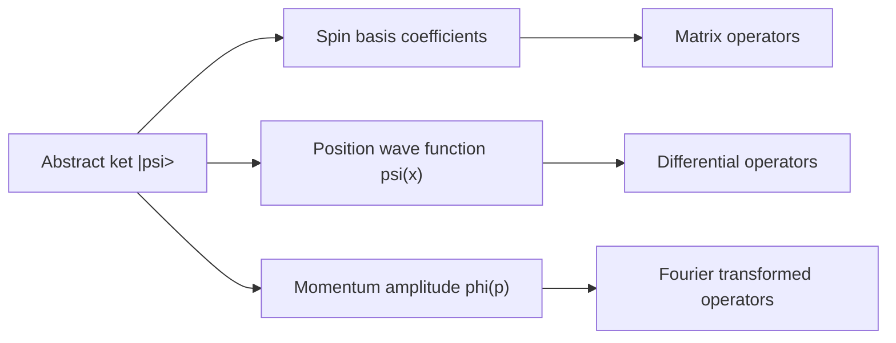

# Dirac Notation and Hilbert Spaces

Dirac notation is not just shorthand. It separates the state itself from any particular coordinate system used to describe it. The same ket can be written as a column vector in a spin basis, a square-integrable wave function in position space, or a momentum-space amplitude after a Fourier transform.

Sakurai introduces bras, kets, and operators before wave mechanics, making Hilbert space the native language. Ballentine begins with a more explicit mathematical account of vector spaces, self-adjointness, probability, and rigged Hilbert spaces. The Gottfried-named notes move between wave functions and Dirac notation, which is useful for seeing how the abstract and coordinate pictures translate. Schiff's older style corresponds mostly to choosing the position representation early.

## Definitions

A **ket** $\vert \psi\rangle$ is a vector in a complex Hilbert space. A **bra** $\langle \psi\vert $ is its dual vector. The inner product $\langle \phi\vert \psi\rangle$ is linear in the ket argument and conjugate-linear in the bra argument under the physics convention.

The norm is

$$
\|\psi\|=\sqrt{\langle \psi|\psi\rangle}.
$$

A **linear operator** $A$ maps kets to kets:

$$
A(\alpha|\psi\rangle+\beta|\phi\rangle)=\alpha A|\psi\rangle+\beta A|\phi\rangle.
$$

The **adjoint** $A^\dagger$ is defined by

$$
\langle \phi|A|\psi\rangle=\langle A^\dagger\phi|\psi\rangle.
$$

An **orthonormal discrete basis** $\{\vert n\rangle\}$ satisfies

$$
\langle m|n\rangle=\delta_{mn},
\qquad
\sum_n |n\rangle\langle n|=I.
$$

For a continuous basis such as position,

$$
\langle x|x'\rangle=\delta(x-x'),
\qquad
\int_{-\infty}^{\infty}|x\rangle\langle x|\,dx=I.
$$

The **wave function** is the coordinate representation of the ket:

$$
\psi(x)=\langle x|\psi\rangle.
$$

The **momentum-space wave function** is

$$
\phi(p)=\langle p|\psi\rangle.
$$

The position and momentum representations are connected by the convention-dependent Fourier kernel. With

$$
\langle x|p\rangle={1\over \sqrt{2\pi\hbar}}e^{ipx/\hbar},
$$

we have

$$
\psi(x)=\int {dp\over \sqrt{2\pi\hbar}}e^{ipx/\hbar}\phi(p).
$$

## Key results

In a discrete basis, a ket becomes a column of coefficients:

$$
|\psi\rangle=\sum_n c_n|n\rangle,\qquad c_n=\langle n|\psi\rangle.
$$

An operator becomes a matrix:

$$
A_{mn}=\langle m|A|n\rangle.
$$

The expectation value then looks like ordinary matrix algebra:

$$
\langle A\rangle=\sum_{m,n}c_m^*A_{mn}c_n.
$$

A change of orthonormal basis is unitary. If

$$
|e'_j\rangle=\sum_i |e_i\rangle U_{ij},
$$

then $U^\dagger U=I$ and the same abstract vector has transformed components

$$
c'_j=\langle e'_j|\psi\rangle=\sum_i U_{ij}^*c_i.
$$

The spectral theorem says that a self-adjoint operator can be represented by real eigenvalues and orthogonal eigenspaces, with continuous-spectrum caveats handled rigorously by generalized eigenvectors or a rigged Hilbert space. Ballentine is more explicit about these mathematical caveats than Sakurai; Sakurai uses the formal Dirac machinery efficiently and returns to normalization subtleties as needed.

Tensor products describe composite systems:

$$
|\psi\rangle_A\otimes|\phi\rangle_B \equiv |\psi\rangle_A|\phi\rangle_B.
$$

Not every vector in a tensor product factors. For example,

$$
|\Phi^+\rangle={1\over \sqrt{2}}\left(|0\rangle_A|0\rangle_B+|1\rangle_A|1\rangle_B\right)
$$

is entangled. This is already latent in the Hilbert-space postulates: the state space of a pair is not the Cartesian product of two state spaces, but the tensor product.

In position representation, the momentum operator is

$$
P=-i\hbar {d\over dx},
$$

because it generates translations:

$$
T(a)=\exp(-iaP/\hbar),\qquad T(a)^\dagger X T(a)=X+aI.
$$

This result connects Sakurai's generator-first derivation with Schiff's traditional differential-operator wave mechanics.

## Visual



| Object | Abstract notation | Discrete representation | Position representation |
|---|---|---|---|
| State | $\vert \psi\rangle$ | column vector $c_n$ | $\psi(x)=\langle x\vert \psi\rangle$ |
| Bra | $\langle\psi\vert $ | conjugate row $c_n^*$ | $\psi^*(x)$ under integrals |
| Identity | $I$ | $\sum_n \vert n\rangle\langle n\vert $ | $\int dx\,\vert x\rangle\langle x\vert $ |
| Momentum | $P$ | matrix $P_{mn}$ | $-i\hbar d/dx$ |
| Probability | projector $P_a$ | $\vert c_a\vert ^2$ | $\int_R \vert \psi(x)\vert ^2 dx$ |

## Worked example 1: Changing from z-basis to x-basis

**Problem.** In the $S_z$ basis, let

$$
|\psi\rangle={1\over \sqrt{5}}\begin{pmatrix}1\\2\end{pmatrix}.
$$

Find the amplitudes in the $S_x$ basis, where

$$
|+x\rangle={1\over \sqrt{2}}\begin{pmatrix}1\\1\end{pmatrix},
\qquad
|-x\rangle={1\over \sqrt{2}}\begin{pmatrix}1\\-1\end{pmatrix}.
$$

**Method.**

1. Compute the $+x$ amplitude:

$$
\begin{aligned}
c_{+x}
&=\langle +x|\psi\rangle\\
&={1\over \sqrt{2}}\begin{pmatrix}1&1\end{pmatrix}
{1\over \sqrt{5}}\begin{pmatrix}1\\2\end{pmatrix}\\
&={3\over \sqrt{10}}.
\end{aligned}
$$

2. Compute the $-x$ amplitude:

$$
\begin{aligned}
c_{-x}
&=\langle -x|\psi\rangle\\
&={1\over \sqrt{2}}\begin{pmatrix}1&-1\end{pmatrix}
{1\over \sqrt{5}}\begin{pmatrix}1\\2\end{pmatrix}\\
&=-{1\over \sqrt{10}}.
\end{aligned}
$$

3. Check probabilities:

$$
|c_{+x}|^2+|c_{-x}|^2={9\over 10}+{1\over 10}=1.
$$

**Checked answer.** The same ket is

$$
|\psi\rangle={3\over \sqrt{10}}|+x\rangle-{1\over \sqrt{10}}|-x\rangle.
$$

The negative sign is a relative phase and affects later interference, even though its probability contribution is positive.

## Worked example 2: Momentum operator in position space

**Problem.** Let

$$
\psi(x)=N e^{-x^2/(2a^2)}.
$$

Find $N$ and compute $\langle P\rangle$.

**Method.**

1. Normalize:

$$
1=\int_{-\infty}^{\infty}|\psi(x)|^2dx
=|N|^2\int_{-\infty}^{\infty}e^{-x^2/a^2}dx.
$$

2. Use

$$
\int_{-\infty}^{\infty}e^{-x^2/a^2}dx=a\sqrt{\pi},
$$

so

$$
|N|^2={1\over a\sqrt{\pi}},\qquad N={1\over \pi^{1/4}\sqrt{a}}
$$

for real positive $N$.

3. Apply $P=-i\hbar d/dx$:

$$
{d\psi\over dx}=-{x\over a^2}\psi(x).
$$

4. Compute

$$
\begin{aligned}
\langle P\rangle
&=\int_{-\infty}^{\infty}\psi^*(x)\left(-i\hbar {d\over dx}\right)\psi(x)\,dx\\
&={i\hbar\over a^2}\int_{-\infty}^{\infty}x|\psi(x)|^2dx.
\end{aligned}
$$

5. The integrand $x\vert \psi(x)\vert ^2$ is odd, so the integral is zero.

**Checked answer.** $\langle P\rangle=0$, consistent with a real, even wave packet centered at zero momentum.

## Code

```python
import numpy as np

psi_z = np.array([1, 2], dtype=complex) / np.sqrt(5)
plus_x = np.array([1, 1], dtype=complex) / np.sqrt(2)
minus_x = np.array([1, -1], dtype=complex) / np.sqrt(2)

amps_x = np.array([np.vdot(plus_x, psi_z), np.vdot(minus_x, psi_z)])
print("x-basis amplitudes:", amps_x)
print("probabilities:", np.abs(amps_x) ** 2)
print("normalization:", np.sum(np.abs(amps_x) ** 2))
```

## Common pitfalls

- Confusing a ket with one of its representations. A column vector is basis-dependent; the ket is not.
- Forgetting complex conjugation in bras. $\langle \psi\vert \phi\rangle$ is not usually the same as $\langle \phi\vert \psi\rangle$.
- Treating continuous eigenkets as normalizable vectors. Position eigenkets are distributions with delta normalization.
- Dropping the identity resolution. Most useful calculations start by inserting $I=\sum_n \vert n\rangle\langle n\vert $ or $I=\int dx\,\vert x\rangle\langle x\vert $.
- Mixing Fourier conventions. If the factor $1/\sqrt{2\pi\hbar}$ changes, the inverse transform must change consistently.
- Ignoring operator domains. Ballentine's rigged-Hilbert-space discussion exists because unbounded operators such as $X$ and $P$ require care.
- Thinking tensor products are optional notation. Composite systems require tensor products, and entanglement is impossible to describe with ordinary scalar multiplication.

The safest way to work with Dirac notation is to delay choosing a basis until the calculation tells you which basis is natural. If the Hamiltonian is diagonal in energy eigenstates, expand in energy eigenstates. If the question asks for a position probability over an interval, insert the position identity. If spin analyzers are involved, use the relevant spin basis. This habit is exactly the advantage of Sakurai's order: the abstract vector comes first, and representations are chosen as tools rather than mistaken for the underlying object.

Continuous spectra deserve special care. Expressions such as $\vert x\rangle$ and $\vert p\rangle$ are extremely useful, but they are not normalizable vectors in the same Hilbert space sense as a bound-state ket. Their inner products are delta functions, and physical states are wave packets built by integrating them with square-integrable amplitudes. Ballentine's rigged-Hilbert-space discussion is meant to discipline this formalism, not to make elementary calculations impossible. The practical rule is to use delta-normalized states as distributions and return to normalizable packets when probabilities for real preparations are required.

Matrix representations also hide basis dependence. A diagonal matrix in one basis may be dense in another, and a column vector with entries $(1,0)$ does not mean "the state is intrinsically simple"; it means the chosen first basis vector is the state. Change-of-basis matrices must be unitary for orthonormal bases, and probabilities should remain unchanged after the transformation. If a basis change changes a norm or a probability, the conjugation or inverse convention has likely been mishandled.

For composite systems, the tensor-product notation is not just a way to write longer columns. It changes the logic of states. A product state assigns each subsystem its own pure state, but a general vector in the product space need not factor. That difference is the seed of entanglement, reduced density matrices, exchange symmetry, and Bell correlations. Many later pages are easier if this point is settled early.

## Connections

- [Postulates of quantum mechanics](/physics/quantum-mechanics/postulates-of-quantum-mechanics)
- [Spin-1/2 systems](/physics/quantum-mechanics/spin-one-half-systems)
- [Quantum dynamics and pictures](/physics/quantum-mechanics/quantum-dynamics-pictures)
- [Density operator, entanglement, and decoherence](/physics/quantum-mechanics/density-operator-entanglement-decoherence)
- [Symmetries and conservation laws](/physics/quantum-mechanics/symmetries-conservation-laws)
