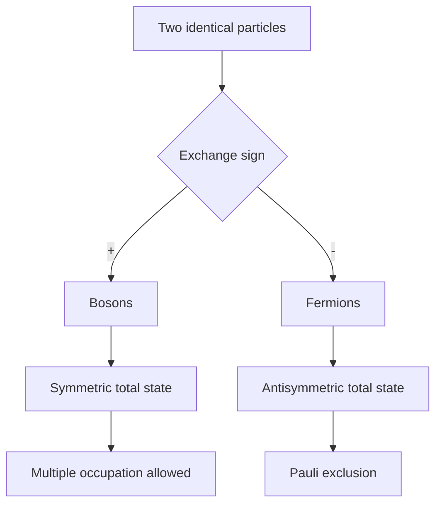

# Identical Particles and Symmetrization

Identical particles force a change in what counts as a physical state. If two electrons are exchanged, there is no new physical arrangement with labels swapped. Quantum mechanics implements that indistinguishability by restricting multiparticle states to symmetric or antisymmetric sectors.

Sakurai places identical particles after scattering, using permutation symmetry, the symmetrization postulate, and second-quantized notation. Ballentine gives a careful account of permutation symmetry and indistinguishability, then connects it to many-fermion systems. The Gottfried-named notes relate identical particles to symmetries and spin-statistics. Schiff's traditional examples include helium, exchange degeneracy, and atomic shell structure.

## Definitions

For two particles, the exchange operator $P_{12}$ acts as

$$
P_{12}|\alpha\rangle_1|\beta\rangle_2=|\beta\rangle_1|\alpha\rangle_2.
$$

For identical particles, physical states must be eigenstates of exchange:

$$
P_{12}|\Psi\rangle=\pm|\Psi\rangle.
$$

The plus sign describes bosons; the minus sign describes fermions.

For two distinct one-particle states $\vert \alpha\rangle$ and $\vert \beta\rangle$, the normalized symmetric state is

$$
|\Psi_B\rangle={1\over\sqrt2}
\left(|\alpha\rangle_1|\beta\rangle_2+|\beta\rangle_1|\alpha\rangle_2\right),
$$

and the normalized antisymmetric state is

$$
|\Psi_F\rangle={1\over\sqrt2}
\left(|\alpha\rangle_1|\beta\rangle_2-|\beta\rangle_1|\alpha\rangle_2\right).
$$

For $N$ fermions, the antisymmetric wave function can be written as a Slater determinant:

$$
\Psi(x_1,\ldots,x_N)={1\over\sqrt{N!}}
\det[\phi_i(x_j)].
$$

Here $x$ includes all one-particle labels needed for the state, often position and spin.

The occupation-number notation writes a many-particle state as

$$
|n_1,n_2,\ldots\rangle,
$$

where bosons allow $n_i=0,1,2,\ldots$ and fermions allow only $n_i=0$ or $1$.

## Key results

The **Pauli exclusion principle** follows immediately from antisymmetry. If two fermions occupy the same one-particle state, the antisymmetrized state is

$$
{1\over\sqrt2}\left(|\alpha\rangle_1|\alpha\rangle_2-|\alpha\rangle_1|\alpha\rangle_2\right)=0.
$$

So the state does not exist.

For two identical spin-1/2 fermions, the total state must be antisymmetric under exchange. If the spin part is symmetric, the spatial part must be antisymmetric. If the spin part is antisymmetric, the spatial part must be symmetric.

The two-spin triplet is symmetric:

$$
|1,1\rangle=|\uparrow\uparrow\rangle,
$$

$$
|1,0\rangle={1\over\sqrt2}(|\uparrow\downarrow\rangle+|\downarrow\uparrow\rangle),
$$

$$
|1,-1\rangle=|\downarrow\downarrow\rangle.
$$

The singlet is antisymmetric:

$$
|0,0\rangle={1\over\sqrt2}(|\uparrow\downarrow\rangle-|\downarrow\uparrow\rangle).
$$

Exchange symmetry also changes scattering. For identical spinless bosons, amplitudes for indistinguishable alternatives add symmetrically. For identical spinless fermions, they add antisymmetrically. This is not a small correction; it changes angular distributions.

Sakurai and Ballentine both stress that symmetrization is a postulate of nonrelativistic quantum mechanics. The deep spin-statistics theorem belongs to relativistic quantum field theory, but ordinary quantum mechanics imports the result: integer-spin particles are bosons and half-integer-spin particles are fermions.

## Visual



| Particle type | Exchange behavior | Occupation | Typical examples |
|---|---|---|---|
| Boson | symmetric | $n=0,1,2,\ldots$ | photons, phonons, helium-4 atoms |
| Fermion | antisymmetric | $n=0$ or $1$ | electrons, protons, neutrons |
| Distinguishable model | no required symmetry | labels matter | different species or tracked particles |

## Worked example 1: Normalizing a two-boson state

**Problem.** Let $\vert \alpha\rangle$ and $\vert \beta\rangle$ be orthonormal one-particle states. Normalize the symmetric two-particle state.

**Method.**

1. Start with

$$
|\Phi\rangle=|\alpha\rangle_1|\beta\rangle_2+|\beta\rangle_1|\alpha\rangle_2.
$$

2. Compute the norm:

$$
\langle \Phi|\Phi\rangle
=\langle\alpha\beta|\alpha\beta\rangle
+\langle\alpha\beta|\beta\alpha\rangle
+\langle\beta\alpha|\alpha\beta\rangle
+\langle\beta\alpha|\beta\alpha\rangle.
$$

3. Because the one-particle states are orthonormal,

$$
\langle\alpha|\beta\rangle=0.
$$

4. Therefore the cross terms vanish and the two diagonal terms equal one:

$$
\langle \Phi|\Phi\rangle=2.
$$

5. The normalized state is

$$
|\Psi_B\rangle={1\over\sqrt2}
\left(|\alpha\rangle_1|\beta\rangle_2+|\beta\rangle_1|\alpha\rangle_2\right).
$$

**Checked answer.** The normalization factor changes if $\alpha=\beta$; then the correctly normalized two-boson state is simply $\vert \alpha\rangle_1\vert \alpha\rangle_2$ in first-quantized notation.

## Worked example 2: Spin symmetry for two electrons in the same orbital

**Problem.** Two electrons occupy the same spatial orbital $\varphi(\mathbf r)$. Which spin state is allowed?

**Method.**

1. The spatial part is

$$
\Phi(\mathbf r_1,\mathbf r_2)=\varphi(\mathbf r_1)\varphi(\mathbf r_2).
$$

2. Exchange particles:

$$
\Phi(\mathbf r_2,\mathbf r_1)=\varphi(\mathbf r_2)\varphi(\mathbf r_1)=\Phi(\mathbf r_1,\mathbf r_2).
$$

So the spatial part is symmetric.

3. Electrons are fermions, so the total state must be antisymmetric.

4. Therefore the spin part must be antisymmetric.

5. The antisymmetric two-spin state is the singlet:

$$
|0,0\rangle={1\over\sqrt2}
\left(|\uparrow\downarrow\rangle-|\downarrow\uparrow\rangle\right).
$$

**Checked answer.** Two electrons in the same orbital must have opposite spin combined into the singlet state. This is the shell-structure version of the Pauli principle.

## Code

```python
import numpy as np

alpha_beta = np.array([1, 0, 0, 0], dtype=complex)  # |alpha>|beta>
beta_alpha = np.array([0, 0, 1, 0], dtype=complex)  # |beta>|alpha>

boson = (alpha_beta + beta_alpha) / np.sqrt(2)
fermion = (alpha_beta - beta_alpha) / np.sqrt(2)

swap = np.array([[0, 0, 1, 0],
                 [0, 1, 0, 0],
                 [1, 0, 0, 0],
                 [0, 0, 0, 1]], dtype=complex)

print(np.allclose(swap @ boson, boson))
print(np.allclose(swap @ fermion, -fermion))
```

## Common pitfalls

- Symmetrizing only the spin part. The total state, including spatial and spin coordinates, must have the required exchange symmetry.
- Treating particle labels as observables for identical particles. Labels in first-quantized notation are bookkeeping devices.
- Forgetting the special normalization when two bosons occupy the same one-particle state.
- Saying Pauli exclusion means "opposite spins repel." It is a statement about antisymmetric state space, not a new force.
- Applying boson or fermion exchange rules to distinguishable particles of different species.
- Confusing exchange symmetry with ordinary spatial parity. They are different operations.
- Assuming the spin-statistics connection is proved inside elementary nonrelativistic quantum mechanics. In this setting it is imposed as a postulate informed by relativistic theory and experiment.

The phrase "particle 1" and "particle 2" in first-quantized notation should be read as coordinate slots, not observable name tags. For identical particles, swapping the slots cannot produce a new measurable arrangement. The only physically allowed sectors are the symmetric and antisymmetric ones. This is why an unsymmetrized product such as $\phi_a(x_1)\phi_b(x_2)$ is not a valid final description for two identical particles unless it is combined with its exchanged partner.

Spin and spatial symmetry must be considered together. Two electrons in the same spatial orbital require a symmetric spatial state, so their spin state must be antisymmetric. Two electrons in different orbitals can form either symmetric or antisymmetric spatial combinations, paired with the opposite spin symmetry. This is the basis for singlet-triplet splittings and exchange effects. Calling the effect a force is misleading; it is a restriction on the allowed state space that changes energy expectations when interactions are present.

Second quantization streamlines the same physics. Instead of explicitly symmetrizing or antisymmetrizing wave functions, creation operators build states with the right exchange algebra automatically. Bosonic creation operators commute, fermionic creation operators anticommute, and the Pauli principle appears as $(c_i^\dagger)^2=0$ for fermions. Sakurai's later identical-particle discussion points in this direction because many-particle calculations quickly become unwieldy in fully written first-quantized notation.

Exchange symmetry also changes counting. A state with one boson in mode $a$ and one in mode $b$ is one physical occupation state, not two states depending on which particle is "in" which mode. For fermions, each spin-orbital can be occupied at most once, producing shell structure and the periodic table. For bosons, multiple occupation allows Bose-Einstein condensation and coherent fields. The same symmetrization postulate therefore explains both exclusion and collective enhancement.

When writing two-particle wave functions, check exchange by performing the swap explicitly. Replace $(x_1,s_1)$ with $(x_2,s_2)$ everywhere, including spin labels, not just spatial coordinates. The sign of the total state under this operation is what matters. A spatially antisymmetric function multiplied by a spin singlet is symmetric overall, not antisymmetric, because both factors change sign. Tracking both factors prevents many helium and two-electron mistakes.

Occupation-number notation helps with this bookkeeping, but it can hide the wave-function structure. A fermion state $c_a^\dagger c_b^\dagger\vert 0\rangle$ already contains antisymmetry, including the sign change under operator exchange. If you translate it back into first-quantized notation, the Slater determinant reappears. Moving between the two languages is a useful check that the physical state has not changed.

In applications, always specify what one-particle state means. It may include spatial orbital, spin projection, band index, or another internal label. Pauli exclusion forbids two fermions from occupying the same complete one-particle state, not merely the same spatial region. This precision is essential for atomic shells and solid-state bands.

## Connections

- [Addition of angular momentum](/physics/quantum-mechanics/addition-of-angular-momentum)
- [Density operator, entanglement, and decoherence](/physics/quantum-mechanics/density-operator-entanglement-decoherence)
- [Scattering theory](/physics/quantum-mechanics/scattering-theory)
- [Central potentials and the hydrogen atom](/physics/quantum-mechanics/central-potentials-hydrogen-atom)
- [Measurement and interpretation](/physics/quantum-mechanics/measurement-interpretation)
