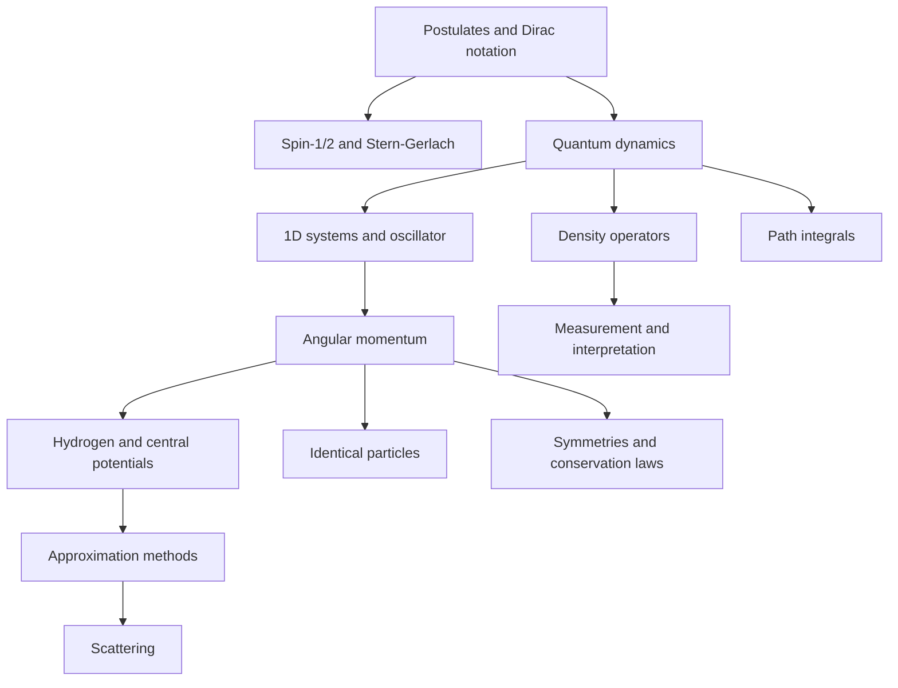

# Quantum Mechanics

Quantum mechanics is the framework for physical systems whose states are probability amplitudes rather than points in phase space. It replaces the classical idea of a fully specified trajectory with Hilbert-space states, operators for observables, unitary time evolution, and measurement probabilities computed from inner products or density operators.

This section synthesizes four requested sources into one wiki sequence. Sakurai's *Modern Quantum Mechanics* supplies the primary structure: Stern-Gerlach motivation, Dirac notation, dynamics, angular momentum, symmetries, approximation methods, scattering, and identical particles. Ballentine supplies mathematical care, ensemble interpretation, density-operator emphasis, and scattering depth. The file named for Gottfried in the local source set extracts as graduate lecture notes that cite Gottfried/Yan and is used where it cleanly reinforces postulates, spin, dynamics, angular momentum, symmetries, and perturbation theory. Schiff is included as the classic wave-mechanics contrast where the topic naturally matches the older coordinate-representation style; this local copy is scanned/image-only through `pdftotext`, so no precise extracted page quotations are used from it.


*Figure: Hydrogen-atom probability-density plots for several energy levels. Image: [Wikimedia Commons](https://commons.wikimedia.org/wiki/File:Hydrogen_Density_Plots.png), PoorLeno, public domain.*

## Definitions

A **state** is represented by a ray in Hilbert space for a pure preparation, or by a density operator for a general preparation. A **ket** $\vert \psi\rangle$ is the abstract state vector; a **wave function** $\psi(x)=\langle x\vert \psi\rangle$ is one representation of that vector. A **bra** $\langle\psi\vert $ is the corresponding dual object.

An **observable** is represented by a self-adjoint operator. If

$$
A|a_n\rangle=a_n|a_n\rangle,
$$

then the possible ideal measurement results are the eigenvalues $a_n$, and the Born probability for a nondegenerate discrete result is

$$
P(a_n|\psi)=|\langle a_n|\psi\rangle|^2.
$$

The **Hamiltonian** $H$ is the generator of time translations. For a closed system,

$$
i\hbar {d\over dt}|\psi(t)\rangle=H|\psi(t)\rangle.
$$

Equivalently,

$$
|\psi(t)\rangle=U(t,t_0)|\psi(t_0)\rangle,
\qquad
U^\dagger U=I.
$$

A **symmetry** is a transformation preserving physical transition probabilities. Continuous unitary symmetries have Hermitian generators, so translations, rotations, and time evolution are tied to momentum, angular momentum, and energy.

The section is organized as a graduate-level path through nonrelativistic quantum mechanics. It starts with the formal postulates and two-state systems, moves through wave mechanics and solvable models, builds the angular-momentum machinery needed for atoms, then develops approximation, scattering, many-particle, density-matrix, path-integral, and interpretation topics.

## Key results

The central computational rules are:

$$
\langle A\rangle=\langle\psi|A|\psi\rangle
$$

for a pure state, and

$$
\langle A\rangle=\mathrm{Tr}(\rho A)
$$

for a density operator. Compatibility is expressed by commutation:

$$
[A,B]=0
$$

under the usual spectral assumptions. Incompatibility gives uncertainty bounds such as

$$
\Delta X\Delta P\geq {\hbar\over2}.
$$

The core exact models are:

$$
E_n^{\mathrm{box}}={n^2\pi^2\hbar^2\over2mL^2},
$$

$$
E_n^{\mathrm{osc}}=\hbar\omega\left(n+{1\over2}\right),
$$

and

$$
E_n^{\mathrm{H}}=-{13.6\,\mathrm{eV}\over n^2}
$$

for the ideal hydrogen spectrum. The core angular momentum relations are

$$
[J_i,J_j]=i\hbar\epsilon_{ijk}J_k,
$$

and

$$
J^2|j,m\rangle=\hbar^2j(j+1)|j,m\rangle,\qquad
J_z|j,m\rangle=\hbar m|j,m\rangle.
$$

The approximation toolkit includes:

$$
E_n^{(1)}=\langle n^{(0)}|V|n^{(0)}\rangle,
$$

$$
\Gamma={2\pi\over\hbar}|V_{fi}|^2\rho(E_f),
$$

and the variational bound

$$
{\langle\alpha|H|\alpha\rangle\over\langle\alpha|\alpha\rangle}\geq E_0.
$$

The scattering pages use

$$
{d\sigma\over d\Omega}=|f(\theta,\phi)|^2,
$$

while the path-integral page uses

$$
K(b,a)=\int\mathcal D[x(t)]e^{iS[x]/\hbar}.
$$

The chapter list is:

1. [Postulates of quantum mechanics](/physics/quantum-mechanics/postulates-of-quantum-mechanics)
2. [Dirac notation and Hilbert spaces](/physics/quantum-mechanics/dirac-notation-hilbert-spaces)
3. [Spin-1/2 systems](/physics/quantum-mechanics/spin-one-half-systems)
4. [Quantum dynamics and pictures](/physics/quantum-mechanics/quantum-dynamics-pictures)
5. [One-dimensional Schrodinger systems](/physics/quantum-mechanics/one-dimensional-schrodinger-systems)
6. [Harmonic oscillator with ladder operators](/physics/quantum-mechanics/harmonic-oscillator-ladder-operators)
7. [Angular momentum algebra](/physics/quantum-mechanics/angular-momentum-algebra)
8. [Addition of angular momentum](/physics/quantum-mechanics/addition-of-angular-momentum)
9. [Central potentials and the hydrogen atom](/physics/quantum-mechanics/central-potentials-hydrogen-atom)
10. [Identical particles and symmetrization](/physics/quantum-mechanics/identical-particles-symmetrization)
11. [Time-independent perturbation theory](/physics/quantum-mechanics/time-independent-perturbation-theory)
12. [Time-dependent perturbation theory](/physics/quantum-mechanics/time-dependent-perturbation-theory)
13. [Variational principle and WKB](/physics/quantum-mechanics/variational-principle-wkb)
14. [Scattering theory](/physics/quantum-mechanics/scattering-theory)
15. [Density operator, entanglement, and decoherence](/physics/quantum-mechanics/density-operator-entanglement-decoherence)
16. [Symmetries and conservation laws](/physics/quantum-mechanics/symmetries-conservation-laws)
17. [Path integral formulation](/physics/quantum-mechanics/path-integral-formulation)
18. [Measurement and interpretation](/physics/quantum-mechanics/measurement-interpretation)

## Visual



| Source | Role in this wiki | Distinct emphasis |
|---|---|---|
| Sakurai | primary sequence and notation | Dirac notation, spin-first motivation, symmetry and angular momentum |
| Ballentine | rigorous cross-check | ensembles, probability, density operators, scattering, interpretation care |
| Gottfried-named local notes | supporting structure where extracted | postulates, spin, dynamics, angular momentum, symmetries, perturbation theory |
| Schiff | classic contrast | wave mechanics, coordinate-space solutions, older spectroscopic notation |

## Worked example 1: Choosing the right page for a Stern-Gerlach question

**Problem.** A beam prepared as $\vert +z\rangle$ passes through an $S_x$ analyzer. The $+x$ output is kept and then measured again along $z$. Which pages contain the needed tools, and what is the result?

**Method.**

1. The state and measurement rules come from [postulates](/physics/quantum-mechanics/postulates-of-quantum-mechanics).

2. The basis conversion comes from [Dirac notation](/physics/quantum-mechanics/dirac-notation-hilbert-spaces) and [spin-1/2 systems](/physics/quantum-mechanics/spin-one-half-systems).

3. Write

$$
|+z\rangle={1\over\sqrt2}|+x\rangle+{1\over\sqrt2}|-x\rangle.
$$

4. The probability to pass the $+x$ analyzer is

$$
P(+x|+z)={1\over2}.
$$

5. Conditional on that selection, the state is $\vert +x\rangle$.

6. Convert back:

$$
|+x\rangle={1\over\sqrt2}|+z\rangle+{1\over\sqrt2}|-z\rangle.
$$

7. Therefore the final $z$ probabilities are

$$
P(+z)=P(-z)={1\over2}.
$$

**Checked answer.** The intermediate incompatible measurement changes the state description; the result is not guaranteed to remain $+z$.

## Worked example 2: Choosing an approximation method

**Problem.** You need the ground-state energy of a particle in a potential that is close to a harmonic oscillator but includes a small term $\lambda x^4$. Which page should you use first, and what is the first-order correction?

**Method.**

1. The exact unperturbed system is the oscillator, so begin with [harmonic oscillator with ladder operators](/physics/quantum-mechanics/harmonic-oscillator-ladder-operators).

2. The correction is small and time independent, so use [time-independent perturbation theory](/physics/quantum-mechanics/time-independent-perturbation-theory).

3. First-order perturbation theory says

$$
E_0^{(1)}=\lambda\langle0|X^4|0\rangle.
$$

4. For the oscillator ground state,

$$
\langle0|X^2|0\rangle={\hbar\over2m\omega}.
$$

5. The Gaussian fourth moment is

$$
\langle0|X^4|0\rangle=3\left({\hbar\over2m\omega}\right)^2.
$$

6. Therefore

$$
E_0^{(1)}={3\lambda\hbar^2\over4m^2\omega^2}.
$$

7. If $\lambda$ is not small or no exactly solvable $H_0$ is available, compare with [variational principle and WKB](/physics/quantum-mechanics/variational-principle-wkb).

**Checked answer.** The positive quartic term raises the ground energy, as expected for a stiffer confining potential.

## Code

```python
pages = [
    "postulates-of-quantum-mechanics",
    "dirac-notation-hilbert-spaces",
    "spin-one-half-systems",
    "quantum-dynamics-pictures",
    "one-dimensional-schrodinger-systems",
    "harmonic-oscillator-ladder-operators",
    "angular-momentum-algebra",
    "addition-of-angular-momentum",
    "central-potentials-hydrogen-atom",
    "identical-particles-symmetrization",
    "time-independent-perturbation-theory",
    "time-dependent-perturbation-theory",
    "variational-principle-wkb",
    "scattering-theory",
    "density-operator-entanglement-decoherence",
    "symmetries-conservation-laws",
    "path-integral-formulation",
    "measurement-interpretation",
]

for i, slug in enumerate(pages, start=1):
    print(f"{i:02d}. /physics/quantum-mechanics/{slug}")
```

## Common pitfalls

- Starting with wave functions when a two-state Dirac calculation is simpler. Sakurai's sequence is designed to prevent that habit.
- Treating the four books as four separate courses. The wiki merges them into one concept map, using differences only where they clarify.
- Forgetting representation dependence. $\psi(x)$, a spinor column, and momentum amplitudes may describe the same abstract ket in different bases.
- Using perturbation theory when the real issue is degeneracy. Degenerate perturbation theory requires diagonalizing the perturbation inside the degenerate subspace first.
- Treating interpretation language as if it changed standard probabilities. Copenhagen, ensemble, and many-worlds readings disagree conceptually but not on the Born-rule calculations in these pages.
- Ignoring source limitations. The local Schiff PDF is not text-searchable through the available extraction tool, so this wiki avoids fabricated Schiff page-specific claims.
- Reading formulas without conditions. Every formula here has a domain: closed systems for unitary evolution, weak coupling for perturbation theory, slow variation for WKB, central potentials for partial waves, and so on.

Use the sequence as a dependency graph, not as a pile of isolated notes. The postulates define the rules, Dirac notation gives the language, spin makes the rules concrete, and dynamics shows how amplitudes evolve. The one-dimensional systems and oscillator provide exactly solved laboratories. Angular momentum then supplies the representation theory needed for atoms, spin coupling, symmetry, and partial waves. Approximation methods and scattering are where the machinery becomes broadly useful.

The source differences are pedagogically useful. Sakurai is concise and modern, but sometimes assumes comfort with formal manipulations. Ballentine is more explicit about probability, domains, ensembles, and interpretation. The Gottfried-named lecture notes are useful as a bridge between postulate lists and worked graduate-course calculations. Schiff's older coordinate style remains valuable because many students still first meet quantum mechanics through differential equations. Reading across these styles helps prevent over-identifying quantum mechanics with any single notation.

When adding future pages, keep the same pattern: physical motivation first, then formal definitions, key formulas with conditions, at least two worked examples, one visual anchor, code for computational checking, pitfalls, and absolute wiki links. This makes the section usable as both a reading path and a reference. It also keeps the notes honest: a formula without a condition, an example without a check, or an interpretation without a calculation is incomplete.

## Connections

- [Postulates of quantum mechanics](/physics/quantum-mechanics/postulates-of-quantum-mechanics)
- [Dirac notation and Hilbert spaces](/physics/quantum-mechanics/dirac-notation-hilbert-spaces)
- [Quantum dynamics and pictures](/physics/quantum-mechanics/quantum-dynamics-pictures)
- [Angular momentum algebra](/physics/quantum-mechanics/angular-momentum-algebra)
- [Measurement and interpretation](/physics/quantum-mechanics/measurement-interpretation)
