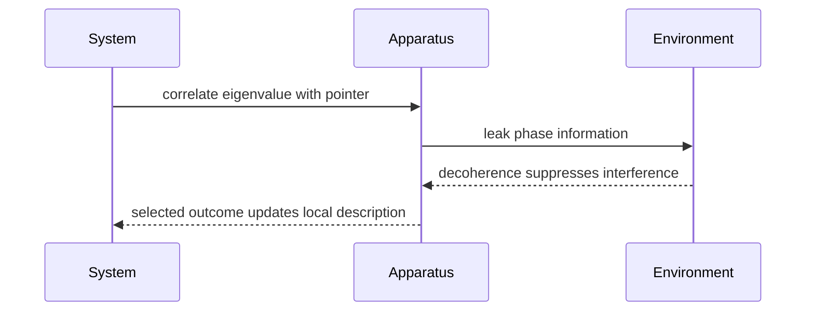

# Measurement and Interpretation

Measurement is where the formal rules meet the question of what quantum states mean. The operational calculations are clear: use projectors or more general measurement operators to compute probabilities and update descriptions. The interpretation of that update is the disputed part.

Sakurai discusses measurements from the start through Stern-Gerlach experiments and later through spin correlations and Bell inequalities. Ballentine is the major contrast source here: he strongly emphasizes an ensemble interpretation and resists reading the state vector as the complete physical condition of one individual system. The Gottfried-named notes include postulates, spin measurement, density matrices, and interpretation remarks. Schiff's older treatment is closer to traditional Copenhagen language.


*Figure: The Stern-Gerlach experiment is the physical scene behind spin quantization and quantum measurement. Image: [Wikimedia Commons](https://commons.wikimedia.org/wiki/File:Stern-Gerlach_experiment.svg), Tatoute, CC BY-SA 4.0.*

## Definitions

For a projective measurement of an observable

$$
A=\sum_a aP_a,
$$

the probability of outcome $a$ is

$$
P(a)=\langle\psi|P_a|\psi\rangle.
$$

After obtaining $a$, the ideal projected state is

$$
|\psi_a\rangle={P_a|\psi\rangle\over \sqrt{\langle\psi|P_a|\psi\rangle}}.
$$

For a density operator,

$$
P(a)=\mathrm{Tr}(\rho P_a),
$$

and

$$
\rho\mapsto {P_a\rho P_a\over \mathrm{Tr}(\rho P_a)}
$$

conditioned on outcome $a$.

A more general measurement is described by measurement operators $M_k$ satisfying

$$
\sum_k M_k^\dagger M_k=I.
$$

Outcome probabilities are

$$
P(k)=\mathrm{Tr}(M_k\rho M_k^\dagger),
$$

and conditional states are

$$
\rho_k={M_k\rho M_k^\dagger\over P(k)}.
$$

A **pointer basis** is the set of apparatus states that become robustly correlated with outcomes after environmental decoherence.

## Key results

The projection rule is repeatable for ideal sharp measurements. If the system is projected into the eigenspace of $a$, an immediate repetition of the same measurement gives the same result with probability one:

$$
P_aP_a=P_a.
$$

The distinction between a proper mixture and an improper mixture matters conceptually. A proper mixture represents classical uncertainty over preparations:

$$
\rho=\sum_i p_i|\psi_i\rangle\langle\psi_i|.
$$

An improper mixture arises as a reduced state from entanglement:

$$
\rho_A=\mathrm{Tr}_B(|\Psi\rangle\langle\Psi|).
$$

The density matrix may have the same numerical form in both cases, but the physical story differs.

Bell-type results show that quantum correlations cannot be reproduced by local hidden-variable theories satisfying the relevant assumptions. Sakurai's spin-correlation treatment uses entangled spin states to show how measurement choices at separated analyzers produce correlations stronger than classical local models allow. Ballentine accepts the quantum predictions but frames the state vector statistically rather than as a direct individual-system ontology.

Interpretation sketches:

- **Copenhagen family:** the formalism gives probabilities for measurement outcomes; collapse is often treated as an update tied to measurement context.
- **Many-worlds:** the universal state evolves unitarily; apparent outcomes correspond to decohered branches.
- **Ensemble interpretation:** the state describes an ensemble of similarly prepared systems, not necessarily a complete description of one individual system.

These interpretations agree on standard laboratory probabilities in the domain covered here. They differ on what the mathematical state is saying about reality.

## Visual



| Interpretation | State-vector meaning | Collapse/status of outcomes | Strength |
|---|---|---|---|
| Copenhagen family | context-dependent prediction tool | primitive or effective update | close to lab practice |
| Many-worlds | universal physical state | no fundamental collapse | keeps unitary dynamics universal |
| Ensemble | statistical description of preparations | update of selected ensemble | emphasizes operational probabilities |
| Decoherence program | reduced states become effectively diagonal | explains classical appearance, not selection alone | physically models apparatus/environment |

## Worked example 1: Projective measurement with density matrices

**Problem.** A spin-1/2 system has

$$
\rho={1\over2}\begin{pmatrix}1&c\\c^*&1\end{pmatrix},
$$

where $\vert c\vert \leq1$. Measure $S_z$. Find the probabilities and the unconditioned post-measurement state.

**Method.**

1. The projectors are

$$
P_+=\begin{pmatrix}1&0\\0&0\end{pmatrix},
\qquad
P_-=\begin{pmatrix}0&0\\0&1\end{pmatrix}.
$$

2. Compute probabilities:

$$
P(+)=\mathrm{Tr}(\rho P_+)={1\over2},
\qquad
P(-)=\mathrm{Tr}(\rho P_-)={1\over2}.
$$

3. If the outcome is not recorded or is ignored, the nonselective measurement map is

$$
\rho\mapsto P_+\rho P_+ + P_-\rho P_-.
$$

4. Calculate:

$$
P_+\rho P_+={1\over2}\begin{pmatrix}1&0\\0&0\end{pmatrix},
$$

and

$$
P_-\rho P_-={1\over2}\begin{pmatrix}0&0\\0&1\end{pmatrix}.
$$

5. Add:

$$
\rho'={1\over2}\begin{pmatrix}1&0\\0&1\end{pmatrix}.
$$

**Checked answer.** The $S_z$ measurement removes coherence between $\vert +z\rangle$ and $\vert -z\rangle$ in the nonselective description, while leaving the $S_z$ probabilities unchanged.

## Worked example 2: Bell singlet correlation

**Problem.** For the singlet state

$$
|\Psi^-\rangle={1\over\sqrt2}(|+z\rangle|-z\rangle-|-z\rangle|+z\rangle),
$$

the spin correlation along unit vectors $\mathbf a$ and $\mathbf b$ is

$$
E(\mathbf a,\mathbf b)=\langle(\boldsymbol{\sigma}\cdot\mathbf a)\otimes(\boldsymbol{\sigma}\cdot\mathbf b)\rangle.
$$

State the result and check two limits.

**Method.**

1. The singlet is rotationally invariant and has total spin zero.

2. The standard Pauli-matrix result is

$$
E(\mathbf a,\mathbf b)=-\mathbf a\cdot\mathbf b.
$$

3. If $\mathbf a=\mathbf b$, then

$$
E=-1.
$$

This means perfect anticorrelation for measurements along the same axis.

4. If $\mathbf a\perp\mathbf b$, then

$$
E=0.
$$

There is no average correlation for perpendicular axes.

5. If the angle is $\theta$,

$$
E=-\cos\theta.
$$

**Checked answer.** The result matches the same-axis singlet property and gives the cosine dependence used in Bell-inequality tests.

## Code

```python
import numpy as np

rho = 0.5 * np.array([[1, 0.6], [0.6, 1]], dtype=complex)
p_plus = np.array([[1, 0], [0, 0]], dtype=complex)
p_minus = np.array([[0, 0], [0, 1]], dtype=complex)

rho_after = p_plus @ rho @ p_plus + p_minus @ rho @ p_minus
print("probabilities:", np.trace(rho @ p_plus).real, np.trace(rho @ p_minus).real)
print(rho_after)
```

## Common pitfalls

- Treating collapse as the only possible interpretation of the update rule. The calculation is shared; the ontology is debated.
- Ignoring unconditioned measurement. If the outcome is not selected, use the sum over outcomes, not a single projected state.
- Confusing decoherence with a literal proof that one outcome occurred. Decoherence explains suppression of interference in reduced descriptions.
- Forgetting that density matrices with the same entries can arise from different preparation stories.
- Assuming Bell correlations allow faster-than-light signaling. They do not; local outcome statistics remain marginally random.
- Treating generalized measurements as exotic. Real apparatus often implements nonideal measurements better modeled by $M_k$ than by sharp projectors.
- Mixing interpretive claims into numerical predictions without saying which is which.

A disciplined measurement analysis starts with the actual record. If a detector distinguishes two outcomes, the probabilities must be assigned to those outcomes. If several microscopic alternatives lead to the same unresolved record, add the corresponding amplitudes before squaring when coherence is preserved; add probabilities when decoherence or recorded which-path information makes the alternatives distinguishable. Many apparent paradoxes come from switching between these two rules mid-problem.

Projection is an idealization. It is appropriate for sharp, repeatable measurements of observables with well-defined eigenspaces. Real measurements may be weak, noisy, inefficient, or destructive, and generalized measurement operators model those cases more flexibly. The projective postulate remains central because it is simple, experimentally relevant in many limits, and sufficient for the core Stern-Gerlach and spectral examples used throughout this wiki.

Interpretation should not be used to patch a calculation. Copenhagen-style language, many-worlds branching, and ensemble updating all reproduce the same Born probabilities for the standard examples here. If two interpretations appear to give different numerical predictions for an ordinary spin measurement, the setup has likely been described differently. First settle the Hilbert space, Hamiltonian, measurement operators, and conditioning. Then discuss what the state update means.

Decoherence explains why macroscopic measurement records are stable in practice. When apparatus pointer states become entangled with many environmental degrees of freedom, interference between macroscopically distinct records becomes inaccessible locally. This supports the emergence of classical-looking alternatives, but by itself it does not answer every interpretive question about why a particular outcome is experienced. That is why measurement remains both a technical topic and a conceptual one.

For practical calculations, write the measurement as a map before interpreting it. A selective projective measurement uses $P_a\rho P_a/\mathrm{Tr}(\rho P_a)$. A nonselective projective measurement uses $\sum_a P_a\rho P_a$. A generalized measurement uses $M_k\rho M_k^\dagger$ with $\sum_kM_k^\dagger M_k=I$. These maps answer different laboratory questions. Once the map is clear, interpretation can be discussed without changing the arithmetic.

Bell experiments are a useful guardrail against overly classical pictures. The singlet correlations are not explained by assigning preexisting spin values along all axes while preserving locality in the Bell sense. At the same time, the correlations cannot be used for controllable faster-than-light communication because each local marginal distribution is random. Both statements are part of the standard quantum prediction.

The best habit is to label interpretive sentences separately from predictive equations. The equations say what probabilities a preparation and measurement imply. The interpretation says what those equations mean. Keeping the layers separate makes disagreements clearer and prevents philosophical language from hiding a missing projector, trace, or normalization.

## Connections

- [Postulates of quantum mechanics](/physics/quantum-mechanics/postulates-of-quantum-mechanics)
- [Density operator, entanglement, and decoherence](/physics/quantum-mechanics/density-operator-entanglement-decoherence)
- [Spin-1/2 systems](/physics/quantum-mechanics/spin-one-half-systems)
- [Symmetries and conservation laws](/physics/quantum-mechanics/symmetries-conservation-laws)
- [Identical particles and symmetrization](/physics/quantum-mechanics/identical-particles-symmetrization)
