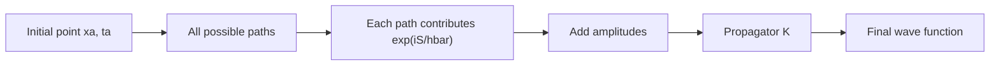

# Path Integral Formulation

The path integral reformulates quantum mechanics as a sum over histories. Instead of solving a differential equation for a wave function or evolving a ket with an operator, one computes an amplitude by adding phase contributions from all paths connecting an initial point to a final point.

Sakurai sketches propagators, composition, and Feynman's formulation after Schrodinger dynamics and WKB. Ballentine introduces path integrals in coordinate-representation applications. The Gottfried-named notes discuss propagators and Feynman's formulation in the dynamics chapter. Schiff's classic book predates the modern path-integral-first style, so its closest connection is through propagators and semiclassical wave mechanics.


*Figure: The double-slit experiment is the canonical setting where path difference becomes an observable fringe pattern. Image: [Wikimedia Commons](https://commons.wikimedia.org/wiki/File:Double-slit.svg), NekoJaNekoJa and Johannes Kalliauer, CC BY-SA 4.0.*

## Definitions

The propagator is the position-space transition amplitude

$$
K(x_b,t_b;x_a,t_a)=\langle x_b|U(t_b,t_a)|x_a\rangle.
$$

It evolves wave functions by

$$
\psi(x_b,t_b)=\int K(x_b,t_b;x_a,t_a)\psi(x_a,t_a)\,dx_a.
$$

The propagator composition law is

$$
K(x_b,t_b;x_a,t_a)=\int dx_c\,
K(x_b,t_b;x_c,t_c)K(x_c,t_c;x_a,t_a)
$$

for $t_a\lt t_c\lt t_b$.

For a Lagrangian

$$
L(x,\dot x,t)=T-V,
$$

the action is

$$
S[x(t)]=\int_{t_a}^{t_b}L(x,\dot x,t)\,dt.
$$

Feynman's formal expression is

$$
K(x_b,t_b;x_a,t_a)=\int \mathcal D[x(t)]\,e^{iS[x(t)]/\hbar}.
$$

The integral is over all paths satisfying the endpoint conditions

$$
x(t_a)=x_a,\qquad x(t_b)=x_b.
$$

## Key results

The path integral is built by slicing time into many small intervals. For one short step,

$$
K(x_{j+1},t+\epsilon;x_j,t)
\approx
\left({m\over 2\pi i\hbar\epsilon}\right)^{1/2}
\exp\left[{i\epsilon\over\hbar}
\left({m\over2}\left({x_{j+1}-x_j\over\epsilon}\right)^2
-V(x_j)\right)\right].
$$

Multiplying short-time kernels and integrating over intermediate positions gives the formal measure $\mathcal D[x(t)]$.

For a free particle in one dimension, the exact propagator is

$$
K_0(x_b,t;x_a,0)
=\sqrt{m\over 2\pi i\hbar t}
\exp\left[{im(x_b-x_a)^2\over 2\hbar t}\right].
$$

The exponent is the classical free-particle action divided by $\hbar$:

$$
S_{\mathrm{cl}}={m(x_b-x_a)^2\over 2t}.
$$

In the semiclassical limit, rapidly oscillating phases cancel except near stationary-action paths. This recovers the classical principle

$$
\delta S=0.
$$

That is the conceptual bridge between WKB, classical mechanics, and Feynman's formulation. Sakurai emphasizes this physical meaning: classical motion emerges not because nonclassical paths are absent, but because their phases destructively interfere.

## Visual



| Formulation | Basic object | Strength | Typical calculation |
|---|---|---|---|
| Schrodinger | wave function $\psi(x,t)$ | differential equations | bound states, direct evolution |
| Heisenberg | operators $A(t)$ | symmetries and conservation | commutators, equations of motion |
| Path integral | histories with $e^{iS/\hbar}$ | semiclassical intuition, field theory | propagators, tunneling estimates |
| WKB | local action phase | approximate spectra and tunneling | slowly varying potentials |

## Worked example 1: Free-particle classical action

**Problem.** Find the classical action for a free particle moving from $x_a$ at $t=0$ to $x_b$ at time $t$.

**Method.**

1. The free Lagrangian is

$$
L={1\over2}m\dot x^2.
$$

2. The classical path has constant velocity:

$$
\dot x={x_b-x_a\over t}.
$$

3. Substitute into the Lagrangian:

$$
L_{\mathrm{cl}}={1\over2}m\left({x_b-x_a\over t}\right)^2.
$$

4. Integrate over time:

$$
S_{\mathrm{cl}}=\int_0^t L_{\mathrm{cl}}\,dt'
=t\,{1\over2}m\left({x_b-x_a\over t}\right)^2.
$$

5. Simplify:

$$
S_{\mathrm{cl}}={m(x_b-x_a)^2\over2t}.
$$

**Checked answer.** This is exactly the phase in the free-particle propagator exponent, $e^{iS_{\mathrm{cl}}/\hbar}$.

## Worked example 2: Propagator composition for a free particle

**Problem.** Explain why the free propagator composition integrates over all intermediate positions.

**Method.**

1. Insert an identity at intermediate time $t_c$:

$$
I=\int dx_c\,|x_c\rangle\langle x_c|.
$$

2. Start from

$$
K(x_b,t_b;x_a,t_a)=\langle x_b|U(t_b,t_a)|x_a\rangle.
$$

3. Use time-evolution composition:

$$
U(t_b,t_a)=U(t_b,t_c)U(t_c,t_a).
$$

4. Insert identity:

$$
\begin{aligned}
K
&=\int dx_c\,\langle x_b|U(t_b,t_c)|x_c\rangle
\langle x_c|U(t_c,t_a)|x_a\rangle\\
&=\int dx_c\,K(x_b,t_b;x_c,t_c)K(x_c,t_c;x_a,t_a).
\end{aligned}
$$

5. Repeating this insertion for many time slices gives the path-integral construction.

**Checked answer.** The sum over paths is the repeated resolution of the identity in the position basis.

## Code

```python
import numpy as np

def free_kernel(xb, xa, t, m=1.0, hbar=1.0):
    prefactor = np.sqrt(m / (2 * np.pi * 1j * hbar * t))
    phase = np.exp(1j * m * (xb - xa) ** 2 / (2 * hbar * t))
    return prefactor * phase

xa, xb, t = 0.0, 1.0, 2.0
k = free_kernel(xb, xa, t)
print(k)
print("magnitude:", abs(k))
```

## Common pitfalls

- Thinking particles literally take every path as a classical trajectory. The path integral is an amplitude rule, not a collection of observed paths.
- Forgetting that the measure $\mathcal D[x(t)]$ is formal in elementary presentations.
- Treating the classical path as the only path. It dominates only in a stationary-phase or semiclassical approximation.
- Dropping normalization factors in propagators when checking unitarity.
- Mixing real-time and imaginary-time path integrals. Wick rotation changes oscillatory phases into exponential weights.
- Applying a naive path integral in coordinates with nontrivial measure without accounting for Jacobians or operator-ordering subtleties.
- Assuming path integrals replace operator methods. They are equivalent when defined carefully and useful for different questions.

The path integral is easiest to trust when it is tied back to operator identities. The repeated insertion of position resolutions of the identity is the concrete origin of the "sum over paths." Each intermediate position is integrated over, and in the limit of many slices the sequence of positions becomes a path. This derivation keeps the formal expression from sounding mystical and shows why the propagator composition law is central.

Stationary phase is the key semiclassical idea. When the action is large compared with $\hbar$, nearby nonstationary paths have rapidly changing phases and cancel in the sum. Paths near $\delta S=0$ have phases that vary slowly, so they contribute coherently. Classical mechanics therefore emerges from interference, not from deleting nonclassical paths by hand. This connects the path-integral page directly to WKB and to the action principle in classical mechanics.

Real-time path integrals are oscillatory and mathematically delicate. Imaginary-time path integrals, obtained by a Wick rotation in suitable systems, replace $e^{iS/\hbar}$ with a decaying exponential weight resembling statistical mechanics. This is powerful for ground-state projection and quantum field theory, but it is not the same object as the real-time transition amplitude. Confusing the two can lead to wrong signs, wrong normalization, and wrong physical interpretation.

Sakurai's brief treatment is enough to understand propagators and semiclassical intuition, while Ballentine's coordinate-representation path-integral discussion makes the connection to wave mechanics. In practice, path integrals become indispensable in field theory and many-body physics because they handle symmetries, perturbation expansions, and collective variables naturally. For elementary quantum mechanics, their main value is conceptual unity: amplitudes, action, propagators, and classical limits become one story.

A useful way to read the free-particle kernel is as three factors at once. The exponential contains the classical action and therefore the phase information. The prefactor carries normalization and spreading with time. The complex phase in the prefactor is needed for exact composition and unitarity, not just for aesthetics. Dropping the prefactor may be harmless for rough stationary-phase intuition, but it is not harmless when evolving a normalized wave packet.

Potential terms enter the sliced path integral through short-time approximations, so operator-ordering subtleties can appear when the Hamiltonian is more complicated than $P^2/2m+V(X)$. This is one reason operator methods remain important. A path-integral expression should be checked against the Hamiltonian it claims to represent. In simple Cartesian problems the correspondence is direct; in curved coordinates, constrained systems, or systems with gauge fields, the measure and phase require more care.

Path integrals also clarify tunneling. In real time, tunneling is encoded in oscillatory amplitudes and analytic continuation. In imaginary time, classically forbidden motion can be described by instanton-like paths contributing exponentially small factors. This connects the WKB tunneling exponent with an action viewpoint. The elementary page does not require instanton machinery, but recognizing the connection helps explain why action integrals appear in both WKB and Feynman's formulation.

For ordinary homework problems, the path integral is often most useful as a check on propagators. Verify endpoint limits, composition, and the classical-action phase. If those three features are present, the expression is usually consistent with the operator evolution it represents.

If any one of those checks fails, return to the short-time kernel before trusting the continuum notation.

Normalization matters because amplitudes must compose consistently in time.

## Connections

- [Quantum dynamics and pictures](/physics/quantum-mechanics/quantum-dynamics-pictures)
- [One-dimensional Schrodinger systems](/physics/quantum-mechanics/one-dimensional-schrodinger-systems)
- [Variational principle and WKB](/physics/quantum-mechanics/variational-principle-wkb)
- [Scattering theory](/physics/quantum-mechanics/scattering-theory)
- [Measurement and interpretation](/physics/quantum-mechanics/measurement-interpretation)
