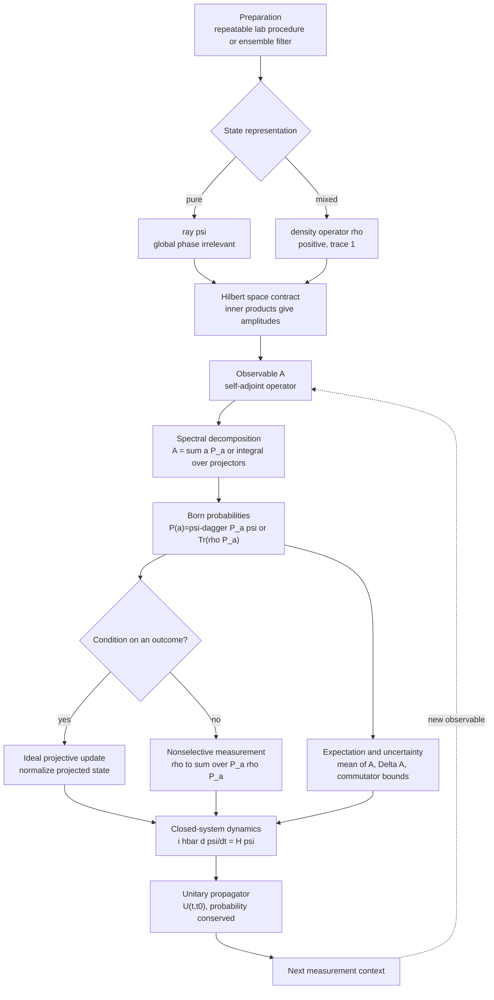

# Postulates of Quantum Mechanics

The postulates are the grammar that lets experiments, probabilities, and time evolution speak the same language. Classical mechanics begins with points in phase space and deterministic trajectories. Quantum mechanics begins with state vectors, operators, probability amplitudes, and unitary time development; deterministic prediction is assigned to the state, while individual measurement outcomes are probabilistic.

Sakurai builds this grammar from Stern-Gerlach experiments and Dirac notation, so the postulates feel operational rather than decorative. Ballentine states the same mathematics with more emphasis on ensembles and probability distributions, warning that a state vector need not be read as a literal property list for one individual system. The Gottfried-named notes use a conventional postulate-first structure. Schiff's older wave-mechanics style is best treated here as the coordinate-representation version of the same rules.

## Definitions

A **pure state** is represented by a normalized vector $\vert \psi\rangle$ in a complex Hilbert space, with physically identical rays $\vert \psi\rangle$ and $e^{i\alpha}\vert \psi\rangle$. Normalization means

$$
\langle \psi|\psi\rangle = 1.
$$

An **observable** is represented by a self-adjoint operator $A=A^\dagger$. Its possible ideal measurement values are eigenvalues $a_n$ in

$$
A|a_n\rangle = a_n|a_n\rangle.
$$

For a nondegenerate discrete spectrum, the **Born rule** gives

$$
P(a_n|\psi)=|\langle a_n|\psi\rangle|^2.
$$

For a degenerate eigenvalue, the probability is the norm of the projection onto the eigenspace:

$$
P(a|\psi)=\langle \psi|P_a|\psi\rangle.
$$

The **expectation value** is

$$
\langle A\rangle_\psi=\langle \psi|A|\psi\rangle,
$$

and the uncertainty is

$$
\Delta A=\sqrt{\langle A^2\rangle-\langle A\rangle^2}.
$$

The **time-evolution operator** $U(t,t_0)$ carries states from $t_0$ to $t$:

$$
|\psi(t)\rangle=U(t,t_0)|\psi(t_0)\rangle.
$$

For a closed system, $U$ is unitary, so $U^\dagger U=I$ and probabilities remain normalized. If $H$ is time independent,

$$
U(t,t_0)=\exp[-iH(t-t_0)/\hbar].
$$

The post-measurement update in the ideal projective model is

$$
|\psi\rangle \mapsto {P_a|\psi\rangle \over \sqrt{\langle \psi|P_a|\psi\rangle}},
$$

conditioned on obtaining the result $a$. This is a rule for idealized sharp measurement. Ballentine's ensemble reading keeps the same probability formula but treats "collapse" more cautiously, as a change in the statistical description after selection.

## Key results

The spectral decomposition of a discrete self-adjoint observable is

$$
A=\sum_n a_n |a_n\rangle\langle a_n|,
$$

with completeness

$$
\sum_n |a_n\rangle\langle a_n|=I.
$$

These two equations are the bridge from abstract kets to concrete probabilities. Expanding

$$
|\psi\rangle=\sum_n c_n|a_n\rangle,\qquad c_n=\langle a_n|\psi\rangle
$$

shows that measurement probabilities are squared expansion coefficients.

Compatible observables have simultaneous eigenstates when the relevant self-adjoint operators commute under the usual domain assumptions:

$$
[A,B]=AB-BA=0.
$$

Incompatible observables obey the Robertson uncertainty relation

$$
\Delta A\,\Delta B\geq {1\over 2}|\langle [A,B]\rangle|.
$$

For position and momentum, $[X,P]=i\hbar I$, so

$$
\Delta X\,\Delta P\geq {\hbar\over 2}.
$$

The proof is a Cauchy-Schwarz argument. Let

$$
|\alpha\rangle=(A-\langle A\rangle)|\psi\rangle,\qquad
|\beta\rangle=(B-\langle B\rangle)|\psi\rangle.
$$

Then $\vert \langle \alpha\vert \beta\rangle\vert ^2\leq \langle \alpha\vert \alpha\rangle\langle \beta\vert \beta\rangle=(\Delta A)^2(\Delta B)^2$. Taking the imaginary part of $\langle \alpha\vert \beta\rangle$ yields the commutator lower bound. Sakurai uses this result early to show that incompatibility is not an experimental imperfection; Ballentine stresses that the inequality is a statement about distributions prepared by the same procedure.

For closed systems, unitarity is equivalent to conservation of total probability:

$$
\langle \psi(t)|\psi(t)\rangle
=\langle \psi(t_0)|U^\dagger U|\psi(t_0)\rangle
=1.
$$

Differentiating $U$ gives the Schrodinger equation

$$
i\hbar {d\over dt}|\psi(t)\rangle=H|\psi(t)\rangle.
$$

Thus the postulates are not independent slogans. Hilbert space gives superposition, self-adjoint operators give possible values, the Born rule gives probabilities, projection gives ideal state update, and unitary time evolution tells how amplitudes change between measurements.

## Visual



This postulates diagram spells out every operational block: preparation, state representation, observable, spectral projectors, Born probabilities, state update, and unitary dynamics. Pure and mixed states share the same measurement architecture once probabilities are written with projectors or traces. The feedback arrow shows sequential measurement structure, where the output state of one measurement becomes the input state for the next observable.

| Postulate | Mathematical form | Sakurai emphasis | Ballentine emphasis |
|---|---|---|---|
| State | ray $\vert \psi\rangle$ | operational preparation via spin analyzers | ensemble or statistical preparation |
| Observable | self-adjoint $A$ | eigenkets and matrix representations | probability distributions of values |
| Measurement | $P(a)=\langle\psi\vert P_a\vert \psi\rangle$ | sequential measurement changes state | selection changes ensemble description |
| Dynamics | $i\hbar d\vert \psi\rangle/dt=H\vert \psi\rangle$ | unitary operator first | transformation and symmetry structure |

## Worked example 1: Spin-z measurement from a tilted state

**Problem.** A spin-1/2 particle is prepared in

$$
|\psi\rangle=\cos{\theta\over 2}|+z\rangle+e^{i\phi}\sin{\theta\over 2}|-z\rangle.
$$

Find the probabilities for measuring $S_z=+\hbar/2$ and $S_z=-\hbar/2$, then compute $\langle S_z\rangle$.

**Method.**

1. Identify the measurement eigenbasis: $\{\vert +z\rangle,\vert -z\rangle\}$.
2. Read off amplitudes:

$$
c_+=\langle +z|\psi\rangle=\cos{\theta\over 2},\qquad
c_-=\langle -z|\psi\rangle=e^{i\phi}\sin{\theta\over 2}.
$$

3. Square magnitudes:

$$
P(+)=|c_+|^2=\cos^2{\theta\over 2},
\qquad
P(-)=|c_-|^2=\sin^2{\theta\over 2}.
$$

4. Check normalization:

$$
P(+)+P(-)=\cos^2{\theta\over 2}+\sin^2{\theta\over 2}=1.
$$

5. Compute the expectation:

$$
\begin{aligned}
\langle S_z\rangle
&={\hbar\over 2}P(+)-{\hbar\over 2}P(-)\\
&={\hbar\over 2}\left(\cos^2{\theta\over 2}-\sin^2{\theta\over 2}\right)\\
&={\hbar\over 2}\cos\theta.
\end{aligned}
$$

**Checked answer.** The phase $\phi$ does not affect an $S_z$ measurement, and the limiting cases work: $\theta=0$ gives $P(+)=1$, while $\theta=\pi$ gives $P(-)=1$.

## Worked example 2: Compatibility and a repeated measurement

**Problem.** A system is prepared in

$$
|\psi\rangle={1\over \sqrt{3}}|a_1\rangle+\sqrt{2\over 3}|a_2\rangle,
$$

where $A\vert a_i\rangle=a_i\vert a_i\rangle$ and $a_1\neq a_2$. An ideal measurement of $A$ gives $a_2$. Immediately measuring $A$ again, what is the probability of again obtaining $a_2$? What is the post-measurement state?

**Method.**

1. The probability of the first result $a_2$ is

$$
P(a_2)=\left|\sqrt{2\over 3}\right|^2={2\over 3}.
$$

2. Conditional on obtaining $a_2$, the projection operator is

$$
P_{a_2}=|a_2\rangle\langle a_2|.
$$

3. Apply and renormalize:

$$
P_{a_2}|\psi\rangle
=|a_2\rangle\langle a_2|\psi\rangle
=\sqrt{2\over 3}|a_2\rangle.
$$

4. The norm of this vector is $\sqrt{2/3}$, so the normalized state is

$$
|\psi_{\mathrm{after}}\rangle=|a_2\rangle.
$$

5. The repeated measurement probability is therefore

$$
P_{\mathrm{repeat}}(a_2)=|\langle a_2|a_2\rangle|^2=1.
$$

**Checked answer.** The certainty of the repeated result is a feature of ideal projective measurement, not of arbitrary real measuring devices. Ballentine would describe the selected subensemble as now represented by $\vert a_2\rangle$.

## Code

```python
import numpy as np

hbar = 1.0
theta = np.pi / 3
phi = np.pi / 5

psi = np.array([np.cos(theta / 2), np.exp(1j * phi) * np.sin(theta / 2)])
sz = 0.5 * hbar * np.array([[1, 0], [0, -1]], dtype=complex)

prob_plus = abs(psi[0]) ** 2
prob_minus = abs(psi[1]) ** 2
expectation = np.vdot(psi, sz @ psi).real

print(prob_plus, prob_minus, prob_plus + prob_minus)
print(expectation)
```

## Common pitfalls

- Treating a global phase $e^{i\alpha}$ as observable. It changes the vector but not the physical ray.
- Squaring an amplitude without taking its complex modulus. The probability is $\vert c\vert ^2$, not $c^2$.
- Forgetting degeneracy. Projection is onto an eigenspace, not always onto a single vector.
- Confusing expectation value with a guaranteed measurement result. A spin expectation can be zero even though no measurement yields zero for $S_z$.
- Assuming all measurement is projective. The postulates here describe the ideal sharp-measurement model; generalized measurement is a later refinement.
- Reading uncertainty as apparatus error. In the standard formalism, $\Delta A$ is the spread of outcomes for repeated preparations.
- Ignoring normalization after projection. A projected vector usually needs to be divided by the square root of its probability.
- Mixing interpretations with formulas. Copenhagen, ensemble, and many-worlds accounts disagree about the story told around the rule, but the computed probabilities here are the same.

When using the postulates in a calculation, separate three layers that are easy to blur. The first layer is preparation: what procedure produces the state or density operator? The second layer is representation: which basis makes the calculation short? The third layer is interpretation: what story, if any, is being attached to the state update? A Stern-Gerlach preparation, for example, may be written as a spinor, a ket, or a density matrix, but those are descriptions of the same preparation. The probability calculation should not change just because the notation changes.

A good diagnostic for measurement problems is to ask whether the outcome is selected or ignored. If the outcome is selected, use a conditional projected state. If the apparatus interacts with the system but the record is discarded, sum over all possible outcomes in the density-matrix description. These two procedures produce different final states. This distinction becomes important in decoherence, spin echo, and any problem where a later interference experiment asks whether phase information survived.

Another frequent source of mistakes is the phrase "the system is in an eigenstate after measurement." That statement is incomplete when the measured eigenvalue is degenerate. The ideal measurement places the state in the eigenspace associated with the result; it does not necessarily choose a unique vector inside that eigenspace. Additional compatible observables are needed to refine the state further. This is why complete sets of commuting observables matter in atomic and angular-momentum problems.

The four-source synthesis is useful here because the books put pressure on different assumptions. Sakurai makes the postulates feel like rules inferred from sequential analyzer experiments. Ballentine insists that probability language be taken seriously and not replaced by vague individual-particle imagery. The Gottfried-style postulate list is efficient for reference. Schiff's wave-mechanics approach reminds you that the same postulates must reproduce familiar differential-equation boundary-value problems.

## Connections

- [Dirac notation and Hilbert spaces](/physics/quantum-mechanics/dirac-notation-hilbert-spaces)
- [Spin-1/2 systems](/physics/quantum-mechanics/spin-one-half-systems)
- [Quantum dynamics and pictures](/physics/quantum-mechanics/quantum-dynamics-pictures)
- [Density operator, entanglement, and decoherence](/physics/quantum-mechanics/density-operator-entanglement-decoherence)
- [Measurement and interpretation](/physics/quantum-mechanics/measurement-interpretation)
