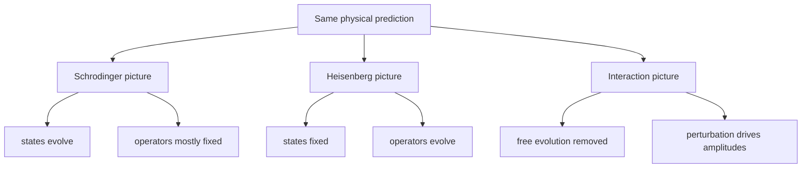

# Quantum Dynamics and Pictures

Quantum dynamics describes how probability amplitudes change between preparations and measurements. The same physics can be represented in several pictures: in the Schrodinger picture states move, in the Heisenberg picture operators move, and in the interaction picture both share the work in a way designed for perturbation theory.

Sakurai develops the time-evolution operator first, then compares pictures and applies the result to spin precession, Ehrenfest's theorem, and transition amplitudes. Ballentine puts dynamics inside a broader symmetry and transformation framework. The Gottfried-named notes emphasize propagators and density operators soon after the picture change. Schiff's wave-mechanics tradition corresponds most directly to Schrodinger's differential equation in coordinate representation.


*Figure: The Bloch sphere turns a two-component complex state into a geometric object that can be rotated and measured. Image: [Wikimedia Commons](https://commons.wikimedia.org/wiki/File:Bloch_sphere.svg), Smite-Meister, CC BY-SA 3.0.*

## Definitions

The **time-evolution operator** satisfies

$$
|\psi(t)\rangle=U(t,t_0)|\psi(t_0)\rangle.
$$

For a closed system,

$$
U^\dagger(t,t_0)U(t,t_0)=I.
$$

If the Hamiltonian is time independent,

$$
U(t,t_0)=e^{-iH(t-t_0)/\hbar}.
$$

If $H(t)$ depends on time and does not commute with itself at different times, the formal solution uses time ordering:

$$
U(t,t_0)=\mathcal T\exp\left[-{i\over\hbar}\int_{t_0}^{t}H(t')\,dt'\right].
$$

In the **Schrodinger picture**, states carry time dependence:

$$
i\hbar {d\over dt}|\psi_S(t)\rangle=H_S|\psi_S(t)\rangle,
$$

while operators are fixed unless they have explicit time dependence.

In the **Heisenberg picture**,

$$
|\psi_H\rangle=|\psi_S(t_0)\rangle,
\qquad
A_H(t)=U^\dagger(t,t_0)A_S U(t,t_0).
$$

In the **interaction picture**, split $H=H_0+V(t)$ and define

$$
|\psi_I(t)\rangle=e^{iH_0(t-t_0)/\hbar}|\psi_S(t)\rangle,
$$

with

$$
V_I(t)=e^{iH_0(t-t_0)/\hbar}V(t)e^{-iH_0(t-t_0)/\hbar}.
$$

## Key results

The Heisenberg equation of motion is

$$
{dA_H\over dt}={i\over\hbar}[H_H,A_H]+\left({\partial A_S\over\partial t}\right)_H.
$$

If $A$ has no explicit time dependence and $[A,H]=0$, then $A$ is conserved. This is the operator version of conservation laws, and it prepares the later symmetry page.

Expectation values are picture independent:

$$
\langle \psi_S(t)|A_S|\psi_S(t)\rangle
=\langle \psi_H|A_H(t)|\psi_H\rangle.
$$

Ehrenfest's theorem follows by applying the Heisenberg equation to $X$ and $P$ for

$$
H={P^2\over 2m}+V(X).
$$

The result is

$$
{d\over dt}\langle X\rangle={\langle P\rangle\over m},
\qquad
{d\over dt}\langle P\rangle=-\left\langle {dV\over dX}\right\rangle.
$$

This resembles Newton's law, but it is not identical unless the wave packet is narrow enough or the force is linear.

The interaction-picture state obeys

$$
i\hbar {d\over dt}|\psi_I(t)\rangle=V_I(t)|\psi_I(t)\rangle.
$$

Iterating this integral equation gives the Dyson series:

$$
\begin{aligned}
|\psi_I(t)\rangle
&=|\psi_I(t_0)\rangle
-{i\over\hbar}\int_{t_0}^{t}dt_1\,V_I(t_1)|\psi_I(t_0)\rangle\\
&\quad+\left(-{i\over\hbar}\right)^2
\int_{t_0}^{t}dt_1\int_{t_0}^{t_1}dt_2\,V_I(t_1)V_I(t_2)|\psi_I(t_0)\rangle+\cdots.
\end{aligned}
$$

Sakurai uses this machinery for time-dependent perturbation theory. Ballentine's transformation-centered viewpoint makes clear that changing pictures is not changing the experiment; it is changing where time dependence is stored.

## Visual



| Picture | State | Operator | Best use |
|---|---|---|---|
| Schrodinger | $\vert \psi_S(t)\rangle$ | $A_S$ | wave functions, spectra, direct time evolution |
| Heisenberg | fixed $\vert \psi_H\rangle$ | $A_H(t)$ | conservation laws, commutators, field theory style |
| Interaction | $\vert \psi_I(t)\rangle$ from $V_I$ | $A_I(t)$ from $H_0$ | perturbation theory and transitions |

## Worked example 1: Free particle Ehrenfest theorem

**Problem.** For

$$
H={P^2\over 2m},
$$

show that the Heisenberg operator $X_H(t)$ moves linearly in time.

**Method.**

1. Use the Heisenberg equation:

$$
{dX_H\over dt}={i\over\hbar}[H,X_H].
$$

2. Compute the commutator using $[X,P]=i\hbar$ or $[P,X]=-i\hbar$:

$$
[P^2,X]=P[P,X]+[P,X]P=-2i\hbar P.
$$

3. Therefore

$$
[H,X]={1\over 2m}[P^2,X]=-{i\hbar\over m}P.
$$

4. Substitute:

$$
{dX_H\over dt}={i\over\hbar}\left(-{i\hbar\over m}P_H\right)={P_H\over m}.
$$

5. Since

$$
{dP_H\over dt}={i\over\hbar}[H,P_H]=0,
$$

integrate:

$$
X_H(t)=X_H(0)+{P_H(0)\over m}t.
$$

**Checked answer.** Taking expectation values gives $\langle X\rangle(t)=\langle X\rangle(0)+\langle P\rangle t/m$, the quantum analogue of uniform classical motion.

## Worked example 2: Two-level evolution under a diagonal Hamiltonian

**Problem.** Let

$$
H={\hbar\Omega\over 2}\sigma_z,
\qquad
|\psi(0)\rangle={1\over \sqrt2}(|+z\rangle+|-z\rangle).
$$

Find $\vert \psi(t)\rangle$ and $\langle S_x\rangle(t)$.

**Method.**

1. The time-evolution operator is

$$
U(t)=\begin{pmatrix}e^{-i\Omega t/2}&0\\0&e^{i\Omega t/2}\end{pmatrix}.
$$

2. Apply it to the initial state:

$$
|\psi(t)\rangle={1\over \sqrt2}\left(e^{-i\Omega t/2}|+z\rangle+e^{i\Omega t/2}|-z\rangle\right).
$$

3. Use

$$
S_x={\hbar\over 2}\begin{pmatrix}0&1\\1&0\end{pmatrix}.
$$

4. Compute the expectation:

$$
\begin{aligned}
\langle S_x\rangle
&={\hbar\over 2}\left({1\over 2}e^{i\Omega t}+{1\over 2}e^{-i\Omega t}\right)\\
&={\hbar\over 2}\cos(\Omega t).
\end{aligned}
$$

**Checked answer.** The $z$ probabilities remain $1/2$ and $1/2$, while the relative phase produces oscillation in the $x$ expectation value.

## Code

```python
import numpy as np

hbar = 1.0
omega = 2.0
sx = np.array([[0, 1], [1, 0]], dtype=complex) * hbar / 2
psi0 = np.array([1, 1], dtype=complex) / np.sqrt(2)

for t in np.linspace(0, np.pi / omega, 5):
    u = np.diag([np.exp(-1j * omega * t / 2), np.exp(1j * omega * t / 2)])
    psi = u @ psi0
    print(round(t, 3), np.vdot(psi, sx @ psi).real)
```

## Common pitfalls

- Thinking the three pictures are different theories. They are equivalent representations of the same amplitudes.
- Applying $e^{-iHt/\hbar}$ when $H(t_1)$ and $H(t_2)$ do not commute. Time ordering is then required.
- Dropping explicit time dependence in the Heisenberg equation. The partial derivative term matters for driven observables.
- Assuming Ehrenfest's theorem always reproduces one exact classical trajectory. It does so only in special limits.
- Forgetting that interaction-picture operators evolve with $H_0$, not the full Hamiltonian.
- Confusing conservation of an operator with conservation of a particular measurement outcome. Conservation means the distribution is stationary for that observable under the stated Hamiltonian.
- Losing unitarity in numerical time stepping. If a simulation changes the norm of a closed-system state, the integrator or approximation needs checking.

The most practical way to choose a picture is to identify what is simple. If the state has a simple initial expansion and the Hamiltonian is diagonal, the Schrodinger picture is usually direct. If the question asks how observables move or whether a quantity is conserved, the Heisenberg picture exposes the commutator structure. If the Hamiltonian splits into a solvable large part plus a weak time-dependent part, the interaction picture removes the trivial phases and leaves only transition-producing terms.

Picture independence is a useful error check. If a probability or expectation value is physical, it cannot depend on where the time dependence was placed. For example, a spin precession result computed by evolving the spinor must agree with the result computed by rotating the spin operator. If the answers differ, common causes include using $U$ instead of $U^\dagger$ in the Heisenberg operator, losing a sign in the exponent, or forgetting that bras evolve with the adjoint.

Time-dependent Hamiltonians require more care than the compact notation suggests. The expression $e^{-i\int Hdt/\hbar}$ is valid only when Hamiltonians at different times commute or when time ordering is included. This issue is not pedantic: driven two-level systems, magnetic resonance, and perturbation theory all involve operators whose values at different times may fail to commute. Sakurai's development of the time-evolution operator makes this point structurally clear.

Numerical dynamics should respect the same structure. Exact closed-system evolution is unitary, so a finite-step approximation that steadily changes the norm is not just imprecise; it is violating a core physical constraint. For small matrices, exponentiating a Hermitian Hamiltonian gives a unitary step. For differential wave equations, stable unitary or norm-preserving schemes are preferred when long-time phase accuracy matters.

A final check is to distinguish time dependence of phases from time dependence of probabilities. Energy eigenstates acquire phases, but their energy measurement probabilities do not change under a time-independent Hamiltonian. Superpositions acquire relative phases, and those relative phases can change probabilities for other observables. Many spin-precession and two-level interference effects are nothing more than this relative-phase evolution made visible.

When a problem includes measurement at an intermediate time, split the calculation into unitary pieces separated by state-update rules. Do not evolve through a measurement as if it were just another Hamiltonian interval unless the measurement interaction is explicitly modeled.

## Connections

- [Postulates of quantum mechanics](/physics/quantum-mechanics/postulates-of-quantum-mechanics)
- [Spin-1/2 systems](/physics/quantum-mechanics/spin-one-half-systems)
- [Symmetries and conservation laws](/physics/quantum-mechanics/symmetries-conservation-laws)
- [Time-dependent perturbation theory](/physics/quantum-mechanics/time-dependent-perturbation-theory)
- [Path integral formulation](/physics/quantum-mechanics/path-integral-formulation)
