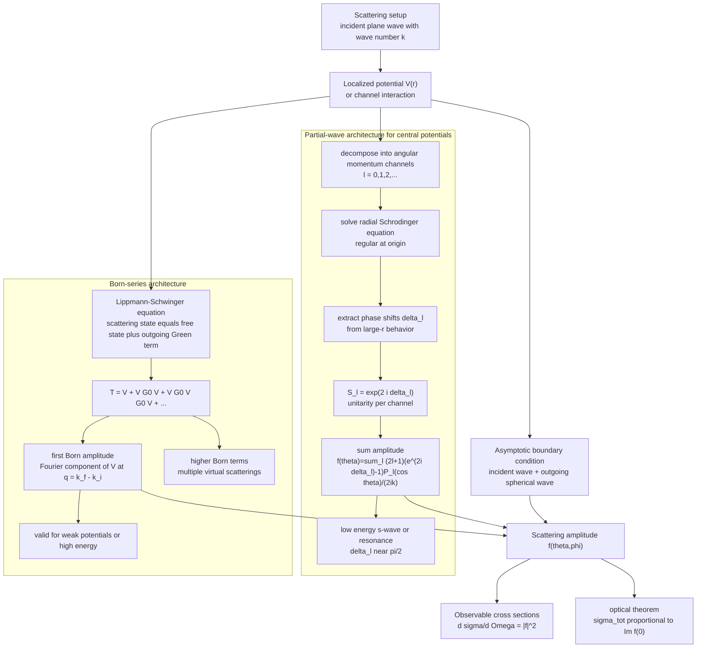

# Scattering Theory

Scattering turns quantum mechanics into an experimental engine. Instead of preparing bound states and measuring their spectra, one sends particles toward a target and reads interaction information from angular distributions, cross sections, phase shifts, and resonances.

Sakurai treats scattering through time-dependent perturbation ideas, amplitudes, Born approximation, partial waves, and symmetry. Ballentine has a broad scattering chapter with cross sections, spherical potentials, scattering operators, resonances, and identical-particle effects. The Gottfried-named notes touch scattering through diffraction and perturbation methods. Schiff's classic account is a standard source for partial waves and potential scattering notation.


*Figure: The double-slit experiment is the canonical setting where path difference becomes an observable fringe pattern. Image: [Wikimedia Commons](https://commons.wikimedia.org/wiki/File:Double-slit.svg), NekoJaNekoJa and Johannes Kalliauer, CC BY-SA 4.0.*

## Definitions

For elastic scattering from a localized potential, the asymptotic stationary wave function has the form

$$
\psi(\mathbf r)\sim e^{ikz}+f(\theta,\phi){e^{ikr}\over r}.
$$

The first term is the incident plane wave and the second is the outgoing spherical wave. The **scattering amplitude** is $f(\theta,\phi)$.

The differential cross section is

$$
{d\sigma\over d\Omega}=|f(\theta,\phi)|^2.
$$

The total cross section is

$$
\sigma_{\mathrm{tot}}=\int |f(\theta,\phi)|^2\,d\Omega.
$$

For a central potential, the amplitude depends only on $\theta$ and can be expanded in partial waves:

$$
f(\theta)={1\over k}\sum_{\ell=0}^{\infty}(2\ell+1)e^{i\delta_\ell}\sin\delta_\ell\,P_\ell(\cos\theta).
$$

The real quantities $\delta_\ell$ are **phase shifts**. They encode how the potential changes each angular-momentum channel.

## Key results

The optical theorem relates forward scattering to the total cross section:

$$
\sigma_{\mathrm{tot}}={4\pi\over k}\mathrm{Im}\,f(0).
$$

It is a consequence of probability conservation and unitarity of the scattering matrix.

The first Born approximation is valid for weak potentials or high energies where the incident wave is only slightly distorted. With common plane-wave normalization conventions, the amplitude is proportional to the Fourier transform of the potential:

$$
f_B(\mathbf q)=-{m\over 2\pi\hbar^2}\int e^{-i\mathbf q\cdot\mathbf r}V(\mathbf r)\,d^3r,
$$

where

$$
\mathbf q=\mathbf k_f-\mathbf k_i.
$$

Different normalization conventions move factors of $2\pi$ around, so the structural statement is more important than the prefactor: Born scattering measures Fourier components of the potential.

For a central potential, low-energy scattering is often dominated by the $\ell=0$ partial wave. The s-wave scattering amplitude can be described by a scattering length $a_s$:

$$
f(k)\approx -a_s
$$

at very low $k$, giving

$$
\sigma\approx 4\pi a_s^2
$$

for distinguishable spinless particles under the simplest assumptions.

Resonances occur when a phase shift passes rapidly through $\pi/2$. They signal long-lived intermediate states or quasi-bound behavior. Ballentine's scattering chapter treats this connection explicitly, while Sakurai emphasizes how amplitudes and symmetries organize the calculation.

## Visual



The scattering diagram shows the common I/O contract first: an incident wave and localized potential determine an outgoing amplitude and observable cross section. The partial-wave subgraph exposes the channel-by-channel route through radial equations, phase shifts, unitarity, and resonances; the Born subgraph exposes the Lippmann-Schwinger series and first-Born Fourier-transform approximation. The optical-theorem node links the forward amplitude back to total probability conservation.

| Method | Best regime | Main output | Failure mode |
|---|---|---|---|
| Born approximation | weak potential, high energy | Fourier transform of $V$ | strong distortion ignored |
| Partial waves | central potentials | phase shifts $\delta_\ell$ | many waves needed at high energy |
| Low-energy scattering length | $ka_s$ small | universal s-wave cross section | misses effective range/resonances |
| S-matrix | general scattering | unitarity and channels | abstract unless tied to observables |

## Worked example 1: Born amplitude for a Gaussian potential

**Problem.** For

$$
V(r)=V_0e^{-r^2/a^2},
$$

find the Born amplitude up to the standard prefactor.

**Method.**

1. The Born amplitude is proportional to

$$
I(\mathbf q)=\int e^{-i\mathbf q\cdot\mathbf r}V_0e^{-r^2/a^2}\,d^3r.
$$

2. The three-dimensional Gaussian transform factors into three one-dimensional transforms:

$$
I(\mathbf q)=V_0
\prod_{i=x,y,z}\int_{-\infty}^{\infty}e^{-iq_i x_i}e^{-x_i^2/a^2}\,dx_i.
$$

3. Use

$$
\int_{-\infty}^{\infty}e^{-iqx}e^{-x^2/a^2}dx
=a\sqrt{\pi}e^{-a^2q^2/4}
$$

for each component.

4. Therefore

$$
I(\mathbf q)=V_0\pi^{3/2}a^3e^{-a^2q^2/4}.
$$

5. With the convention stated above,

$$
f_B(q)=-{mV_0\pi^{3/2}a^3\over 2\pi\hbar^2}
e^{-a^2q^2/4}.
$$

**Checked answer.** The amplitude is largest at small momentum transfer and decays rapidly for large scattering angles.

## Worked example 2: Total cross section from s-wave scattering

**Problem.** Suppose low-energy scattering is dominated by a real scattering length $a_s$. Find the total cross section for distinguishable spinless particles.

**Method.**

1. At low energy,

$$
f(\theta)\approx -a_s.
$$

2. The differential cross section is

$$
{d\sigma\over d\Omega}=|f|^2=a_s^2.
$$

3. Integrate over solid angle:

$$
\sigma_{\mathrm{tot}}=\int a_s^2\,d\Omega.
$$

4. Since

$$
\int d\Omega=4\pi,
$$

we get

$$
\sigma_{\mathrm{tot}}=4\pi a_s^2.
$$

**Checked answer.** The result is independent of angle and energy at this leading level, as expected for s-wave dominance.

## Code

```python
import numpy as np

def gaussian_born_shape(q, a=1.0):
    return np.exp(-(a * q) ** 2 / 4)

angles = np.linspace(0, np.pi, 7)
k = 2.0
q = 2 * k * np.sin(angles / 2)

for theta, value in zip(angles, gaussian_born_shape(q)):
    print(round(theta, 3), round(value, 5))
```

## Common pitfalls

- Confusing amplitude with probability. Cross sections involve $\vert f\vert ^2$ and flux normalization.
- Forgetting that Born-approximation prefactors depend on normalization convention.
- Applying Born approximation to strong low-energy potentials where phase shifts are large.
- Summing partial waves without checking convergence.
- Ignoring identical-particle symmetrization in scattering amplitudes.
- Treating the optical theorem as optional. A proposed amplitude that violates it cannot come from unitary scattering.
- Using total cross section when the experiment measures angular distribution, or vice versa.

Scattering notation is compact because it hides preparation and detection details. The incident beam defines a flux, the target defines an interaction region, and the detector samples outgoing particles per solid angle. Cross section has dimensions of area because it converts incident flux into event rate. If a calculation gives a dimensionless total cross section or an angular distribution with the wrong units, the normalization has been mishandled.

The Born approximation is best understood as a Fourier probe. Large scattering angles correspond to large momentum transfer, so they test short-distance structure of the potential. Smooth broad potentials have Fourier transforms concentrated near small $q$, while sharp potentials scatter more strongly into large angles. This interpretation is why diffraction, form factors, and scattering from composite objects share the same mathematical skeleton. Ballentine's diffraction-scattering sections reinforce this link between quantum amplitudes and spatial structure.

Partial waves are the opposite organization: instead of momentum transfer, they sort scattering by angular momentum. At low energy, only small $\ell$ waves reach the interaction region effectively; higher partial waves are suppressed by centrifugal barriers. At higher energy, many partial waves contribute and the sum approaches more classical angular behavior. Resonances appear as rapid phase-shift changes because the wave spends extra time in the interaction region.

Identical particles require amplitude-level symmetrization. If two final alternatives differ only by exchange of identical particles, they are not distinct outcomes. For bosons, the exchanged amplitude adds; for fermions, it subtracts, with spin state affecting the spatial symmetry. This is why scattering theory cannot be fully separated from the identical-particle page. Cross sections encode both interaction dynamics and the quantum statistics of the particles being scattered.

The S-matrix viewpoint packages scattering as a map from incoming asymptotic states to outgoing asymptotic states. Bound-state calculations focus on normalizable eigenstates, while scattering calculations use states that look free far before and far after the collision. The interaction is inferred from how phases and amplitudes differ from free propagation. This is why unitarity is so central: total probability distributed among all open channels must be conserved.

Coulomb scattering is a special warning case. The formulas for short-range potentials assume an asymptotic form with a plane wave plus an outgoing spherical wave. The Coulomb potential falls off slowly, so its long-range phase modifies the usual assumptions. Rutherford scattering is recovered, but the derivation needs care. If a potential is not short-ranged, do not apply short-range scattering formulas without checking their conditions.

Experimentally, cross sections are often averaged over spin states, detector acceptance, energy spread, and target structure. A clean formula such as $d\sigma/d\Omega=\vert f\vert ^2$ is the core theoretical object, but comparing to data may require summing or averaging over unresolved quantum numbers. This is another place where density matrices and identical-particle symmetries enter practical scattering.

For consistency checks, examine the forward direction, low-energy limit, and unitarity. The forward amplitude is constrained by the optical theorem, low-energy behavior should match the expected dominant partial wave, and probabilities across all open channels must not exceed the incoming flux. These checks are often more revealing than algebraic simplification.

They also connect formal amplitudes directly to measurable rates.

That link is essential.

## Connections

- [Time-dependent perturbation theory](/physics/quantum-mechanics/time-dependent-perturbation-theory)
- [Angular momentum algebra](/physics/quantum-mechanics/angular-momentum-algebra)
- [Identical particles and symmetrization](/physics/quantum-mechanics/identical-particles-symmetrization)
- [Variational principle and WKB](/physics/quantum-mechanics/variational-principle-wkb)
- [Symmetries and conservation laws](/physics/quantum-mechanics/symmetries-conservation-laws)
