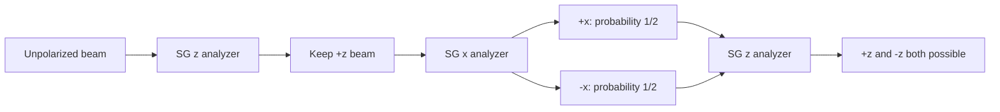

# Spin-1/2 Systems

Spin-1/2 is the smallest nontrivial quantum laboratory. Its Hilbert space is two-dimensional, but it already contains incompatible observables, sequential measurement effects, unitary rotations, density matrices, entanglement, and the difference between amplitudes and probabilities. This is why Sakurai starts with Stern-Gerlach analyzers instead of beginning with differential equations.

Sakurai's treatment is operational and experimental: beams split, recombine, and reveal the logic of spin states. Ballentine returns to spin for measurement and state preparation, emphasizing what is inferred from repeated preparations. The Gottfried-named notes use spin-1/2 as a clean illustration of the postulates and density matrices. Schiff's older notation usually reaches spin after wave mechanics, so the contrast is mainly pedagogical.


*Figure: Bloch-sphere representation of a two-level quantum state. Image: [Wikimedia Commons](https://commons.wikimedia.org/wiki/File:Bloch_sphere.svg), Smite-Meister, CC BY-SA 3.0.*

## Definitions

The standard $S_z$ basis is

$$
|+z\rangle=\begin{pmatrix}1\\0\end{pmatrix},
\qquad
|-z\rangle=\begin{pmatrix}0\\1\end{pmatrix}.
$$

The Pauli matrices are

$$
\sigma_x=\begin{pmatrix}0&1\\1&0\end{pmatrix},\quad
\sigma_y=\begin{pmatrix}0&-i\\i&0\end{pmatrix},\quad
\sigma_z=\begin{pmatrix}1&0\\0&-1\end{pmatrix}.
$$

Spin operators are

$$
S_i={\hbar\over 2}\sigma_i,\qquad i=x,y,z.
$$

They satisfy

$$
[S_i,S_j]=i\hbar\epsilon_{ijk}S_k,
$$

and

$$
S^2=S_x^2+S_y^2+S_z^2={3\hbar^2\over 4}I.
$$

A general normalized spinor can be written, up to global phase, as

$$
|\mathbf n,+\rangle
=\cos{\theta\over 2}|+z\rangle
 +e^{i\phi}\sin{\theta\over 2}|-z\rangle,
$$

where $\mathbf n$ is a unit vector on the Bloch sphere:

$$
\mathbf n=(\sin\theta\cos\phi,\sin\theta\sin\phi,\cos\theta).
$$

The observable for spin along $\mathbf n$ is

$$
S_{\mathbf n}={\hbar\over 2}\mathbf n\cdot\boldsymbol{\sigma}.
$$

## Key results

The Pauli matrices obey

$$
\sigma_i\sigma_j=\delta_{ij}I+i\epsilon_{ijk}\sigma_k.
$$

This identity makes two-level calculations compact. For any unit vector $\mathbf n$,

$$
(\mathbf n\cdot\boldsymbol{\sigma})^2=I,
$$

so $S_{\mathbf n}$ has eigenvalues $\pm\hbar/2$.

The projectors onto spin up and down along $\mathbf n$ are

$$
P_{\mathbf n,\pm}={1\over 2}(I\pm \mathbf n\cdot\boldsymbol{\sigma}).
$$

If a state has Bloch vector $\mathbf r$, with density matrix

$$
\rho={1\over 2}(I+\mathbf r\cdot\boldsymbol{\sigma}),
$$

then

$$
P(+\mathbf n)=\mathrm{Tr}(\rho P_{\mathbf n,+})={1+\mathbf r\cdot \mathbf n\over 2}.
$$

For a pure state, $\vert \mathbf r\vert =1$. For a mixed state, $0\leq \vert \mathbf r\vert \lt 1$. The completely unpolarized beam has $\rho=I/2$ and gives $P(+\mathbf n)=1/2$ for every analyzer direction.

Rotations are represented by

$$
U(R_{\mathbf n}(\theta))=\exp\left(-{i\theta\over 2}\mathbf n\cdot\boldsymbol{\sigma}\right)
=I\cos{\theta\over 2}-i(\mathbf n\cdot\boldsymbol{\sigma})\sin{\theta\over 2}.
$$

The half-angle is essential. A $2\pi$ rotation changes a spinor sign, although all single-state probabilities remain unchanged. Sakurai uses this feature to emphasize that spin is not a tiny classical spinning ball.

In a magnetic field with Hamiltonian

$$
H=-\boldsymbol{\mu}\cdot\mathbf B=-\gamma\mathbf S\cdot\mathbf B,
$$

the Bloch vector precesses about $\mathbf B$ at the Larmor frequency $\omega=\vert \gamma\vert B$ up to sign convention. This connects the algebra of Pauli matrices to magnetic resonance and two-level dynamics.

## Visual



| Direction | Spin-up ket in $S_z$ basis | Spin-down ket in $S_z$ basis |
|---|---|---|
| $z$ | $\begin{pmatrix}1\\0\end{pmatrix}$ | $\begin{pmatrix}0\\1\end{pmatrix}$ |
| $x$ | ${1\over\sqrt2}\begin{pmatrix}1\\1\end{pmatrix}$ | ${1\over\sqrt2}\begin{pmatrix}1\\-1\end{pmatrix}$ |
| $y$ | ${1\over\sqrt2}\begin{pmatrix}1\\i\end{pmatrix}$ | ${1\over\sqrt2}\begin{pmatrix}1\\-i\end{pmatrix}$ |

## Worked example 1: Sequential Stern-Gerlach analyzers

**Problem.** A beam is prepared in $\vert +z\rangle$. It passes through an $S_x$ analyzer, and only the $+x$ output is kept. That beam then passes through an $S_z$ analyzer. What are the final $S_z$ probabilities?

**Method.**

1. Express $\vert +z\rangle$ in the $x$ basis:

$$
|+z\rangle={1\over \sqrt2}|+x\rangle+{1\over \sqrt2}|-x\rangle.
$$

2. The probability to pass the $+x$ selection is

$$
P(+x|+z)=|\langle +x|+z\rangle|^2={1\over 2}.
$$

3. Conditional on being selected, the state is now $\vert +x\rangle$.

4. Expand $\vert +x\rangle$ in the $z$ basis:

$$
|+x\rangle={1\over \sqrt2}|+z\rangle+{1\over \sqrt2}|-z\rangle.
$$

5. Therefore

$$
P(+z|+x)=P(-z|+x)={1\over 2}.
$$

**Checked answer.** The final $S_z$ result is not certainly $+\hbar/2$. The intermediate incompatible $S_x$ selection changed the state. This is the central lesson of Sakurai's sequential Stern-Gerlach discussion.

## Worked example 2: Spin precession in a z-directed magnetic field

**Problem.** A spin starts in $\vert +x\rangle$ and evolves under

$$
H={\hbar\omega\over 2}\sigma_z.
$$

Find the probability of measuring $+x$ at time $t$.

**Method.**

1. Write the initial state:

$$
|+x\rangle={1\over \sqrt2}\begin{pmatrix}1\\1\end{pmatrix}.
$$

2. The evolution operator is

$$
U(t)=e^{-iHt/\hbar}
=\begin{pmatrix}e^{-i\omega t/2}&0\\0&e^{i\omega t/2}\end{pmatrix}.
$$

3. Evolve the state:

$$
|\psi(t)\rangle={1\over \sqrt2}\begin{pmatrix}e^{-i\omega t/2}\\e^{i\omega t/2}\end{pmatrix}.
$$

4. Project onto $\vert +x\rangle$:

$$
\begin{aligned}
\langle +x|\psi(t)\rangle
&={1\over 2}\left(e^{-i\omega t/2}+e^{i\omega t/2}\right)\\
&=\cos{\omega t\over 2}.
\end{aligned}
$$

5. Square the modulus:

$$
P(+x,t)=\cos^2{\omega t\over 2}.
$$

**Checked answer.** At $t=0$, the probability is $1$. At $\omega t=\pi$, the spin has rotated to $\vert -x\rangle$ and the probability is $0$.

## Code

```python
import numpy as np

sx = np.array([[0, 1], [1, 0]], dtype=complex)
sz = np.array([[1, 0], [0, -1]], dtype=complex)
plus_x = np.array([1, 1], dtype=complex) / np.sqrt(2)

omega = 1.0
for t in [0, np.pi / 2, np.pi]:
    u = np.diag([np.exp(-1j * omega * t / 2), np.exp(1j * omega * t / 2)])
    psi_t = u @ plus_x
    prob_plus_x = abs(np.vdot(plus_x, psi_t)) ** 2
    print(t, prob_plus_x, np.vdot(psi_t, sx @ psi_t).real, np.vdot(psi_t, sz @ psi_t).real)
```

## Common pitfalls

- Calling spin-up along one axis the same state as spin-up along another axis. $\vert +z\rangle$ and $\vert +x\rangle$ are different states.
- Forgetting that Stern-Gerlach selection is state preparation, not passive observation.
- Losing the factor of $1/2$ in spin rotations. Spinors rotate with $e^{-i\theta\sigma/2}$.
- Treating the sign change under a $2\pi$ spinor rotation as directly observable for a single isolated spin state. It becomes observable through interference.
- Using Pauli matrices without the $\hbar/2$ factor when computing physical angular momentum.
- Confusing a mixed unpolarized beam with a coherent superposition. $\rho=I/2$ is not the same preparation as $(\vert +z\rangle+\vert -z\rangle)/\sqrt2$.
- Expecting repeated incompatible measurements to preserve earlier information. An $S_x$ selection erases definite $S_z$ preparation in the projective model.

Spin-1/2 calculations are often short enough that students skip the physical story, but the story is what prevents sign and basis errors. Always name the preparation axis, the measurement axis, and whether a beam is selected or recombined. A selected $+x$ beam is a new preparation. A recombined pair of beams can restore interference if relative phase information has been preserved. Sakurai's sequential Stern-Gerlach examples are built around exactly this distinction.

The Bloch-sphere picture is powerful but has limits. Every pure spin-1/2 state corresponds to a point on the sphere, and every mixed spin-1/2 state corresponds to a point inside it. That picture does not mean the spin is a tiny arrow already pointing in that direction before measurement. It means the state assigns probabilities for all possible spin-axis measurements by the rule $P(+\mathbf n)=(1+\mathbf r\cdot\mathbf n)/2$. Ballentine's ensemble language is a useful guardrail: the vector summarizes preparation statistics, not necessarily hidden classical orientation.

When using Pauli matrices, keep track of whether you are computing dimensionless matrix algebra or physical angular momentum. The matrices $\sigma_i$ have eigenvalues $\pm1$, while $S_i$ has eigenvalues $\pm\hbar/2$. Rotation operators use $\sigma_i/2$ in the exponent for spin-1/2, and Hamiltonians use the physical magnetic moment, which may introduce signs through charge and gyromagnetic ratio. Many wrong Larmor-precession answers are only sign-convention mistakes, but those signs matter when comparing to an experiment.

Spin also previews later themes. Two spin-1/2 systems decompose into singlet and triplet sectors, giving the simplest nontrivial example of angular-momentum addition. The singlet gives the cleanest Bell-correlation example. Mixed spin beams are the easiest density-matrix examples. For that reason, mastering this page pays off repeatedly.

## Connections

- [Postulates of quantum mechanics](/physics/quantum-mechanics/postulates-of-quantum-mechanics)
- [Dirac notation and Hilbert spaces](/physics/quantum-mechanics/dirac-notation-hilbert-spaces)
- [Quantum dynamics and pictures](/physics/quantum-mechanics/quantum-dynamics-pictures)
- [Angular momentum algebra](/physics/quantum-mechanics/angular-momentum-algebra)
- [Density operator, entanglement, and decoherence](/physics/quantum-mechanics/density-operator-entanglement-decoherence)
