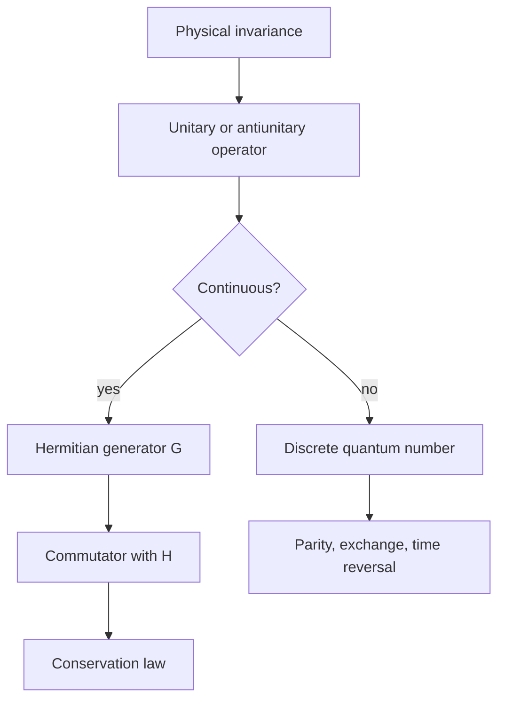

# Symmetries and Conservation Laws

Symmetry is the shortest route from physical invariance to conserved quantities and degeneracies. In quantum mechanics, a symmetry is represented by a transformation on Hilbert space that preserves transition probabilities and leaves the relevant dynamics unchanged.

Sakurai devotes a chapter to symmetries, conservation laws, degeneracies, parity, lattice translations, and time reversal. Ballentine treats symmetries of spacetime and the Galilei group early, making generators central. The Gottfried-named notes connect symmetries to rotations, angular momentum, and identical particles. Schiff's classic applications appear throughout central potentials, parity, and selection rules.

## Definitions

A transformation is a symmetry if it preserves physical transition probabilities:

$$
|\langle \phi|\psi\rangle|^2.
$$

By Wigner's theorem, such transformations are represented by unitary or antiunitary operators. Continuous ordinary symmetries are represented by unitary operators.

For a continuous transformation with parameter $\epsilon$,

$$
U(\epsilon)=I-{i\epsilon G\over\hbar}+O(\epsilon^2),
$$

where $G$ is the Hermitian generator.

Translations are generated by momentum:

$$
T(a)=e^{-iaP/\hbar}.
$$

Rotations are generated by angular momentum:

$$
R_{\mathbf n}(\theta)=e^{-i\theta\mathbf n\cdot\mathbf J/\hbar}.
$$

Time translations are generated by the Hamiltonian:

$$
U(t)=e^{-iHt/\hbar}.
$$

Parity $\Pi$ acts by spatial inversion:

$$
\Pi|\mathbf r\rangle=|-\mathbf r\rangle.
$$

Time reversal is represented by an antiunitary operator $\Theta$, not a unitary one, because it must reverse momenta and angular momenta while preserving probabilities.

## Key results

If a unitary symmetry $U$ leaves the Hamiltonian invariant,

$$
UHU^\dagger=H,
$$

then the symmetry maps energy eigenstates to energy eigenstates with the same energy.

For a continuous symmetry with generator $G$, invariance implies

$$
[H,G]=0.
$$

Then $G$ is conserved:

$$
{d\over dt}\langle G\rangle={i\over\hbar}\langle[H,G]\rangle=0
$$

when $G$ has no explicit time dependence.

Examples:

$$
[H,P]=0 \Rightarrow \text{momentum conservation},
$$

$$
[H,J_i]=0 \Rightarrow \text{angular momentum conservation},
$$

and

$$
[H,\Pi]=0 \Rightarrow \text{parity is a good quantum number}.
$$

Degeneracy often follows from symmetry, but the relationship must be stated carefully. If a symmetry operator commutes with $H$ and also commutes with all labels already used, it may simply label states rather than force degeneracy. Degeneracy is forced when the symmetry connects linearly independent states with the same energy.

For parity-invariant one-dimensional potentials, eigenstates can be chosen even or odd:

$$
\psi(-x)=\pm\psi(x).
$$

For lattice translation symmetry,

$$
T(a)H T(a)^\dagger=H,
$$

leading to Bloch-like states with phase under discrete translation. Sakurai uses this to show that symmetry reasoning is broader than rotations.

## Visual



| Symmetry | Operator | Generator or label | Conservation/result |
|---|---|---|---|
| Time translation | $e^{-iHt/\hbar}$ | $H$ | energy conservation |
| Space translation | $e^{-iaP/\hbar}$ | $P$ | momentum conservation |
| Rotation | $e^{-i\theta J/\hbar}$ | $J$ | angular momentum conservation |
| Parity | $\Pi$ | even/odd label | selection rules |
| Time reversal | $\Theta$ | antiunitary | constraints on dynamics |

## Worked example 1: Translation invariance and momentum conservation

**Problem.** Show that a free particle conserves momentum.

**Method.**

1. The free Hamiltonian is

$$
H={P^2\over2m}.
$$

2. Compute the commutator:

$$
[H,P]=\left[{P^2\over2m},P\right].
$$

3. Since any operator commutes with its own powers,

$$
[P^2,P]=0.
$$

4. Therefore

$$
[H,P]=0.
$$

5. Use the Heisenberg equation:

$$
{dP_H\over dt}={i\over\hbar}[H,P_H]=0.
$$

**Checked answer.** Momentum is conserved because the Hamiltonian is invariant under spatial translations.

## Worked example 2: Parity selection rule

**Problem.** Let $V(x)=V(-x)$, so energy eigenstates have definite parity. Show that $\langle n\vert X\vert n\rangle=0$ for a nondegenerate bound state.

**Method.**

1. A nondegenerate eigenstate can be chosen with parity:

$$
\psi_n(-x)=\eta_n\psi_n(x),
\qquad \eta_n=\pm1.
$$

2. The expectation value is

$$
\langle X\rangle=\int_{-\infty}^{\infty}\psi_n^*(x)x\psi_n(x)\,dx.
$$

3. The probability density is even:

$$
|\psi_n(-x)|^2=|\eta_n|^2|\psi_n(x)|^2=|\psi_n(x)|^2.
$$

4. The factor $x$ is odd.

5. Therefore the integrand $x\vert \psi_n(x)\vert ^2$ is odd, and the integral over symmetric limits is zero:

$$
\langle X\rangle=0.
$$

**Checked answer.** This is why first-order shifts from an odd perturbation vanish in parity eigenstates.

## Code

```python
import numpy as np

# Parity check for harmonic oscillator-like even/odd sample functions
x = np.linspace(-5, 5, 2001)
psi_even = np.exp(-x**2 / 2)
psi_odd = x * np.exp(-x**2 / 2)

for psi in [psi_even, psi_odd]:
    norm = np.trapz(abs(psi) ** 2, x)
    x_mean = np.trapz(abs(psi) ** 2 * x, x) / norm
    print(x_mean)
```

## Common pitfalls

- Saying "symmetry" without specifying the operator and what it leaves invariant.
- Confusing invariance of a state with invariance of the Hamiltonian. A Hamiltonian can be symmetric even when a particular state is not.
- Assuming every commuting operator causes degeneracy. It may only provide a good label.
- Forgetting that time reversal is antiunitary, so it complex conjugates amplitudes in a suitable basis.
- Mixing continuous generators with discrete labels. Parity has no infinitesimal Hermitian generator like translations do.
- Applying parity selection rules when the perturbation or boundary conditions break parity.
- Treating conservation laws as approximate after choosing a numerical method that does not preserve the symmetry.

A reliable symmetry argument has three parts. First, identify the transformation: translation, rotation, inversion, time reversal, exchange, or a more abstract internal transformation. Second, identify how states and operators transform. Third, verify that the Hamiltonian and boundary conditions are invariant. Leaving out the boundary conditions is a common mistake. A free-particle Hamiltonian is translation invariant on the infinite line, but a box with walls is not invariant under arbitrary translations.

Continuous symmetries give generators, and generators give conserved quantities when they commute with the Hamiltonian. This is the quantum version of Noether's theorem. The commutator is not just a formal test; it tells how the corresponding observable changes in the Heisenberg picture. If $[H,G]=0$, then the distribution of $G$ is constant in time. If $[H,G]\neq0$, the symmetry is broken and transitions between different $G$ labels may become allowed.

Discrete symmetries work differently. Parity has eigenvalues $\pm1$ rather than a continuous generator. Time reversal is antiunitary, which means it complex conjugates amplitudes in addition to transforming operators. Exchange symmetry is a restriction on the allowed state space for identical particles. Putting all of these under the word "symmetry" is useful, but the mathematical implementation differs from case to case.

Symmetry also explains degeneracy patterns, but not every degeneracy is protected in the same way. Rotational symmetry creates $(2j+1)$ multiplets when energy does not depend on $m$. Coulomb degeneracy in hydrogen is larger because of an additional hidden symmetry. Accidental degeneracies can disappear under small perturbations, while symmetry-protected degeneracies remain until the protecting symmetry is broken. This distinction is essential in perturbation theory and spectroscopy.

Selection rules are symmetry statements written as matrix elements. If a perturbation has definite transformation behavior, many transitions vanish because the initial state, operator, and final state cannot combine to an invariant amplitude. Parity selection rules are the simplest example: an odd operator connects states of opposite parity, while its diagonal matrix element in a parity eigenstate vanishes. Angular-momentum selection rules are the richer version, using tensor operators and Clebsch-Gordan structure.

Antiunitary time reversal deserves special caution. For spinless systems in a real potential, time reversal can be represented roughly as complex conjugation in the position basis. For spin-1/2, it also flips spin and satisfies a different algebraic structure. Magnetic fields typically break time-reversal symmetry because they reverse under time reversal. This affects degeneracies, response coefficients, and the interpretation of phases.

In numerical and approximate work, preserving symmetry is often a design choice. A finite grid may accidentally break rotational symmetry. A truncated basis may preserve parity but not full translation invariance. Perturbative truncations may respect a conservation law only if the included subspace is closed under the symmetry. When an approximation gives forbidden transitions, check whether the physics breaks the symmetry or the approximation did.

Sakurai's symmetry chapter is placed after angular momentum because rotations provide the most important example, but Ballentine's earlier symmetry treatment is a reminder that the idea is foundational. Quantum numbers are not arbitrary labels; they are eigenvalues of operators associated with transformations that leave the physics invariant.

A final practical rule is to ask what would change if the coordinate axes were relabeled. If the physics changes, there must be an external structure such as a field, boundary, lattice, or measuring apparatus. If no such structure exists, axis-dependent answers usually indicate that symmetry was broken by the calculation rather than by the system.

This question is quick and catches many false splittings.

## Connections

- [Quantum dynamics and pictures](/physics/quantum-mechanics/quantum-dynamics-pictures)
- [Angular momentum algebra](/physics/quantum-mechanics/angular-momentum-algebra)
- [Central potentials and the hydrogen atom](/physics/quantum-mechanics/central-potentials-hydrogen-atom)
- [Time-independent perturbation theory](/physics/quantum-mechanics/time-independent-perturbation-theory)
- [Measurement and interpretation](/physics/quantum-mechanics/measurement-interpretation)
