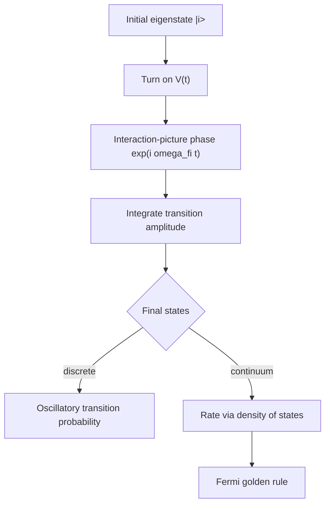

# Time-Dependent Perturbation Theory

Time-dependent perturbation theory predicts transitions. Instead of asking how an energy level shifts when the Hamiltonian is slightly changed, it asks how a system initially in one eigenstate develops amplitude to be found in another. This is the language of absorption, emission, decays, scattering, and Fermi's golden rule.

Sakurai derives the formalism in the interaction picture and uses constant and harmonic perturbations to reach the golden rule. Ballentine treats time-dependent phenomena alongside decay, beats, and adiabatic behavior. The Gottfried-named notes follow a similar interaction-picture route. Schiff's older treatment often emphasizes explicit integrals of transition amplitudes in wave mechanics.


*Figure: The Stern-Gerlach experiment is the physical scene behind spin quantization and quantum measurement. Image: [Wikimedia Commons](https://commons.wikimedia.org/wiki/File:Stern-Gerlach_experiment.svg), Tatoute, CC BY-SA 4.0.*

## Definitions

Split the Hamiltonian as

$$
H(t)=H_0+V(t),
$$

where

$$
H_0|n\rangle=E_n|n\rangle.
$$

In the interaction picture,

$$
V_I(t)=e^{iH_0t/\hbar}V(t)e^{-iH_0t/\hbar}.
$$

The interaction-picture state obeys

$$
i\hbar{d\over dt}|\psi_I(t)\rangle=V_I(t)|\psi_I(t)\rangle.
$$

If the system begins in $\vert i\rangle$, the first-order amplitude for a transition to $\vert f\rangle$ is

$$
c_f^{(1)}(t)=-{i\over\hbar}\int_0^t
\langle f|V(t')|i\rangle e^{i\omega_{fi}t'}\,dt',
$$

where

$$
\omega_{fi}={E_f-E_i\over \hbar}.
$$

The transition probability to first order is

$$
P_{i\to f}(t)\approx |c_f^{(1)}(t)|^2.
$$

For a continuum of final states, probabilities are converted into rates by multiplying by a density of states.

## Key results

For a constant perturbation turned on from $0$ to $t$, with $V_{fi}=\langle f\vert V\vert i\rangle$,

$$
c_f^{(1)}(t)=-{iV_{fi}\over\hbar}\int_0^t e^{i\omega_{fi}t'}dt'
={V_{fi}\over\hbar}{1-e^{i\omega_{fi}t}\over \omega_{fi}}.
$$

Thus

$$
P_{i\to f}(t)=
{4|V_{fi}|^2\over \hbar^2\omega_{fi}^2}
\sin^2{\omega_{fi}t\over 2}.
$$

For a harmonic perturbation,

$$
V(t)=W e^{-i\omega t}+W^\dagger e^{i\omega t},
$$

large transition probability occurs near resonance:

$$
E_f-E_i\approx \hbar\omega
$$

for absorption from the $W$ term, with the opposite sign for stimulated emission depending on convention.

Fermi's golden rule is

$$
\Gamma_{i\to f}={2\pi\over\hbar}|V_{fi}|^2\rho(E_f),
$$

where $\rho(E_f)$ is the density of final states at the energy selected by conservation. More precisely, the transition rate into a continuum is

$$
d\Gamma={2\pi\over\hbar}|\langle f|V|i\rangle|^2\delta(E_f-E_i)\,d\rho_f.
$$

The golden rule rests on three approximations: weak coupling, long observation time compared with microscopic oscillation periods, and a dense continuum of final states. Sakurai emphasizes how the sinc-squared time factor narrows into an energy-conserving delta function. Ballentine's discussion of decay highlights that exponential decay is an approximation, not an exact law for all times.

## Visual



| Perturbation | Amplitude feature | Physical interpretation |
|---|---|---|
| constant for finite time | sinc-like energy width | short pulses broaden energy selection |
| harmonic drive | resonance at $\omega_{fi}\approx \omega$ | absorption or stimulated emission |
| continuum coupling | linear growth of total probability | constant transition rate |
| strong resonant two-level drive | Rabi oscillations | first-order theory eventually fails |

## Worked example 1: Constant perturbation between two levels

**Problem.** A system starts in $\vert i\rangle$. A constant perturbation with matrix element $V_{fi}$ is turned on for time $t$. Find the first-order transition probability to $\vert f\rangle$.

**Method.**

1. Start from

$$
c_f^{(1)}(t)=-{i\over\hbar}V_{fi}\int_0^t e^{i\omega_{fi}t'}dt'.
$$

2. Integrate:

$$
\int_0^t e^{i\omega t'}dt'={e^{i\omega t}-1\over i\omega}.
$$

3. Substitute:

$$
c_f^{(1)}(t)=-{iV_{fi}\over\hbar}{e^{i\omega_{fi}t}-1\over i\omega_{fi}}
={V_{fi}\over\hbar\omega_{fi}}\left(1-e^{i\omega_{fi}t}\right).
$$

4. Take the modulus squared:

$$
|1-e^{i\omega t}|^2=(1-e^{i\omega t})(1-e^{-i\omega t})
=2-2\cos\omega t.
$$

5. Use

$$
2-2\cos\omega t=4\sin^2{\omega t\over2}.
$$

6. Therefore

$$
P_{i\to f}(t)=
{4|V_{fi}|^2\over\hbar^2\omega_{fi}^2}
\sin^2{\omega_{fi}t\over2}.
$$

**Checked answer.** When $\omega_{fi}\to0$, use $\sin x\sim x$ to get $P\approx \vert V_{fi}\vert ^2t^2/\hbar^2$, as expected for a resonant weak coupling at short time.

## Worked example 2: Golden-rule estimate

**Problem.** A state couples to a continuum with approximately constant matrix element $V_0$ and density of states $\rho(E)=\rho_0$ near the final energy. Find the transition rate.

**Method.**

1. Use Fermi's golden rule:

$$
\Gamma={2\pi\over\hbar}|V_{fi}|^2\rho(E_f).
$$

2. Insert the approximation

$$
|V_{fi}|^2\approx |V_0|^2,
\qquad
\rho(E_f)\approx\rho_0.
$$

3. The rate is

$$
\Gamma={2\pi\over\hbar}|V_0|^2\rho_0.
$$

4. The survival probability under the exponential approximation is

$$
P_{\mathrm{surv}}(t)\approx e^{-\Gamma t}.
$$

5. The lifetime is

$$
\tau={1\over \Gamma}.
$$

**Checked answer.** The dimensions are correct: $\vert V_0\vert ^2\rho_0/\hbar$ has units of inverse time when $\rho_0$ is states per energy.

## Code

```python
import numpy as np

hbar = 1.0
v = 0.05
omega_fi = 0.7

times = np.linspace(0, 30, 6)
for t in times:
    prob = 4 * abs(v) ** 2 / (hbar**2 * omega_fi**2) * np.sin(omega_fi * t / 2) ** 2
    print(round(t, 2), prob)
```

## Common pitfalls

- Using first-order perturbation theory after transition probability is no longer small.
- Forgetting the oscillatory phase $e^{i\omega_{fi}t}$ in the interaction-picture matrix element.
- Treating the golden rule as valid for a single isolated final level. It is a continuum-rate result.
- Ignoring density of states. The matrix element alone is not a rate.
- Assuming exact exponential decay at arbitrarily short and long times. It is an approximation over an intermediate regime.
- Mixing angular frequency and ordinary frequency; factors of $2\pi$ matter.
- Applying resonance formulas without checking which part of $V(t)$ corresponds to absorption or emission under the chosen sign convention.

The central object in time-dependent perturbation theory is phase accumulation. A matrix element may be nonzero, but if the phase $e^{i\omega_{fi}t}$ oscillates rapidly, contributions from different times cancel. Near resonance, the phase varies slowly and the amplitude can accumulate coherently. This is the physical origin of energy selection in long-time transitions and of broad spectral response for short pulses.

First-order amplitudes are amplitudes, not probabilities. If several indistinguishable paths lead to the same final state, their amplitudes must be added before squaring. If final states are distinguishable or unobserved, probabilities may be summed. This distinction is the same interference logic seen in spin and path integrals, now applied to transition histories. It becomes essential in multi-photon processes, decay channels, and scattering.

The golden rule should always be accompanied by its conditions. The final states must form a dense enough continuum, the coupling must be weak enough that the initial state is not strongly depleted over the times considered, and the observation time must be long enough for the sinc-squared energy window to become narrow. At very short times, transition probability is quadratic in time; at intermediate times it can look exponential after summing over a continuum; at very long times, exact models may deviate again.

Driven two-level systems are the boundary between perturbation theory and exact dynamics. Weak off-resonant driving is well described by first-order transition amplitudes. Strong resonant driving produces Rabi oscillations, where probability flows back and forth and first-order theory eventually predicts probabilities larger than one. When that happens, the issue is not arithmetic but the breakdown of the perturbative approximation.

Selection rules still matter in time-dependent problems. A harmonic electric-dipole perturbation contains an operator such as $\mathbf r\cdot\mathbf E$, so parity and angular momentum determine which transitions have nonzero matrix elements before any time integral is evaluated. Resonance cannot create a transition whose matrix element is zero by symmetry. Conversely, a nonzero matrix element far from resonance may produce only a small bounded oscillation.

Pulse duration controls energy resolution. A perturbation applied for a short time has a broad frequency spectrum, so it can drive a range of transitions. A long nearly monochromatic drive selects a narrow energy window. This is the time-energy Fourier relationship behind spectroscopy, and it is more precise than saying energy is "violated" for short times. The full system still evolves according to the time-dependent Hamiltonian; the finite-time amplitude simply has a broadened response.

For checks, take limits. At $t=0$ transition probabilities must vanish. For very weak coupling they should scale as $\vert V\vert ^2$. Near resonance they should grow much more efficiently than far off resonance. If these trends fail, the phase convention or time integral is likely wrong.

## Connections

- [Quantum dynamics and pictures](/physics/quantum-mechanics/quantum-dynamics-pictures)
- [Time-independent perturbation theory](/physics/quantum-mechanics/time-independent-perturbation-theory)
- [Scattering theory](/physics/quantum-mechanics/scattering-theory)
- [Density operator, entanglement, and decoherence](/physics/quantum-mechanics/density-operator-entanglement-decoherence)
- [Measurement and interpretation](/physics/quantum-mechanics/measurement-interpretation)
