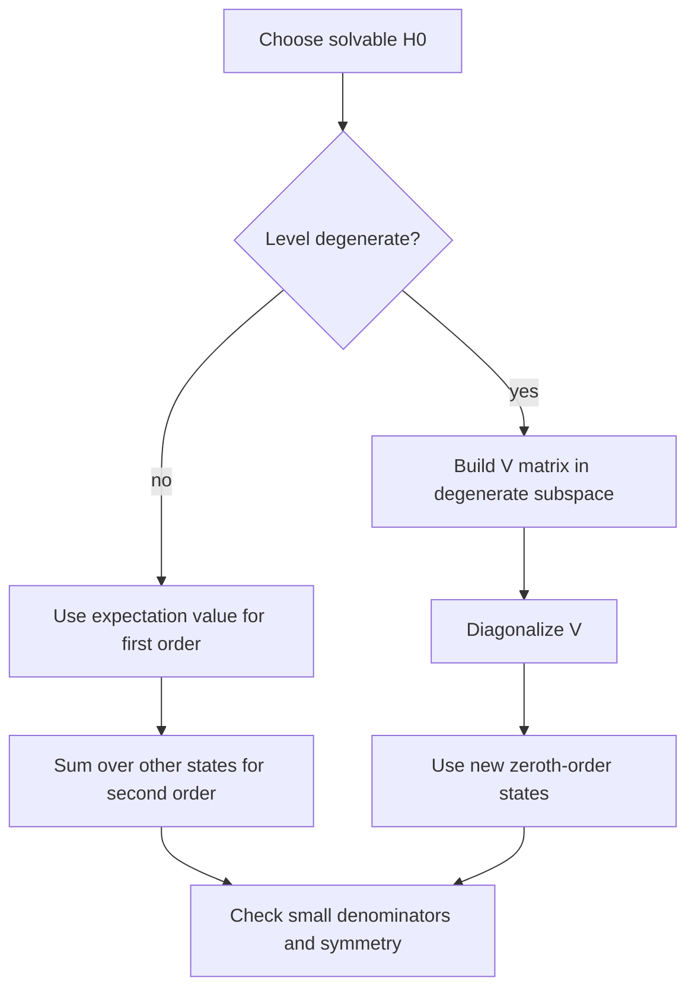

# Time-Independent Perturbation Theory

Most useful Hamiltonians cannot be solved exactly. Time-independent perturbation theory gives controlled corrections when the true Hamiltonian is close to a solvable one. It explains fine structure, Zeeman splitting, Stark shifts, anharmonic oscillators, and many effective models.

Sakurai presents nondegenerate and degenerate perturbation theory, then applies it to hydrogenlike atoms, fine structure, and electromagnetic-field interactions. Ballentine gives a careful stationary-state perturbation chapter with variational comparison. The Gottfried-named notes emphasize Rayleigh-Schrodinger expansions and hydrogen in fields. Schiff's classic treatment is often more coordinate-based and calculation-heavy.

## Definitions

Write the Hamiltonian as

$$
H=H_0+\lambda V,
$$

where $H_0$ is exactly solvable and $\lambda$ is a bookkeeping parameter set to $1$ at the end.

The unperturbed eigenproblem is

$$
H_0|n^{(0)}\rangle=E_n^{(0)}|n^{(0)}\rangle.
$$

For a nondegenerate level, expand

$$
E_n=E_n^{(0)}+\lambda E_n^{(1)}+\lambda^2E_n^{(2)}+\cdots,
$$

and

$$
|n\rangle=|n^{(0)}\rangle+\lambda|n^{(1)}\rangle+\lambda^2|n^{(2)}\rangle+\cdots.
$$

The common normalization convention is intermediate normalization:

$$
\langle n^{(0)}|n\rangle=1,
$$

which implies

$$
\langle n^{(0)}|n^{(1)}\rangle=0.
$$

For a degenerate subspace, one must first diagonalize $V$ inside that subspace. Ordinary nondegenerate formulas fail because denominators become zero.

## Key results

For a nondegenerate level,

$$
E_n^{(1)}=\langle n^{(0)}|V|n^{(0)}\rangle.
$$

The first-order state correction is

$$
|n^{(1)}\rangle
=\sum_{k\neq n}
{|k^{(0)}\rangle\langle k^{(0)}|V|n^{(0)}\rangle
\over E_n^{(0)}-E_k^{(0)}}.
$$

The second-order energy correction is

$$
E_n^{(2)}
=\sum_{k\neq n}
{|\langle k^{(0)}|V|n^{(0)}\rangle|^2
\over E_n^{(0)}-E_k^{(0)}}.
$$

For a degenerate level with basis $\vert \alpha\rangle$ inside the degenerate subspace, build the perturbation matrix

$$
V_{\alpha\beta}=\langle \alpha|V|\beta\rangle.
$$

Its eigenvalues are the first-order energy shifts, and its eigenvectors give the correct zeroth-order linear combinations.

In the linear Stark effect, a hydrogen perturbation has the form

$$
V=e\mathcal E z
$$

up to charge-sign convention. Degeneracy within the $n=2$ shell allows a first-order shift. In contrast, the nondegenerate ground state has no first-order Stark shift by parity because

$$
\langle 100|z|100\rangle=0.
$$

In a weak magnetic field, Zeeman shifts are controlled by magnetic moments and angular momentum projections. The simplest orbital form is

$$
\Delta E=\mu_B B m_\ell,
$$

with spin and fine-structure refinements depending on coupling regime. Sakurai's treatment makes the angular-momentum basis choice explicit.

## Visual



| Case | First action | First-order shift | Main danger |
|---|---|---|---|
| Nondegenerate | compute diagonal matrix element | $\langle n\vert V\vert n\rangle$ | small denominators |
| Degenerate | diagonalize $V$ in subspace | eigenvalues of $V_{\alpha\beta}$ | using wrong basis |
| Parity-odd perturbation on even state | check symmetry | often zero | missing second-order effect |
| Magnetic splitting | choose angular-momentum basis | projection-dependent | mixing weak/strong field regimes |

## Worked example 1: Two-level nondegenerate perturbation

**Problem.** Let

$$
H_0=\begin{pmatrix}0&0\\0&\Delta\end{pmatrix},
\qquad
V=\begin{pmatrix}0&v\\v&0\end{pmatrix},
$$

with $\Delta\gt 0$. Find the first nonzero correction to the lower energy.

**Method.**

1. The lower unperturbed state is

$$
|0\rangle=\begin{pmatrix}1\\0\end{pmatrix},
\qquad E_0^{(0)}=0.
$$

2. The first-order shift is

$$
E_0^{(1)}=\langle0|V|0\rangle=0.
$$

3. The only other state is

$$
|1\rangle=\begin{pmatrix}0\\1\end{pmatrix},
\qquad E_1^{(0)}=\Delta.
$$

4. The coupling matrix element is

$$
\langle1|V|0\rangle=v.
$$

5. The second-order shift is

$$
E_0^{(2)}={|v|^2\over E_0^{(0)}-E_1^{(0)}}
=-{v^2\over \Delta}.
$$

**Checked answer.** The lower level moves downward. Exact diagonalization gives $E_-=(\Delta-\sqrt{\Delta^2+4v^2})/2\approx -v^2/\Delta$ for small $v/\Delta$.

## Worked example 2: Degenerate perturbation in a two-state subspace

**Problem.** Two unperturbed states $\vert a\rangle,\vert b\rangle$ have the same energy $E_0$. In this subspace,

$$
V=\begin{pmatrix}0&g\\g&0\end{pmatrix}.
$$

Find the first-order corrected energies and states.

**Method.**

1. Nondegenerate perturbation theory is invalid because $E_a^{(0)}-E_b^{(0)}=0$.

2. Diagonalize the perturbation matrix:

$$
\det\begin{pmatrix}-\epsilon&g\\g&-\epsilon\end{pmatrix}
=\epsilon^2-g^2=0.
$$

3. The eigenvalues are

$$
\epsilon_+=g,\qquad \epsilon_-=-g.
$$

4. The normalized eigenvectors are

$$
|+\rangle={1\over\sqrt2}(|a\rangle+|b\rangle),
\qquad
|-\rangle={1\over\sqrt2}(|a\rangle-|b\rangle).
$$

5. Therefore the first-order energies are

$$
E_\pm=E_0+\lambda(\pm g).
$$

**Checked answer.** The perturbation splits the degeneracy linearly, and the correct starting states are symmetric and antisymmetric combinations.

## Code

```python
import numpy as np

delta = 10.0
v = 0.5
h = np.array([[0, v], [v, delta]], dtype=float)
exact = np.linalg.eigvalsh(h)[0]
perturbative = -v**2 / delta

print("exact lower energy:", exact)
print("second-order estimate:", perturbative)
print("relative error:", abs((exact - perturbative) / exact))
```

## Common pitfalls

- Using nondegenerate formulas inside a degenerate subspace. Zero denominators are not a minor algebra issue; the basis is wrong.
- Forgetting symmetry selection rules. Parity can make matrix elements vanish before integration.
- Trusting perturbation theory near level crossings or small denominators.
- Ignoring normalization conventions for corrected states.
- Calling a first-order zero shift "no effect." The leading effect may be second order.
- Mixing exact eigenstates of the full Hamiltonian with unperturbed states inside matrix elements.
- Applying weak-field Zeeman formulas in regimes where spin-orbit coupling is no longer the dominant internal interaction.

Perturbation theory begins with a modeling decision: what is $H_0$, and what is small? The best $H_0$ is not always the most obvious algebraic split; it should capture the dominant physics and leave a perturbation whose matrix elements are small compared with relevant level spacings. If the perturbation connects nearly degenerate states, the expansion parameter is effectively large even when the operator looks small. This is why level spacing appears in denominators.

Symmetry should be used before summing states. If $V$ is odd under parity, its diagonal matrix element in a parity eigenstate vanishes. If $V$ is rotationally invariant, it cannot mix states with different total angular momentum labels in the usual way. Selection rules reduce both computation and error. Sakurai's angular-momentum-first structure pays off here because perturbation theory in atoms is often mostly a problem of choosing the right coupled basis.

Degenerate perturbation theory is best understood as exact diagonalization of the perturbation inside a small subspace. The perturbation chooses the linear combinations that nature uses as the correct zeroth-order states. Once that diagonalization is done, corrections from states outside the degenerate subspace can be treated with formulas resembling the nondegenerate case. Skipping this first step leads to infinite denominators and physically meaningless "corrections."

Always compare perturbative results with limiting behavior. A repulsive positive perturbation should raise an energy if the diagonal expectation is positive. Coupling to a higher level usually pushes a lower level downward at second order, as in level repulsion. A formula that becomes larger as the perturbation becomes smaller is signaling a denominator or degeneracy problem. Ballentine's careful stationary-state treatment is useful because it keeps these assumptions visible.

Perturbative state corrections are just as important as energy corrections when computing observables. A first-order energy shift may vanish, while a first-order change in the state produces a nonzero expectation value for another operator. Electric polarizability is the standard example: the first-order Stark shift of a nondegenerate parity eigenstate can vanish, but the field mixes opposite-parity states into the wave function and produces a second-order energy shift and induced dipole response.

In matrix problems, exact diagonalization of a small model is an excellent check. Expand the exact eigenvalues in powers of the small parameter and compare term by term with perturbation theory. This confirms signs, denominators, and degeneracy handling. Sakurai frequently uses compact operator formulas, but small matrices expose the same physics without hidden sums over infinite bases.

Finally, perturbation theory is an asymptotic tool, not always a convergent one. Adding more terms does not guarantee improvement outside the method's domain. Physical judgment about small parameters, symmetries, and nearby levels matters as much as algebraic fluency.

For operator perturbations in infinite-dimensional spaces, convergence of sums over intermediate states is another hidden assumption. Selection rules, closure relations, or sum rules can simplify these expressions, but they do not remove the need to check whether the perturbation and states are physically admissible. Formal sums that diverge signal missing physics, an invalid approximation, or the need for renormalized parameters in more advanced settings.

This is why perturbative answers should always be paired with stated small parameters and validity conditions.

State those assumptions explicitly before trusting numerical agreement.

## Connections

- [Harmonic oscillator with ladder operators](/physics/quantum-mechanics/harmonic-oscillator-ladder-operators)
- [Central potentials and the hydrogen atom](/physics/quantum-mechanics/central-potentials-hydrogen-atom)
- [Addition of angular momentum](/physics/quantum-mechanics/addition-of-angular-momentum)
- [Time-dependent perturbation theory](/physics/quantum-mechanics/time-dependent-perturbation-theory)
- [Variational principle and WKB](/physics/quantum-mechanics/variational-principle-wkb)
