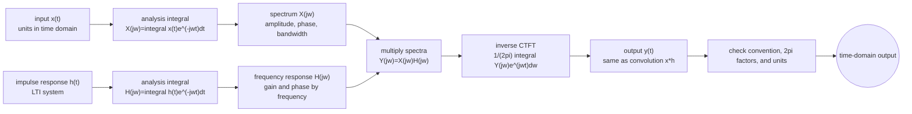

# Continuous-Time Fourier Transform

The continuous-time Fourier transform extends Fourier analysis from periodic signals to aperiodic signals. Instead of a line spectrum at harmonics of one fundamental frequency, an aperiodic signal is represented by a continuous spectrum $X(j\omega)$. The transform answers how much of each complex exponential $e^{j\omega t}$ is present in the signal.

For LTI systems, the CTFT turns convolution into multiplication. This is the main computational payoff: differential equations, filters, and cascade systems become algebraic in frequency. The transform also gives a precise language for bandwidth, ideal filtering, modulation, and sampling.


*Figure: Fourier analysis becomes concrete when a time waveform and its spectral lines are shown side by side. Image: [Wikimedia Commons](https://commons.wikimedia.org/wiki/File:Fourier_transform_time_and_frequency_domains.gif), Lucas Vieira, public domain.*

## Definitions

The continuous-time Fourier transform of $x(t)$ is

$$
X(j\omega)=\int_{-\infty}^{\infty}x(t)e^{-j\omega t}\,dt.
$$

The inverse transform is

$$
x(t)=\frac{1}{2\pi}\int_{-\infty}^{\infty}X(j\omega)e^{j\omega t}\,d\omega.
$$

The notation $X(j\omega)$ emphasizes the connection to the Laplace transform evaluated on the imaginary axis. Some fields write the same transform as $X(\omega)$. In these notes, $X(j\omega)$ is used for consistency with systems notation.

The CTFT exists in the ordinary integral sense for many absolutely integrable signals:

$$
\int_{-\infty}^{\infty}|x(t)|\,dt<\infty.
$$

Signals that are not absolutely integrable can still have transforms in a generalized sense. Important examples include

$$
\delta(t) \leftrightarrow 1,
\qquad
1 \leftrightarrow 2\pi\delta(\omega),
\qquad
e^{j\omega_0 t}\leftrightarrow 2\pi\delta(\omega-\omega_0).
$$

The Fourier transform of an impulse-shifted signal follows from the sifting property:

$$
\delta(t-t_0) \leftrightarrow e^{-j\omega t_0}.
$$

For real-valued $x(t)$, the transform has conjugate symmetry:

$$
X(-j\omega)=X^*(j\omega).
$$

Equivalently, the magnitude is even and the phase is odd, apart from phase jumps where the magnitude is zero.

## Key results

Linearity:

$$
a x_1(t)+b x_2(t) \leftrightarrow aX_1(j\omega)+bX_2(j\omega).
$$

Time shifting:

$$
x(t-t_0)\leftrightarrow e^{-j\omega t_0}X(j\omega).
$$

Frequency shifting, or modulation by a complex exponential:

$$
e^{j\omega_0 t}x(t)\leftrightarrow X(j(\omega-\omega_0)).
$$

Time scaling:

$$
x(a t)\leftrightarrow \frac{1}{|a|}X\left(j\frac{\omega}{a}\right),\qquad a\ne 0.
$$

Differentiation in time:

$$
\frac{d}{dt}x(t)\leftrightarrow j\omega X(j\omega),
$$

when boundary terms vanish or the identity is interpreted distributionally.

Multiplication by time:

$$
t x(t)\leftrightarrow j\frac{d}{d\omega}X(j\omega).
$$

Convolution:

$$
x(t)*h(t)\leftrightarrow X(j\omega)H(j\omega).
$$

Multiplication in time:

$$
x(t)h(t)\leftrightarrow \frac{1}{2\pi}X(j\omega)*H(j\omega),
$$

where the convolution on the right is with respect to $\omega$.

Parseval's relation:

$$
\int_{-\infty}^{\infty}|x(t)|^2\,dt
=\frac{1}{2\pi}\int_{-\infty}^{\infty}|X(j\omega)|^2\,d\omega.
$$

For an LTI system with impulse response $h(t)$, the frequency response is

$$
H(j\omega)=\int_{-\infty}^{\infty}h(t)e^{-j\omega t}\,dt.
$$

If $y=x*h$, then

$$
Y(j\omega)=X(j\omega)H(j\omega).
$$

Thus $H(j\omega)$ scales and phase-shifts each frequency component of the input.

The CTFT should be read with units in mind. If $t$ is measured in seconds, then $\omega$ is radians per second and $d\omega$ carries radians per second. The inverse transform has the factor $1/(2\pi)$ because angular frequency is being used. If a text uses ordinary frequency $f$ in hertz, the transform pair is usually written with $e^{-j2\pi f t}$ and the inverse has no $1/(2\pi)$ factor. Mixing these conventions is a common source of wrong constants.

Bandwidth is the part of the frequency axis where $X(j\omega)$ is nonzero or practically significant. A strictly bandlimited signal has exact zero spectrum outside a finite interval, which is an idealization. Real signals are often treated as effectively bandlimited when energy outside a band is small enough to ignore. Sampling and filtering results should state whether the assumption is exact or approximate.

The CTFT can also be viewed as a limiting case of Fourier series. As the period of a periodic extension grows, harmonic spacing becomes smaller and line coefficients approach a continuous spectral density. This intuition explains why aperiodic signals use integrals over frequency while periodic signals use sums over harmonics.

Duality is another useful guide. Narrow signals in time tend to have broad spectra, and broad smooth signals tend to have concentrated spectra. This is not just a slogan; it is visible in transform pairs such as rectangular pulses and sinc spectra. It helps explain why sharp time-domain edges demand high-frequency content.

## Visual

| Property | Time-domain operation | Frequency-domain result |
|---|---|---|
| Linearity | $a x_1+b x_2$ | $aX_1+bX_2$ |
| Time shift | $x(t-t_0)$ | $e^{-j\omega t_0}X(j\omega)$ |
| Modulation | $e^{j\omega_0t}x(t)$ | $X(j(\omega-\omega_0))$ |
| Time scaling | $x(a t)$ | $\frac{1}{\vert a\vert }X(j\omega/a)$ |
| Differentiation | $dx/dt$ | $j\omega X(j\omega)$ |
| Convolution | $x*h$ | $XH$ |
| Multiplication | $xh$ | $\frac{1}{2\pi}X*H$ |



This CTFT diagram shows the parallel analysis of an input signal and an LTI impulse response, followed by spectral multiplication and inverse synthesis. The shape transition is conceptual: time-domain functions become continuous spectra indexed by angular frequency, then return to a time-domain output. The convention check is explicit because $2\pi$ factors and units are the most common source of otherwise-correct transform errors.

## Worked example 1: transform of a decaying exponential

Problem: Find the CTFT of

$$
x(t)=e^{-a t}u(t), \qquad a>0.
$$

Method:

1. Start from the definition:

$$
X(j\omega)=\int_{-\infty}^{\infty}e^{-a t}u(t)e^{-j\omega t}\,dt.
$$

2. The unit step restricts the integral to $t\ge 0$:

$$
X(j\omega)=\int_{0}^{\infty}e^{-a t}e^{-j\omega t}\,dt.
$$

3. Combine exponents:

$$
X(j\omega)=\int_{0}^{\infty}e^{-(a+j\omega)t}\,dt.
$$

4. Since $a\gt 0$, the exponential decays and

$$
\int_{0}^{\infty}e^{-(a+j\omega)t}\,dt
=\left[-\frac{1}{a+j\omega}e^{-(a+j\omega)t}\right]_{0}^{\infty}.
$$

5. The upper limit is zero. The lower limit contributes $-1/(a+j\omega)$ inside the bracket, so

$$
X(j\omega)=\frac{1}{a+j\omega}.
$$

Checked answer:

$$
e^{-a t}u(t)\leftrightarrow \frac{1}{a+j\omega},\qquad a>0.
$$

Magnitude and phase are

$$
|X(j\omega)|=\frac{1}{\sqrt{a^2+\omega^2}},
\qquad
\angle X(j\omega)=-\tan^{-1}\frac{\omega}{a}.
$$

The transform is largest at low frequency because the time signal is a smooth one-sided decay.

## Worked example 2: filtering a rectangular spectrum

Problem: Suppose an LTI system has ideal lowpass response

$$
H(j\omega)=
\begin{cases}
1, & |\omega|\le 5,\\
0, & |\omega|>5,
\end{cases}
$$

and the input spectrum is

$$
X(j\omega)=
\begin{cases}
2, & |\omega|\le 3,\\
1, & 3<|\omega|\le 8,\\
0, & |\omega|>8.
\end{cases}
$$

Find $Y(j\omega)$.

Method:

1. For an LTI system,

$$
Y(j\omega)=X(j\omega)H(j\omega).
$$

2. The system passes frequencies with $\vert \omega\vert \le 5$ and removes frequencies with $\vert \omega\vert \gt 5$.

3. On $\vert \omega\vert \le 3$, both $X$ and $H$ are nonzero:

$$
Y(j\omega)=2\cdot 1=2.
$$

4. On $3\lt \vert \omega\vert \le 5$, the input spectrum has value $1$ and the filter still passes:

$$
Y(j\omega)=1\cdot 1=1.
$$

5. On $5\lt \vert \omega\vert \le 8$, the input has value $1$ but the filter is zero:

$$
Y(j\omega)=1\cdot 0=0.
$$

6. Outside $\vert \omega\vert \gt 8$, the input is already zero.

Checked answer:

$$
Y(j\omega)=
\begin{cases}
2, & |\omega|\le 3,\\
1, & 3<|\omega|\le 5,\\
0, & |\omega|>5.
\end{cases}
$$

The output bandwidth is limited by the filter cutoff, not by the original input support.

## Code

```python
import numpy as np
import matplotlib.pyplot as plt

a = 2.0
omega = np.linspace(-30, 30, 2000)
X = 1 / (a + 1j * omega)

H = np.where(np.abs(omega) <= 5, 1.0, 0.0)
X_piece = np.where(np.abs(omega) <= 3, 2.0,
                   np.where(np.abs(omega) <= 8, 1.0, 0.0))
Y_piece = X_piece * H

fig, ax = plt.subplots(1, 2, figsize=(10, 3))
ax[0].plot(omega, np.abs(X))
ax[0].set_title(r"$\vert 1/(a+j\omega)\vert $")
ax[0].grid(True)

ax[1].plot(omega, X_piece, label="input spectrum")
ax[1].plot(omega, Y_piece, label="after lowpass")
ax[1].legend()
ax[1].grid(True)
plt.tight_layout()
plt.show()
```

## Common pitfalls

- Forgetting the $1/(2\pi)$ factor in the inverse CTFT and in the multiplication property.
- Treating the CTFT of a periodic sinusoid as an ordinary function instead of impulses in frequency.
- Confusing time shift with frequency shift. A time shift multiplies the spectrum by a phase ramp; modulation shifts the spectrum.
- Assuming a Fourier transform exists as an ordinary integral for every useful signal. Constants and sinusoids require generalized transforms.
- Dropping phase information. Magnitude alone is not enough to reconstruct a general signal.

## Connections

- [Fourier Series for Periodic Signals](/physics/signals-systems/fourier-series-periodic-signals)
- [LTI Systems and Convolution](/physics/signals-systems/lti-systems-convolution)
- [Sampling, Aliasing, and Reconstruction](/physics/signals-systems/sampling-aliasing-reconstruction)
- [Frequency Response and Filtering](/physics/signals-systems/frequency-response-filtering)
- [Laplace Transform and ROC](/physics/signals-systems/laplace-transform-roc)
