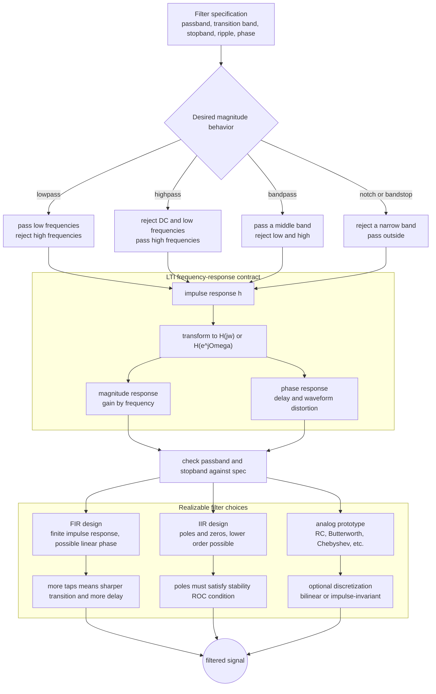

# Frequency Response and Filtering

Frequency response describes how an LTI system changes sinusoidal or complex exponential components. If the input contains a component at frequency $\omega$, the output contains the same frequency multiplied by a complex number. The magnitude of that number is the gain, and its angle is the phase shift. Filtering is the design or use of frequency response to pass desired components and suppress undesired ones.

This page connects Fourier transforms, Laplace transforms, and $z$-transforms. In continuous time, the frequency response is $H(j\omega)$. In discrete time, it is $H(e^{j\Omega})$. In both cases, it is obtained from the impulse response of an LTI system and used through multiplication in the frequency domain.


*Figure: Fourier analysis becomes concrete when a time waveform and its spectral lines are shown side by side. Image: [Wikimedia Commons](https://commons.wikimedia.org/wiki/File:Fourier_transform_time_and_frequency_domains.gif), Lucas Vieira, public domain.*

## Definitions

For a continuous-time LTI system with impulse response $h(t)$, the frequency response is

$$
H(j\omega)=\int_{-\infty}^{\infty}h(t)e^{-j\omega t}\,dt.
$$

If the input is a complex exponential

$$
x(t)=e^{j\omega t},
$$

then the output is

$$
y(t)=H(j\omega)e^{j\omega t}.
$$

This eigenfunction property follows from convolution:

$$
\begin{aligned}
y(t)
&=\int_{-\infty}^{\infty}h(\tau)e^{j\omega(t-\tau)}\,d\tau\\
&=e^{j\omega t}\int_{-\infty}^{\infty}h(\tau)e^{-j\omega\tau}\,d\tau\\
&=H(j\omega)e^{j\omega t}.
\end{aligned}
$$

For a discrete-time LTI system,

$$
H(e^{j\Omega})=\sum_{n=-\infty}^{\infty}h[n]e^{-j\Omega n}.
$$

If

$$
x[n]=e^{j\Omega n},
$$

then

$$
y[n]=H(e^{j\Omega})e^{j\Omega n}.
$$

Magnitude response is

$$
|H(j\omega)| \quad \text{or} \quad |H(e^{j\Omega})|.
$$

Phase response is

$$
\angle H(j\omega) \quad \text{or} \quad \angle H(e^{j\Omega}).
$$

A lowpass filter passes low frequencies and attenuates high frequencies. A highpass filter does the reverse. A bandpass filter passes a middle band. A bandstop or notch filter suppresses a middle band while passing lower and higher frequencies.

The cutoff frequency is a boundary between passband and stopband. For practical filters, passband ripple, stopband attenuation, and transition width replace the impossible ideal brick-wall response.

## Key results

For an LTI system,

$$
Y(j\omega)=H(j\omega)X(j\omega)
$$

or

$$
Y(e^{j\Omega})=H(e^{j\Omega})X(e^{j\Omega}).
$$

Thus filtering can be understood as pointwise spectral multiplication. If $H$ is zero over a frequency interval, components in that interval are removed. If $H$ has magnitude greater than one, those components are amplified.

Ideal continuous-time lowpass response:

$$
H_{\text{LP}}(j\omega)=
\begin{cases}
1, & |\omega|\le \omega_c,\\
0, & |\omega|>\omega_c.
\end{cases}
$$

Its impulse response is proportional to a sinc:

$$
h_{\text{LP}}(t)=\frac{\sin(\omega_c t)}{\pi t}.
$$

This impulse response extends infinitely in both time directions, so the ideal lowpass filter is noncausal and not directly realizable without delay and approximation.

An ideal highpass filter can be formed as

$$
H_{\text{HP}}(j\omega)=1-H_{\text{LP}}(j\omega).
$$

In the time domain this corresponds to

$$
h_{\text{HP}}(t)=\delta(t)-h_{\text{LP}}(t).
$$

For discrete-time FIR filters, the frequency response is a finite sum:

$$
H(e^{j\Omega})=\sum_{k=0}^{M}b_k e^{-j\Omega k}.
$$

For recursive IIR filters described by

$$
y[n]+\sum_{k=1}^{N}a_k y[n-k]=\sum_{k=0}^{M}b_k x[n-k],
$$

the system function is

$$
H(z)=\frac{\sum_{k=0}^{M}b_k z^{-k}}{1+\sum_{k=1}^{N}a_k z^{-k}}.
$$

The frequency response is $H(e^{j\Omega})$ if the unit circle is in the ROC. Poles near the unit circle create peaks in the magnitude response; zeros on the unit circle create exact notches.

Filter specifications usually separate passband, transition band, and stopband. In the passband, the filter should preserve desired components within an allowed ripple. In the stopband, the filter should attenuate undesired components by a specified amount. The transition band is the frequency interval where the response moves from passband to stopband. Narrow transition bands require longer FIR filters or higher-order IIR filters.

Phase matters when waveform shape matters. A linear-phase filter delays all frequency components by the same group delay, preserving the shape of broadband pulses apart from delay and magnitude shaping. Nonlinear phase can smear transients even when the magnitude response looks acceptable. This is why audio, communications, and measurement systems often specify both magnitude and phase behavior.

Ideal filters are useful reference models, but realizable filters trade sharpness, delay, ripple, and stability. A causal approximation to an ideal lowpass response cannot have both finite delay and a perfectly sharp cutoff.

## Visual

| Filter type | Passes | Rejects | Ideal response sketch |
|---|---|---|---|
| Lowpass | DC and low frequencies | high frequencies | $\vert \omega\vert \le \omega_c$ |
| Highpass | high frequencies | DC and low frequencies | $\vert \omega\vert \ge \omega_c$ |
| Bandpass | middle band | low and high bands | $\omega_1\le \vert \omega\vert \le \omega_2$ |
| Bandstop / notch | low and high bands | middle band | remove around $\omega_0$ |
| Allpass | all magnitudes | none by magnitude | changes phase only |



This filtering diagram connects ideal frequency goals to realizable LTI systems. The central contract is the impulse-response-to-frequency-response path, where magnitude controls pass/stop behavior and phase controls delay or waveform distortion. The realization subgraph shows why FIR, IIR, and analog-prototype filters make different tradeoffs in transition width, delay, order, and stability.

## Worked example 1: RC lowpass frequency response

Problem: A first-order continuous-time lowpass system has impulse response

$$
h(t)=\frac{1}{RC}e^{-t/(RC)}u(t).
$$

Find $H(j\omega)$ and the magnitude response.

Method:

1. Use the CTFT pair

$$
e^{-a t}u(t)\leftrightarrow \frac{1}{a+j\omega}, \qquad a>0.
$$

2. Here

$$
a=\frac{1}{RC}
$$

and the impulse response has scale $1/(RC)$.

3. Therefore

$$
H(j\omega)=\frac{1}{RC}\frac{1}{\frac{1}{RC}+j\omega}.
$$

4. Multiply numerator and denominator by $RC$:

$$
H(j\omega)=\frac{1}{1+j\omega RC}.
$$

5. The magnitude is

$$
|H(j\omega)|=\frac{1}{\sqrt{1+(\omega RC)^2}}.
$$

6. At $\omega=0$,

$$
|H(j0)|=1.
$$

7. At $\omega=1/(RC)$,

$$
|H(j\omega)|=\frac{1}{\sqrt{2}},
$$

which is the usual $-3$ dB cutoff point.

Checked answer:

$$
H(j\omega)=\frac{1}{1+j\omega RC},
\qquad
|H(j\omega)|=\frac{1}{\sqrt{1+(\omega RC)^2}}.
$$

The system passes low frequencies and attenuates high frequencies.

## Worked example 2: notch frequency from FIR zeros

Problem: Consider the discrete-time FIR filter

$$
y[n]=x[n]-2\cos(\Omega_0)x[n-1]+x[n-2].
$$

Show that it has notches at $\Omega=\pm\Omega_0$.

Method:

1. The impulse response is

$$
h[n]=\delta[n]-2\cos(\Omega_0)\delta[n-1]+\delta[n-2].
$$

2. The frequency response is

$$
H(e^{j\Omega})=1-2\cos(\Omega_0)e^{-j\Omega}+e^{-j2\Omega}.
$$

3. Factor the expression using zeros at $e^{\pm j\Omega_0}$:

$$
H(z)=1-2\cos(\Omega_0)z^{-1}+z^{-2}
=\left(1-e^{j\Omega_0}z^{-1}\right)\left(1-e^{-j\Omega_0}z^{-1}\right).
$$

4. Evaluate on the unit circle, $z=e^{j\Omega}$:

$$
H(e^{j\Omega})
=\left(1-e^{j\Omega_0}e^{-j\Omega}\right)
\left(1-e^{-j\Omega_0}e^{-j\Omega}\right).
$$

Equivalently,

$$
H(e^{j\Omega})
=\left(1-e^{-j(\Omega-\Omega_0)}\right)
\left(1-e^{-j(\Omega+\Omega_0)}\right)
$$

This product shows that the response is zero when either factor is zero. The direct substitution below checks the cancellation without relying only on the factorization.

5. At $\Omega=\Omega_0$:

$$
H(e^{j\Omega_0})
=1-2\cos(\Omega_0)e^{-j\Omega_0}+e^{-j2\Omega_0}.
$$

Use $2\cos(\Omega_0)=e^{j\Omega_0}+e^{-j\Omega_0}$:

$$
H(e^{j\Omega_0})
=1-(e^{j\Omega_0}+e^{-j\Omega_0})e^{-j\Omega_0}+e^{-j2\Omega_0}.
$$

Simplify:

$$
H(e^{j\Omega_0})
=1-(1+e^{-j2\Omega_0})+e^{-j2\Omega_0}=0.
$$

6. At $\Omega=-\Omega_0$, the same conjugate-symmetry argument gives

$$
H(e^{-j\Omega_0})=0.
$$

Checked answer: The filter has exact notches at $\Omega=\pm\Omega_0$. Its zeros lie on the unit circle at $z=e^{j\Omega_0}$ and $z=e^{-j\Omega_0}$.

## Code

```python
import numpy as np
import matplotlib.pyplot as plt

Omega0 = 0.35 * np.pi
Omega = np.linspace(-np.pi, np.pi, 2000)

H_notch = 1 - 2 * np.cos(Omega0) * np.exp(-1j * Omega) + np.exp(-2j * Omega)
RC = 0.01
omega = np.linspace(0, 800, 1000)
H_rc = 1 / (1 + 1j * omega * RC)

fig, ax = plt.subplots(1, 2, figsize=(10, 3))
ax[0].plot(omega, np.abs(H_rc))
ax[0].set_title("RC lowpass magnitude")
ax[0].grid(True)

ax[1].plot(Omega, np.abs(H_notch))
ax[1].axvline(Omega0, color="r", linestyle="--")
ax[1].axvline(-Omega0, color="r", linestyle="--")
ax[1].set_title("FIR notch magnitude")
ax[1].grid(True)
plt.tight_layout()
plt.show()
```

## Common pitfalls

- Calling a filter ideal without noticing whether its impulse response is causal or finite-duration.
- Ignoring phase response. Two systems can have similar magnitude responses but different waveform distortion.
- Evaluating $H(z)$ on the unit circle when the unit circle is outside the ROC.
- Assuming poles near the unit circle are always bad. They can be useful for resonance, but they reduce stability margin in causal IIR filters.
- Mixing continuous-time cutoff $\omega_c$ in rad/s with discrete-time cutoff $\Omega_c$ in rad/sample.

## Connections

- [Continuous-Time Fourier Transform](/physics/signals-systems/continuous-time-fourier-transform)
- [Discrete-Time Fourier Transform](/physics/signals-systems/discrete-time-fourier-transform)
- [Laplace Transform and ROC](/physics/signals-systems/laplace-transform-roc)
- [Z-Transform and ROC](/physics/signals-systems/z-transform-roc)
- [Sampling, Aliasing, and Reconstruction](/physics/signals-systems/sampling-aliasing-reconstruction)
