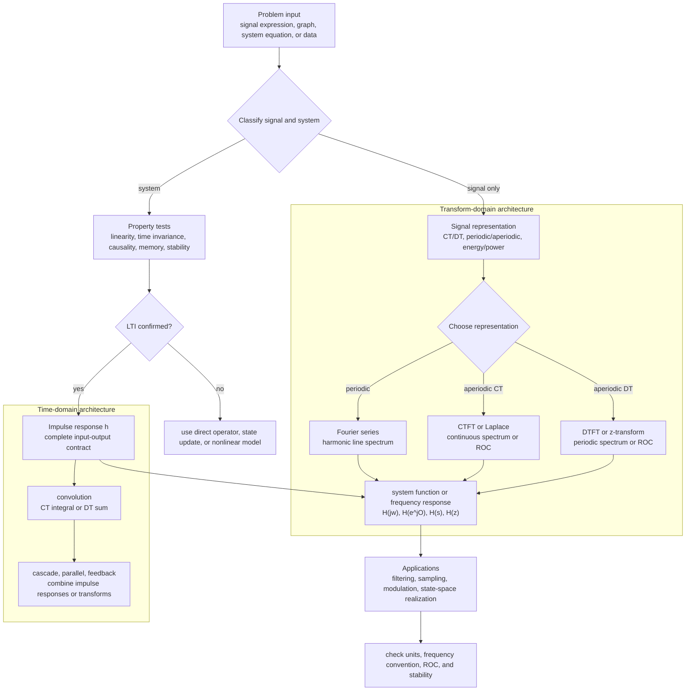

# Signals and Systems

Signals and systems is the study of how information, energy, and physical measurements vary with an independent variable, usually time, and how devices or mathematical rules transform those variations. In Oppenheim, Willsky, and Nawab's treatment, the main theme is representation: a complicated waveform becomes easier to understand after it is decomposed into impulses, shifted copies, exponentials, sinusoids, or transform-domain components.

The notes in this section follow the usual second-edition course arc: begin with signal and system models, build linear time-invariant systems through convolution, move into Fourier series and Fourier transforms, then use sampling, modulation, Laplace transforms, and $z$-transforms to analyze frequency behavior, stability, and realizations. The pages are working study notes rather than a replacement for the textbook. They emphasize definitions, formulas, example calculations, and the decision process for choosing the right domain.


*Figure: An oscilloscope grounds signal language in measured voltage traces, triggering, bandwidth, and time scales. Image: [Wikimedia Commons](https://commons.wikimedia.org/wiki/File:Tektronix_2235_100Mhz_Oscilloscope.png), Dennis van Zuijlekom, CC BY-SA 2.0.*


*Figure: Fourier analysis becomes concrete when a time waveform and its spectral lines are shown side by side. Image: [Wikimedia Commons](https://commons.wikimedia.org/wiki/File:Fourier_transform_time_and_frequency_domains.gif), Lucas Vieira, public domain.*


*Figure: Aliasing shows why sampling rate is a physical constraint, not just a numerical detail. Image: [Wikimedia Commons](https://commons.wikimedia.org/wiki/File:AliasingSines.svg), Moxfyre, CC BY-SA 3.0/GFDL.*

## Definitions

A signal is a function of one or more independent variables. In this section the independent variable is time, so continuous-time signals are written as $x(t)$ and discrete-time signals are written as $x[n]$. Continuous time uses real-valued time $t\in\mathbb{R}$; discrete time uses integer sample index $n\in\mathbb{Z}$. This difference determines whether formulas use integrals or sums, whether frequency is unique or periodic, and whether time shifts can be arbitrary real numbers or must be integer sample shifts.

A system is a mapping from an input signal to an output signal:

$$
y=T\{x\}.
$$

The most important system class in these notes is the linear time-invariant system. Linearity means superposition holds. Time invariance means a time shift at the input produces the same time shift at the output. These two properties imply that the impulse response determines the entire input-output behavior through convolution.

The chapter list used by these notes is:

| Order | Topic area | Wiki page |
|---:|---|---|
| 1 | Signal models, independent variables, transformations of time | [Signals and Time Transformations](/physics/signals-systems/signals-time-transformations) |
| 2 | Periodicity, energy, power, and signal classes | [Periodicity, Energy, and Power](/physics/signals-systems/periodicity-energy-power) |
| 3 | System properties: linearity, time invariance, causality, stability | [System Properties](/physics/signals-systems/system-properties) |
| 4 | Continuous- and discrete-time LTI systems | [LTI Systems and Convolution](/physics/signals-systems/lti-systems-convolution) |
| 5 | Periodic signal expansions | [Fourier Series for Periodic Signals](/physics/signals-systems/fourier-series-periodic-signals) |
| 6 | Aperiodic continuous-time spectra | [Continuous-Time Fourier Transform](/physics/signals-systems/continuous-time-fourier-transform) |
| 7 | Aperiodic discrete-time spectra | [Discrete-Time Fourier Transform](/physics/signals-systems/discrete-time-fourier-transform) |
| 8 | Sampling, aliasing, and reconstruction | [Sampling, Aliasing, and Reconstruction](/physics/signals-systems/sampling-aliasing-reconstruction) |
| 9 | Laplace-domain analysis and ROC | [Laplace Transform and ROC](/physics/signals-systems/laplace-transform-roc) |
| 10 | $z$-domain analysis and ROC | [Z-Transform and ROC](/physics/signals-systems/z-transform-roc) |
| 11 | Frequency response and filters | [Frequency Response and Filtering](/physics/signals-systems/frequency-response-filtering) |
| 12 | Modulation and communication models | [Modulation and Communication Systems](/physics/signals-systems/modulation-communication-systems) |
| 13 | State variables and first-order vector models | [State-Space Introduction](/physics/signals-systems/state-space-introduction) |

## Key results

The first organizing result is impulse decomposition. In discrete time,

$$
x[n]=\sum_{k=-\infty}^{\infty}x[k]\delta[n-k].
$$

In continuous time,

$$
x(t)=\int_{-\infty}^{\infty}x(\tau)\delta(t-\tau)\,d\tau.
$$

These formulas say that a signal can be assembled from shifted impulses. For LTI systems, each shifted impulse produces a shifted impulse response, so the weighted sum or integral of those responses gives convolution:

$$
y(t)=x(t)*h(t),
\qquad
y[n]=x[n]*h[n].
$$

The second organizing result is the complex exponential eigenfunction property. For an LTI system,

$$
e^{j\omega t}\to H(j\omega)e^{j\omega t}
$$

in continuous time, and

$$
e^{j\Omega n}\to H(e^{j\Omega})e^{j\Omega n}
$$

in discrete time. The frequency is preserved; only amplitude and phase change. Fourier series and Fourier transforms exploit this fact by decomposing signals into exponential components.

The third organizing result is that transform algebra must be paired with convergence information. A Laplace transform $X(s)$ or a $z$-transform $X(z)$ is incomplete without its region of convergence. The ROC determines sidedness, whether the Fourier transform exists, and whether a causal rational LTI system is stable.

Use this decision path when solving problems:

| If the problem gives... | Usually start with... | Reason |
|---|---|---|
| a graph or shifted expression | signal transformations | locate support and landmarks |
| system property claims | property tests | avoid assuming LTI |
| LTI impulse response | convolution or frequency response | $h$ determines the system |
| periodic signal | Fourier series | spectrum is harmonic lines |
| aperiodic CT signal | CTFT or Laplace | continuous spectrum or ROC needed |
| aperiodic DT sequence | DTFT or $z$-transform | periodic spectrum or ROC needed |
| sampling rate and bandwidth | sampling theorem | check aliasing before reconstruction |

Another useful habit is to separate representation questions from system questions. A representation question asks, "How can this signal be decomposed?" A system question asks, "How does the operator act on each component?" For example, Fourier series is a representation method for periodic signals, while frequency response is a system method for LTI systems. They work together only after the system has been identified as LTI.

The same separation helps with transform domains. The CTFT and DTFT describe spectra directly on frequency axes. The Laplace and $z$ transforms add convergence regions so that exponential growth, decay, sidedness, and stability can be represented. When a problem includes words such as causal, stable, right-sided, left-sided, pole, zero, or ROC, it is usually asking for Laplace or $z$ reasoning, not only Fourier algebra.

Finally, always track units. Continuous-time frequency $\omega$ is in radians per second, ordinary frequency $f$ is in cycles per second, and discrete-time frequency $\Omega$ is in radians per sample. The conversion $\Omega=\omega T$ is central in sampling problems and is a common place where otherwise correct solutions lose a factor of $2\pi$.

## Visual



This overview diagram separates the signals-and-systems workflow into classification, property testing, LTI reduction, time-domain convolution, transform-domain representation, and application layers. The impulse response is shown as the key I/O contract for LTI systems, while Fourier, Laplace, DTFT, and $z$ tools are routed by signal type and ROC needs. The final check node captures the common failure points: units, frequency convention, sidedness, and stability.

## Worked example 1: choosing the right representation

Problem: A signal is described as a nonzero periodic square wave with period $T_0=4$, and it is passed through an LTI system with known frequency response $H(j\omega)$. Which representation should be used to compute the steady output?

Method:

1. The input is continuous-time because its period is given as a real time $T_0=4$ rather than an integer sample period.

2. The input is periodic and nonzero. A nonzero periodic signal usually has infinite total energy but finite average power, so a Fourier transform as an ordinary function is not the most direct representation.

3. Use the continuous-time Fourier series:

$$
x(t)=\sum_{k=-\infty}^{\infty}a_k e^{jk\omega_0t}.
$$

4. Compute the fundamental frequency:

$$
\omega_0=\frac{2\pi}{T_0}=\frac{2\pi}{4}=\frac{\pi}{2}.
$$

5. Because the system is LTI, each harmonic is scaled by the frequency response at that harmonic:

$$
y(t)=\sum_{k=-\infty}^{\infty}a_k H\left(jk\frac{\pi}{2}\right)e^{jk(\pi/2)t}.
$$

Checked answer: Use CT Fourier series coefficients, not a finite-energy CTFT calculation. The LTI system acts by multiplying the $k$th harmonic coefficient by $H(jk\pi/2)$.

## Worked example 2: identifying when ROC is required

Problem: Two sequences have the same algebraic $z$-transform expression,

$$
X(z)=\frac{1}{1-0.8z^{-1}}.
$$

One has ROC $\vert z\vert \gt 0.8$, and the other has ROC $\vert z\vert \lt 0.8$. Are they the same sequence?

Method:

1. The expression has a pole at $z=0.8$.

2. ROC $\vert z\vert \gt 0.8$ corresponds to the right-sided geometric sequence

$$
x_1[n]=(0.8)^n u[n].
$$

3. ROC $\vert z\vert \lt 0.8$ corresponds to the left-sided sequence

$$
x_2[n]=-(0.8)^n u[-n-1].
$$

4. Compare a sample. At $n=0$,

$$
x_1[0]=1,\qquad x_2[0]=0.
$$

5. Therefore the sequences are different even though the rational expression is identical.

Checked answer: They are not the same sequence. The ROC is part of the transform specification.

## Code

```python
import numpy as np

def choose_tool(is_periodic, is_discrete, is_lti, has_roc_question):
    if has_roc_question:
        return "z-transform" if is_discrete else "Laplace transform"
    if is_periodic:
        return "DT Fourier series" if is_discrete else "CT Fourier series"
    if is_lti:
        return "DTFT/frequency response" if is_discrete else "CTFT/frequency response"
    return "start with definitions and system-property tests"

cases = [
    (True, False, True, False),
    (False, True, True, True),
    (False, False, False, False),
]

for case in cases:
    print(case, "->", choose_tool(*case))
```

## Common pitfalls

- Treating continuous-time and discrete-time variables as interchangeable. Use $t$ for CT and $n$ for DT unless a page explicitly says otherwise.
- Forgetting the region of convergence for Laplace and $z$ transforms. The same rational expression can describe different signals.
- Assuming that every bounded-looking formula has finite energy. Periodic nonzero signals have infinite energy but finite average power.
- Calling every frequency-domain plot a Fourier transform. Periodic signals often use Fourier series coefficients, while aperiodic signals use transform densities.
- Applying ideal sampling conclusions without checking bandlimiting. Sampling below Nyquist creates aliasing that cannot be removed by an ideal reconstruction filter.
- Using LTI shortcuts before proving the system is LTI. Convolution and frequency response are not valid for arbitrary nonlinear or time-varying systems.

## Connections

- [Signals and Time Transformations](/physics/signals-systems/signals-time-transformations)
- [Periodicity, Energy, and Power](/physics/signals-systems/periodicity-energy-power)
- [System Properties](/physics/signals-systems/system-properties)
- [LTI Systems and Convolution](/physics/signals-systems/lti-systems-convolution)
- [Continuous-Time Fourier Transform](/physics/signals-systems/continuous-time-fourier-transform)
- [Sampling, Aliasing, and Reconstruction](/physics/signals-systems/sampling-aliasing-reconstruction)
- [Laplace Transform and ROC](/physics/signals-systems/laplace-transform-roc)
- [Z-Transform and ROC](/physics/signals-systems/z-transform-roc)
