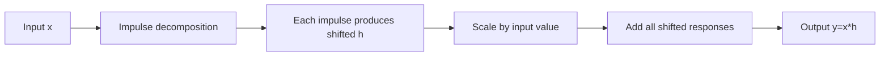

# LTI Systems and Convolution

Linear time-invariant systems are the central model class in signals and systems because they are both expressive and computable. Linearity lets responses add, and time invariance lets a shifted input impulse produce a shifted copy of one fixed response. From these two facts, the output for any input is obtained by convolution with the impulse response.

Convolution is often introduced as a formula, but its meaning is constructive. Break the input into weighted impulses. Pass each impulse through the system. Shift and scale the impulse response for each piece. Add all those responses. In continuous time this addition becomes an integral; in discrete time it becomes a sum.

## Definitions

The impulse response of a continuous-time system is the output when the input is $\delta(t)$:

$$
h(t)=T\{\delta(t)\}.
$$

The impulse response of a discrete-time system is

$$
h[n]=T\{\delta[n]\}.
$$

For a continuous-time LTI system, the input can be represented as

$$
x(t)=\int_{-\infty}^{\infty}x(\tau)\delta(t-\tau)\,d\tau.
$$

By time invariance,

$$
T\{\delta(t-\tau)\}=h(t-\tau).
$$

By linearity, the output is

$$
y(t)=\int_{-\infty}^{\infty}x(\tau)h(t-\tau)\,d\tau.
$$

This is the continuous-time convolution of $x$ and $h$, written

$$
y(t)=(x*h)(t).
$$

For a discrete-time LTI system,

$$
x[n]=\sum_{k=-\infty}^{\infty}x[k]\delta[n-k],
$$

so

$$
y[n]=\sum_{k=-\infty}^{\infty}x[k]h[n-k].
$$

This is discrete-time convolution:

$$
y[n]=(x*h)[n].
$$

Convolution has equivalent forms:

$$
(x*h)(t)=\int_{-\infty}^{\infty}h(\tau)x(t-\tau)\,d\tau,
$$

and

$$
(x*h)[n]=\sum_{k=-\infty}^{\infty}h[k]x[n-k].
$$

For a causal continuous-time LTI system,

$$
h(t)=0 \quad \text{for } t<0.
$$

For a causal discrete-time LTI system,

$$
h[n]=0 \quad \text{for } n<0.
$$

BIBO stability for an LTI system is equivalent to absolute integrability or summability:

$$
\int_{-\infty}^{\infty}|h(t)|\,dt<\infty
$$

for continuous time, and

$$
\sum_{n=-\infty}^{\infty}|h[n]|<\infty
$$

for discrete time.

## Key results

Convolution is commutative:

$$
x*h=h*x.
$$

For continuous time, this follows from the change of variables $\lambda=t-\tau$. For discrete time, it follows from the index substitution $\ell=n-k$. Commutativity means either signal can be flipped and shifted in the graphical convolution procedure, but it does not mean the physical roles of input and impulse response are identical.

Convolution is associative:

$$
x*(h_1*h_2)=(x*h_1)*h_2.
$$

This property explains why cascaded LTI systems have an equivalent impulse response

$$
h_{\text{eq}}=h_1*h_2.
$$

Convolution is distributive:

$$
x*(h_1+h_2)=x*h_1+x*h_2.
$$

This explains parallel interconnections of LTI systems.

The impulse is the identity element:

$$
x(t)*\delta(t)=x(t), \qquad x[n]*\delta[n]=x[n].
$$

Shifting an impulse response shifts the output:

$$
x(t)*\delta(t-t_0)=x(t-t_0),
$$

and

$$
x[n]*\delta[n-n_0]=x[n-n_0].
$$

For differential equation systems with zero initial rest, impulse response can be found by solving the equation with impulse input or by transform methods. For difference equation systems, $h[n]$ is found by setting $x[n]=\delta[n]$ and recursively computing the output, assuming initial rest.

Graphical convolution is easiest when treated as an overlap problem. First identify where $x(\tau)$ is nonzero. Then identify where $h(t-\tau)$ or $h[n-k]$ is nonzero for a fixed output time or sample. The output is the area or sum of the product over the overlap. For rectangular pulses this reduces to overlap length; for ramps and exponentials the integrand changes over the overlap and the integral must be evaluated on each range.

Support gives a quick check. If $x(t)$ is supported on $[a,b]$ and $h(t)$ is supported on $[c,d]$, then $x*h$ is supported on $[a+c,b+d]$, assuming no exact cancellations. In discrete time, if one sequence occupies indices $a$ through $b$ and another occupies $c$ through $d$, the convolution occupies $a+c$ through $b+d$. This support rule catches many off-by-one and endpoint mistakes.

Convolution also explains why LTI systems are easy to interconnect. In cascade, impulse responses convolve. In parallel, impulse responses add. In feedback, the equivalent impulse response can often be described by an infinite convolution series or by transform-domain algebra, provided the feedback interconnection is stable and well-defined. These interconnection rules are not generic system rules; they rely on LTI structure.

The impulse response is sometimes more informative than the original equation. A short finite impulse response means the system has finite memory. A long decaying impulse response means old inputs continue to matter but with decreasing influence. A nondecaying impulse response warns that bounded inputs may produce unbounded or persistent accumulated effects.

## Visual



| LTI fact | Continuous time | Discrete time |
|---|---|---|
| Impulse response | $h(t)=T\{\delta(t)\}$ | $h[n]=T\{\delta[n]\}$ |
| Convolution | $y(t)=\int x(\tau)h(t-\tau)d\tau$ | $y[n]=\sum_k x[k]h[n-k]$ |
| Causality | $h(t)=0$ for $t\lt 0$ | $h[n]=0$ for $n\lt 0$ |
| BIBO stability | $\int \vert h(t)\vert dt\lt \infty$ | $\sum_n \vert h[n]\vert \lt \infty$ |
| Identity | $\delta(t)$ | $\delta[n]$ |

## Worked example 1: continuous-time convolution of two pulses

Problem: Let

$$
x(t)=u(t)-u(t-2),
\qquad
h(t)=u(t)-u(t-3).
$$

Find $y(t)=x(t)*h(t)$.

Method:

1. Interpret the signals. $x(t)$ is a unit-height rectangle on $0\le t\lt 2$. $h(t)$ is a unit-height rectangle on $0\le t\lt 3$.

2. The convolution integral is

$$
y(t)=\int_{-\infty}^{\infty}x(\tau)h(t-\tau)\,d\tau.
$$

3. The factor $x(\tau)$ is nonzero for

$$
0\le \tau<2.
$$

4. The factor $h(t-\tau)$ is nonzero when

$$
0\le t-\tau<3.
$$

This is equivalent to

$$
t-3<\tau\le t.
$$

5. The integrand equals $1$ where the intervals overlap:

$$
[0,2) \cap (t-3,t].
$$

Therefore $y(t)$ equals the length of that overlap.

6. Work by ranges of $t$:

If $t\lt 0$, no overlap:

$$
y(t)=0.
$$

If $0\le t\lt 2$, the overlap is from $0$ to $t$, length $t$:

$$
y(t)=t.
$$

If $2\le t\lt 3$, the shorter pulse is fully inside the longer overlap window, length $2$:

$$
y(t)=2.
$$

If $3\le t\lt 5$, the overlap is from $t-3$ to $2$, length $5-t$:

$$
y(t)=5-t.
$$

If $t\ge 5$, no overlap:

$$
y(t)=0.
$$

Checked answer:

$$
y(t)=
\begin{cases}
0, & t<0,\\
t, & 0\le t<2,\\
2, & 2\le t<3,\\
5-t, & 3\le t<5,\\
0, & t\ge 5.
\end{cases}
$$

The support length is $2+3=5$, as expected for convolution of two right-starting finite pulses.

## Worked example 2: discrete-time convolution

Problem: Compute $y[n]=x[n]*h[n]$ for

$$
x[n]=\delta[n]+2\delta[n-1]+\delta[n-2],
$$

and

$$
h[n]=\delta[n]-\delta[n-1].
$$

Method:

1. Use impulse shifting:

$$
x*h=(\delta[n]+2\delta[n-1]+\delta[n-2])*h[n].
$$

2. Distribute convolution:

$$
y[n]=\delta[n]*h[n]+2\delta[n-1]*h[n]+\delta[n-2]*h[n].
$$

3. Convolution with a shifted impulse shifts $h$:

$$
y[n]=h[n]+2h[n-1]+h[n-2].
$$

4. Substitute $h[n]=\delta[n]-\delta[n-1]$:

$$
y[n]=(\delta[n]-\delta[n-1])
+2(\delta[n-1]-\delta[n-2])
+(\delta[n-2]-\delta[n-3]).
$$

5. Collect like impulse terms:

$$
y[n]=\delta[n]+\delta[n-1]-\delta[n-2]-\delta[n-3].
$$

Checked answer: The output samples are $1$ at $n=0$, $1$ at $n=1$, $-1$ at $n=2$, $-1$ at $n=3$, and $0$ elsewhere. Direct summation gives the same result.

## Code

```python
import numpy as np
import matplotlib.pyplot as plt

x = np.array([1, 2, 1], dtype=float)
h = np.array([1, -1], dtype=float)
y = np.convolve(x, h)

print("y samples:", y)

n_x = np.arange(len(x))
n_h = np.arange(len(h))
n_y = np.arange(len(y))

fig, ax = plt.subplots(3, 1, figsize=(7, 6), sharex=True)
ax[0].stem(n_x, x)
ax[0].set_title("x[n]")
ax[1].stem(n_h, h)
ax[1].set_title("h[n]")
ax[2].stem(n_y, y)
ax[2].set_title("y[n]=x[n]*h[n]")
for a in ax:
    a.grid(True)
plt.tight_layout()
plt.show()
```

## Common pitfalls

- Forgetting the flip in graphical convolution. The term is $h(t-\tau)$ or $h[n-k]$, not $h(t+\tau)$.
- Using LTI convolution for a system that is linear but time-varying, or time-invariant but nonlinear.
- Confusing impulse response with step response. The step response is the convolution of $h$ with $u$.
- Dropping boundary cases in finite pulse convolution. Draw overlap intervals and compute lengths.
- Assuming causal means stable. A causal impulse response can still fail absolute integrability or summability.

## Connections

- [System Properties](/physics/signals-systems/system-properties)
- [Continuous-Time Fourier Transform](/physics/signals-systems/continuous-time-fourier-transform)
- [Discrete-Time Fourier Transform](/physics/signals-systems/discrete-time-fourier-transform)
- [Laplace Transform and ROC](/physics/signals-systems/laplace-transform-roc)
- [Z-Transform and ROC](/physics/signals-systems/z-transform-roc)
