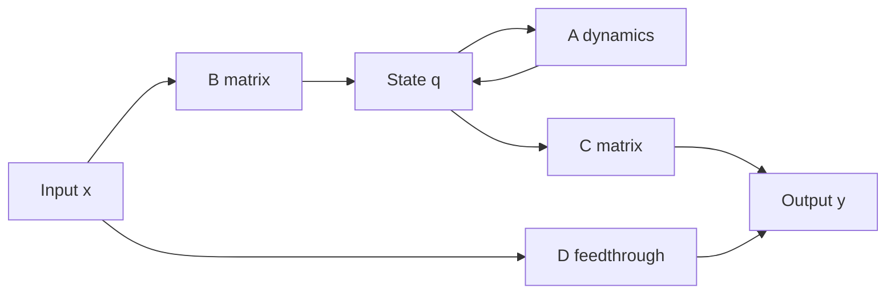

# State-Space Introduction

State-space models describe systems using internal variables rather than only input-output equations. A state is a minimal set of variables that, together with the future input, determines the future output. This viewpoint is especially useful for multi-input multi-output systems, interconnected systems, simulation, and modern control.

In a signals and systems course, state space complements convolution and transform methods. Convolution emphasizes the impulse response of an LTI system. Transform methods emphasize poles, zeros, and frequency response. State space emphasizes first-order vector dynamics and internal structure. The same system can often be represented in all three ways.

## Definitions

A continuous-time linear time-invariant state-space model is

$$
\frac{d}{dt}q(t)=Aq(t)+Bx(t),
$$

$$
y(t)=Cq(t)+Dx(t).
$$

Here $q(t)$ is the state vector, $x(t)$ is the input, $y(t)$ is the output, and $A,B,C,D$ are constant matrices of compatible dimensions. Many books use $x(t)$ for the state, but these notes use $q(t)$ for state to avoid conflict with the input signal $x(t)$.

A discrete-time LTI state-space model is

$$
q[n+1]=Aq[n]+Bx[n],
$$

$$
y[n]=Cq[n]+Dx[n].
$$

The matrix $A$ controls internal dynamics. The matrix $B$ injects the input into the state. The matrix $C$ maps state to output. The matrix $D$ is a direct feedthrough term from input to output.

For continuous time, the zero-input response is

$$
q_{\text{zi}}(t)=e^{At}q(0),
$$

where the matrix exponential is

$$
e^{At}=I+At+\frac{A^2t^2}{2!}+\frac{A^3t^3}{3!}+\cdots.
$$

The zero-state response is

$$
q_{\text{zs}}(t)=\int_{0}^{t}e^{A(t-\tau)}Bx(\tau)\,d\tau.
$$

Thus

$$
q(t)=e^{At}q(0)+\int_{0}^{t}e^{A(t-\tau)}Bx(\tau)\,d\tau.
$$

For discrete time,

$$
q[n]=A^n q[0]+\sum_{k=0}^{n-1}A^{n-1-k}B x[k].
$$

The continuous-time transfer function for zero initial conditions is

$$
H(s)=C(sI-A)^{-1}B+D.
$$

The discrete-time transfer function is

$$
H(z)=C(zI-A)^{-1}B+D.
$$

## Key results

State-space models convert higher-order scalar equations into first-order vector equations. For example, a second-order differential equation can be represented by choosing state variables such as position and velocity. This is not just bookkeeping: first-order vector form makes interconnection, simulation, and eigenvalue analysis systematic.

The eigenvalues of $A$ are the natural modes of the system. In continuous time, a mode associated with eigenvalue $\lambda$ behaves like $e^{\lambda t}$. For causal finite-dimensional LTI systems, internal asymptotic stability requires

$$
\operatorname{Re}(\lambda_i)<0
$$

for every eigenvalue of $A$. In discrete time, modes behave like $\lambda^n$, and internal asymptotic stability requires

$$
|\lambda_i|<1.
$$

The transfer function denominator is related to

$$
\det(sI-A)
$$

or

$$
\det(zI-A),
$$

although pole-zero cancellations can hide internal modes from the input-output transfer function. This is one reason state-space analysis can reveal behavior that a transfer function alone may obscure.

For a continuous-time state-space model with impulse input and zero initial state, the impulse response is

$$
h(t)=Ce^{At}Bu(t)+D\delta(t)
$$

in the single-input single-output case. The $D\delta(t)$ term represents direct feedthrough.

For discrete time, the impulse response is

$$
h[0]=D,
$$

and for $n\ge 1$,

$$
h[n]=CA^{n-1}B.
$$

These formulas connect state space back to convolution.

State choice is not unique. If $q(t)$ is a valid state, then $\tilde q(t)=Pq(t)$ is also a valid state for any invertible matrix $P$, with transformed matrices

$$
\tilde A=PAP^{-1},\qquad \tilde B=PB,\qquad \tilde C=CP^{-1},\qquad \tilde D=D.
$$

The transfer function is unchanged by this similarity transformation. This means state variables are coordinates for internal behavior, not directly observable physical quantities unless they are chosen that way.

Two structural ideas often appear after the introductory treatment. Controllability asks whether inputs can move the state through the whole state space. Observability asks whether outputs contain enough information to determine the state. A transfer function can hide uncontrollable or unobservable modes through pole-zero cancellation, while a state-space model can expose them. For this introductory page, the important point is that state space contains internal information beyond the external input-output formula.

For numerical simulation, state-space form is practical because first-order update rules are natural for computers. Continuous-time models can be integrated with ODE solvers, and discrete-time models can be iterated directly. This is one reason state-space notation is common in control, estimation, signal processing, and physics-based modeling.

The input-output transfer function assumes zero initial conditions, but state-space equations naturally include nonzero initial state. This distinction matters physically. A circuit capacitor may already be charged, a mass may already be moving, or a filter memory may contain previous samples. Transform methods can handle these cases, but state space makes the stored internal information explicit from the start.

Dimensions are a useful sanity check. If the state has length $m$, then $A$ is $m\times m$. For a single input, $B$ is $m\times 1$. For a single output, $C$ is $1\times m$. Checking matrix shapes often catches an incorrect state choice before any algebra is done.

## Visual



| Representation | Main object | Best for | Typical equation |
|---|---|---|---|
| Convolution | impulse response $h$ | LTI input-output response | $y=x*h$ |
| Fourier response | $H(j\omega)$ or $H(e^{j\Omega})$ | filtering and spectra | $Y=HX$ |
| Laplace / $z$ | $H(s)$ or $H(z)$ with ROC | poles, stability, transients | rational system functions |
| State space | $A,B,C,D$ | internal dynamics and MIMO systems | $\dot q=Aq+Bx$ |

## Worked example 1: building a state model from a differential equation

Problem: Convert the differential equation

$$
\frac{d^2y}{dt^2}+3\frac{dy}{dt}+2y=x(t)
$$

to continuous-time state-space form using

$$
q_1(t)=y(t), \qquad q_2(t)=\frac{dy}{dt}.
$$

Method:

1. Write the first state equation:

$$
\frac{dq_1}{dt}=q_2.
$$

2. Use the differential equation to solve for the second derivative:

$$
\frac{d^2y}{dt^2}=x(t)-3\frac{dy}{dt}-2y.
$$

3. Substitute states:

$$
\frac{dq_2}{dt}=x(t)-3q_2(t)-2q_1(t).
$$

4. Arrange in matrix form:

$$
\frac{d}{dt}
\begin{bmatrix}
q_1\\
q_2
\end{bmatrix}
=
\begin{bmatrix}
0 & 1\\
-2 & -3
\end{bmatrix}
\begin{bmatrix}
q_1\\
q_2
\end{bmatrix}
+
\begin{bmatrix}
0\\
1
\end{bmatrix}
x(t).
$$

5. The output is $y=q_1$, so

$$
y(t)=
\begin{bmatrix}
1 & 0
\end{bmatrix}
\begin{bmatrix}
q_1\\
q_2
\end{bmatrix}
+0\cdot x(t).
$$

Checked answer:

$$
A=
\begin{bmatrix}
0 & 1\\
-2 & -3
\end{bmatrix},
\quad
B=
\begin{bmatrix}
0\\
1
\end{bmatrix},
\quad
C=
\begin{bmatrix}
1 & 0
\end{bmatrix},
\quad
D=0.
$$

The eigenvalues of $A$ are $-1$ and $-2$, matching the natural modes of the differential equation.

## Worked example 2: impulse response from discrete-time state space

Problem: A discrete-time system is defined by

$$
q[n+1]=0.5q[n]+x[n],
$$

$$
y[n]=q[n],
$$

with zero initial state. Find its impulse response.

Method:

1. Identify matrices:

$$
A=0.5,\qquad B=1,\qquad C=1,\qquad D=0.
$$

2. For discrete-time state space, the impulse response satisfies

$$
h[0]=D=0.
$$

3. For $n\ge 1$,

$$
h[n]=CA^{n-1}B.
$$

4. Substitute scalar values:

$$
h[n]=1\cdot (0.5)^{n-1}\cdot 1=(0.5)^{n-1},\qquad n\ge 1.
$$

5. Combine with the step:

$$
h[n]=(0.5)^{n-1}u[n-1].
$$

Checked answer:

$$
h[0]=0,\quad h[1]=1,\quad h[2]=0.5,\quad h[3]=0.25,\quad \ldots
$$

The system is causal and stable because the state eigenvalue has magnitude $0.5\lt 1$.

## Code

```python
import numpy as np
from scipy.signal import StateSpace, impulse
import matplotlib.pyplot as plt

A = np.array([[0, 1], [-2, -3]], dtype=float)
B = np.array([[0], [1]], dtype=float)
C = np.array([[1, 0]], dtype=float)
D = np.array([[0]], dtype=float)

eigvals = np.linalg.eigvals(A)
print("continuous-time eigenvalues:", eigvals)

sys = StateSpace(A, B, C, D)
t, y = impulse(sys, T=np.linspace(0, 8, 400))

n = np.arange(0, 12)
h_dt = np.where(n >= 1, 0.5 ** (n - 1), 0.0)

fig, ax = plt.subplots(1, 2, figsize=(10, 3))
ax[0].plot(t, y)
ax[0].set_title("CT impulse response")
ax[0].grid(True)

ax[1].stem(n, h_dt)
ax[1].set_title("DT state-space impulse response")
ax[1].grid(True)
plt.tight_layout()
plt.show()
```

## Common pitfalls

- Using $x(t)$ for both input and state without clarifying notation.
- Forgetting the direct feedthrough term $D$, especially in impulse-response formulas.
- Assuming transfer-function stability always reveals internal stability. Hidden modes can be canceled in input-output form.
- Confusing continuous-time stability conditions with discrete-time ones. CT uses left half-plane; DT uses inside the unit circle.
- Treating state variables as unique. Many different state choices can represent the same input-output behavior.

## Connections

- [System Properties](/physics/signals-systems/system-properties)
- [LTI Systems and Convolution](/physics/signals-systems/lti-systems-convolution)
- [Laplace Transform and ROC](/physics/signals-systems/laplace-transform-roc)
- [Z-Transform and ROC](/physics/signals-systems/z-transform-roc)
- [Frequency Response and Filtering](/physics/signals-systems/frequency-response-filtering)
