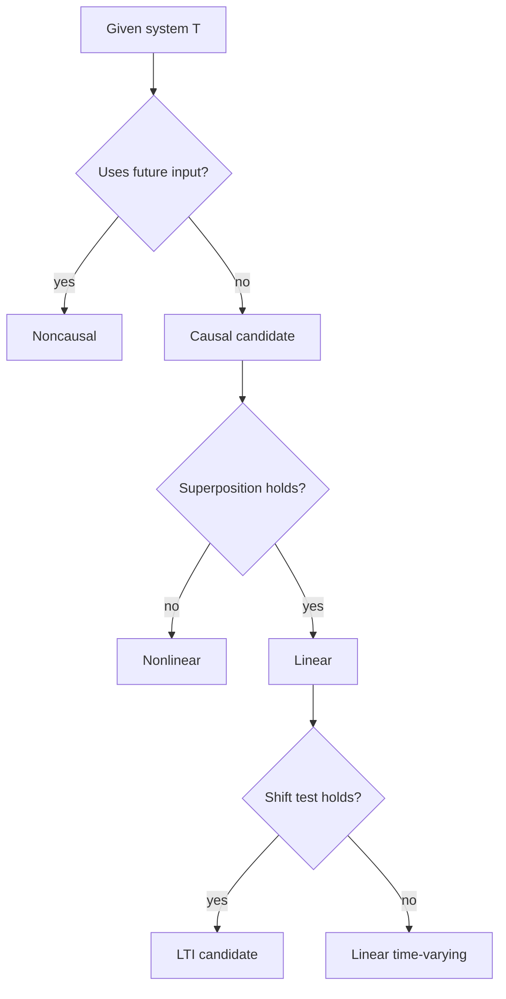

# System Properties

A system maps an input signal to an output signal. It can represent an electrical network, a mechanical suspension, a digital filter, a communication channel, or an abstract operation such as differentiation. Before solving a system, the first task is to classify it. Properties such as linearity, time invariance, causality, memory, stability, and invertibility determine which tools are legal and which conclusions can be trusted.

The most important later theory, linear time-invariant analysis, is built from two of these properties. Linearity gives superposition. Time invariance says the system behaves the same way regardless of the absolute time origin. Together they imply that the response to any signal can be assembled from shifted impulse responses, producing convolution.

## Definitions

A continuous-time system $T$ maps an input $x(t)$ to an output

$$
y(t)=T\{x(t)\}.
$$

A discrete-time system maps $x[n]$ to

$$
y[n]=T\{x[n]\}.
$$

A system is memoryless if the output at a time depends only on the input value at that same time. In continuous time, a memoryless system has the form

$$
y(t)=f(x(t))
$$

for some function $f$. In discrete time,

$$
y[n]=f(x[n]).
$$

A system has memory if the output depends on past, future, or accumulated values of the input. Examples include

$$
y(t)=x(t-2), \qquad y(t)=\int_{-\infty}^{t}x(\tau)\,d\tau, \qquad y[n]=x[n]+x[n-1].
$$

A system is linear if it satisfies superposition. For any inputs $x_1$ and $x_2$, and any constants $a$ and $b$,

$$
T\{a x_1+b x_2\}=aT\{x_1\}+bT\{x_2\}.
$$

Equivalently, linearity is additivity plus homogeneity.

A system is time-invariant if shifting the input shifts the output by the same amount. In continuous time, if

$$
T\{x(t)\}=y(t),
$$

then for every real $t_0$,

$$
T\{x(t-t_0)\}=y(t-t_0).
$$

In discrete time, if $T\{x[n]\}=y[n]$, then for every integer $n_0$,

$$
T\{x[n-n_0]\}=y[n-n_0].
$$

A system is causal if the output at the present does not depend on future input values. For continuous time, $y(t_0)$ may depend on $x(t)$ only for $t\le t_0$. For discrete time, $y[n_0]$ may depend on $x[n]$ only for $n\le n_0$.

A system is bounded-input bounded-output stable, or BIBO stable, if every bounded input produces a bounded output. Formally, if

$$
|x(t)|\le B_x<\infty
$$

for all $t$, then there must exist a finite $B_y$ such that

$$
|y(t)|\le B_y
$$

for all $t$. The same definition applies to sequences.

A system is invertible if distinct inputs produce distinct outputs, so that another system can recover the input from the output. If $T^{-1}$ exists, then

$$
T^{-1}\{T\{x\}\}=x.
$$

## Key results

To prove linearity, test the combined input directly. Compute the output produced by $a x_1+b x_2$, and compare it with $a y_1+b y_2$. A single counterexample is enough to disprove linearity. Systems that add constants, multiply signals by themselves, take magnitudes, or contain fixed thresholds are usually nonlinear.

To test time invariance, use two paths:

1. Shift the input first, then apply the system.
2. Apply the system first, then shift the output.

If the two expressions match for every input and every shift, the system is time-invariant. If the system contains explicit time, such as $t x(t)$ or $n x[n]$, it is often time-varying. However, explicit time is a warning sign, not a proof by itself; the two-path test is definitive.

For memorylessness, a delay system such as $y[n]=x[n-1]$ has memory, even though it is simple. A memoryless nonlinear system such as

$$
y(t)=x^2(t)
$$

has no memory but is not linear. Properties are independent; one should not infer one from another.

Causality is about information ordering, not algebraic simplicity. The system

$$
y[n]=x[n]+x[n-1]
$$

is causal because it uses present and past inputs. The system

$$
y[n]=x[n+1]
$$

is noncausal because it requires a future input sample.

For LTI systems, later pages give sharper tests: causality is equivalent to $h(t)=0$ for $t\lt 0$ or $h[n]=0$ for $n\lt 0$, and BIBO stability is equivalent to absolute integrability or absolute summability of the impulse response. Those tests depend on LTI structure and should not be used for arbitrary systems.

When several properties are requested, test them independently and record the reason for each conclusion. A system can be linear and noncausal, nonlinear and memoryless, stable and noninvertible, or causal and unstable. Many exam errors come from treating the properties as a chain of implications. The only major implication in this early list is that memoryless systems are automatically causal, because a present output depending only on the present input cannot depend on future input values.

For systems described by formulas, it is helpful to classify the location of input samples or values first. Terms like $x(t-3)$ or $x[n-1]$ point to the past. Terms like $x(t+3)$ or $x[n+1]$ point to the future. Terms like $\int_{-\infty}^{t}x(\tau)d\tau$ use accumulated past information, while $\int_{t}^{\infty}x(\tau)d\tau$ uses future information. This quick scan makes the causality and memory tests less error-prone before moving to linearity and time invariance.

## Visual

| Property | Question to ask | Typical test | Common counterexample |
|---|---|---|---|
| Memoryless | Does output use only current input? | inspect dependence on $x(t_0)$ or $x[n_0]$ | $y[n]=x[n-1]$ |
| Linear | Does superposition hold? | compare $T\{a x_1+b x_2\}$ with $a y_1+b y_2$ | $y=x^2$ |
| Time-invariant | Does a shift commute with the system? | two-path shift test | $y(t)=t x(t)$ |
| Causal | Is future input needed? | check dependence relative to current time | $y[n]=x[n+2]$ |
| BIBO stable | Do bounded inputs always give bounded outputs? | find bound or counterexample | $y(t)=\int_{-\infty}^{t}x(\tau)d\tau$ |
| Invertible | Can input be recovered uniquely? | check one-to-one behavior | $y(t)=x^2(t)$ |



## Worked example 1: classifying a continuous-time system

Problem: Classify

$$
y(t)=t x(t-1)
$$

with respect to memory, linearity, time invariance, and causality.

Method:

1. Memory: The output at time $t$ uses $x(t-1)$, not only $x(t)$. Therefore the system has memory.

2. Linearity: Let inputs $x_1$ and $x_2$ produce

$$
y_1(t)=t x_1(t-1), \qquad y_2(t)=t x_2(t-1).
$$

For input $a x_1+b x_2$,

$$
T\{a x_1+b x_2\}
=t\left(a x_1(t-1)+b x_2(t-1)\right).
$$

Distribute:

$$
t\left(a x_1(t-1)+b x_2(t-1)\right)
=a t x_1(t-1)+b t x_2(t-1)
=a y_1(t)+b y_2(t).
$$

So the system is linear.

3. Time invariance: First shift the input by $t_0$:

$$
x_s(t)=x(t-t_0).
$$

Apply the system:

$$
T\{x_s\}=t x_s(t-1)=t x(t-1-t_0).
$$

Now apply the system first and shift the output:

$$
y(t-t_0)=(t-t_0)x(t-t_0-1).
$$

The two expressions are

$$
t x(t-1-t_0)
$$

and

$$
(t-t_0)x(t-1-t_0).
$$

They are not equal for arbitrary $t_0$ and $x$. Therefore the system is time-varying.

4. Causality: At time $t$, the output uses $x(t-1)$, a past value. Therefore the system is causal.

Checked answer: The system has memory, is linear, is time-varying, and is causal.

## Worked example 2: testing BIBO stability and invertibility

Problem: Consider the discrete-time system

$$
y[n]=x^2[n].
$$

Determine whether it is memoryless, linear, time-invariant, BIBO stable, and invertible over real-valued input sequences.

Method:

1. Memoryless: $y[n]$ depends only on $x[n]$, so it is memoryless.

2. Linearity: Test homogeneity with input $x[n]$ and scalar $a$:

$$
T\{a x[n]\}=(a x[n])^2=a^2x^2[n].
$$

But

$$
aT\{x[n]\}=a x^2[n].
$$

These are not equal for general $a$. For example, $a=2$ gives $4x^2[n]$ versus $2x^2[n]$. The system is nonlinear.

3. Time invariance: Shift the input:

$$
x_s[n]=x[n-n_0].
$$

Then

$$
T\{x_s\}=x^2[n-n_0].
$$

The original output shifted is

$$
y[n-n_0]=x^2[n-n_0].
$$

They match, so the system is time-invariant.

4. BIBO stability: If $\vert x[n]\vert \le B_x$, then

$$
|y[n]|=|x^2[n]|=|x[n]|^2\le B_x^2.
$$

So the system is BIBO stable.

5. Invertibility: Real inputs $x[n]$ and $-x[n]$ produce the same output:

$$
x^2[n]=(-x[n])^2.
$$

Unless the domain is restricted to nonnegative signals, the input cannot be recovered uniquely.

Checked answer: The system is memoryless, nonlinear, time-invariant, BIBO stable, and not invertible over all real sequences.

## Code

```python
import numpy as np

def system_square(x):
    return x**2

n = np.arange(-4, 5)
x = np.array([-2, -1, 0, 1, 2, 1, 0, -1, -2], dtype=float)
shift = 2

left = system_square(np.roll(x, shift))
right = np.roll(system_square(x), shift)

print("time-invariance check:", np.allclose(left, right))
print("x and -x produce same output:", np.allclose(system_square(x), system_square(-x)))
print("bounded input max:", np.max(np.abs(x)))
print("bounded output max:", np.max(np.abs(system_square(x))))
```

## Common pitfalls

- Treating nonlinear as equivalent to time-varying. These are separate properties.
- Calling a delayed system memoryless. Any dependence on $x(t-t_0)$ with $t_0\ne 0$ is memory.
- Declaring a system time-varying only because the expression looks complicated. Use the two-path shift test.
- Using LTI impulse-response tests for systems that have not been proven LTI.
- Forgetting that invertibility depends on the allowed input set. Squaring is not invertible on all real signals, but it is invertible on nonnegative signals.

## Connections

- [Signals and Time Transformations](/physics/signals-systems/signals-time-transformations)
- [LTI Systems and Convolution](/physics/signals-systems/lti-systems-convolution)
- [Frequency Response and Filtering](/physics/signals-systems/frequency-response-filtering)
- [State-Space Introduction](/physics/signals-systems/state-space-introduction)
