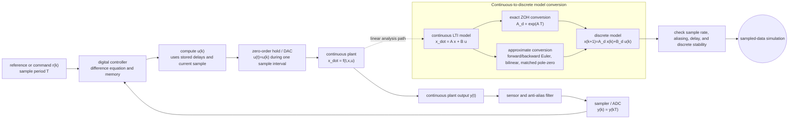

# Discrete-Time and Sampled-Data Systems

Discrete-time models update at separated time instants rather than evolving over every real-valued time. Some systems are inherently discrete, such as population counts by generation or account balances by month. Others are sampled-data systems: a continuous physical plant is measured, controlled, or simulated through samples taken every $T$ seconds.

Continuous simulation and discrete-time modeling meet in several places. Numerical integration itself creates a difference equation. Digital controllers sample sensor data and hold actuator commands. Simulink models often combine continuous plant blocks with discrete controllers. Understanding the difference between solver step size, sample time, and output logging interval prevents many simulation errors.

## Definitions

A discrete-time state model is

$$
x[k+1]=f_d(x[k],u[k],k),
\qquad
y[k]=g_d(x[k],u[k],k).
$$

For an LTI discrete-time system,

$$
x[k+1]=A_d x[k]+B_d u[k],
\qquad
y[k]=C_d x[k]+D_d u[k].
$$

The sample period $T$ relates sample index and physical time:

$$
t_k=kT.
$$

A zero-order hold keeps an input constant between samples:

$$
u(t)=u[k],\qquad kT\le t < (k+1)T.
$$

For a continuous LTI system

$$
\dot{x}=Ax+Bu,
$$

sampled with zero-order hold, the exact discrete-time matrices are

$$
A_d=e^{AT},
\qquad
B_d=\int_0^T e^{A\tau}B\,d\tau.
$$

The $z$-transform plays a role in discrete-time analysis similar to the Laplace transform in continuous time.

## Key results

Discrete-time stability for an LTI system requires all eigenvalues of $A_d$ to lie inside the unit circle:

$$
|\lambda_i(A_d)|<1.
$$

If a continuous-time pole is $s=\lambda$, exact sampling maps it to

$$
z=e^{\lambda T}.
$$

Thus a continuous pole with negative real part maps inside the unit circle. Numerical integration methods approximate this mapping, and their approximations can distort stability and dynamics.

Forward Euler applied to $\dot{x}=Ax+Bu$ gives

$$
x[k+1]=(I+TA)x[k]+TB u[k].
$$

Backward Euler gives

$$
x[k+1]=(I-TA)^{-1}x[k]+(I-TA)^{-1}TB u[k].
$$

The exact zero-order hold model is preferred when converting a linear continuous plant for digital controller analysis, because it accounts for the held input over the sample interval.

Sampling can lose information. A sinusoid of frequency $f$ sampled at rate $f_s=1/T$ aliases unless the signal bandwidth is below the Nyquist frequency $f_s/2$. In simulation, aliasing can occur when logging or controller sample times are too slow even if the continuous solver uses smaller internal steps.

The sample period is a modeling choice with physical consequences. A controller that updates every $10\ \mathrm{ms}$ cannot react to a disturbance that appears and disappears between updates unless the effect is visible in a later sample. A data logger that records once per second can miss fast oscillations even if the plant model was integrated accurately. When a simulation includes sensors, controllers, and actuators, each sample time should correspond to a real device rate or a deliberate design assumption.

Discrete-time models are also useful for systems whose natural clock is not a numerical artifact. Population generations, inventory updates, monthly financial balances, packet arrivals, and digital filters are described directly by difference equations. In those cases the index $k$ is part of the model, not just a method for approximating a continuous ODE. Confusing inherently discrete dynamics with sampled continuous dynamics can lead to wrong interpretations of stability and response time.

When comparing continuous and discrete simulations, use the same input convention. Exact zero-order hold conversion assumes the input is constant over each interval. A first-order hold assumes linear interpolation between samples. Impulse-invariant, matched pole-zero, and bilinear transformations preserve different features of the continuous model. No conversion is universally best; the appropriate one depends on whether time response, frequency response, controller implementation, or numerical convenience is the priority.

In Simulink, sampled-data diagrams should make rate changes visible. A continuous plant feeding a discrete controller usually needs a sampler or Zero-Order Hold interpretation at the interface. A discrete controller feeding a continuous actuator should state whether the command is held, filtered, delayed, or interpolated. Rate Transition blocks are not just cosmetic in multi-rate models; they document and manage the timing boundary between signals that update at different rates.

Time-response plots for sampled-data systems should show samples when samples matter. Connecting sample points with a smooth line can suggest behavior between samples that the discrete model does not define. A useful report often overlays the continuous response, the held input, and the sampled output. This makes it clear which behavior belongs to the physical plant, which belongs to the digital algorithm, and which belongs only to plotting interpolation.

Initial conditions also need translation. A continuous plant state $x(0)$ becomes the discrete initial state $x[0]$, but controller memory, filter delays, and previous held commands may have their own initial values. A sampled-data simulation that initializes the plant correctly but leaves the controller state inconsistent can show artificial transients. For digital filters and controllers, document whether the stored delays start at zero, at steady state, or from measured history.

For final-value checks, compare discrete equilibria directly rather than assuming the continuous formula survived discretization. Exact zero-order hold preserves the constant-input equilibrium for nonsingular first-order examples, but approximate methods or added delays may shift the apparent steady value.

## Visual



This sampled-data architecture shows every timing boundary: sensor filtering, sampling, controller memory, zero-order hold, and continuous plant response. The conversion subgraph separates exact zero-order-hold discretization from approximate methods such as Euler or bilinear transforms. The loop makes the I/O contract explicit: the controller only sees $y[k]$, while the plant receives a held continuous input between ticks.

| Concept | Continuous time | Discrete time |
|---|---|---|
| Independent variable | $t\in\mathbb{R}$ | $k\in\mathbb{Z}$ |
| State equation | $\dot{x}=Ax+Bu$ | $x[k+1]=A_dx[k]+B_du[k]$ |
| Stability region | Left half-plane | Inside unit circle |
| Transform variable | $s$ | $z$ |
| Frequency uniqueness | Nonperiodic in $\omega$ | Periodic in digital frequency |
| Input holding | Not needed | Must define between samples for plant input |

## Worked example 1: Exact discretization of a first-order plant

Problem: A continuous plant is

$$
\dot{x}=-2x+3u.
$$

Assume zero-order hold input and sample period $T=0.1\ \mathrm{s}$. Find $A_d$ and $B_d$.

1. Identify matrices:

$$
A=-2,\qquad B=3.
$$

2. Compute $A_d$:

$$
A_d=e^{AT}=e^{-2(0.1)}=e^{-0.2}\approx0.8187.
$$

3. Compute $B_d$:

$$
B_d=\int_0^T e^{A\tau}B\,d\tau
=\int_0^{0.1} e^{-2\tau}3\,d\tau.
$$

4. Integrate:

$$
B_d=3\left[\frac{-1}{2}e^{-2\tau}\right]_0^{0.1}
=\frac{3}{2}(1-e^{-0.2}).
$$

5. Evaluate:

$$
B_d=1.5(1-0.8187)=0.2719.
$$

6. Write the difference equation:

$$
x[k+1]=0.8187x[k]+0.2719u[k].
$$

Checked answer: the discrete steady state for constant $u=1$ is

$$
\bar{x}=\frac{B_d}{1-A_d}
=\frac{0.2719}{0.1813}
\approx1.5,
$$

which matches the continuous equilibrium $0=-2\bar{x}+3$. The sampled time-response plot should lie on the continuous first-order response at sample times.

Simulink description: use a Discrete State-Space block with sample time `0.1`, $A_d=0.8187$, $B_d=0.2719$, $C=1$, and $D=0$. A Zero-Order Hold block should appear between a discrete controller and continuous plant when modeling sampled-data behavior explicitly.

## Worked example 2: Euler discretization and stability

Problem: Approximate

$$
\dot{x}=-8x+u
$$

with forward Euler and sample time $T=0.3$. Determine whether the zero-input discrete model is stable. Compare with exact sampling.

1. Forward Euler gives

$$
x[k+1]=x[k]+T(-8x[k]+u[k]).
$$

2. Collect terms:

$$
x[k+1]=(1-8T)x[k]+T u[k].
$$

3. Substitute $T=0.3$:

$$
A_d^\text{Euler}=1-8(0.3)=1-2.4=-1.4.
$$

4. Apply discrete stability condition:

$$
|-1.4|=1.4>1.
$$

So the Euler discrete model is unstable.

5. Exact sampling maps the continuous pole $-8$ to

$$
z=e^{-8T}=e^{-2.4}\approx0.0907.
$$

6. Compare. The exact sampled model is stable because $0.0907\lt 1$, while the Euler approximation is unstable.

Checked answer: the continuous system is stable, but the chosen Euler step is too large. A time-response plot of the Euler model should alternate signs and grow; the exact sampled model should decay rapidly.

Simulink description: a fixed-step Euler solver with step `0.3` on the continuous model can show the numerical instability. A Discrete Transfer Fcn or Discrete State-Space block using exact `c2d` coefficients should show the stable sampled response.

## Code

```matlab
clear; clc; close all;

% Exact discretization of first-order plant
A = -2; B = 3; C = 1; D = 0; T = 0.1;
sysc = ss(A, B, C, D);
sysd = c2d(sysc, T, 'zoh');
disp(sysd.A);
disp(sysd.B);

% Compare continuous and sampled response
t = 0:0.001:3;
[yc, tc] = step(sysc, t);
[yd, td] = step(sysd, 0:T:3);
figure;
plot(tc, yc, 'b-', td, yd, 'ro', 'LineWidth', 1.3);
grid on; xlabel('Time (s)'); ylabel('x');
legend('Continuous', 'Sampled', 'Location', 'southeast');
title('Exact sampled-data response');

% Euler instability example
Tbad = 0.3;
Ad_euler = 1 - 8*Tbad;
Bd_euler = Tbad;
Ad_exact = exp(-8*Tbad);
N = 12;
x_euler = zeros(1,N+1); x_exact = zeros(1,N+1);
x_euler(1) = 1; x_exact(1) = 1;
for k = 1:N
    x_euler(k+1) = Ad_euler*x_euler(k);
    x_exact(k+1) = Ad_exact*x_exact(k);
end
kvec = 0:N;
figure;
stem(kvec, x_euler, 'r', 'DisplayName', 'Euler'); hold on;
stem(kvec, x_exact, 'b', 'DisplayName', 'Exact ZOH');
grid on; xlabel('Sample k'); ylabel('x[k]');
legend('Location', 'best');
title('Discrete stability comparison');
```

The first plot should show red sample points sitting on the continuous curve. The second should show Euler diverging while exact sampling decays. This distinction is central in simulation: discretization is a modeling and numerical decision, not a harmless formatting change.

## Common pitfalls

- Confusing solver fixed step with a digital controller's sample period.
- Logging too slowly and then interpreting aliased plots as physical oscillations.
- Using forward Euler discretization for controller design when exact zero-order hold conversion is needed.
- Applying continuous-time pole criteria to discrete-time poles.
- Forgetting the hold assumption when converting between continuous and discrete models.
- Mixing blocks with inherited sample times without checking the compiled sample-time display.

## Connections

- [Z-Transform and ROC](/physics/signals-systems/z-transform-roc)
- [Sampling, Aliasing, and Reconstruction](/physics/signals-systems/sampling-aliasing-reconstruction)
- [Step Size, Accuracy, and Stability](/physics/simulation/step-size-accuracy-stability)
- [Hybrid Systems and Event Handling](/physics/simulation/hybrid-systems-event-handling)
