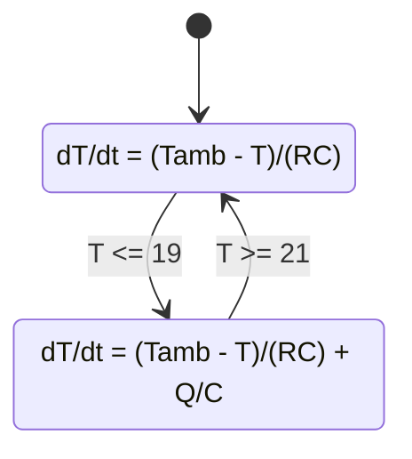

# Hybrid Systems and Event Handling

Hybrid systems combine continuous dynamics with discrete changes. A bouncing ball follows continuous flight equations until impact, then its velocity jumps. A thermostat evolves thermally until a threshold switches a heater. A digital controller samples a continuous plant and updates its command at fixed times. Many Simulink models become hybrid as soon as they include saturation, relays, switches, sample times, triggered subsystems, or state resets.

Hybrid simulation is harder than purely continuous simulation because the solver must locate events accurately and restart the model with changed equations or states. A time step that skips over a threshold can produce wrong event times, wrong energy loss, or even a different sequence of modes. The modeler needs to identify events explicitly and decide which variables are continuous, which jump, and which logic states remember past decisions.

## Definitions

A hybrid system has a continuous state $x$, a discrete mode $q$, and dynamics that depend on the mode:

$$
\dot{x}=f_q(x,u,t).
$$

An event condition or guard is a function

$$
g_q(x,u,t)=0
$$

that indicates when the system should change mode, reset a state, or trigger logic. A reset map defines the instantaneous update:

$$
x^+=R(x^-,q,u,t),
$$

where $x^-$ is the state just before the event and $x^+$ is the state just after it.

Hysteresis uses different switching thresholds for turning on and turning off. It prevents rapid switching when a signal hovers near one threshold. For example, a thermostat may turn on below $19^\circ\mathrm{C}$ and turn off above $21^\circ\mathrm{C}$.

Zero-crossing detection is a solver feature that attempts to locate the time when an event function changes sign. In Simulink, zero-crossing detection improves event timing for blocks such as Relay, Hit Crossing, Saturation, and Integrator limits, depending on configuration.

Zeno behavior is an infinite number of events in finite time. Idealized bouncing with a coefficient of restitution less than one can approach this mathematically. Practical models need tolerances, sticking rules, or event cutoffs.

## Key results

Hybrid models should be specified by mode, flow, guard, and reset:

| Component | Meaning | Example |
|---|---|---|
| Mode | Current discrete condition | heater on/off, contact/free flight |
| Flow | ODE in that mode | $\dot{T}=f_\text{on}(T)$ |
| Guard | Event condition | $T=21^\circ\mathrm{C}$ |
| Reset | Instantaneous update | $v^+=-ev^-$ after bounce |
| Invariant | Condition for staying in mode | heater remains on while $T\lt 21$ |

For a bouncing ball with height $h$ and velocity $v$, free-flight dynamics are

$$
\dot{h}=v,\qquad \dot{v}=-g.
$$

Impact occurs when

$$
h=0,\qquad v<0.
$$

The reset map is

$$
h^+=0,\qquad v^+=-e v^-,
$$

where $0\le e\le1$ is the coefficient of restitution.

For a relay with hysteresis, the switching rule is not a memoryless function of the input. It depends on the previous relay state. This discrete memory is the difference between a simple saturation and a true hybrid switching element.

Event handling changes the meaning of solver accuracy. In a smooth ODE, reducing local truncation error usually improves the trajectory everywhere. In a hybrid system, a small error in event time can place the state in the wrong mode, after which the continuous trajectory follows the wrong equations. This is why event functions, zero-crossing detection, and clear reset rules are not optional details. They define the model's execution semantics.

Hybrid models also need careful plotting. A continuous state plot alone can hide the reason for a change in slope. Plotting the discrete mode, event flag, controller sample, or reset count underneath the continuous response makes the result interpretable. For example, a thermostat temperature plot is incomplete without the heater on/off signal; a bouncing ball height plot is incomplete without showing impact times or velocity resets; a sampled controller response is incomplete without the control update sequence.

A practical modeling rule is to avoid hidden switching. If a parameter changes value at an event, represent that change with a named mode or logged signal. If a state is reset, write the reset equation next to the block or in the script. If a guard includes a tolerance, document it. These details are part of the mathematical model because they can change the sequence of events and therefore the final response.

Hybrid systems should be tested with cases that exercise every mode. A thermostat test that never crosses the lower threshold does not verify the on transition. A bouncing ball test with no impact does not verify the reset. A sampled controller test with a constant input may not reveal rate-transition mistakes. Good examples deliberately force each guard, reset, and mode so the event logic is visible in the response.

## Visual



| Hybrid issue | Why it matters | Modeling response |
|---|---|---|
| Threshold crossing | Determines exact switching time | Use event functions or zero-crossing blocks |
| State reset | Causes discontinuous state change | Define reset map explicitly |
| Chattering | Creates many rapid switches | Add hysteresis or dwell time |
| Sample-time boundary | Digital logic updates only at ticks | Use Rate Transition or discrete blocks |
| Algebraic switching | Mode depends instantly on output | Add dynamics, delay, or robust logic |

## Worked example 1: Thermostat with hysteresis

Problem: A room has thermal model

$$
C\dot{T}=\frac{T_\text{amb}-T}{R}+Q q,
$$

where $q=1$ means heater on and $q=0$ means heater off. Let $C=1000\ \mathrm{J/K}$, $R=0.2\ \mathrm{K/W}$, $T_\text{amb}=10^\circ\mathrm{C}$, and $Q=80\ \mathrm{W}$. The heater turns on at $19^\circ\mathrm{C}$ and off at $21^\circ\mathrm{C}$. Derive the two continuous modes and predict the response.

1. Divide by $C$:

$$
\dot{T}=\frac{T_\text{amb}-T}{RC}+\frac{Q}{C}q.
$$

2. Compute constants:

$$
RC=0.2(1000)=200\ \mathrm{s},
\qquad
\frac{Q}{C}=0.08\ \mathrm{K/s}.
$$

3. Heater off mode $q=0$:

$$
\dot{T}=\frac{10-T}{200}.
$$

The off equilibrium is $10^\circ\mathrm{C}$.

4. Heater on mode $q=1$:

$$
\dot{T}=\frac{10-T}{200}+0.08.
$$

Set derivative to zero:

$$
0=\frac{10-\bar{T}}{200}+0.08
\quad\Rightarrow\quad
\bar{T}=26^\circ\mathrm{C}.
$$

5. Define guards:

$$
q:0\to1\quad\text{when }T\le19,
$$

and

$$
q:1\to0\quad\text{when }T\ge21.
$$

Checked answer: the temperature should cycle between $19^\circ\mathrm{C}$ and $21^\circ\mathrm{C}$. It warms toward $26^\circ\mathrm{C}$ while on and cools toward $10^\circ\mathrm{C}$ while off, switching before either equilibrium is reached. The time-response plot should be a sawtooth-like thermal cycle with smooth exponential arcs, not straight lines.

Simulink description: use a Relay block with on/off thresholds or a Stateflow chart for the mode $q$. Multiply $q$ by heater power, sum heat loss and heater input, divide by $C$, and integrate temperature. Scope both $T$ and $q$ so the switching logic is visible.

## Worked example 2: Bouncing ball event reset

Problem: A ball is dropped from $h(0)=2\ \mathrm{m}$ with $v(0)=0$. Let $g=9.81\ \mathrm{m/s^2}$ and coefficient of restitution $e=0.8$. Find the first impact time and post-impact velocity.

1. During free flight,

$$
h(t)=h_0+v_0t-\frac{1}{2}gt^2.
$$

With $h_0=2$ and $v_0=0$:

$$
h(t)=2-4.905t^2.
$$

2. Set $h(t)=0$ for impact:

$$
0=2-4.905t^2.
$$

3. Solve:

$$
t^2=\frac{2}{4.905}\approx0.4077,
\qquad
t\approx0.6386\ \mathrm{s}.
$$

4. Velocity just before impact:

$$
v^-=v_0-gt=-9.81(0.6386)\approx-6.264\ \mathrm{m/s}.
$$

5. Apply reset:

$$
v^+=-e v^-=-0.8(-6.264)\approx5.011\ \mathrm{m/s}.
$$

6. Height reset:

$$
h^+=0.
$$

Checked answer: the post-impact velocity is upward and smaller in magnitude than the pre-impact velocity, meaning energy has been lost. The time-response plot should show parabolic arcs in height with sharp corners in velocity at impacts.

Simulink description: use Integrator blocks for velocity and height, an event-enabled reset on height/velocity at impact, or a Stateflow chart to implement the reset. A simple Saturation block is not enough because velocity must change discontinuously according to the restitution law.

## Code

```matlab
clear; clc; close all;

%% Thermostat with simple fixed-step event logic
C = 1000; R = 0.2; Tamb = 10; Q = 80;
h = 0.5; tEnd = 2000;
t = 0:h:tEnd;
T = zeros(size(t)); q = zeros(size(t));
T(1) = 20; q(1) = 0;
for k = 1:numel(t)-1
    if q(k) == 0 && T(k) <= 19
        q(k) = 1;
    elseif q(k) == 1 && T(k) >= 21
        q(k) = 0;
    end
    dT = ((Tamb - T(k))/R + Q*q(k))/C;
    T(k+1) = T(k) + h*dT;
    q(k+1) = q(k);
end

figure;
subplot(2,1,1);
plot(t, T, 'LineWidth', 1.3); grid on;
ylabel('T (deg C)'); title('Thermostat hybrid response');
subplot(2,1,2);
stairs(t, q, 'LineWidth', 1.3); grid on;
xlabel('Time (s)'); ylabel('Heater q');

%% Bouncing ball with MATLAB event detection
g = 9.81; e = 0.8;
x0 = [2; 0]; tfinal = 5;
tout = []; xout = [];
t0 = 0;
while t0 < tfinal && x0(1) >= 0
    opts = odeset('Events', @(t,x) hit_ground(t,x));
    [ts, xs, te, xe] = ode45(@(t,x) [x(2); -g], [t0 tfinal], x0, opts);
    tout = [tout; ts]; %#ok<AGROW>
    xout = [xout; xs]; %#ok<AGROW>
    if isempty(te)
        break;
    end
    x0 = [0; -e*xe(2)];
    t0 = te;
    if abs(x0(2)) < 0.05
        break;
    end
end

figure;
plot(tout, xout(:,1), 'LineWidth', 1.3); grid on;
xlabel('Time (s)'); ylabel('Height (m)');
title('Bouncing ball with event reset');

function [value, isterminal, direction] = hit_ground(~, x)
value = x(1);
isterminal = 1;
direction = -1;
end
```

The thermostat example uses a simple fixed-step loop, so switch times are approximate. The bouncing ball example uses MATLAB event detection, which locates the ground crossing more accurately and restarts integration after the reset. In Simulink, the same distinction appears between coarse sample-based switching and zero-crossing-aware continuous event handling.

## Common pitfalls

- Letting a solver step past an event and then applying the reset late.
- Modeling hysteresis as a memoryless function. Hysteresis requires stored mode information.
- Adding a Unit Delay to fix an algebraic loop without considering the physical delay it introduces.
- Ignoring chattering when a signal hovers near a threshold.
- Forgetting to reset all affected states after an event.
- Using continuous scopes only; always plot the discrete mode or event flag alongside the continuous state.

## Connections

- [Discrete-Time and Sampled-Data Systems](/physics/simulation/discrete-time-sampled-data-systems)
- [Simulink Block Diagrams](/physics/simulation/simulink-block-diagrams)
- [Step Size, Accuracy, and Stability](/physics/simulation/step-size-accuracy-stability)
- [Nonlinear Systems and Linearization](/physics/simulation/nonlinear-systems-linearization)
