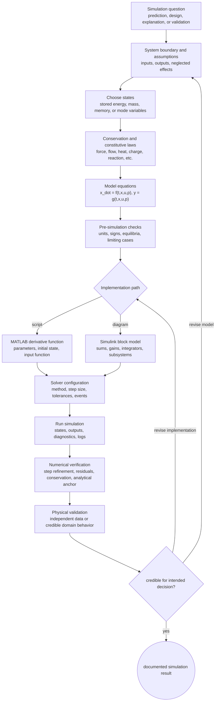

# Simulation of Dynamic Systems

Simulation of dynamic systems studies how mathematical models evolve over time when they are solved on a computer. In the setting of Klee and Allen's *Simulation of Dynamic Systems with MATLAB and Simulink*, the main focus is continuous system simulation: physical, biological, and engineered systems represented by algebraic equations, ordinary differential equations, difference equations, and block diagrams.

These notes are written as working study pages. They emphasize model derivation, state-space form, numerical integration, MATLAB scripts, Simulink implementation, time-response interpretation, and verification. The goal is not to replace a textbook or software manual, but to give a coherent path from physical assumptions to a simulation result that can be checked, explained, and improved.


*Figure: The Lorenz attractor is the standard visual scene for sensitive dependence and nonlinear simulation. Image: [Wikimedia Commons](https://commons.wikimedia.org/wiki/File:Lorenz_attractor_yb.svg), Wikimol and Dschwen, CC BY-SA 3.0/GFDL.*


*Figure: State-space diagrams show how stored state, input, and output maps fit into one dynamic-system representation. Image: [Wikimedia Commons](https://commons.wikimedia.org/wiki/File:Typical_State_Space_model.svg), Cburnett and BiMiT, CC0 1.0.*


*Figure: The cart-pendulum setup is a classic benchmark for unstable dynamics, feedback, and hybrid simulation tests. Image: [Wikimedia Commons](https://commons.wikimedia.org/wiki/File:Cart-pendulum.svg), Krishnavedala, CC0 1.0.*

## Definitions

A dynamic system is a system whose current behavior depends on stored information from the past. The stored information is represented by state variables. For a continuous-time system,

$$
\dot{x}(t)=f(x(t),u(t),t)
$$

describes how the state changes at each instant. For a discrete-time system,

$$
x[k+1]=f_d(x[k],u[k],k)
$$

describes how the state updates from one sample to the next.

A model is a simplified mathematical representation of a real or proposed system. A simulation is the execution of that model over time. The distinction matters: a model can be physically wrong even if simulated perfectly, and a correct model can be simulated poorly with an unsuitable solver or step size.

MATLAB is useful for scripted simulations, parameter sweeps, numerical integration, plotting, and analysis. Simulink is useful for executable block diagrams, subsystem composition, hybrid continuous/discrete models, and workflows where signal flow is clearer than code. The two tools are complementary: the same state equations can often be implemented as a MATLAB derivative function or as Simulink blocks.

The source text's table of contents follows this broad sequence:

| Book arc | Main topics | Wiki coverage |
|---:|---|---|
| 1 | Mathematical modeling, difference equations, population dynamics | [Mathematical Modeling](/physics/simulation/mathematical-modeling-continuous-time) |
| 2 | Continuous-time systems, state variables, nonlinear elements | [State Space](/physics/simulation/state-space-representation), [Nonlinear Systems](/physics/simulation/nonlinear-systems-linearization) |
| 3 | Elementary numerical integration | [Numerical Integration](/physics/simulation/numerical-integration-methods) |
| 4 | Linear systems, transfer functions, frequency response, $z$-transform | [Linear Systems](/physics/simulation/linear-systems-transfer-functions-modes), [Signals and Systems](/physics/signals-systems/intro) |
| 5 | Simulink, algebraic loops, subsystems, discrete-time blocks, hybrid models | [Simulink Block Diagrams](/physics/simulation/simulink-block-diagrams), [Hybrid Systems](/physics/simulation/hybrid-systems-event-handling) |
| 6 | Runge-Kutta, adaptive methods, multistep methods, stiffness, discontinuities | [Step Size and Stability](/physics/simulation/step-size-accuracy-stability) |
| 7 | Simulation tools, trimming, optimization, linearization, acceleration | [MATLAB Scripting](/physics/simulation/matlab-scripting-for-simulation), [Nonlinear Linearization](/physics/simulation/nonlinear-systems-linearization) |
| 8 | Advanced integration, dynamic errors, multirate, real-time simulation | [Discrete-Time Systems](/physics/simulation/discrete-time-sampled-data-systems), [Validation Examples](/physics/simulation/validation-multi-domain-examples) |

## Key results

The central simulation pipeline is

$$
\text{physical system}\to\text{mathematical model}\to\text{numerical method}\to\text{computed response}\to\text{interpretation}.
$$

Every arrow can introduce error. Modeling error enters when assumptions omit important physics. Numerical error enters when the solver and step size approximate the equations. Implementation error enters when code or block diagrams do not match the equations. Interpretation error enters when plots are read without checking units, initial conditions, solver settings, or validation data.

State-space form is the common interface:

$$
\dot{x}=f(t,x,u,p),
\qquad
y=g(t,x,u,p),
$$

where $p$ denotes parameters. MATLAB solvers need a function that computes $\dot{x}$. Simulink integrator diagrams need signals that compute each state derivative. Linear analysis needs matrices obtained from this form:

$$
\dot{x}=Ax+Bu,
\qquad
y=Cx+Du.
$$

Numerical integration advances a solution from $t_k$ to $t_{k+1}=t_k+h$. Explicit Euler,

$$
x_{k+1}=x_k+h f(t_k,x_k),
$$

is simple but low accuracy and conditionally stable. Runge-Kutta methods use staged slopes for higher accuracy. Adaptive solvers estimate error and adjust step size. Stiff solvers handle systems where fast stable modes restrict explicit methods.

The result of a simulation should be checked against at least one anchor: an equilibrium, an analytical solution, a limiting case, a conservation law, a refined-step solution, a frequency-domain prediction, or measured data. This verification habit is the difference between making a plot and doing simulation engineering.

## Visual



This overview diagram shows the full simulation architecture from question framing to documented result. The model path exposes boundaries, states, laws, equations, and pre-run checks before MATLAB or Simulink implementation; the numerical path exposes solver settings, logs, verification, and validation. The two feedback arrows distinguish revising the physics model from revising the implementation.

| Page order | Page | Main deliverable |
|---:|---|---|
| 1 | This overview | Map of the simulation workflow |
| 2 | [Mathematical Modeling](/physics/simulation/mathematical-modeling-continuous-time) | Conservation laws and physical derivations |
| 3 | [State-Space Representation](/physics/simulation/state-space-representation) | First-order vector form and matrices |
| 4 | [Numerical Integration Methods](/physics/simulation/numerical-integration-methods) | Euler, trapezoidal, RK4, adaptive ideas |
| 5 | [Step Size, Accuracy, and Stability](/physics/simulation/step-size-accuracy-stability) | Solver quality and convergence checks |
| 6 | [Linear Systems](/physics/simulation/linear-systems-transfer-functions-modes) | Poles, modes, transfer functions, response |
| 7 | [Nonlinear Systems](/physics/simulation/nonlinear-systems-linearization) | Nonlinear elements and Jacobian linearization |
| 8 | [MATLAB Scripting](/physics/simulation/matlab-scripting-for-simulation) | Reproducible script workflow |
| 9 | [Simulink Block Diagrams](/physics/simulation/simulink-block-diagrams) | Integrator diagrams, subsystems, algebraic loops |
| 10 | [Discrete-Time Systems](/physics/simulation/discrete-time-sampled-data-systems) | Difference equations and sampled-data models |
| 11 | [Hybrid Systems](/physics/simulation/hybrid-systems-event-handling) | Events, modes, resets, hysteresis |
| 12 | [Validation Examples](/physics/simulation/validation-multi-domain-examples) | Verification, validation, and domain analogies |

## Worked example 1: Choose a simulation workflow for a tank model

Problem: A well-mixed tank obeys

$$
A\dot{h}=q_\text{in}-\frac{h}{R_h}.
$$

You need to predict the height response to a change in inflow, compare MATLAB and Simulink implementations, and decide what pages in this section to use.

1. Identify the model type. The equation is a first-order continuous-time ODE with one state $h$ and one input $q_\text{in}$.

2. Put it in state-space form:

$$
\dot{h}=-\frac{1}{A R_h}h+\frac{1}{A}q_\text{in}.
$$

This points to [State-Space Representation](/physics/simulation/state-space-representation).

3. Choose a numerical method. If the tank is smooth and nonstiff, `ode45` is a reasonable MATLAB default. If using a fixed-step teaching loop, explicit Euler or RK4 can demonstrate the effect of step size. This points to [Numerical Integration Methods](/physics/simulation/numerical-integration-methods).

4. Predict the response. For constant inflow, the equilibrium is

$$
\bar{h}=R_h q_\text{in}.
$$

The time constant is

$$
\tau=A R_h.
$$

This gives an analytical check for the time-response plot.

5. Build Simulink version. Use a Sum block for $q_\text{in}-h/R_h$, a Gain $1/A$, and an Integrator for $h$. This points to [Simulink Block Diagrams](/physics/simulation/simulink-block-diagrams).

6. Verify. Compare MATLAB and Simulink outputs at the same input, initial condition, and solver settings. Then compare the final value with $\bar{h}$. This points to [Validation Examples](/physics/simulation/validation-multi-domain-examples).

Checked answer: the correct response is a monotone exponential toward $R_hq_\text{in}$. If MATLAB and Simulink disagree, the likely causes are different initial conditions, solver settings, input timing, or block signs.

## Worked example 2: Decide when linear analysis is enough

Problem: A pendulum model is

$$
\ddot{\theta}+\frac{b}{m\ell^2}\dot{\theta}+\frac{g}{\ell}\sin\theta=\frac{1}{m\ell^2}\tau.
$$

You need a model for small oscillations near $\theta=0$, but later you may simulate large release angles. Decide which pages and methods apply.

1. Convert to state variables:

$$
x_1=\theta,\qquad x_2=\dot{\theta}.
$$

Then

$$
\begin{aligned}
\dot{x}_1 &= x_2,\\
\dot{x}_2 &= -\frac{b}{m\ell^2}x_2-\frac{g}{\ell}\sin x_1+\frac{1}{m\ell^2}\tau.
\end{aligned}
$$

2. For small oscillations, linearize $\sin x_1$ near zero:

$$
\sin x_1\approx x_1.
$$

3. The local linear model is

$$
\dot{x}=
\begin{bmatrix}
0 & 1\\
-g/\ell & -b/(m\ell^2)
\end{bmatrix}x
+
\begin{bmatrix}
0\\
1/(m\ell^2)
\end{bmatrix}\tau.
$$

This points to [Nonlinear Systems and Linearization](/physics/simulation/nonlinear-systems-linearization) and [Linear Systems](/physics/simulation/linear-systems-transfer-functions-modes).

4. Predict small-angle behavior. If damping is positive, the eigenvalues should have negative real parts, so the time response should be stable and oscillatory or overdamped depending on $b$.

5. For large release angles, use the nonlinear sine model. The linear model underestimates period changes and can give wrong response for large $\theta$. This points back to [MATLAB Scripting](/physics/simulation/matlab-scripting-for-simulation) or [Simulink Block Diagrams](/physics/simulation/simulink-block-diagrams).

6. Check both models. Run the nonlinear and linear simulations for $5^\circ$ and for $60^\circ$. The small-angle plots should agree closely; the large-angle plots should diverge.

Checked answer: linear analysis is enough for local small-signal behavior near the downward equilibrium, but nonlinear simulation is required for large motion or switching constraints. The difference should be visible in the time-response plot as angle grows.

## Code

```matlab
clear; clc; close all;

% Overview example: compare nonlinear and linear pendulum models.
m = 1;
ell = 1;
b = 0.08;
g = 9.81;

A = [0 1; -g/ell -b/(m*ell^2)];
pend_linear = @(t,x) A*x;
pend_nonlinear = @(t,x) [x(2); ...
    -(b/(m*ell^2))*x(2) - (g/ell)*sin(x(1))];

angles = [5 60]*pi/180;
figure;
for i = 1:numel(angles)
    x0 = [angles(i); 0];
    [tn, xn] = ode45(pend_nonlinear, [0 10], x0);
    [tl, xl] = ode45(pend_linear, [0 10], x0);

    subplot(2,1,i);
    plot(tn, xn(:,1), 'b-', tl, xl(:,1), 'r--', 'LineWidth', 1.3);
    grid on;
    ylabel('\theta (rad)');
    title(sprintf('Initial angle = %.0f degrees', angles(i)*180/pi));
    legend('Nonlinear', 'Linearized', 'Location', 'best');
end
xlabel('Time (s)');
```

The first subplot should show close agreement between nonlinear and linear models. The second should show visible mismatch because the sine nonlinearity matters. A Simulink version uses two parallel subsystems, one with a Trigonometric Function block and one with a State-Space block, feeding a common Scope for comparison.

## Common pitfalls

- Treating simulation as a substitute for deriving and checking the model.
- Building a Simulink diagram before deciding what the states are.
- Accepting a time plot without checking equilibrium, units, or solver settings.
- Using a linearized model outside its operating region.
- Confusing discrete controller sample time with numerical solver step size.
- Reporting validation without independent data or an explicit quantity of interest.

## Connections

- [Mathematical Modeling of Continuous-Time Systems](/physics/simulation/mathematical-modeling-continuous-time)
- [State-Space Representation](/physics/simulation/state-space-representation)
- [Numerical Integration Methods](/physics/simulation/numerical-integration-methods)
- [Step Size, Accuracy, and Stability](/physics/simulation/step-size-accuracy-stability)
- [Linear Systems, Transfer Functions, and Modes](/physics/simulation/linear-systems-transfer-functions-modes)
- [Nonlinear Systems and Linearization](/physics/simulation/nonlinear-systems-linearization)
- [MATLAB Scripting for Simulation](/physics/simulation/matlab-scripting-for-simulation)
- [Simulink Block Diagrams](/physics/simulation/simulink-block-diagrams)
- [Discrete-Time and Sampled-Data Systems](/physics/simulation/discrete-time-sampled-data-systems)
- [Hybrid Systems and Event Handling](/physics/simulation/hybrid-systems-event-handling)
- [Validation and Multi-Domain Simulation Examples](/physics/simulation/validation-multi-domain-examples)
