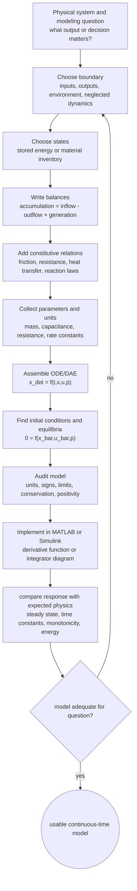

# Mathematical Modeling of Continuous-Time Systems

Mathematical modeling is the translation step between a physical story and a simulation. A tank fills, a mass moves, a capacitor charges, a population grows, or a reactor heats up; the modeler chooses state variables, writes conservation laws, introduces constitutive relations, and obtains algebraic or differential equations that can be solved numerically. In continuous system simulation the central object is usually an ordinary differential equation, because the state evolves over a continuum of time values.

The point of the model is not to reproduce every detail of the real system. A useful simulation model keeps the mechanisms that matter for the question being asked and omits details whose effects are small, unknown, or outside the intended operating range. Klee and Allen's text emphasizes this modeling-to-simulation path: begin with physical laws, turn them into equations, and then replace the continuous equation by a discrete-time numerical procedure that MATLAB or Simulink can execute.


*Figure: The mass-spring oscillator is the canonical apparatus behind resonance, normal modes, and linearization. Image: [Wikimedia Commons](https://commons.wikimedia.org/wiki/File:Harmonic_oscillator.svg), LucasVB, public domain.*

## Definitions

A continuous-time dynamical system has variables that are functions of real-valued time $t$. A scalar first-order model has the form

$$
\dot{x}(t)=f(x(t),u(t),t),
\qquad
y(t)=g(x(t),u(t),t),
$$

where $x$ is the state, $u$ is an input, $y$ is an output, and the dot denotes $d/dt$. A vector model stacks several states:

$$
\dot{\mathbf{x}}(t)=\mathbf{f}(\mathbf{x}(t),\mathbf{u}(t),t),
\qquad
\mathbf{y}(t)=\mathbf{g}(\mathbf{x}(t),\mathbf{u}(t),t).
$$

A state is a minimum set of variables that, together with future inputs, determines future behavior. For a mechanical mass-spring-damper, position alone is not enough because two systems at the same position can move differently if their velocities differ. A good state choice is $x_1=q$ and $x_2=\dot{q}$.

A conservation law says that accumulation equals inflow minus outflow plus generation. In lumped models this often appears as

$$
\frac{d}{dt}(\text{stored quantity})=\text{rate in}-\text{rate out}+\text{rate generated}.
$$

Constitutive laws relate effort-like and flow-like variables. Examples include Ohm's law $v=Ri$, Hooke's law $F=kx$, viscous friction $F=b\dot{x}$, and Newton's cooling law $\dot{Q}=hA(T-T_\infty)$. Constitutive relations close the model by replacing vague physical phrases with equations.

A lumped-parameter model assumes spatial variation inside each element can be summarized by a finite number of variables. A distributed-parameter model keeps spatial dependence and leads to partial differential equations. Continuous system simulation often begins with lumped approximations even when the physical system is distributed, because ordinary differential equations are easier to simulate and interpret.

## Key results

The most useful modeling pattern is the balance equation. If $S(x)$ is the stored quantity and $x$ is the chosen state, then

$$
\frac{dS}{dt}=\frac{dS}{dx}\dot{x}.
$$

When $S$ is proportional to $x$, the model is first order. For a tank with constant cross-sectional area $A$, stored volume is $V=Ah$, so

$$
A\dot{h}=q_\text{in}-q_\text{out}.
$$

If the outlet relation is linearized as $q_\text{out}=h/R_h$, then

$$
\dot{h}=-\frac{1}{A R_h}h+\frac{1}{A}q_\text{in}.
$$

This is the same mathematical form as an RC circuit,

$$
C\dot{v}=-\frac{1}{R}v+i_\text{in},
$$

which is why simulation methods transfer across domains.

Dimensional consistency is a non-negotiable check. If the left-hand side has units of meters per second, every term on the right-hand side must also reduce to meters per second. This check catches sign errors, missing capacitances or masses, and accidental use of total quantities where rates are required.

Equilibrium points are obtained by setting derivatives to zero. For an autonomous system $\dot{x}=f(x,u)$ with constant input $\bar{u}$, an equilibrium $\bar{x}$ satisfies

$$
0=f(\bar{x},\bar{u}).
$$

Equilibria matter because simulations are often run as deviations from a steady operating condition. They also provide a way to check whether long-time numerical results make physical sense.

## Visual



This modeling diagram shows the derivation pipeline before any solver is chosen. The state and balance layers define the dynamic order, constitutive laws add physical closure, and parameter/unit checks constrain the equations. The feedback loop is intentionally at the boundary stage because an inadequate model often needs a revised system boundary, not just different numerical settings.

| Modeling decision | Typical choice | Simulation consequence |
|---|---|---|
| Boundary | Include only components needed for the question | Determines inputs, outputs, and neglected dynamics |
| State variables | Stored energy or material variables | Determines order of ODE system |
| Constitutive law | Linear, nonlinear, empirical, or table-based | Determines whether linear tools apply |
| Parameter treatment | Constant, scheduled, random, or estimated | Affects validation and sensitivity studies |
| Initial condition | Measured, equilibrium, or assumed | Strongly affects transients |

## Worked example 1: Draining tank with a linear outlet

Problem: A tank has cross-sectional area $A=2\ \mathrm{m^2}$ and a linear hydraulic resistance $R_h=5\ \mathrm{s/m^2}$. A constant inflow $q_\text{in}=0.4\ \mathrm{m^3/s}$ begins at $t=0$. The initial height is $h(0)=0.5\ \mathrm{m}$. Derive the model, find the equilibrium, and predict the qualitative time-response plot.

1. Choose the state. The stored volume is $V=Ah$, so the water height $h$ is sufficient if the tank is well mixed and the area is constant.

2. Write the volume balance:

$$
\frac{dV}{dt}=q_\text{in}-q_\text{out}.
$$

3. Substitute $V=Ah$ and $q_\text{out}=h/R_h$:

$$
A\dot{h}=q_\text{in}-\frac{h}{R_h}.
$$

4. Divide by $A$:

$$
\dot{h}=-\frac{1}{A R_h}h+\frac{1}{A}q_\text{in}
=-\frac{1}{10}h+0.2.
$$

5. Find the equilibrium by setting $\dot{h}=0$:

$$
0=-0.1\bar{h}+0.2
\quad\Rightarrow\quad
\bar{h}=2.0\ \mathrm{m}.
$$

6. Solve the first-order response:

$$
h(t)=\bar{h}+\bigl(h(0)-\bar{h}\bigr)e^{-t/(A R_h)}
=2.0-1.5e^{-t/10}.
$$

Checked answer: $h(0)=2.0-1.5=0.5\ \mathrm{m}$ and $h(\infty)=2.0\ \mathrm{m}$. The time-response plot should be a monotone rising exponential with time constant $10\ \mathrm{s}$, initially steep and then flattening as the outlet flow increases.

Simulink description: use a Sum block for $q_\text{in}-q_\text{out}$, a Gain block $1/A$, an Integrator block for $h$, and a feedback Gain block $1/R_h$ from $h$ to the negative input of the Sum. A Scope should show the same rising exponential.

## Worked example 2: Mass-spring-damper model from Newton's law

Problem: A cart of mass $m=4\ \mathrm{kg}$ is attached to a spring $k=20\ \mathrm{N/m}$ and a damper $b=6\ \mathrm{N\,s/m}$. An external force $F(t)$ acts on the cart. Let displacement $q$ be measured from the spring's unstretched position. Derive a first-order state model and find the equilibrium for a constant force $F_0=10\ \mathrm{N}$.

1. Choose states. A second-order mechanical equation needs position and velocity:

$$
x_1=q,\qquad x_2=\dot{q}.
$$

2. Apply Newton's second law. The forces are external force $F$, spring force $-kq$, and damping force $-b\dot{q}$:

$$
m\ddot{q}=F-b\dot{q}-kq.
$$

3. Substitute parameter values:

$$
4\ddot{q}=F-6\dot{q}-20q.
$$

4. Convert to state equations:

$$
\begin{aligned}
\dot{x}_1 &= x_2,\\
\dot{x}_2 &= -\frac{k}{m}x_1-\frac{b}{m}x_2+\frac{1}{m}F\\
&=-5x_1-1.5x_2+0.25F.
\end{aligned}
$$

5. For constant $F_0=10$, set $\dot{x}_1=\dot{x}_2=0$. From $\dot{x}_1=0$, $\bar{x}_2=0$. Then

$$
0=-5\bar{x}_1-1.5(0)+0.25(10),
$$

so

$$
\bar{x}_1=0.5\ \mathrm{m}.
$$

Checked answer: a static spring under $10\ \mathrm{N}$ extends $F_0/k=10/20=0.5\ \mathrm{m}$, matching the state calculation. The time-response plot for a force step should approach $0.5\ \mathrm{m}$ with decaying oscillation or monotone decay depending on damping. Here $\omega_n=\sqrt{k/m}=\sqrt{5}$ and $\zeta=b/(2\sqrt{km})=6/(2\sqrt{80})\approx0.335$, so the plot is underdamped.

Simulink description: build two cascaded Integrator blocks for acceleration to velocity to position. Sum $F$, $-b\dot{q}$, and $-kq$, multiply by $1/m$, and feed the acceleration integrator. Scope the position and velocity states.

## Code

```matlab
% Draining tank and mass-spring-damper simulations.
clear; clc; close all;

% Tank parameters
A = 2;
Rh = 5;
qin = 0.4;
h0 = 0.5;
tspan = [0 60];

tank_rhs = @(t,h) (qin - h/Rh)/A;
[tt, hh] = ode45(tank_rhs, tspan, h0);

% Mechanical parameters
m = 4;
b = 6;
k = 20;
F0 = 10;
x0 = [0; 0];
mech_rhs = @(t,x) [x(2); (F0 - b*x(2) - k*x(1))/m];
[tm, xm] = ode45(mech_rhs, [0 10], x0);

figure;
subplot(2,1,1);
plot(tt, hh, 'LineWidth', 1.5); grid on;
xlabel('Time (s)'); ylabel('Height h (m)');
title('Tank response: monotone approach to equilibrium');

subplot(2,1,2);
plot(tm, xm(:,1), 'LineWidth', 1.5); grid on;
xlabel('Time (s)'); ylabel('Position q (m)');
title('Mass-spring-damper step response');
```

The first plot should rise smoothly from $0.5\ \mathrm{m}$ toward $2\ \mathrm{m}$. The second should oscillate around $0.5\ \mathrm{m}$ with a decaying envelope because the damping ratio is less than one. In Simulink the same responses appear if the integrator initial conditions are set to the stated initial states and the force or inflow is represented with Constant or Step blocks.

## Common pitfalls

- Choosing outputs as states when they do not contain enough memory. Position without velocity is not a complete mechanical state.
- Mixing total stored quantities and rates. A flow rate belongs on the right side of a balance equation; a stored amount belongs inside the derivative.
- Forgetting sign conventions. Pick positive directions once, then make spring, damping, and outflow terms oppose the stored variable or motion when physics says they should.
- Treating nonlinear outlet or friction laws as linear without saying so. Linear models are local approximations unless the physical law is truly linear over the full range.
- Running MATLAB before checking units. Numerical solvers can integrate dimensionally impossible equations without warning.
- Setting all initial conditions to zero by habit. A wrong initial condition can make a correct model look wrong during the transient.

## Connections

- [State-Space Representation](/physics/simulation/state-space-representation)
- [Numerical Integration Methods](/physics/simulation/numerical-integration-methods)
- [Nonlinear Systems and Linearization](/physics/simulation/nonlinear-systems-linearization)
- [LTI Systems and Convolution](/physics/signals-systems/lti-systems-convolution)
