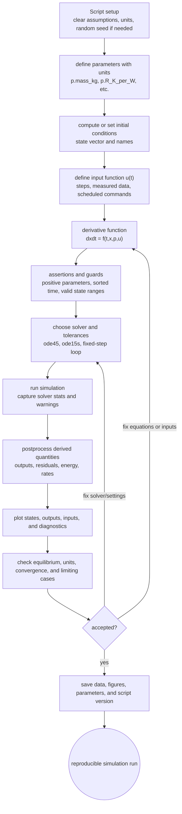

# MATLAB Scripting for Simulation

MATLAB scripting is the most direct way to turn a mathematical model into a repeatable simulation experiment. A script can define parameters, compute equilibria, call an ODE solver, postprocess outputs, and generate plots. Compared with a hand-built block diagram, a script makes parameter sweeps, convergence checks, optimization loops, and unit tests easier to automate.

A good simulation script is not just a sequence of commands that happens to make a plot. It should make assumptions visible, keep model equations in one place, label units, set solver tolerances intentionally, and preserve enough results to reproduce the run. This page focuses on the workflow that connects a state equation to MATLAB code and then to Simulink-compatible thinking.


*Figure: The Lorenz attractor is the standard visual scene for sensitive dependence and nonlinear simulation. Image: [Wikimedia Commons](https://commons.wikimedia.org/wiki/File:Lorenz_attractor_yb.svg), Wikimol and Dschwen, CC BY-SA 3.0/GFDL.*

## Definitions

A MATLAB ODE derivative function has the form

```matlab
dxdt = f(t, x)
```

where `t` is the current time and `x` is the current state vector. Parameters can be supplied through anonymous functions, nested functions, structures, or class objects. For small teaching models, an anonymous wrapper is often enough:

```matlab
rhs = @(t,x) model_rhs(t, x, p);
```

An ODE solver call usually has the pattern

```matlab
[t, x] = ode45(rhs, tspan, x0, options);
```

where `tspan` defines the simulation interval or requested output times, `x0` is the initial state, and `options` is created with `odeset`.

The solver result `x` is an array whose rows correspond to time points and whose columns correspond to state variables. This convention is a common source of indexing mistakes. If `x(:,1)` is position and `x(:,2)` is velocity, then `x(1,:)` is the full state at the first output time.

A reproducible script separates five concerns:

1. Parameter definition.
2. Initial condition and input definition.
3. Model derivative calculation.
4. Solver configuration and execution.
5. Plotting and numerical checks.

## Key results

For a state equation

$$
\dot{x}=f(t,x,p),
$$

MATLAB's variable-step solvers estimate the trajectory by choosing internal step sizes. The vector `t` returned by the solver contains accepted output points, not necessarily all internal trial points. If the user supplies `tspan=[0 10]`, MATLAB chooses output times. If the user supplies `tspan=0:0.01:10`, MATLAB returns interpolated values at those times while still using adaptive internal steps.

Solver choice should follow model behavior:

| Solver | Typical use | Notes |
|---|---|---|
| `ode45` | Smooth nonstiff systems | Good default for many teaching simulations |
| `ode23` | Lower accuracy nonstiff problems | Sometimes cheaper for modest tolerances |
| `ode113` | Smooth problems needing high accuracy | Variable-order Adams method |
| `ode15s` | Stiff systems | Good first stiff solver choice |
| `ode23t` | Moderately stiff systems | Trapezoidal-style behavior |
| Fixed-step loop | Real-time or algorithm demonstration | Must check stability and convergence |

Postprocessing should include physical checks. Examples include final value against an equilibrium, conservation of energy in an undamped system, nonnegative concentrations, bounded actuator commands, or agreement with a known analytical response.

A MATLAB script can mirror a Simulink model. Each Integrator block corresponds to a state; each Sum and Gain block corresponds to algebra inside the derivative function; Step, Signal Builder, and From Workspace blocks correspond to the input function used by the script.

A script should also make input timing explicit. A constant input, a step input, a sampled command, and a measured input read from a data file can produce different solver behavior even when their plotted values look similar. For discontinuous inputs, it is often useful to split the simulation interval at known switching times or define event-aware input functions so that the solver does not interpolate across jumps blindly. When a Simulink model uses a Step block at $t=1$, the MATLAB script should represent the same discontinuity, not a smoothed approximation unless smoothing is intentional.

Another useful scripting habit is to compute derived quantities after the solver returns. For example, a mechanical simulation may integrate position and velocity, then compute spring force, damping force, kinetic energy, and total energy as postprocessed outputs. This keeps the state vector minimal while still producing validation plots. In reports, plotting a force balance or residual often reveals mistakes that a state plot hides. The same idea applies to electrical power, thermal heat loss, chemical reaction rate, or biological growth rate.

Scripts are also the natural place for reproducible studies. A single run answers one scenario; a simulation study usually asks what changes when parameters, initial conditions, or solver settings vary. Loops, tables, and saved structures let the modeler record each case without manually renaming variables. This is especially useful for validation, where measured data, calibrated parameters, predicted outputs, and residuals should remain associated with the same run conditions.

When a script is paired with a Simulink model, MATLAB should act as the experiment driver. It can assign workspace parameters, call `sim`, collect logged signals, compute error metrics, and create final plots. That workflow reduces manual clicking and makes the block diagram part of a repeatable computational experiment rather than a one-off visual artifact.

Versioned scripts should avoid dependence on interactive workspace state. A script that only runs after several manual commands is hard to validate. Start from `clear` only when appropriate, define all parameters inside the file or a documented setup function, and make random seeds explicit for Monte Carlo runs. Reproducibility is a simulation requirement, not just a coding style preference.

Good scripts fail loudly when assumptions are violated. Simple assertions for positive masses, nonnegative concentrations, increasing time vectors, and matching data lengths catch errors before the solver produces an attractive but meaningless plot.

Those checks are cheap and usually worth keeping.

## Visual



This scripting diagram treats a MATLAB file as a reproducible experiment driver. Parameters, initial conditions, input timing, derivative function, assertions, solver settings, postprocessing, plotting, and saved artifacts are all separate blocks. The two feedback paths distinguish equation/input errors from solver-configuration errors.

## Worked example 1: Script a first-order thermal model

Problem: A lumped object with thermal capacitance $C=500\ \mathrm{J/K}$ loses heat to ambient through resistance $R=2\ \mathrm{K/W}$. A heater supplies $Q=100\ \mathrm{W}$ starting at $t=0$. Ambient temperature is $T_\infty=20^\circ\mathrm{C}$ and $T(0)=20^\circ\mathrm{C}$. Derive the model and prepare a MATLAB script.

1. Write the energy balance:

$$
C\dot{T}=Q-\frac{T-T_\infty}{R}.
$$

2. Divide by $C$:

$$
\dot{T}=\frac{Q}{C}-\frac{T-T_\infty}{RC}.
$$

3. Compute time constant:

$$
\tau=RC=2(500)=1000\ \mathrm{s}.
$$

4. Compute equilibrium:

$$
0=Q-\frac{\bar{T}-T_\infty}{R}
\quad\Rightarrow\quad
\bar{T}=T_\infty+RQ=20+2(100)=220^\circ\mathrm{C}.
$$

5. Write the exact response for checking:

$$
T(t)=\bar{T}+(T(0)-\bar{T})e^{-t/\tau}
=220-200e^{-t/1000}.
$$

Checked answer: at one time constant, $T(1000)=220-200e^{-1}\approx146.4^\circ\mathrm{C}$. The time-response plot should be a slow monotone exponential toward $220^\circ\mathrm{C}$.

Simulink description: use a Constant block for heater power, a Constant for ambient temperature, a Sum block for $T-T_\infty$, a Gain $1/R$ for heat loss, a Sum block for $Q-\text{loss}$, a Gain $1/C$, and an Integrator for $T$ with initial condition $20$.

## Worked example 2: Parameter sweep for damping ratio

Problem: Simulate

$$
\ddot{q}+2\zeta\omega_n\dot{q}+\omega_n^2q=\omega_n^2u
$$

for a unit step input, $\omega_n=3\ \mathrm{rad/s}$, and $\zeta\in\{0.1,0.4,1.0\}$. Derive the state model and state what the plot should show.

1. Choose states:

$$
x_1=q,\qquad x_2=\dot{q}.
$$

2. Convert to first-order form:

$$
\begin{aligned}
\dot{x}_1 &= x_2,\\
\dot{x}_2 &= -\omega_n^2x_1-2\zeta\omega_n x_2+\omega_n^2u.
\end{aligned}
$$

3. Substitute $\omega_n=3$:

$$
\dot{x}_2=-9x_1-6\zeta x_2+9u.
$$

4. Check steady state for $u=1$:

$$
0=-9\bar{x}_1+9,
\qquad
\bar{x}_1=1.
$$

5. Predict the plots. $\zeta=0.1$ should produce large overshoot and slow decay. $\zeta=0.4$ should have moderate overshoot. $\zeta=1.0$ should be critically damped and approach without overshoot.

Checked answer: all three responses approach $q=1$, but their transients differ. This is a classic reason to script simulations: a loop over damping values is faster and less error-prone than creating separate block diagrams manually.

Simulink description: put $\zeta$ in the MATLAB workspace and use it in Gain block expressions. Run the model repeatedly from a script with `sim`, changing the parameter each time and logging the output.

## Code

```matlab
clear; clc; close all;

%% Example 1: thermal model
p.C = 500;              % J/K
p.R = 2;                % K/W
p.Tamb = 20;            % deg C
p.Q = 100;              % W
T0 = 20;
tspan = [0 5000];

thermal_rhs = @(t,T) (p.Q - (T - p.Tamb)/p.R)/p.C;
opts = odeset('RelTol', 1e-8, 'AbsTol', 1e-10);
[tT, T] = ode45(thermal_rhs, tspan, T0, opts);

Teq = p.Tamb + p.R*p.Q;
fprintf('Thermal equilibrium: %.2f C\n', Teq);

figure;
plot(tT, T, 'LineWidth', 1.5); grid on;
xlabel('Time (s)'); ylabel('Temperature (deg C)');
title('Lumped thermal response');

%% Example 2: damping-ratio sweep
wn = 3;
zetaList = [0.1 0.4 1.0];
x0 = [0; 0];
figure; hold on; grid on;
for zeta = zetaList
    rhs = @(t,x) [x(2); -wn^2*x(1) - 2*zeta*wn*x(2) + wn^2];
    [t, x] = ode45(rhs, [0 8], x0, opts);
    plot(t, x(:,1), 'DisplayName', sprintf('\\zeta = %.1f', zeta));
end
xlabel('Time (s)'); ylabel('q(t)');
legend('Location', 'best');
title('Step response parameter sweep');
```

The first plot should be monotone and slow because the thermal time constant is large. The second plot should clearly distinguish underdamped and critically damped behavior. A disciplined script records the parameters that produced each curve, which makes the figure interpretable later.

## Common pitfalls

- Hiding parameters inside derivative functions as unexplained numeric constants.
- Passing row vectors and column vectors inconsistently. MATLAB solvers expect the derivative to match the shape of `x0`.
- Treating requested output times as fixed solver steps for adaptive solvers.
- Plotting states without units or labels, making later validation difficult.
- Overwriting variables during parameter sweeps and losing the conditions for each run.
- Comparing a MATLAB script and Simulink model without matching solver tolerances, initial conditions, and input timing.

## Connections

- [Numerical Integration Methods](/physics/simulation/numerical-integration-methods)
- [Simulink Block Diagrams](/physics/simulation/simulink-block-diagrams)
- [Step Size, Accuracy, and Stability](/physics/simulation/step-size-accuracy-stability)
- [Linear Systems, Transfer Functions, and Modes](/physics/simulation/linear-systems-transfer-functions-modes)
