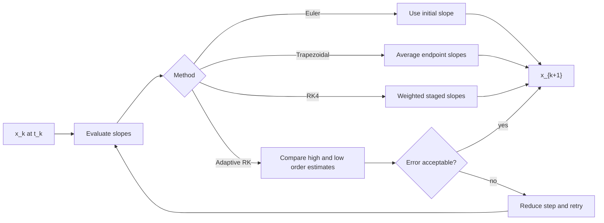

# Numerical Integration Methods

Numerical integration converts a continuous-time state equation into a sequence of computed values. The exact trajectory $\mathbf{x}(t)$ is usually unavailable, so the simulator advances from $\mathbf{x}_k\approx\mathbf{x}(t_k)$ to $\mathbf{x}_{k+1}\approx\mathbf{x}(t_k+h)$ using derivative evaluations. This is the computational core of continuous system simulation in MATLAB scripts and Simulink solvers.

Klee and Allen introduce elementary methods before moving to Runge-Kutta, adaptive, multistep, stiff, and real-time-compatible techniques. The practical idea is simple: an integrator is a rule for using slope information. The engineering difficulty is choosing a rule and step size that produce an answer accurate enough, stable enough, and fast enough for the intended use.

## Definitions

For an initial value problem

$$
\dot{\mathbf{x}}=\mathbf{f}(t,\mathbf{x}),
\qquad
\mathbf{x}(t_0)=\mathbf{x}_0,
$$

a one-step method computes

$$
\mathbf{x}_{k+1}=\mathbf{x}_k+\Phi(t_k,\mathbf{x}_k,h),
$$

where $h=t_{k+1}-t_k$ and $\Phi$ is an increment based on one or more derivative evaluations within the current step.

Explicit Euler uses the slope at the beginning of the interval:

$$
\mathbf{x}_{k+1}=\mathbf{x}_k+h\mathbf{f}(t_k,\mathbf{x}_k).
$$

Backward Euler uses the slope at the end:

$$
\mathbf{x}_{k+1}=\mathbf{x}_k+h\mathbf{f}(t_{k+1},\mathbf{x}_{k+1}).
$$

This is implicit because $\mathbf{x}_{k+1}$ appears on both sides.

The trapezoidal method averages beginning and ending slopes:

$$
\mathbf{x}_{k+1}=\mathbf{x}_k+\frac{h}{2}\left[\mathbf{f}(t_k,\mathbf{x}_k)+\mathbf{f}(t_{k+1},\mathbf{x}_{k+1})\right].
$$

Classical fourth-order Runge-Kutta uses four staged slopes:

$$
\begin{aligned}
k_1 &= f(t_k,x_k),\\
k_2 &= f(t_k+h/2,x_k+h k_1/2),\\
k_3 &= f(t_k+h/2,x_k+h k_2/2),\\
k_4 &= f(t_k+h,x_k+h k_3),\\
x_{k+1} &= x_k+\frac{h}{6}(k_1+2k_2+2k_3+k_4).
\end{aligned}
$$

The same formula applies componentwise for vector states.

## Key results

Local truncation error measures the error made in one step assuming the starting value is exact. Global error measures the accumulated error over an interval. For smooth problems, explicit Euler has first-order global accuracy, trapezoidal and common second-order Runge-Kutta variants have second-order global accuracy, and classical RK4 has fourth-order global accuracy.

Order matters, but it is not the only criterion. Euler may be acceptable for rough exploratory plots or real-time loops with tiny sample periods. RK4 gives much better accuracy per step for smooth nonstiff systems. Implicit methods are more expensive per step but can handle stiff systems where explicit methods require prohibitively small step sizes for stability.

For the scalar test equation $\dot{x}=\lambda x$, explicit Euler gives

$$
x_{k+1}=(1+h\lambda)x_k.
$$

The numerical solution decays only if

$$
|1+h\lambda|<1.
$$

When $\lambda$ is real and negative, this requires $0\lt h\lt -2/\lambda$. A stable physical system can therefore look numerically unstable if the step is too large.

MATLAB's `ode45` is an adaptive explicit Runge-Kutta method suited to many nonstiff problems. `ode15s` is designed for stiff systems. Simulink offers fixed-step and variable-step solvers; fixed-step solvers are common for real-time and code-generation workflows, while variable-step solvers are common for analysis.

Solver choice should be tied to the purpose of the run. If the goal is to understand a model, an adaptive solver with tight tolerances and dense plotting is usually appropriate. If the goal is to implement a controller on a processor, a fixed-step method with the intended sample period is more relevant even if it is less elegant numerically. If the goal is to teach integration error, a low-order method such as Euler is valuable precisely because its limitations are visible.

The time-response plot is part of the numerical diagnosis. A jagged curve, alternating sign decay, or response that changes dramatically when the output grid is refined usually indicates a step-size or stability problem. A smooth curve is not proof of correctness, because interpolation can hide missed events and phase error. For this reason, serious simulation reports should include solver name, tolerances or fixed step, initial conditions, and at least one convergence or analytical check.

## Visual



| Method | Type | Function evaluations | Typical global order | Practical use |
|---|---:|---:|---:|---|
| Explicit Euler | Explicit one-step | 1 | 1 | Simple teaching, fast fixed-step loops |
| Backward Euler | Implicit one-step | Nonlinear solve | 1 | Stiff decay and robust damping |
| Trapezoidal | Implicit one-step | Nonlinear solve | 2 | Better accuracy, less artificial damping |
| RK4 | Explicit one-step | 4 | 4 | Smooth nonstiff systems with fixed step |
| Adaptive RK | Explicit variable-step | Variable | Usually 4/5 or similar | General nonstiff MATLAB simulation |

## Worked example 1: Euler integration of a first-order decay

Problem: Approximate $\dot{x}=-2x+1$ with $x(0)=0$ using explicit Euler and step size $h=0.1$ for the first three steps. Compare with the exact solution form.

1. Write the Euler update:

$$
x_{k+1}=x_k+h(-2x_k+1).
$$

With $h=0.1$,

$$
x_{k+1}=x_k+0.1(1-2x_k)=0.8x_k+0.1.
$$

2. Start from $x_0=0$ at $t_0=0$:

$$
x_1=0.8(0)+0.1=0.1.
$$

3. Second step:

$$
x_2=0.8(0.1)+0.1=0.18.
$$

4. Third step:

$$
x_3=0.8(0.18)+0.1=0.244.
$$

5. Exact solution. The equilibrium is $\bar{x}=0.5$, and the response is

$$
x(t)=0.5+(0-0.5)e^{-2t}=0.5(1-e^{-2t}).
$$

At $t=0.3$,

$$
x(0.3)=0.5(1-e^{-0.6})\approx0.2256.
$$

Checked answer: Euler gives $0.244$, which is higher than the exact value after three steps. The time-response plot should rise toward $0.5$, with explicit Euler slightly ahead of the exact curve for this step size.

Simulink description: a fixed-step discrete implementation would use a Unit Delay or Memory block and gains implementing $x_{k+1}=0.8x_k+0.1$. A continuous Simulink implementation would use an Integrator block and a fixed-step Euler solver for the same numerical method.

## Worked example 2: One RK4 step for a nonlinear equation

Problem: Use one RK4 step with $h=0.2$ for

$$
\dot{x}=f(t,x)=x(1-x)+t,
\qquad
x(0)=0.5.
$$

Find $x(0.2)$ approximately.

1. Compute the first slope:

$$
k_1=f(0,0.5)=0.5(1-0.5)+0=0.25.
$$

2. Compute the second staged state:

$$
x_0+\frac{h}{2}k_1=0.5+0.1(0.25)=0.525.
$$

Then

$$
k_2=f(0.1,0.525)=0.525(0.475)+0.1=0.249375+0.1=0.349375.
$$

3. Compute the third staged state:

$$
0.5+0.1(0.349375)=0.5349375.
$$

Then

$$
k_3=f(0.1,0.5349375)
=0.5349375(0.4650625)+0.1
\approx0.248776+0.1=0.348776.
$$

4. Compute the fourth staged state:

$$
0.5+0.2(0.348776)=0.5697552.
$$

Then

$$
k_4=f(0.2,0.5697552)
=0.5697552(0.4302448)+0.2
\approx0.245128+0.2=0.445128.
$$

5. Combine slopes:

$$
\begin{aligned}
x_1 &=0.5+\frac{0.2}{6}(0.25+2(0.349375)+2(0.348776)+0.445128)\\
&=0.5+\frac{0.2}{6}(2.09143)\\
&\approx0.569714.
\end{aligned}
$$

Checked answer: the result is plausible because the slope begins near $0.25$ and increases across the interval; a change near $0.07$ over $0.2$ seconds is reasonable. The time-response plot should initially rise with mild curvature.

Simulink description: this nonlinear equation can be built with Product and Sum blocks feeding an Integrator. Using a variable-step RK solver should produce a smooth trajectory; using a fixed-step RK4 solver with $h=0.2$ should pass through approximately the same first-step value.

## Code

```matlab
clear; clc; close all;

% Compare explicit Euler, RK4, and ode45 on x' = -2x + 1.
f = @(t,x) -2*x + 1;
h = 0.1;
t = 0:h:3;
x_euler = zeros(size(t));
x_rk4 = zeros(size(t));

for k = 1:numel(t)-1
    x_euler(k+1) = x_euler(k) + h*f(t(k), x_euler(k));

    k1 = f(t(k), x_rk4(k));
    k2 = f(t(k)+h/2, x_rk4(k)+h*k1/2);
    k3 = f(t(k)+h/2, x_rk4(k)+h*k2/2);
    k4 = f(t(k)+h, x_rk4(k)+h*k3);
    x_rk4(k+1) = x_rk4(k) + h*(k1 + 2*k2 + 2*k3 + k4)/6;
end

[to, xo] = ode45(f, [0 3], 0);
x_exact = 0.5*(1 - exp(-2*t));

plot(t, x_exact, 'k-', t, x_euler, 'ro--', t, x_rk4, 'bs-', to, xo, 'g:');
grid on;
xlabel('Time (s)');
ylabel('x(t)');
legend('Exact', 'Euler', 'RK4', 'ode45', 'Location', 'southeast');
title('Numerical integration comparison');
```

The plotted Euler curve should visibly deviate more than RK4 for the same fixed step. `ode45` will usually lie on top of the exact and RK4 curves for this smooth problem. In a Simulink version, changing the solver and fixed step size should reproduce the same qualitative comparison.

## Common pitfalls

- Judging a method only by its order. Stability, stiffness, event handling, and real-time constraints can matter more than formal order.
- Comparing two solvers without using the same tolerances, output times, and initial conditions.
- Assuming small plotted error means small state error. Some outputs hide state components that are inaccurate.
- Forgetting that implicit methods require algebraic or nonlinear solves at each step.
- Using fixed-step Euler on a fast stable mode without checking the stability limit.
- Treating adaptive solver output spacing as the internal step spacing. MATLAB often interpolates output at requested times while taking different internal steps.

## Connections

- [Step Size, Accuracy, and Stability](/physics/simulation/step-size-accuracy-stability)
- [State-Space Representation](/physics/simulation/state-space-representation)
- [MATLAB Scripting for Simulation](/physics/simulation/matlab-scripting-for-simulation)
- [Discrete-Time and Sampled-Data Systems](/physics/simulation/discrete-time-sampled-data-systems)
