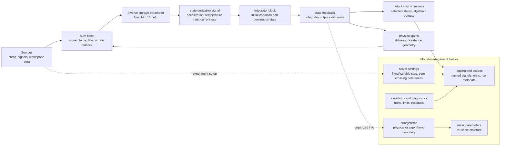

# Simulink Block Diagrams

Simulink represents dynamic systems as executable block diagrams. Instead of writing a derivative function directly, the modeler connects sources, sums, gains, nonlinear blocks, integrators, transfer functions, and scopes. This visual form is useful when the model is naturally described by signal flow, when many subsystems interact, or when simulation must later connect to control design, code generation, hardware-in-the-loop testing, or real-time execution.

A block diagram is still a mathematical model. Every connection should correspond to a variable with units, every Integrator block should correspond to a state, and every feedback path should represent a real dependency or algorithmic relation. The diagram is most valuable when it clarifies structure rather than hiding equations behind unlabeled blocks.

## Definitions

An Integrator block implements

$$
x(t)=x(0)+\int_0^t \dot{x}(\tau)\,d\tau.
$$

The signal entering the Integrator is the state derivative, and the signal leaving it is the state. A continuous-time Simulink model is often built by arranging algebra that computes $\dot{x}$, then feeding an Integrator.

A Transfer Fcn block implements a continuous-time input-output relation

$$
G(s)=\frac{b_ms^m+\cdots+b_0}{a_ns^n+\cdots+a_0}.
$$

It is compact but hides internal states. A State-Space block implements

$$
\dot{x}=Ax+Bu,\qquad y=Cx+Du.
$$

Subsystems group blocks behind an interface. They are essential for large models because they expose meaningful ports while hiding internal implementation details.

An algebraic loop occurs when Simulink must determine a signal value that depends instantaneously on itself, with no dynamic state or delay in the loop. Algebraic loops can be valid mathematical constraints, but they often slow simulation or indicate a missing dynamic element.

## Key results

The most reliable Simulink construction pattern is derivative first, integrator second. For each state $x_i$, build a signal representing $\dot{x}_i$ from current states, inputs, and parameters, then connect it to an Integrator whose output is $x_i$. This mirrors state-space form and makes initialization clear.

Block diagrams should be unit checked just like equations. If a Sum block combines force, velocity, and displacement directly, the diagram is wrong even if it runs. Gains often carry units: $1/m$ converts force to acceleration, $1/C$ converts heat flow to temperature rate, and $1/L$ converts voltage to current derivative.

Solver settings are part of the model definition. Continuous Integrator blocks require a continuous solver. Discrete blocks require sample times. Hybrid models require attention to zero-crossing detection, event location, and sample-time transitions.

Logging strategy matters. A Scope is good for quick inspection, but validation and reports require data logging to the workspace, Simulation Data Inspector, or files. The plotted time response should always identify which signal is being inspected and whether it is a state, output, error, or command.

Subsystem boundaries should follow physical or algorithmic boundaries. A mass-spring-damper subsystem might expose force input and position output while keeping velocity internal. A thermal subsystem might expose heater power and ambient temperature as inputs and object temperature as output. Clear boundaries make it easier to replace a simple model with a more detailed one later without changing the rest of the diagram. They also make it easier to compare a subsystem against a MATLAB script that implements the same equations.

Simulink models need naming discipline. Signals such as `x1` and `gain3` are acceptable for quick exploration but poor for study notes or validation. Names like `position_m`, `velocity_mps`, `heat_loss_W`, and `tank_height_m` document units and reduce ambiguity. This is especially important when blocks from different domains are combined, because the diagram can otherwise connect compatible numeric dimensions but incompatible physical quantities. A model that runs is not necessarily a model that means anything.

Masks and subsystem parameters should be used when a repeated structure appears. A two-tank system, a multi-mass chain, or a thermal network may contain the same balance equation several times with different parameter values. Masking the subsystem makes the repeated pattern explicit and reduces copy-edit errors. The same idea applies in MATLAB through functions: repeated model structure should be parameterized, not duplicated and edited in many places.

A time-response plot from Simulink should be interpreted with the solver configuration in view. Variable-step solvers may place many internal points near discontinuities and few points during slow smooth motion. Fixed-step solvers produce a uniform grid but may miss threshold crossings unless the grid is fine enough or the logic is discrete by design. The plotted line is therefore a combination of model dynamics, solver behavior, and logging settings.

A block diagram should also distinguish physical signals from diagnostic signals. A feedback line used by the model and a logged residual used for validation may both appear as wires, but they serve different purposes. Keeping diagnostics in a clearly named subsystem or logging configuration prevents accidental feedback changes and makes it easier to remove diagnostic code without altering model behavior.

Model initialization deserves the same care as wiring. Integrator initial conditions, block parameters, workspace variables, and mask values together define the starting state. A diagram can be structurally correct and still produce the wrong transient if one initial value is left at its default.

## Visual



The Simulink diagram shows an integrator-centered realization rather than a generic block chain. Inputs and feedback form a signed balance, gains convert the balance into a derivative, integrators store the states, and outputs are logged with metadata. The management subgraph adds the blocks that make a diagram maintainable: subsystems, masks, solver settings, assertions, and diagnostics.

| Simulink block | Mathematical role | Typical mistake |
|---|---|---|
| Integrator | Stores continuous state | Wrong initial condition |
| Sum | Adds signed terms | Incorrect sign convention |
| Gain | Parameter or unit conversion | Hidden magic number |
| Product | Nonlinear multiplication | Dimension mismatch |
| Saturation | Limit on signal | Ignoring operation at limit |
| Transfer Fcn | Compact LTI system | Losing state interpretation |
| Unit Delay | Discrete state | Confusing sample time with solver step |

## Worked example 1: Build a mass-spring-damper diagram

Problem: Create a Simulink diagram for

$$
m\ddot{q}+b\dot{q}+kq=F(t)
$$

with $m=2$, $b=3$, and $k=8$. Derive the state equations and describe the block connections.

1. Solve for acceleration:

$$
\ddot{q}=\frac{1}{m}\left(F-b\dot{q}-kq\right).
$$

2. Choose states:

$$
x_1=q,\qquad x_2=\dot{q}.
$$

3. Write derivatives:

$$
\dot{x}_1=x_2,
\qquad
\dot{x}_2=\frac{1}{2}\left(F-3x_2-8x_1\right).
$$

4. Build the signal flow. Use a Step block for $F(t)$. Use a Sum block with signs `+--` to compute $F-3\dot{q}-8q$. Use Gain blocks `3` and `8` on velocity and position feedback. Use Gain `1/2` to compute acceleration.

5. Use two Integrator blocks in series. Acceleration integrates to velocity, and velocity integrates to position. Feed velocity and position back to the Sum block.

6. Set initial conditions. If $q(0)=0.1$ and $\dot{q}(0)=0$, set the position Integrator initial condition to `0.1` and velocity Integrator initial condition to `0`.

Checked answer: for a constant force $F_0=4$, the steady displacement is $F_0/k=0.5$. The time-response plot of position should approach $0.5$ with damping. The velocity plot should decay to zero.

MATLAB comparison: use an ODE script or an `ss` object with

$$
A=\begin{bmatrix}0&1\\-4&-1.5\end{bmatrix},
\quad
B=\begin{bmatrix}0\\0.5\end{bmatrix}.
$$

## Worked example 2: Identify and remove an algebraic loop

Problem: A static nonlinear actuator is modeled as

$$
y=\operatorname{sat}(K(r-y)).
$$

This creates an algebraic loop because $y$ depends instantly on itself. Explain the issue and give a dynamic alternative.

1. Write the signal dependency. The error is

$$
e=r-y.
$$

The output is

$$
y=\operatorname{sat}(Ke).
$$

Substitute:

$$
y=\operatorname{sat}(K(r-y)).
$$

2. Notice there is no derivative, integrator, or delay. At each time instant Simulink must solve this nonlinear algebraic equation.

3. If the actuator is actually dynamic, introduce a first-order actuator:

$$
\tau\dot{y}=-y+\operatorname{sat}(K(r-y)).
$$

4. Solve for the derivative:

$$
\dot{y}=\frac{-y+\operatorname{sat}(K(r-y))}{\tau}.
$$

5. Implement this with an Integrator. The feedback $y$ now passes through a dynamic state, so the loop is no longer purely algebraic.

Checked answer: the dynamic model has a physical time constant and a state initial condition. The time-response plot should show $y$ moving smoothly toward a saturated or unsaturated value instead of being solved instantaneously.

MATLAB comparison: simulate the first-order actuator with `ode45`. If $\tau$ is very small, the response approaches the static algebraic behavior but becomes stiff.

## Code

```matlab
clear; clc; close all;

% MATLAB reference for the mass-spring-damper Simulink diagram.
m = 2; b = 3; k = 8; F0 = 4;
x0 = [0.1; 0];
rhs_msd = @(t,x) [x(2); (F0 - b*x(2) - k*x(1))/m];
[t, x] = ode45(rhs_msd, [0 10], x0);

figure;
subplot(2,1,1);
plot(t, x(:,1), 'LineWidth', 1.4); grid on;
ylabel('q (m)');
title('Mass-spring-damper position');
subplot(2,1,2);
plot(t, x(:,2), 'LineWidth', 1.4); grid on;
xlabel('Time (s)'); ylabel('dq/dt (m/s)');

% Dynamic actuator alternative to an algebraic loop.
K = 5; tau = 0.1; r = 1; umax = 2;
sat = @(v) min(max(v, -umax), umax);
rhs_act = @(t,y) (-y + sat(K*(r - y)))/tau;
[ta, ya] = ode45(rhs_act, [0 2], 0);

figure;
plot(ta, ya, 'LineWidth', 1.4); grid on;
xlabel('Time (s)'); ylabel('Actuator output y');
title('Dynamic actuator with saturation');
```

The first figure should match the Simulink scope if solver settings and initial conditions match. The second figure should show a fast but continuous actuator transient. In a Simulink model, the saturation block sits inside the derivative calculation rather than defining an instantaneous equation for its own output.

## Common pitfalls

- Building a diagram from left to right without first identifying states and derivatives.
- Leaving Gain blocks unlabeled so the diagram becomes impossible to audit.
- Using Transfer Fcn blocks for physical subsystems whose internal states need validation.
- Ignoring algebraic loop warnings because the plot appears reasonable.
- Mixing continuous and discrete blocks without explicit sample-time thinking.
- Comparing Simulink and MATLAB runs while using different solver tolerances or input definitions.

## Connections

- [State-Space Representation](/physics/simulation/state-space-representation)
- [Nonlinear Systems and Linearization](/physics/simulation/nonlinear-systems-linearization)
- [Hybrid Systems and Event Handling](/physics/simulation/hybrid-systems-event-handling)
- [MATLAB Scripting for Simulation](/physics/simulation/matlab-scripting-for-simulation)
