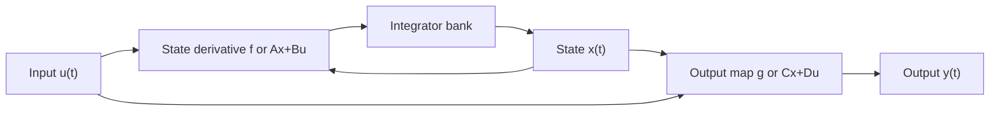

# State-Space Representation

State-space representation is the working language of simulation because it expresses a dynamic model as first-order differential equations. Higher-order equations, coupled component models, and nonlinear systems can all be written in this form. Once a model is in state-space form, a numerical solver only needs a function that maps the current time, current state, and current input to the state derivative.

This representation also separates model structure from implementation. MATLAB functions such as `ode45`, `ss`, `lsim`, and `step` operate naturally on state equations, and Simulink's Integrator and State-Space blocks are built around the same idea. Transfer functions are useful for linear input-output analysis, but state-space models keep the internal variables visible, which is essential when validating simulations against measured states or checking physical constraints.

## Definitions

A continuous-time nonlinear state-space model is

$$
\dot{\mathbf{x}}=\mathbf{f}(\mathbf{x},\mathbf{u},t),
\qquad
\mathbf{y}=\mathbf{g}(\mathbf{x},\mathbf{u},t).
$$

Here $\mathbf{x}\in\mathbb{R}^n$ is the state vector, $\mathbf{u}\in\mathbb{R}^m$ is the input vector, and $\mathbf{y}\in\mathbb{R}^p$ is the output vector. The model order is $n$, the number of states.

The linear time-invariant state-space model is

$$
\dot{\mathbf{x}}=A\mathbf{x}+B\mathbf{u},
\qquad
\mathbf{y}=C\mathbf{x}+D\mathbf{u}.
$$

The matrix dimensions are

$$
A\in\mathbb{R}^{n\times n},\quad
B\in\mathbb{R}^{n\times m},\quad
C\in\mathbb{R}^{p\times n},\quad
D\in\mathbb{R}^{p\times m}.
$$

An initial condition $\mathbf{x}(0)=\mathbf{x}_0$ is part of the simulation problem. Without it, the derivative rule is incomplete because many possible trajectories satisfy the same differential equation.

State variables are not unique. A second-order equation can be represented by position and velocity, by position and momentum, or by transformed modal coordinates. Different choices can improve numerical conditioning, interpretability, or compatibility with measured data.

## Key results

Any ordinary differential equation that can be solved for the highest derivative can be rewritten as first-order state equations. For

$$
a_2\ddot{y}+a_1\dot{y}+a_0y=b_0u,
$$

choose $x_1=y$ and $x_2=\dot{y}$. Then

$$
\begin{aligned}
\dot{x}_1 &= x_2,\\
\dot{x}_2 &= -\frac{a_0}{a_2}x_1-\frac{a_1}{a_2}x_2+\frac{b_0}{a_2}u.
\end{aligned}
$$

For an LTI model, the unforced solution is

$$
\mathbf{x}(t)=e^{At}\mathbf{x}_0.
$$

With input $\mathbf{u}(t)$, the solution is

$$
\mathbf{x}(t)=e^{At}\mathbf{x}_0+\int_0^t e^{A(t-\tau)}B\mathbf{u}(\tau)\,d\tau.
$$

This formula is important even when we do not compute the matrix exponential directly. It shows that the eigenvalues of $A$ control natural modes and that input history is filtered through the same state transition matrix.

The transfer function matrix of an LTI state-space model is

$$
G(s)=C(sI-A)^{-1}B+D.
$$

This connects state-space simulation to the Laplace-domain tools used in signals, systems, and control. The poles of $G(s)$ are usually eigenvalues of $A$, although cancellations can hide internal modes from a particular input-output channel.

For simulation work, state ordering should be documented as carefully as parameter values. A solver only sees a vector of numbers, so the meaning of `x(1)` and `x(2)` must be recoverable from comments, variable names, plots, or block labels. A common professional practice is to keep a short state table with symbol, units, initial value, and physical interpretation. That table prevents mistakes when the derivative function is edited later or when a Simulink model is compared with a MATLAB script.

State scaling also matters. If one state is a voltage near $10^{-3}$ and another is a position near $10^4$, a single absolute tolerance can make the solver over-resolve one state and under-resolve another. In MATLAB this can be handled with vector absolute tolerances, nondimensional states, or a scaled state transformation. In Simulink, the same issue appears when logged signals have very different magnitudes and the solver reports tiny steps or inaccurate zero crossings. A state-space representation is therefore not only a mathematical format; it is also a numerical interface.

## Visual



| Form | Main use | Strength | Limitation |
|---|---|---|---|
| Higher-order ODE | Compact scalar physics | Familiar for simple mechanical or electrical models | Not directly accepted by general ODE solvers |
| State-space | Simulation and multi-input systems | Handles coupled states and nonlinearities | State choice must be made carefully |
| Transfer function | Linear input-output analysis | Easy poles, zeros, frequency response | Hides internal state and initial-condition structure |
| Block diagram | Simulink implementation | Shows signal flow and feedback | Can obscure equations if blocks are undocumented |

## Worked example 1: Convert an RLC circuit to state-space form

Problem: A series RLC circuit is driven by an input voltage $v_s(t)$. Let $R=4\ \Omega$, $L=0.5\ \mathrm{H}$, and $C=0.1\ \mathrm{F}$. Choose capacitor voltage and inductor current as states. Derive $A$ and $B$ for output $y=v_C$.

1. Choose states:

$$
x_1=v_C,\qquad x_2=i_L.
$$

2. Use capacitor and inductor relations:

$$
i_C=C\dot{v}_C,\qquad v_L=L\dot{i}_L.
$$

In a series circuit the current through all elements is $i_L=i_C$, so

$$
\dot{x}_1=\frac{1}{C}x_2=10x_2.
$$

3. Apply Kirchhoff's voltage law:

$$
v_s=v_R+v_L+v_C=Ri_L+L\dot{i}_L+v_C.
$$

4. Solve for $\dot{i}_L$:

$$
L\dot{i}_L=v_s-Ri_L-v_C,
$$

so

$$
\dot{x}_2=-\frac{1}{L}x_1-\frac{R}{L}x_2+\frac{1}{L}v_s
=-2x_1-8x_2+2v_s.
$$

5. Assemble matrices:

$$
\dot{\mathbf{x}}=
\begin{bmatrix}
0 & 10\\
-2 & -8
\end{bmatrix}\mathbf{x}
+
\begin{bmatrix}
0\\
2
\end{bmatrix}v_s,
\qquad
y=\begin{bmatrix}1&0\end{bmatrix}\mathbf{x}.
$$

Checked answer: dimensions are consistent: $A$ is $2\times2$, $B$ is $2\times1$, and $C$ is $1\times2$. A unit step in voltage should make $v_C$ approach $1\ \mathrm{V}$ at steady state, because the capacitor is open-circuit in DC and no voltage is dropped across $R$ or $L$ after transients.

Simulink description: use a State-Space block with the $A$, $B$, $C$, and $D=0$ matrices, or build the two equations with Sum, Gain, and Integrator blocks. The time-response plot should show capacitor voltage rising toward the input with possible overshoot depending on damping.

## Worked example 2: Build a controllable canonical realization

Problem: The transfer function

$$
G(s)=\frac{Y(s)}{U(s)}=\frac{3}{s^2+4s+5}
$$

is to be simulated in state-space form. Construct a realization using $x_1=y$ and $x_2=\dot{y}$, and check the step steady state.

1. Convert the transfer function to a differential equation:

$$
(s^2+4s+5)Y(s)=3U(s).
$$

Assuming zero initial conditions, this corresponds to

$$
\ddot{y}+4\dot{y}+5y=3u.
$$

2. Choose states:

$$
x_1=y,\qquad x_2=\dot{y}.
$$

3. Write first-order equations:

$$
\begin{aligned}
\dot{x}_1 &= x_2,\\
\dot{x}_2 &= -5x_1-4x_2+3u.
\end{aligned}
$$

4. Assemble output:

$$
y=x_1.
$$

Thus

$$
A=\begin{bmatrix}0&1\\-5&-4\end{bmatrix},
\quad
B=\begin{bmatrix}0\\3\end{bmatrix},
\quad
C=\begin{bmatrix}1&0\end{bmatrix},
\quad
D=0.
$$

5. Check the unit-step steady state. At equilibrium, $\dot{x}_1=\dot{x}_2=0$. From the first equation, $\bar{x}_2=0$. From the second,

$$
0=-5\bar{x}_1+3,
\qquad
\bar{x}_1=0.6.
$$

Checked answer: the DC gain is $G(0)=3/5=0.6$, matching the equilibrium. The time-response plot should show a stable second-order response because the poles of $s^2+4s+5$ are $-2\pm j$, both in the left half-plane.

Simulink description: this system can be implemented with one Transfer Fcn block using numerator `[3]` and denominator `[1 4 5]`, or with two Integrator blocks in state form. The state implementation is better when internal velocity-like state $x_2$ must be inspected.

## Code

```matlab
clear; clc; close all;

% RLC state-space model
R = 4; L = 0.5; Ccap = 0.1;
A1 = [0, 1/Ccap; -1/L, -R/L];
B1 = [0; 1/L];
C1 = [1, 0];
D1 = 0;
sys_rlc = ss(A1, B1, C1, D1);

% Transfer function realization
A2 = [0 1; -5 -4];
B2 = [0; 3];
C2 = [1 0];
D2 = 0;
sys_second = ss(A2, B2, C2, D2);

t = linspace(0, 8, 500);
figure;
subplot(2,1,1);
step(sys_rlc, t); grid on;
title('RLC capacitor voltage response');

subplot(2,1,2);
step(sys_second, t); grid on;
title('Second-order realization response');
```

The MATLAB `ss` command creates LTI state-space objects that can be plotted directly. For nonlinear or time-varying systems, replace `ss` with a derivative function and integrate with `ode45`, `ode15s`, or another solver. In Simulink, the equivalent compact implementation is a State-Space block; the expanded implementation is an integrator bank with feedback gains matching the rows of $A$ and feedthrough gains matching $B$.

## Common pitfalls

- Using the output as the only state for a second-order model. The derivative of the output is also needed unless the model has been reduced for a valid reason.
- Confusing $B$ and $C$ dimensions. $B$ maps inputs into state derivatives; $C$ maps states into outputs.
- Assuming every transfer function realization exposes the same internal variables. Realizations can be mathematically equivalent but physically different.
- Forgetting direct feedthrough $D$ when the output algebraically depends on the input.
- Ignoring initial conditions when comparing a state-space simulation to a transfer-function step response. Many transfer-function commands default to zero initial state.
- Treating hidden pole-zero cancellations as harmless. A canceled internal unstable mode can still be dangerous if it corresponds to a real state.

## Connections

- [Mathematical Modeling of Continuous-Time Systems](/physics/simulation/mathematical-modeling-continuous-time)
- [Linear Systems, Transfer Functions, and Modes](/physics/simulation/linear-systems-transfer-functions-modes)
- [MATLAB Scripting for Simulation](/physics/simulation/matlab-scripting-for-simulation)
- [State-Space Introduction](/physics/signals-systems/state-space-introduction)
