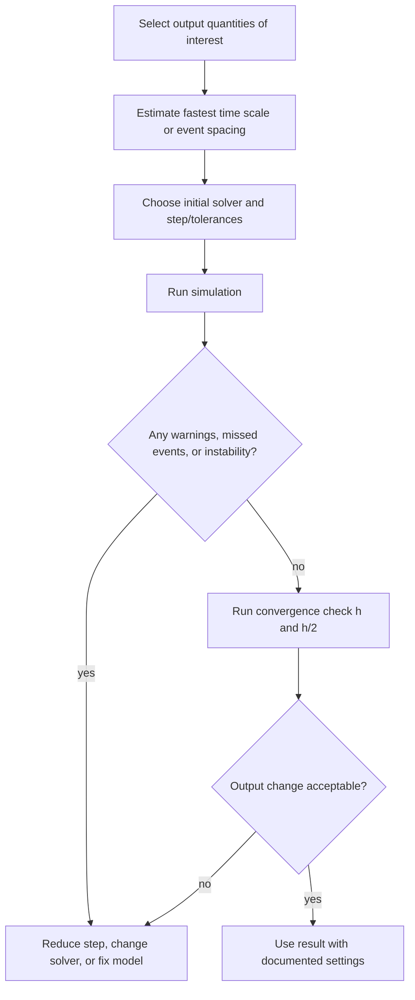

# Step Size, Accuracy, and Stability

Step size is the most visible simulation setting, but it controls several different things at once. A smaller step usually improves accuracy, but it also increases run time, can expose discontinuities more sharply, and may still fail if the model is stiff or badly scaled. A larger step may be fast enough for real-time operation, but it can create numerical oscillations, unstable growth, or a smooth-looking response that is dynamically wrong.

The central lesson is that a simulation result is a numerical experiment, not a direct view of the differential equation. A physically stable model can become unstable after discretization. A plotted curve can look smooth while missing peak values or event times. The modeler needs a step-size selection process that checks local error, global behavior, solver stability, and the time scales present in the system.

## Definitions

For a fixed-step simulation, the time grid is

$$
t_k=t_0+kh,
$$

where $h$ is the step size. The solver computes approximations $\mathbf{x}_k\approx\mathbf{x}(t_k)$.

Local truncation error is the one-step error made by the numerical formula when the starting value is exact. If a method has local error $O(h^{p+1})$, its global error over a fixed interval is usually $O(h^p)$ for stable, smooth problems. The integer $p$ is the order of the method.

Absolute stability concerns the behavior of a numerical method applied to the test equation

$$
\dot{x}=\lambda x.
$$

For explicit Euler,

$$
x_{k+1}=(1+h\lambda)x_k.
$$

The numerical solution decays only when $\vert 1+h\lambda\vert \lt 1$. This condition depends on both the continuous model and the solver.

Stiffness is present when the model has fast stable dynamics that force small explicit steps even though the quantities of interest evolve slowly. Stiff systems are common in chemical kinetics, thermal networks with small and large capacitances, electrical circuits with widely separated time constants, and mechanical contact problems.

An adaptive solver changes step size during the simulation. It estimates error, accepts the step if the error is below tolerance, and rejects or repeats the step with a smaller $h$ if the error is too large.

## Key results

For the scalar stable system $\dot{x}=-ax$ with $a\gt 0$, explicit Euler is stable only if

$$
|1-ah|<1.
$$

Solving gives

$$
0<h<\frac{2}{a}.
$$

This is not an accuracy guarantee; it is only a stability boundary. Accurate simulation normally requires $h$ much smaller than the fastest time constant. If $\tau=1/a$, a rough starting point for low-order fixed-step methods is $h\le \tau/10$, followed by convergence checks.

For oscillatory second-order systems, step size must resolve the period. If the damped natural frequency is $\omega_d$, the period is

$$
T_d=\frac{2\pi}{\omega_d}.
$$

Using only a few points per period causes wrong amplitude, wrong phase, and missed peaks. A common practical target is at least $20$ to $50$ points per period for clean plots and phase-sensitive comparisons.

Step-size convergence is one of the simplest verification checks. Run the same model with $h$, $h/2$, and possibly $h/4$. If the output of interest changes negligibly between the smaller two steps, the step is probably adequate for that output. This does not validate the physical model, but it tests numerical resolution.

Adaptive tolerances have two parts in MATLAB solvers:

$$
\text{error weight}=\text{AbsTol}+\text{RelTol}\cdot |x|.
$$

`RelTol` controls relative accuracy for nonzero states; `AbsTol` prevents tiny states from forcing unreasonable steps. Poorly scaled states make tolerance selection harder, so nondimensionalization or state scaling can improve solver behavior.

There is also a distinction between resolution and stability. Resolution asks whether the computed points are close enough to the true curve for the output being studied. Stability asks whether the numerical recurrence damps or amplifies modes in a way that is compatible with the differential equation. A step can be stable but inaccurate, especially for oscillatory systems where phase error accumulates slowly. A step can also be accurate for a slow output while an unobserved fast state is poorly resolved, which matters if that fast state later couples back through a nonlinear event.

For Simulink models, step-size selection must account for block behavior. Discontinuity blocks, relay thresholds, saturation limits, lookup tables, and triggered subsystems can introduce sharp changes that are not obvious from the continuous equations alone. A variable-step solver may reduce the step near such features, but only if the event is represented in a way the solver can detect. Fixed-step simulations should place sample times and event logic deliberately so that switching is not an accident of the chosen grid.

## Visual



| Issue | Symptom in plot | Likely cause | Remedy |
|---|---|---|---|
| Step too large for accuracy | Smooth but shifted response | Phase and amplitude error | Reduce step or use higher-order method |
| Step too large for stability | Growing numerical oscillation | Solver stability limit violated | Reduce step or use implicit/stiff solver |
| Missed discontinuity | Jump appears late or rounded | Solver stepped over event | Add event detection or force breakpoints |
| Stiff dynamics | Very slow simulation or solver failure | Separated time scales | Use `ode15s` or simplify fast modes |
| Bad state scaling | Tiny steps for one state | Tolerance weights mismatched | Rescale states or set vector tolerances |

## Worked example 1: Stability limit for explicit Euler

Problem: The stable differential equation

$$
\dot{x}=-50x,\qquad x(0)=1
$$

has time constant $\tau=0.02\ \mathrm{s}$. Determine whether explicit Euler is stable for $h=0.01$, $h=0.04$, and $h=0.05$.

1. Write the Euler update:

$$
x_{k+1}=x_k+h(-50x_k)=(1-50h)x_k.
$$

2. Apply the stability condition:

$$
|1-50h|<1.
$$

3. Solve it:

$$
-1<1-50h<1.
$$

Subtract $1$:

$$
-2<-50h<0.
$$

Divide by $-50$ and reverse inequalities:

$$
0<h<0.04.
$$

4. Test $h=0.01$:

$$
1-50(0.01)=0.5,
$$

so $\vert 0.5\vert \lt 1$ and the method is stable.

5. Test $h=0.04$:

$$
1-50(0.04)=-1,
$$

so $\vert -1\vert =1$. The method is marginal: values alternate signs without decay in exact arithmetic.

6. Test $h=0.05$:

$$
1-50(0.05)=-1.5,
$$

so $\vert -1.5\vert \gt 1$ and the numerical solution grows in magnitude.

Checked answer: the continuous system always decays, but explicit Euler is safe only for $0\lt h\lt 0.04\ \mathrm{s}$. A time-response plot with $h=0.05$ would alternate sign and grow, which is purely numerical.

Simulink description: with a fixed-step Euler solver, set the step size to each value and scope $x$. The `h=0.01` run decays; the `h=0.04` run alternates near $\pm1$; the `h=0.05` run diverges.

## Worked example 2: Convergence check for a forced oscillator

Problem: A mass-spring-damper system satisfies

$$
\ddot{q}+0.4\dot{q}+4q=1,
\qquad
q(0)=0,\quad \dot{q}(0)=0.
$$

Estimate the oscillation period and choose fixed step sizes for a convergence check.

1. Identify standard second-order form:

$$
\ddot{q}+2\zeta\omega_n\dot{q}+\omega_n^2 q=\omega_n^2 K u.
$$

Here $\omega_n^2=4$, so

$$
\omega_n=2\ \mathrm{rad/s}.
$$

2. Use $2\zeta\omega_n=0.4$:

$$
2\zeta(2)=0.4
\quad\Rightarrow\quad
\zeta=0.1.
$$

3. Compute damped natural frequency:

$$
\omega_d=\omega_n\sqrt{1-\zeta^2}
=2\sqrt{0.99}
\approx1.99\ \mathrm{rad/s}.
$$

4. Compute damped period:

$$
T_d=\frac{2\pi}{\omega_d}
\approx\frac{6.283}{1.99}
\approx3.16\ \mathrm{s}.
$$

5. Choose a plotting-resolution step. For $40$ points per period:

$$
h=\frac{T_d}{40}\approx0.079\ \mathrm{s}.
$$

6. Choose a convergence sequence:

$$
h_1=0.08,\qquad h_2=0.04,\qquad h_3=0.02.
$$

Checked answer: these steps resolve the oscillation. The time-response plot should show an underdamped rise to the equilibrium $q_\infty=1/4=0.25$ with decaying oscillations. If peak height or peak time changes significantly from $h=0.04$ to $h=0.02$, the larger steps are not adequate for those outputs.

Simulink description: use a fixed-step RK4 solver for each step size, scope $q$, and compare logged outputs on the same axes. A variable-step solver can be used as a reference if tolerances are tightened.

## Code

```matlab
clear; clc; close all;

% Explicit Euler stability demonstration
a = 50;
tEnd = 0.3;
steps = [0.01 0.04 0.05];
figure;
for i = 1:numel(steps)
    h = steps(i);
    t = 0:h:tEnd;
    x = zeros(size(t));
    x(1) = 1;
    for k = 1:numel(t)-1
        x(k+1) = x(k) + h*(-a*x(k));
    end
    subplot(3,1,i);
    stairs(t, x, 'LineWidth', 1.3); grid on;
    ylabel('x');
    title(sprintf('Explicit Euler with h = %.3f s', h));
end
xlabel('Time (s)');

% Convergence check for oscillator using ode4-style RK4
rhs = @(x) [x(2); 1 - 0.4*x(2) - 4*x(1)];
hList = [0.08 0.04 0.02];
figure; hold on; grid on;
for h = hList
    t = 0:h:20;
    x = zeros(2, numel(t));
    for k = 1:numel(t)-1
        k1 = rhs(x(:,k));
        k2 = rhs(x(:,k) + h*k1/2);
        k3 = rhs(x(:,k) + h*k2/2);
        k4 = rhs(x(:,k) + h*k3);
        x(:,k+1) = x(:,k) + h*(k1 + 2*k2 + 2*k3 + k4)/6;
    end
    plot(t, x(1,:), 'DisplayName', sprintf('h = %.2f', h));
end
legend('Location', 'best');
xlabel('Time (s)'); ylabel('q(t)');
title('Step-size convergence for forced oscillator');
```

The first figure should make the stability boundary visible. The second should show the three RK4 curves nearly overlapping if the steps are adequate. If the curves separate, refine the step or compare with a tight-tolerance adaptive solution.

## Common pitfalls

- Calling a result validated because two coarse step sizes agree. Use at least one additional refinement when the output matters.
- Confusing solver output times with internal time steps in adaptive solvers.
- Reducing step size to hide a discontinuity-induced problem instead of modeling the event correctly.
- Using scalar absolute tolerance for states with very different units and magnitudes.
- Assuming a stable solver produces an accurate result. Stability only prevents numerical growth; it does not guarantee small phase or amplitude error.
- Changing solver and model parameters at the same time during debugging. Vary one factor at a time.

## Connections

- [Numerical Integration Methods](/physics/simulation/numerical-integration-methods)
- [Hybrid Systems and Event Handling](/physics/simulation/hybrid-systems-event-handling)
- [Validation and Multi-Domain Simulation Examples](/physics/simulation/validation-multi-domain-examples)
- [Sampling, Aliasing, and Reconstruction](/physics/signals-systems/sampling-aliasing-reconstruction)
