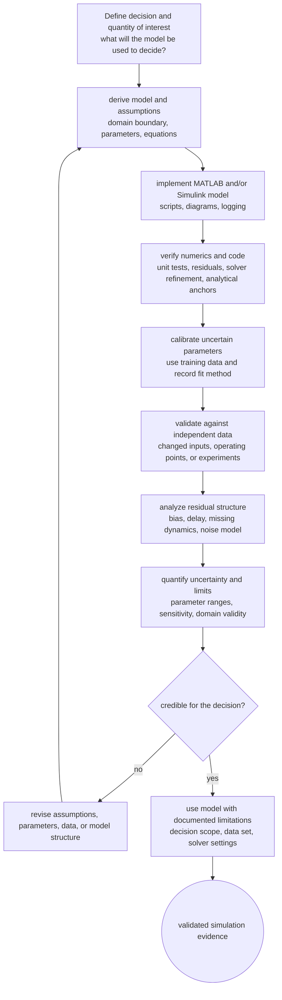

# Validation and Multi-Domain Simulation Examples

Simulation is useful only when the model is credible for its intended question. Verification asks whether the equations were solved correctly and implemented as intended. Validation asks whether the model is an adequate representation of the real system. A MATLAB script can be numerically verified and still physically invalid if a parameter is wrong, a missing mechanism dominates, or the operating range differs from the assumptions.

Dynamic-system simulation is powerful because the same mathematical structures appear in mechanical, electrical, thermal, chemical, and biological domains. Storage elements create states; resistive elements create dissipation; sources drive the system; nonlinearities and constraints shape the response. A validation mindset uses these analogies while still respecting the units, data, and mechanisms of each domain.

## Definitions

Verification is the process of checking that the model implementation correctly solves the specified mathematical model. Examples include code reviews, unit tests, solver convergence studies, comparison with analytical solutions, and consistency between MATLAB and Simulink implementations.

Validation is the process of checking that the specified mathematical model is adequate for the real or intended system. Examples include comparison with experimental data, parameter estimation, residual analysis, sensitivity studies, and expert review of assumptions.

Calibration or parameter identification adjusts uncertain parameters so simulated outputs match reference data. Calibration is not the same as validation; a calibrated model can overfit one data set and fail on another.

A quantity of interest is the output used to make a decision. A simulation for peak cable force, final temperature, settling time, infection peak, or controller stability may require different model fidelity and different validation data.

Uncertainty analysis studies how parameter, input, and initial-condition uncertainty affect outputs. Sensitivity analysis studies which uncertain factors matter most.

## Key results

A practical verification and validation workflow has four layers:

| Layer | Question | Example check |
|---|---|---|
| Equation check | Are the equations internally consistent? | Units, signs, limiting cases |
| Numerical check | Are the equations solved accurately? | Step-size convergence, tolerances, solver comparison |
| Implementation check | Does the code match the equations? | MATLAB/Simulink cross-check, unit tests |
| Physical check | Does the model match observed behavior? | Data comparison, residuals, validation cases |

For first-order linear models, the equilibrium and time constant provide simple validation anchors:

$$
\dot{x}=-\frac{1}{\tau}(x-\bar{x})
\quad\Rightarrow\quad
x(t)=\bar{x}+(x_0-\bar{x})e^{-t/\tau}.
$$

For conservation models, conserved or dissipated quantities are powerful verification checks. An undamped mass-spring system should conserve total energy:

$$
E=\frac{1}{2}m\dot{q}^2+\frac{1}{2}kq^2.
$$

A closed chemical mass-balance model should not create or destroy total material unless reactions or flows explicitly do so.

Residuals between measured and simulated outputs should be inspected over time, not just summarized by one number:

$$
r_i=y_\text{meas}(t_i)-y_\text{sim}(t_i).
$$

Structured residuals often reveal missing dynamics, time delays, bias, or wrong initial conditions.

Validation should be planned around the intended decision. A model used to rank two controller gains may only need accurate settling time and overshoot near one operating point. A model used to certify a safety limit needs conservative treatment of uncertainty, credible worst-case scenarios, and independent evidence near the boundary. A biological model used for qualitative mechanism exploration may be judged differently from a thermal model used to size hardware. The same equations can therefore be adequate for one question and inadequate for another.

Multi-domain analogy helps with derivation, but validation must return to the physical domain. The first-order RC circuit and the mixing tank have the same normalized response, yet the measurement errors, disturbances, and parameter uncertainties are different. Voltage can be measured with high bandwidth and low noise; concentration samples may be delayed, sparse, and affected by mixing imperfections. A good simulation note records both the shared mathematical structure and the domain-specific reasons the model might fail.

Documentation is part of validation. Future readers need to know which data set was used, which parameters were estimated, which solver settings were used, and which outputs were judged acceptable. Without that record, a matching plot is hard to reproduce and easy to overstate. The limitations section of a simulation report should be as concrete as the equations.

A final validation check is prediction under changed conditions. After calibration, change an input, initial condition, or operating point and compare the model with data that were not used to tune it. This is where many plausible models fail. Passing that test does not prove universal truth, but it gives stronger evidence that the model captures a mechanism rather than only fitting one curve.

## Visual



This validation diagram distinguishes verification, calibration, validation, residual analysis, and uncertainty reporting. The pipeline moves from a decision-specific model to independent-data testing, then gates use of the model on whether the evidence is credible for that decision. The revision loop is broad because validation failures can come from assumptions, parameters, data quality, implementation, or model structure.

| Domain | Storage state | Flow/effort analogy | Common response |
|---|---|---|---|
| Mechanical translation | position and velocity | force drives acceleration | oscillation, damping, resonance |
| Electrical circuit | capacitor voltage, inductor current | voltage/current laws | filtering, transient charging |
| Thermal lump | temperature | heat flow through resistance | slow exponential response |
| Chemical reactor | concentration | reaction and inlet/outlet flows | approach to steady concentration |
| Biological population | population size | birth, death, interaction rates | growth, saturation, oscillation |

## Worked example 1: Verify a thermal model against analytical response

Problem: A small heated object follows

$$
C\dot{T}=Q-\frac{T-T_\infty}{R}
$$

with $C=200\ \mathrm{J/K}$, $R=0.5\ \mathrm{K/W}$, $Q=20\ \mathrm{W}$, $T_\infty=25^\circ\mathrm{C}$, and $T(0)=25^\circ\mathrm{C}$. Use the analytical solution to verify the simulation at $t=100\ \mathrm{s}$.

1. Compute time constant:

$$
\tau=RC=0.5(200)=100\ \mathrm{s}.
$$

2. Compute equilibrium:

$$
\bar{T}=T_\infty+RQ=25+0.5(20)=35^\circ\mathrm{C}.
$$

3. Write response:

$$
T(t)=\bar{T}+(T_0-\bar{T})e^{-t/\tau}.
$$

4. Substitute values:

$$
T(t)=35+(25-35)e^{-t/100}
=35-10e^{-t/100}.
$$

5. Evaluate at $t=100$:

$$
T(100)=35-10e^{-1}
\approx35-3.6788
=31.3212^\circ\mathrm{C}.
$$

6. Verification criterion: a tight-tolerance `ode45` run should return approximately $31.321^\circ\mathrm{C}$ at $100\ \mathrm{s}$. A fixed-step Euler run may be acceptable only after a step-convergence check.

Checked answer: the time-response plot should be monotone from $25$ toward $35^\circ\mathrm{C}$, reaching about $63.2\%$ of the total $10^\circ\mathrm{C}$ rise at one time constant.

Simulink description: build the thermal balance with Sum, Gain, and Integrator blocks. Log temperature and compare the logged value at $100\ \mathrm{s}$ with the analytical value. This is verification of the implementation, not validation against a real object.

## Worked example 2: Multi-domain first-order analogy

Problem: Show that an RC circuit and a continuous stirred tank with first-order washout share the same mathematical form, then compute their steady states.

The RC circuit is

$$
C_e\dot{v}=\frac{v_s-v}{R_e}.
$$

The tank concentration model is

$$
V\dot{c}=q(c_\text{in}-c).
$$

1. Put the RC model in standard first-order form:

$$
\dot{v}=-\frac{1}{R_eC_e}v+\frac{1}{R_eC_e}v_s.
$$

2. Put the tank model in standard form:

$$
\dot{c}=-\frac{q}{V}c+\frac{q}{V}c_\text{in}.
$$

3. Identify time constants:

$$
\tau_e=R_eC_e,
\qquad
\tau_c=\frac{V}{q}.
$$

4. Find RC steady state for constant $v_s$:

$$
0=-\frac{1}{R_eC_e}\bar{v}+\frac{1}{R_eC_e}v_s
\quad\Rightarrow\quad
\bar{v}=v_s.
$$

5. Find tank steady state for constant $c_\text{in}$:

$$
0=-\frac{q}{V}\bar{c}+\frac{q}{V}c_\text{in}
\quad\Rightarrow\quad
\bar{c}=c_\text{in}.
$$

6. Interpret. The capacitor voltage approaches source voltage; the tank concentration approaches inlet concentration. Both responses are first-order exponentials, but the units and validation data differ.

Checked answer: for $R_e=10\ \Omega$, $C_e=0.2\ \mathrm{F}$, $\tau_e=2\ \mathrm{s}$. For $V=100\ \mathrm{L}$ and $q=5\ \mathrm{L/min}$, $\tau_c=20\ \mathrm{min}$. The plots have the same normalized shape but very different time scales.

Simulink description: both models can use the same subsystem pattern: subtract state from input, apply gain $1/\tau$, integrate. The subsystem should be parameterized with domain-specific units and labels so the analogy does not erase physical meaning.

## Code

```matlab
clear; clc; close all;

%% Verification against analytical thermal response
C = 200; R = 0.5; Q = 20; Tamb = 25; T0 = 25;
rhs = @(t,T) (Q - (T - Tamb)/R)/C;
tCheck = 100;
[t, T] = ode45(rhs, [0 tCheck], T0, odeset('RelTol',1e-10,'AbsTol',1e-12));
T_exact = Tamb + R*Q + (T0 - (Tamb + R*Q))*exp(-tCheck/(R*C));
fprintf('Numerical T(100) = %.6f C\n', T(end));
fprintf('Exact T(100)     = %.6f C\n', T_exact);
fprintf('Absolute error   = %.3e C\n', abs(T(end) - T_exact));

figure;
plot(t, T, 'LineWidth', 1.4); grid on;
xlabel('Time (s)'); ylabel('Temperature (deg C)');
title('Thermal verification case');

%% Multi-domain normalized first-order responses
te = linspace(0, 10, 300);
tc = linspace(0, 100, 300);
tau_e = 2;
tau_c = 20;
v_norm = 1 - exp(-te/tau_e);
c_norm = 1 - exp(-tc/tau_c);

figure;
plot(te/tau_e, v_norm, 'b-', tc/tau_c, c_norm, 'r--', 'LineWidth', 1.4);
grid on;
xlabel('Normalized time t/\tau');
ylabel('Normalized response');
legend('RC circuit', 'Mixing tank', 'Location', 'southeast');
title('Same first-order form across domains');
```

The first output should show a very small numerical error when using tight tolerances. The second plot should show the electrical and chemical responses lying on the same normalized curve. This is a useful modeling insight, but validation must still use domain-specific measurements: voltage probes for the circuit, concentration samples for the tank, temperature sensors for thermal models, and population or assay data for biological models.

## Common pitfalls

- Treating verification and validation as the same activity.
- Calibrating parameters on the same data later claimed as independent validation.
- Validating only by eye when quantitative error metrics are needed.
- Matching one output while ignoring another physically important state or constraint.
- Trusting a model outside the operating range used for derivation or calibration.
- Forgetting that analogous equations do not imply analogous parameter uncertainty or measurement quality.

## Connections

- [Mathematical Modeling of Continuous-Time Systems](/physics/simulation/mathematical-modeling-continuous-time)
- [MATLAB Scripting for Simulation](/physics/simulation/matlab-scripting-for-simulation)
- [Step Size, Accuracy, and Stability](/physics/simulation/step-size-accuracy-stability)
- [Current, Resistance, and DC Circuits](/physics/general/current-resistance-and-dc-circuits)
- [Temperature, Heat, and Kinetic Theory](/physics/general/temperature-heat-and-kinetic-theory)
