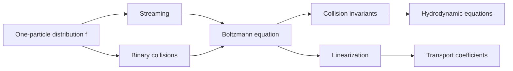

# Boltzmann Equation and Transport

The Boltzmann equation describes the evolution of the one-particle distribution function $f(x,p,t)$ in a dilute gas. It is the bridge between microscopic collisions and macroscopic transport: viscosity, thermal conductivity, diffusion, electrical conductivity, and hydrodynamic conservation laws.

Schwabl derives the equation, studies the H-theorem, linearizes it near local equilibrium, and discusses the relaxation-time approximation. The key approximation is molecular chaos: before a binary collision, two-particle probabilities factor into one-particle distributions.

## Definitions

The Boltzmann equation is

$$
\partial_t f + v\cdot\nabla_x f + F\cdot\nabla_p f
=\left(\partial_t f\right)_{\mathrm{coll}}.
$$

Here $f(x,p,t)d^3x\,d^3p$ is proportional to the number of particles in the phase-space element. The left side is streaming under external force $F$, while the right side accounts for collisions.

Local equilibrium has the Maxwell form

$$
f_{\mathrm{loc}}(x,p,t)
=n(x,t)\left({1\over 2\pi m k_BT(x,t)}\right)^{3/2}
\exp\left[
-{(p-mu(x,t))^2\over 2mk_BT(x,t)}
\right],
$$

where $u(x,t)$ is the fluid velocity.

The relaxation-time approximation writes

$$
\left(\partial_t f\right)_{\mathrm{coll}}
=-{f-f_{\mathrm{loc}}\over \tau}.
$$

Collision invariants are quantities conserved in binary collisions:

$$
1,\qquad p,\qquad {p^2\over 2m}.
$$

They lead to conservation of particle number, momentum, and energy.

## Key results

Boltzmann's $H$ functional is

$$
H(t)=\int f\ln f\,d^3x\,d^3p.
$$

Under the assumptions of the Boltzmann collision operator,

$$
{dH\over dt}\le 0.
$$

This is the H-theorem. Since entropy is proportional to $-H$, it describes irreversible approach to equilibrium within the kinetic approximation. The theorem does not contradict microscopic time reversal because molecular chaos is an additional statistical assumption about pre-collision correlations.

Taking velocity moments of the Boltzmann equation gives hydrodynamic equations. Multiplying by $1$, $p$, and $p^2/(2m)$ and integrating over momentum yields continuity, momentum balance, and energy balance. Constitutive corrections away from local equilibrium produce viscosity and heat conduction.

In the relaxation-time approximation for charged particles under a weak electric field, the steady perturbation satisfies

$$
\delta f=-q\tau\,\mathbf E\cdot\nabla_p f_0.
$$

For an isotropic equilibrium distribution, this gives the Drude conductivity

$$
\sigma={nq^2\tau\over m}.
$$

For dilute gases, transport coefficients scale with mean free path $\ell$ and thermal speed $\bar v$. A rough kinetic estimate for shear viscosity is

$$
\eta\sim {1\over 3}n m \bar v \ell.
$$

The detailed coefficients require solving the linearized Boltzmann equation.

The collision integral has a gain-minus-loss structure. The loss term removes particles from momentum $p_1$ when they collide with particles of momentum $p_2$. The gain term adds particles into $p_1$ from inverse collisions. Conservation of energy and momentum in each binary collision guarantees that the collision invariants survive integration over momentum. This is why hydrodynamics follows from kinetic theory even though the detailed distribution relaxes.

Local equilibrium is not global equilibrium. In local equilibrium, each small fluid element has a Maxwell distribution characterized by fields $n(x,t)$, $u(x,t)$, and $T(x,t)$. Gradients of these fields drive deviations from local equilibrium. Those deviations are small in the hydrodynamic regime, where the mean free path is short compared with macroscopic length scales. The Knudsen number

$$
\mathrm{Kn}={\ell\over L}
$$

measures this separation. Hydrodynamics is an expansion in small $\mathrm{Kn}$.

The H-theorem's equality condition is restrictive. The entropy production vanishes only when the distribution has the Maxwell form determined by collision invariants. This identifies the local Maxwellian as the attractor of collisions. Streaming and external forces can keep the system out of global equilibrium, but collisions still rapidly relax nonhydrodynamic distortions.

In quantum gases, kinetic equations are modified by Bose enhancement and Pauli blocking factors. A final state with occupation $f$ contributes a factor $1+f$ for bosons and $1-f$ for fermions. These factors are the transport counterpart of the equilibrium occupation rules and become important in degenerate gases.

Transport theory therefore sits between microscopic mechanics and continuum physics. It retains enough molecular information to compute coefficients but discards enough detail to produce closed macroscopic equations.

The relaxation-time approximation is useful but blunt. A single $\tau$ cannot capture the fact that different angular distortions of the distribution may decay at different rates. More accurate treatments expand deviations from equilibrium in orthogonal functions and solve an integral equation for the collision operator. Schwabl's linearized discussion points in this direction by treating the collision operator's eigenfunctions and hydrodynamic zero modes.

Hydrodynamic modes are slow because they are tied to conservation laws. Density, momentum, and energy cannot relax locally by collisions alone; they can only move through space. Nonconserved distortions of $f$ decay on microscopic collision times. This separation of slow conserved modes from fast kinetic modes is the reason hydrodynamics is universal at long wavelengths.

The H-theorem should therefore be read at the kinetic level. It proves monotonic relaxation for the Boltzmann equation, not for the exact $N$-particle Liouville equation without assumptions.

Boundary conditions matter in kinetic theory just as they do in diffusion. A gas near a wall may have a distribution that differs from the bulk local Maxwellian, producing slip, temperature jumps, or Knudsen layers. These effects are small in the hydrodynamic limit but important in rarefied gases and microfluidic systems.

External fields add another layer. In plasmas or electron gases, forces can drive distributions far from equilibrium, while collisions try to restore local equilibrium. The competition between streaming, forcing, and collision terms is the practical content of the Boltzmann equation.

The equation is therefore a controlled compromise: richer than hydrodynamics because it retains momentum dependence, but simpler than the full BBGKY hierarchy because it closes at the one-particle level.

## Visual



| Approximation | Statement | Consequence |
|---|---:|---|
| Dilute gas | binary collisions dominate | Boltzmann collision operator |
| Molecular chaos | pre-collision pairs factorize | irreversibility enters |
| Local equilibrium | slowly varying $n,u,T$ | hydrodynamic fields |
| Relaxation time | collision operator $=-(f-f_{\mathrm{loc}})/\tau$ | simple transport formulas |

## Worked example 1: Drude conductivity from relaxation time

Problem: Derive $\sigma=nq^2\tau/m$ for particles of charge $q$ and mass $m$ in a weak uniform electric field.

Method:

1. In steady uniform conditions, the relaxation-time Boltzmann equation is

$$
q\mathbf E\cdot\nabla_p f=-{f-f_0\over \tau}.
$$

2. Linearize $f=f_0+\delta f$ and keep only first order in $\mathbf E$:

$$
q\mathbf E\cdot\nabla_p f_0=-{\delta f\over \tau}.
$$

3. Therefore

$$
\delta f=-q\tau\mathbf E\cdot\nabla_p f_0.
$$

4. The current density is

$$
\mathbf j=q\int {d^3p}\,\mathbf v\,\delta f
$$

up to the chosen normalization of $f$. For an isotropic distribution, the tensor average gives

$$
j_i={nq^2\tau\over m}E_i.
$$

5. Hence

$$
\sigma={nq^2\tau\over m}.
$$

Checked answer: the result is the Drude formula, now read as a relaxation-time solution of the linearized Boltzmann equation.

## Worked example 2: Mean free path estimate of viscosity

Problem: A dilute gas has density $n=2.5\times 10^{25}\,\mathrm{m^{-3}}$, molecular mass $m=4.8\times 10^{-26}\,\mathrm{kg}$, mean speed $\bar v=500\,\mathrm{m/s}$, and mean free path $\ell=7.0\times 10^{-8}\,\mathrm m$. Estimate $\eta$ using $\eta\sim n m\bar v\ell/3$.

Method:

1. Compute mass density:

$$
nm=(2.5\times 10^{25})(4.8\times 10^{-26})
=1.2\,\mathrm{kg/m^3}.
$$

2. Multiply by speed:

$$
nm\bar v=1.2(500)=600\,\mathrm{kg/(m^2s)}.
$$

3. Multiply by mean free path:

$$
600(7.0\times 10^{-8})
=4.2\times 10^{-5}\,\mathrm{kg/(m\,s)}.
$$

4. Divide by $3$:

$$
\eta\sim 1.4\times 10^{-5}\,\mathrm{Pa\,s}.
$$

Checked answer: the magnitude is close to ordinary gas viscosities, showing why mean-free-path estimates are useful.

## Code

```python
def drude_conductivity(n, q, tau, m):
    return n * q**2 * tau / m

def viscosity_estimate(n, m, vbar, mean_free_path):
    return n * m * vbar * mean_free_path / 3.0

e = 1.602176634e-19
me = 9.1093837015e-31
print("metal sigma estimate", drude_conductivity(8.5e28, e, 2.5e-14, me))
print("gas eta estimate", viscosity_estimate(2.5e25, 4.8e-26, 500.0, 7.0e-8))
```

## Common pitfalls

- Forgetting that the Boltzmann equation is for dilute gases; dense fluids require more correlations.
- Treating molecular chaos as a consequence of Hamiltonian mechanics alone. It is a statistical assumption about correlations.
- Using the relaxation-time approximation when conserved quantities are not respected by the chosen $f_{\mathrm{loc}}$.
- Confusing local Maxwellian equilibrium with global equilibrium; local fields may vary in space and time.
- Ignoring normalization conventions for $f$, which affect factors of $h^3$ or $(2\pi\hbar)^3$.

## Connections

- [Brownian motion, Langevin, and Fokker-Planck dynamics](/physics/statistical-mechanics/brownian-motion-langevin-and-fokker-planck-dynamics)
- [Linear response, fluctuation-dissipation, and Onsager theory](/physics/statistical-mechanics/linear-response-fluctuation-dissipation-and-onsager-theory)
- [Irreversibility, master equations, and finite-temperature field theory](/physics/statistical-mechanics/irreversibility-master-equations-and-finite-temperature-field-theory)
- [Classical ideal gas and Maxwell distribution](/physics/statistical-mechanics/classical-ideal-gas-and-maxwell-distribution)
- [Thermodynamics](/physics/thermodynamics/)
